<div class="titlepage" markdown="0">
<div class="kicker">HackMTY 2026 · Altur challenge · Technical report</div>
<h1>Defending a bank's phone line against synthetic callers</h1>
<div class="sub">A complete engineering audit of the ISISI detector: the dataset, the signal processing, two acoustic models, the shortcuts that made the first one look perfect, the telephone channel that broke it, and the three-layer product that shipped.</div>
<div class="rule"></div>
<dl>
<dt>Subject</dt><dd><code>D:\altur\acoustic</code> — 32 commits, 8 branches, 219 passing tests</dd>
<dt>Deployed model</dt><dd>Robust Acoustic V2 — frozen Wav2Vec2 Spanish, hidden layer 5, Silero VAD</dd>
<dt>Endpoint</dt><dd><code>POST /detect</code> → <code>{"is_synthetic": bool, "confidence": float}</code></dd>
<dt>Held-out result</dt><dd>71 / 71 calls correct, fused Brier 0.0096; the report explains at length why that number cannot be taken at face value</dd>
<dt>Evidence policy</dt><dd>Every figure in this document was rendered from measured artifacts in the repository. Claims are tagged <b>Fact</b>, <b>Interpretation</b> or <b>Background</b>; anything the artifacts do not support is marked as an evidence gap rather than filled in.</dd>
</dl>
</div>

# Report contents

[TOC]

# 1 · What this system is

A bank's contact centre receives a call. Somewhere in the first few seconds, this system has to answer one
question: **is the voice on the other end a person, or a machine pretending to be one?**

The answer is produced by three independent detectors that look at completely different evidence, and a
combiner that decides how much each one's opinion is worth.

```text
                 stereo 8 kHz WAV, base64 at the API
                                |
     +--------------------------+--------------------------+
     |                          |                          |
  ACOUSTIC                  BEHAVIOUR                   SEMANTIC
  how the caller             how the caller             what the caller
  SOUNDS                     BEHAVES                    SAYS
  channel 0 -> VAD ->        both channels ->           caller channel ->
  4 s chunks -> frozen       Silero VAD -> turns ->     ASR -> text features
  Wav2Vec2 layer 5 ->        24 timing features ->      + LLM rubric ->
  MLP -> calibrated p        logistic -> calibrated p    logistic -> calibrated p
     |                          |                          |
     +----------+---------------+                          |
                |                                          |
        PRIMARIES, 50 / 50                            VERIFIER, 0.15
        joint confidence >= 0.80 ?  --- yes -->  that IS the verdict. Stop.
                |                                          |
                 no ------------------------------> consult, re-combine
                                                           |
                                          {"is_synthetic": ..., "confidence": ...}
```

!!! fact "The three layers, measured on the 71 held-out calls"
    Acoustic alone 100 % / AUC 1.000. Behaviour alone 97.2 % / AUC 0.991. Semantic alone 91.5 % /
    AUC 0.975. Fused: 100 %, Brier 0.0096, zero false positives and zero false negatives. The primaries
    settled 66 of the 71 calls on their own; the paid verifier was consulted on 5.
    `[outputs/fusion/val_weight_sweep.json]`

## 1.1 The one-paragraph version

The acoustic layer is the project's centre of gravity, and it has a story. A frozen Spanish speech model
with a small classifier on top reached **100 % on the validation split immediately** — every layer of every
backbone tried, including the raw convolutional encoder. That result was not celebrated; it was
investigated. Eight sanity checks ruled out leakage and memorisation. A logistic regression trained on
twenty-four **call statistics with no voice content whatsoever** then reached AUC 1.000 on the same split,
which located the problem precisely: the two classes in this dataset differ by more than their voices. A
simulated telephone line confirmed the consequence — the model fell to 70 % on the first ten calls put
through a codec, and the failure was **asymmetric**, with synthetic callers starting to look human. A second
model was trained through 29 hours of simulated telephone channels and now holds 100 % on lines it was
trained for and on codec families it has never heard.

## 1.2 What a reader should be able to do after this report

Explain, without notes, where every number came from; point at the file that computes it; describe what a
`wav2vec2` hidden state is and why layer 5 rather than layer 11; say exactly what the first model was
cheating with and how much of that cheating survived; and defend the decision to deploy a model that is
*worse* on one of the six evaluation domains.

---

# 2 · The challenge

## 2.1 The problem as the organisers posed it

The brief is `D:\altur\hackmty26-altur-challenge.pdf`, "Defend the Bank Against Voice Deepfakes",
Tecnologías Altur S.A.P.I. de C.V.

> Voice used to be proof of identity. Not anymore. With a few seconds of public audio, anyone can clone a
> voice well enough to fool both people and machines. Contact centers are the front door of every bank, and
> they are now a target from both directions: fraudsters impersonate customers to take over accounts, and
> impersonate banks to social-engineer customers into handing over credentials.

> How can a bank's phone line know, in real time, that it's talking to a real human?

## 2.2 The contract

> To be scored in the automated round, your system must expose one HTTP endpoint: **POST /detect**:
> receives a stereo WAV clip (8kHz, base64-encoded; channel 0 = caller, channel 1 = agent) and returns a
> verdict on the caller: `{"is_synthetic": true, "confidence": 0.87}`. `is_synthetic` is required.
> `confidence` is optional but recommended, we use it to break ties and to reward well-calibrated systems.

Two consequences the project took seriously. First, **`confidence` is not defined by the brief**, so the
project made it configurable and documented which reading it ships: `config.CONFIDENCE_MODE = "verdict"`
means confidence is *the probability that the returned verdict is right*, `max(p, 1-p)` — not the
probability of synthetic. Second, "reward well-calibrated systems" made calibration a deliverable rather
than a nicety, which is why the project fits and reports a Platt scaler and measures Brier score and
expected calibration error.

## 2.3 How judging works, and what that forced

> Judges will visit each team for 15 minutes. During that time we run our benchmark against your endpoint
> using a **hidden test set**, and you walk us through your solution. Your endpoint must be reachable
> throughout judging.

Judging criteria include **robustness** ("how well does the system perform on unseen speakers, engines, and
call conditions?"), **feasibility** ("could a bank deploy this on real phone audio?") and **latency** ("how
fast can it determine an outcome with reasonable confidence?").

!!! interp "Why the hidden set shaped every decision"
    A hidden test set of unknown composition means the validation split cannot be optimised against. It is
    the reason the project refused to tune fusion weights on the 71 calls, the reason the confidence band
    used for latency is a stated policy rather than a fitted value, and the reason a whole second model
    exists: if the hidden set was recorded through a real telephone line and the local split was not, a
    model tuned to the local split would fail on the day.

## 2.4 Why telephone audio is hard

A telephone call is one of the most hostile signal environments in consumer audio, and every hostility is
also an opportunity for a detector to learn the wrong thing.

| Property | What it does to the signal | Consequence for detection |
|---|---|---|
| 8 kHz sampling | Nothing above 4 kHz exists. Sibilance, breath noise and most high-frequency synthesis artefacts are simply gone | The cues that give away a vocoder on studio audio are unavailable |
| Band-pass 300–3400 Hz | The classic PSTN band removes the lowest and highest thirds of the remaining range | A model that learned "where the spectrum ends" learns a property of the *line*, not the speaker |
| Lossy codecs | G.711, G.726, GSM, AMR, iLBC, Opus each discard different information, some parametrically re-synthesising the voice | A parametric codec makes *every* voice partly synthetic |
| Packet loss and jitter | Frames vanish; concealment repeats or zeroes them | Discontinuities that look like synthesis artefacts |
| Automatic gain control | Loudness is flattened toward a target | Any cue based on absolute level is destroyed in transit |
| Comfort noise / DTX | Silence is replaced by generated noise to reassure the listener | The "silence" a model sees in production is not the silence it trained on |

!!! fact "The single most consequential property of this dataset"
    The caller channel in the Altur recordings is **digitally silent between turns** — the 10th percentile
    and the median frame level are both exactly −72.247 dB, the floor of 16-bit quantisation. 266 of the
    353 calls (75.4 %) sit at that exact value. A real telephone line never delivers digital zero.
    `[outputs/dataset_inspection/call_stats.csv]`, `[outputs/robust/dynamic_range.json]`

This one fact is responsible for most of the project's second half, and it is explained in full in §12.

## 2.5 Acoustic, behavioural and semantic evidence

The three families answer different questions and fail in different ways, which is the entire argument for
combining them.

| | Acoustic | Behavioural | Semantic |
|---|---|---|---|
| Question | Does the *voice* carry synthesis artefacts? | Does the *conversation* have human timing? | Do the *words* behave like a script? |
| Input | Caller channel waveform | Both channels' turn boundaries | Transcript of both channels |
| Survives a codec? | Degrades — it is a signal-level cue | Largely, timing is not compressed | Yes, unless the ASR degrades |
| Survives a silent caller? | No — no speech, no evidence | No — needs interaction events | No — needs words |
| Needs the network? | No | No | **Yes** — two paid APIs |
| Latency | ~120 ms | ~860 ms | ~2.1 s |
| Fails when | The channel changes | The agent barely speaks | A new TTS engine changes ASR confidence |

!!! interp "Why the semantic layer is a verifier and not a third vote"
    It is the only layer that leaves the machine, the only one that costs money per call, and the only one
    that sends customer audio to a third party. Making it a gated verifier means that on a typical call it
    is never invoked at all: on the held-out split it ran on 5 calls out of 71. That is a privacy and cost
    decision first and an accuracy decision second.

---

# 3 · The dataset

## 3.1 What it is

The official challenge data lives outside the repository and is never copied into it:
`D:\altur\hackmty26` holds `manifest.csv` and one JSON of turn boundaries per call;
`D:\altur\altur-challenge-audio\audio` holds the WAVs. `config.py` points at both by absolute path.

!!! fact "Composition"
    | | Calls | Human | Synthetic | Synthetic share |
    |---|--:|--:|--:|--:|
    | **train** | 282 | 113 | 169 | 59.9 % |
    | **val** | 71 | 37 | 34 | 47.9 % |
    | **total** | **353** | **150** | **203** | 57.5 % |

    No `anon_id` appears in both splits (`split_overlap_ids = 0`). The split is the official one, used
    unchanged. `[outputs/dataset_inspection/summary.json]`

!!! fact "Format, uniform across all 353 files"
    8000 Hz · 2 channels · PCM_16 · WAV, with **zero** exceptions, zero unreadable files, and zero duplicate
    MD5 hashes. Channel 0 is the caller (the one to classify), channel 1 is the Altur agent.
    `[outputs/dataset_inspection/summary.json → formats]`

| Measure | min | median | max | total |
|---|--:|--:|--:|--:|
| Call duration (s) | 61.00 | 145.94 | 273.90 | **14.508 h** |
| Caller speech, from official turns (s) | 10.14 | 36.94 | 126.14 | **3.912 h** |

Only about a quarter of the audio is the caller talking. That ratio is the reason the system measures its
own latency in *seconds of caller speech* rather than seconds of call — see §16.

## 3.2 What one sample looks like

A manifest row is four fields:

```text
anon_id,label,split,duration_s
call_0181ce113ebe,synthetic,train,170
```

The turn file is a list of intervals per channel, auto-derived by the organisers:

```json
{"turns": [{"channel": 1, "start": 0.3,  "end": 7.66},
           {"channel": 0, "start": 10.5, "end": 20.16},
           {"channel": 1, "start": 21.6, "end": 30.62},
           {"channel": 0, "start": 34.0, "end": 42.88}]}
```

!!! gap "What the dataset does not contain"
    There are **no speaker ids, no TTS system ids, and no codec fields**. The split is documented as
    speaker-disjoint but nothing in the data lets that be verified directly. Every leakage check in this
    project therefore had to be done on the audio itself — which is why §11 exists.

`src/dataset.py` loads this into a DataFrame with columns `anon_id, label, split, duration_s, y, path,
turns_path`, where `y` is 0 for human and 1 for synthetic. `turn_stats()` derives twelve conversation
statistics from the turn file, including response latency (gap from the end of an agent turn to the start
of the next caller turn) and overlap (seconds where both channels are simultaneously active).

!!! warn "The turn files are a starting point, not ground truth at inference time"
    A real incoming call arrives as audio with no turn annotation. The system therefore never uses the turn
    files at inference; it runs its own voice-activity detection. The turn files are used to *evaluate* that
    detector (§5.3) and to compute the dataset statistics in §4.
# 4 · Audio from first principles

This section assumes a reader who programs but has not done signal processing. Every figure in it was
generated by `src/signal_processing_demo.py` from two real calls in the training split.

## 4.1 A waveform is a list of numbers

Sound is air pressure changing over time. A microphone turns pressure into voltage; an
analogue-to-digital converter measures that voltage at a fixed rate and writes down each measurement.

- A **sample** is one measurement. In this dataset each is a 16-bit signed integer, so it is one of 65 536
  levels between −32768 and +32767. The code converts these to `float32` in the range −1.0 … +1.0 on load.
- **Amplitude** is how far a sample is from zero. Bigger swings are louder.
- The **sample rate** is how many measurements per second. 8000 Hz means 8000 numbers per second per
  channel. A 109-second stereo call is therefore `109 × 8000 × 2 = 1,744,000` numbers.

!!! fact "A real call as an array"
    `call_0294f969f98b` decodes to a NumPy array of shape `(870240, 2)` at 8000 Hz — 108.78 seconds. The
    caller channel has RMS −21.6 dBFS, the agent channel −24.6 dBFS.

<div class="figure" markdown="1">

<span class="caption"><b>Figure 4.1 — A waveform at three zoom levels.</b> At the top, seconds of speech; at the bottom, individual samples as dots. There is nothing "audio" about the data structure: it is a list of numbers, and every operation in this project is arithmetic on that list. Source: <code>src/signal_processing_demo.py::fig_waveform_zoom</code>, two real training calls.</span>
</div>

## 4.2 Sample rate, Nyquist, and the 4 kHz ceiling

The **Nyquist–Shannon sampling theorem** says a signal sampled at rate *f* can faithfully represent
frequencies only up to *f/2*. That half-rate is the **Nyquist frequency**.

!!! bg "Why half"
    A sine wave needs at least two samples per cycle to be distinguishable — one for the peak, one for the
    trough. Sample a 5 kHz tone at 8 kHz and you get fewer than two samples per cycle; the reconstruction is
    indistinguishable from a lower-frequency tone. That impostor is called an **alias**, and it is why
    recorders low-pass filter before sampling.

So **8 kHz audio contains no information above 4 kHz. None.** Not attenuated: absent.

<div class="figure" markdown="1">
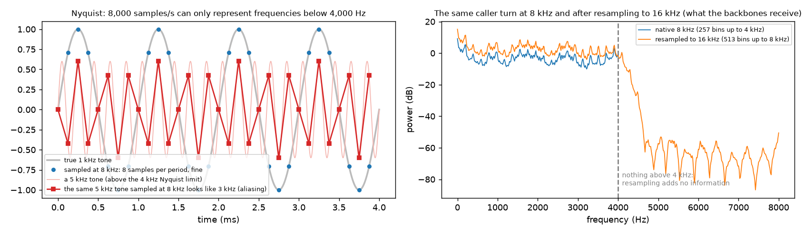
<span class="caption"><b>Figure 4.2 — Nyquist in two panels.</b> Left: a constructed illustration of aliasing — a 5 kHz tone sampled at 8 kHz is indistinguishable from a lower tone. Right: the real spectrum of a call in this dataset at its native 8 kHz next to the same audio upsampled to 16 kHz. The upsampled version is flat above 4 kHz because <b>there is nothing there to restore</b>. Source: <code>src/signal_processing_demo.py::fig_sampling_nyquist</code>; the left panel is a teaching illustration, the right panel is measured.</span>
</div>

## 4.3 Resampling 8 kHz → 16 kHz, and what it does not do

Every speech backbone used here was pretrained on 16 kHz audio, so the chunks must be resampled.
`src/audio.py::resample` uses `scipy.signal.resample_poly` with the ratio derived from
`gcd(8000, 16000) = 8000`, i.e. exact 2× polyphase upsampling — insert a zero between every pair of
samples, then low-pass filter to remove the spectral image.

!!! warn "Upsampling adds no information"
    After resampling, the array is twice as long and the model's expectations are satisfied. The band above
    4 kHz is still empty. Anyone who claims their 8 kHz pipeline "recovers high frequencies" by upsampling
    is mistaken. The reason to do it anyway is that a pretrained model's convolutional front end has fixed
    strides tuned for 16 kHz; feeding it 8 kHz audio would halve every effective receptive field and put the
    input far outside the distribution the weights were learned on.

## 4.4 The frequency domain

A waveform says *what the pressure is at each instant*. Very often the useful question is *which
frequencies are present*, and for that the signal is transformed.

- **Fourier transform / FFT.** Any finite signal can be written as a sum of sine waves at different
  frequencies, amplitudes and phases. The Fast Fourier Transform computes those coefficients efficiently.
  This project uses `n_fft = 512` at 8 kHz, giving 257 frequency bins spaced 8000/512 ≈ **15.6 Hz** apart,
  over a 64 ms window.
- **STFT and the spectrogram.** Speech changes constantly, so a single FFT over a whole call is useless.
  The Short-Time Fourier Transform slides a short window along the signal (here 512 samples, hop 80
  samples = 10 ms) and takes one FFT per position. Stacking the results gives a **spectrogram**: time on
  one axis, frequency on the other, energy as brightness.
- **The mel scale.** Human pitch perception is roughly logarithmic — the gap from 100 to 200 Hz sounds like
  the gap from 1000 to 2000 Hz. The mel scale warps frequency to match. A **mel spectrogram** groups FFT
  bins into (here) 64 mel bands.
- **MFCC.** Applying a discrete cosine transform to the log-mel spectrum decorrelates it; the first ~20
  coefficients summarise the spectral envelope compactly. Before deep learning these were *the* speech
  feature. This project computes them for teaching figures only — the deployed model never sees an MFCC.
- **RMS and dBFS.** Root-mean-square is the energy of a window, `sqrt(mean(x²))`. Expressed in decibels
  relative to full scale it becomes dBFS: `20·log10(rms)`. 0 dBFS is the maximum representable level;
  everything real is negative.
- **Spectral roll-off and centroid.** The roll-off (95 %) is the frequency below which 95 % of the energy
  sits — a proxy for "where the spectrum ends". The centroid is the energy-weighted mean frequency, a proxy
  for brightness. Both matter here because the band edge turned out to be a shortcut.

<div class="figure" markdown="1">
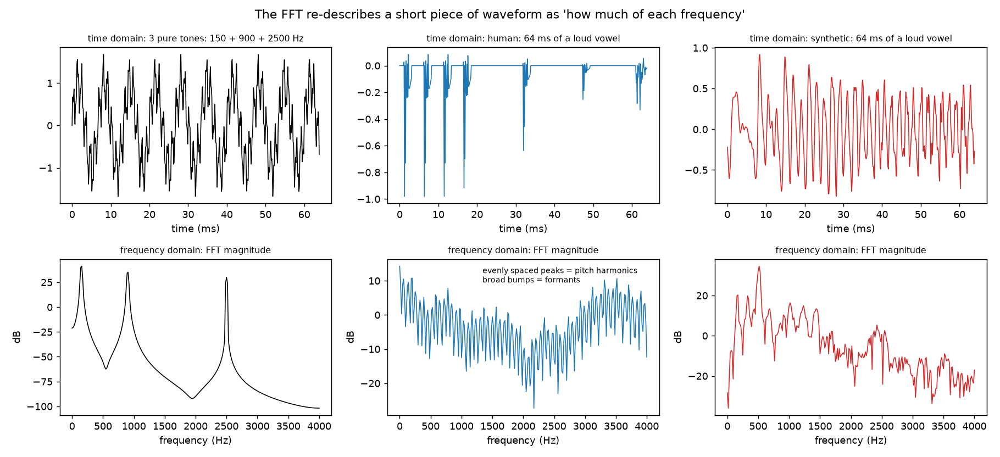
<span class="caption"><b>Figure 4.3 — From a waveform to a spectrum.</b> The leftmost panel is a constructed sum of pure tones so the peaks can be identified unambiguously; the other two are single 64 ms frames taken from real vowels, one human and one synthetic, showing the harmonic stack of voiced speech. Source: <code>src/signal_processing_demo.py::fig_fft</code>.</span>
</div>

<div class="figure" markdown="1">

<span class="caption"><b>Figure 4.4 — Mel and MFCC, explained on one real frame.</b> Left, the mel warping curve; centre, the triangular filterbank that groups FFT bins; right, a real spectrum reconstructed from a truncated MFCC set, showing what the representation keeps and what it discards. Teaching figure. Source: <code>src/signal_processing_demo.py::fig_mel_mfcc_concepts</code>.</span>
</div>

## 4.5 Human against synthetic, in this dataset

<div class="figure" markdown="1">
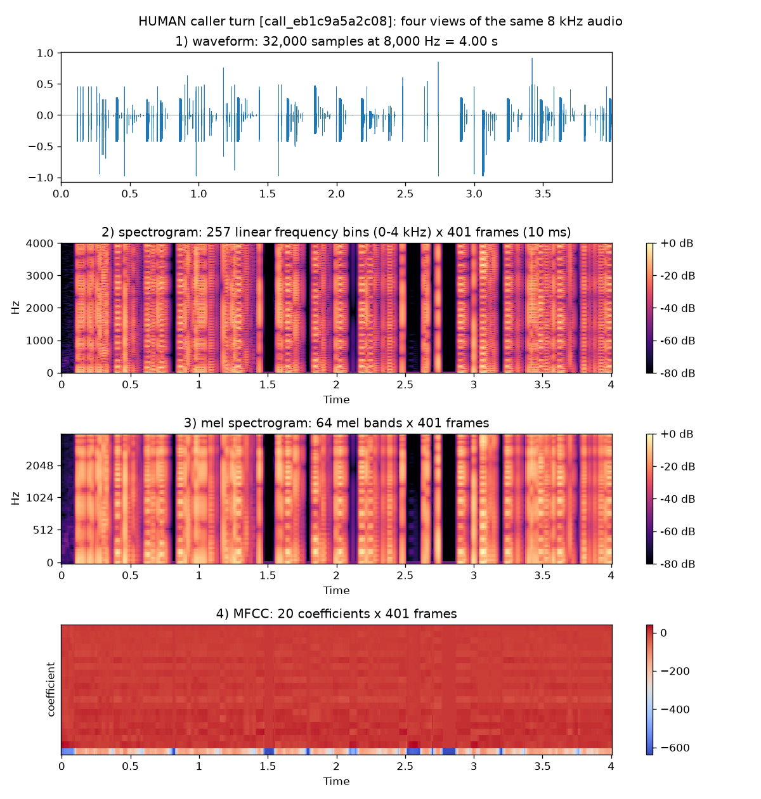
<span class="caption"><b>Figure 4.5 — One real HUMAN caller turn</b> as waveform, spectrogram, mel spectrogram and MFCCs. Source: <code>src/signal_processing_demo.py::fig_representations</code>.</span>
</div>

<div class="figure" markdown="1">

<span class="caption"><b>Figure 4.6 — One real SYNTHETIC caller turn,</b> same four representations, same scales. Source: <code>src/signal_processing_demo.py::fig_representations</code>.</span>
</div>

<div class="figure" markdown="1">

<span class="caption"><b>Figure 4.7 — The two side by side.</b> Source: <code>src/signal_processing_demo.py::fig_spectrogram_pair</code>.</span>
</div>

<div class="figure" markdown="1">

<span class="caption"><b>Figure 4.8 — Long-term average spectrum, averaged over every call in each class and split,</b> peak-normalised, with the 3.4 kHz PSTN band edge marked. The synthetic average rolls off earlier. Source: <code>src/inspect_dataset.py::plot_average_spectra</code>, all 353 calls.</span>
</div>

!!! fact "The measured spectral difference"
    Median ratio of energy in 3.4–4 kHz to energy in 0.3–3.4 kHz, training split: **−30.7 dB for human
    callers, −36.6 dB for synthetic**. Single-feature AUC 0.106, which read in the separating direction is
    0.894. `[outputs/dataset_inspection/shortcut_features.csv]`

!!! warn "Do not read this as a property of synthetic speech"
    A ~6 dB difference in high-band energy between the classes **in this dataset** says something about how
    these two sets of recordings were produced and encoded. It does not establish that synthetic speech in
    general has less high-frequency energy. §12 shows a trivial classifier exploiting exactly this, and §13
    shows what happens to it when a real codec is applied. Treat Figures 4.5–4.8 as illustrations of the
    representations, not as evidence of a universal artefact.

!!! fact "Pitch, reported and then set aside"
    On a 15-call-per-class subset: median F0 149 Hz human vs 142 Hz synthetic; standard deviation 39 Hz vs
    29 Hz; 5th–95th percentile range 9.6 vs 7.8 semitones. The project labels this "illustration, not
    evidence" in both the code and the summary report, and no model uses pitch.
    `[outputs/signal_processing/pitch_stats.csv]`

## 4.6 Stereo: two people, two channels, one rule

```text
                      STEREO WAV  (n_samples, 2)
                               |
              +----------------+----------------+
              |                                 |
         CHANNEL 0                          CHANNEL 1
       THE CALLER                        THE ALTUR AGENT
   the thing to classify              context only, never classified
              |                                 |
              |                                 +--> behaviour layer: turn timing
              |                                 +--> semantic layer: agent transcript,
              |                                 |    for grounding and trap detection
              v                                 |
      ACOUSTIC MODEL <-------- must never receive this --+
```

`config.CALLER_CHANNEL = 0` and `config.AGENT_CHANNEL = 1` are read from one place, and
`audio.get_channel(stereo, channel)` is the only accessor.

!!! interp "Why channel 1 must never reach the acoustic classifier"
    The agent is an Altur voice agent — that is, **a synthetic voice on every single call, in both
    classes**. If any agent audio leaked into the caller channel's feature extraction, the model would
    learn to detect the agent, which is present 100 % of the time and therefore carries no label
    information; worse, the amount of leakage would vary with how much the agent talked, turning a
    conversational property into a spurious class cue. The project also tested a "crosstalk gate" that
    would subtract frames where the agent is louder than the caller, and **rejected it** — see §5.2.

---

# 5 · Finding the caller's voice

## 5.1 Why voice-activity detection is required

Three quarters of a call is not the caller talking. Feeding silence and agent speech to a voice classifier
would dilute every chunk with evidence-free audio and make "how much evidence do we have" unanswerable.

```text
FULL CALL  (109 s)

agent    ####-------####------------####--------####-----------
caller   ----##--#----####------##-------####-----------####----
silence  ..............................................

                              |
                              v   energy VAD on channel 0 only

CALLER SPEECH REGIONS   14 regions, 20.04 s total  (18.4 % of the call)
         [5.44-6.19] [9.95-10.57] [12.93-16.06] [21.61-22.77] ...

                              |
                              v   chunk_regions(4.0 s, min 1.0 s)

MODEL CHUNKS            6 chunks, 14.59 s   (regions under 1 s are dropped,
         [12.93-16.06] [21.61-22.77] [34.40-37.44] ...          and no chunk
         [46.20-48.09] [72.01-73.38] [85.18-89.18]              crosses a region)
```

Those are the real numbers for `call_0294f969f98b`, reproduced in §18.

## 5.2 The energy VAD, exactly

`src/audio.py::detect_speech_energy` — the deployed segmenter for V1, and every parameter lives in
`config.py`.

```text
1. frame the caller channel:  20 ms window, 10 ms hop        (VAD_FRAME_S, VAD_HOP_S)
   -> one RMS value in dB per frame

2. noise floor = 10th percentile of all frame dB values      (robust to the speech itself)

3. a frame is SPEECH if
        level > max(floor + 15.0 dB, -55.0 dB)               (VAD_THRESHOLD_DB, VAD_MIN_ABS_DB)
   the absolute term guards a channel that is near-silent throughout

4. close gaps: any run of non-speech shorter than 0.30 s     (VAD_MIN_GAP_S)
   between two speech runs becomes speech
   (pauses inside a sentence should not split a turn)

5. keep runs of speech at least 0.30 s long                  (VAD_MIN_SPEECH_S)
   and pad each kept region by 0.10 s on both sides          (VAD_PAD_S)

6. merge regions that now overlap after padding
```

Step 3's `floor + 15 dB` rule is the one that matters later: it assumes there *is* 15 dB of headroom
between the noise floor and speech. §13 shows a telephone line removing that assumption.

!!! fact "The threshold was swept, not guessed"
    Seven settings were evaluated against the organisers' own turn annotations. The chosen 15 dB reduces
    calls where agreement collapses (F1 < 0.8) from **21 to 1** versus 12 dB, at no meaningful cost to
    median F1 (0.953 vs 0.952). `[outputs/dataset_inspection/vad_sweep.csv]`

    | setting | median F1 | precision | recall | calls with F1 < 0.8 |
    |---|--:|--:|--:|--:|
    | 12 dB | 0.952 | 0.928 | 0.992 | 21 |
    | 12 dB + crosstalk gate 0 dB | 0.949 | 0.934 | 0.982 | 34 |
    | 12 dB + crosstalk gate 3 dB | 0.950 | 0.934 | 0.984 | 31 |
    | 12 dB + crosstalk gate 6 dB | 0.950 | 0.934 | 0.988 | 29 |
    | **15 dB, no gate  ← chosen** | **0.953** | **0.928** | **0.990** | **1** |
    | 15 dB + gate 3 dB | 0.950 | 0.935 | 0.982 | 13 |
    | 18 dB + gate 3 dB | 0.951 | 0.939 | 0.979 | 21 |

!!! fact "The crosstalk gate was tested and rejected"
    Suppressing caller frames where the agent is louder made things worse at every margin (0, 3 and 6 dB all
    increase the number of failing calls). The reason recorded in `config.py` is that the gate removes
    genuine human speech during overlaps — and humans overlap far more than synthetic callers do (median
    3.7 s vs 1.5 s per call), so the gate would have *introduced* a class-dependent bias while trying to
    remove one. It is configured off: `VAD_CROSSTALK_MARGIN_DB = None`.

!!! fact "Energy beat the neural VAD on this data"
    Against the official turns: energy F1 0.952 / precision 0.928 / recall 0.992; Silero F1 0.927 /
    precision 0.923 / recall 0.954. Calls with F1 < 0.8: energy 21, Silero 54.
    `[outputs/dataset_inspection/vad_silero_vs_energy.csv]` This ranking **reverses** once a telephone
    channel is applied (§13.4), and that reversal is why the deployed V2 model uses Silero.

<div class="figure" markdown="1">
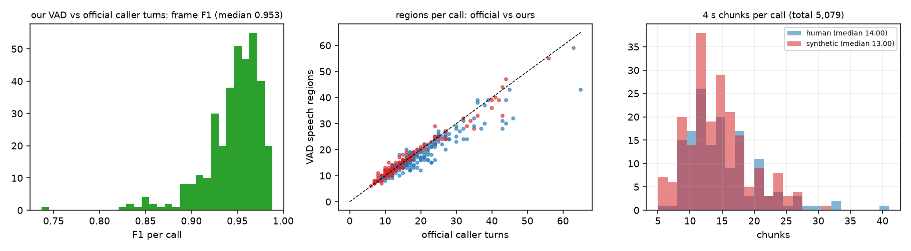
<span class="caption"><b>Figure 5.1 — How well the project's own segmenter agrees with the organisers' turn annotations.</b> Left, the per-call F1 distribution; centre, official region count against detected region count; right, chunks produced per call. Source: <code>src/inspect_dataset.py::plot_vad_and_chunks</code>, all 353 calls.</span>
</div>

## 5.3 Chunking

`src/audio.py::chunk_regions`, and then `caller_chunks` which does the whole job.

```text
for each speech region of length L:
    if L < MIN_CHUNK_SECONDS (1.0 s):     drop the region entirely
    else:
        cut floor(L / 4.0) chunks of exactly 4.0 s
        if the leftover tail is >= 1.0 s: keep it as a shorter chunk
        otherwise discard the tail
truncate the call's chunk list at MAX_CHUNKS_PER_CALL (60)

for each chunk span:
    slice the caller channel
    resample 8000 -> 16000 Hz
    scale so RMS == TARGET_RMS_DB (-26 dB)
```

Chunks are **non-overlapping** and **never cross a region boundary**, so a chunk is always a contiguous
piece of one continuous utterance. It never contains silence stitched to speech.

!!! interp "Why 4 seconds"
    Long enough for several phonemes and at least one or two syllable transitions, which is where synthesis
    artefacts live; short enough that a 37-second median of caller speech still yields a median of 14
    independent observations per call. More observations means the call-level aggregate is an average over
    many nearly independent samples, which both stabilises the score and — crucially — makes the *prefix* of
    that average a valid running estimate. That last property is what makes the latency analysis in §16
    exact rather than approximate.

!!! fact "The RMS normalisation is a deliberate act of blinding"
    Every chunk is scaled to −26 dBFS before any model sees it. The reason is in `config.py` verbatim:
    synthetic callers in this dataset are about 6 dB louder than humans, which is "a trivial shortcut".
    Normalising removes absolute loudness from the acoustic model's reach. §12 shows it does not remove
    everything.

!!! fact "The chunk budget"
    Train: 4102 chunks, 3.005 hours, median 14 per call, zero calls with no chunks. Validation: 977 chunks,
    0.689 hours, median 13 per call, zero calls with no chunks.
    `[outputs/dataset_inspection/summary.json → chunks]`

---

# 6 · What the data actually looks like

`src/inspect_dataset.py` decodes all 353 calls once and writes `call_stats.csv` — 353 rows × 40 columns of
per-call measurements — plus `summary.json`, `shortcut_features.csv` and six figures. Runtime 92 s.

<div class="figure" markdown="1">
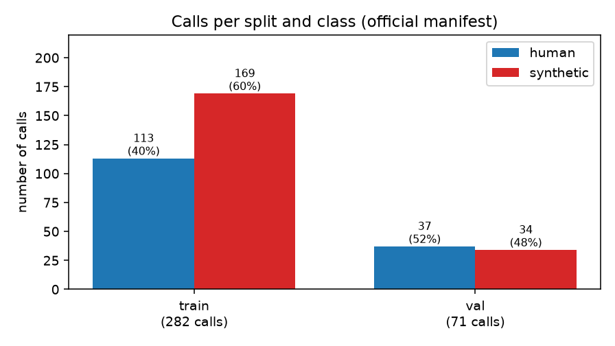
<span class="caption"><b>Figure 6.1 — Calls per split and class.</b> The training split is 60 % synthetic, the validation split 48 %. Source: <code>src/inspect_dataset.py</code>.</span>
</div>

<div class="figure" markdown="1">

<span class="caption"><b>Figure 6.2 — Call duration by class and split.</b> The distributions are near-identical (single-feature AUC 0.469 — below chance), which is exactly what a well-constructed dataset should look like on a variable that must not be informative. Source: <code>src/inspect_dataset.py</code>.</span>
</div>

<div class="figure" markdown="1">
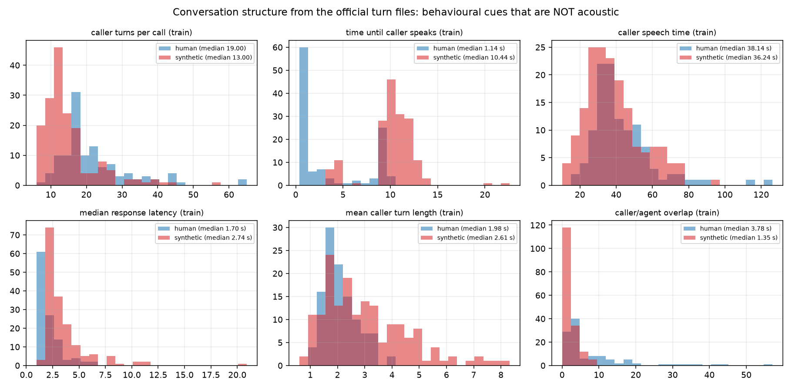
<span class="caption"><b>Figure 6.3 — Six conversation-timing statistics on the training split.</b> These are not near-identical. Source: <code>src/inspect_dataset.py::plot_turn_structure</code>.</span>
</div>

<div class="figure" markdown="1">

<span class="caption"><b>Figure 6.4 — Loudness and bandwidth statistics on the training split.</b> Source: <code>src/inspect_dataset.py::plot_levels</code>.</span>
</div>

!!! fact "Leakage checks that came back clean"
    - **Duplicate audio**: 0 duplicate MD5 hashes across all 353 files.
    - **Near-duplicate spectra**: maximum cross-split correlation of long-term average spectra 0.9921,
      median 0.8806, pairs above 0.995: **0**.
    - **Filename leakage**: the hex value inside `call_<12 hex>` has AUC 0.497 against the label; the label
      sequence in id order has 174 runs where 173.5 are expected at random.
    - **Split provenance**: the loaded train and validation sets match the manifest exactly, overlap 0.

    `[outputs/dataset_inspection/summary.json]`

These checks matter because they eliminate the boring explanations for a perfect score before the
interesting one is reached in §11.
# 7 · Wav2Vec2, from first principles

The deployed model's backbone is **`facebook/wav2vec2-base-es-voxpopuli-v2`**. Explaining it properly is
worth several paragraphs, because "it turns audio into vectors" is not an explanation a judge should
accept.

## 7.1 What the model is

!!! fact "The three backbones that were compared"
    | key | Hugging Face name | pretraining corpus | params | hidden | layers | weights |
    |---|---|---|--:|--:|--:|--:|
    | `wavlm` | `microsoft/wavlm-base-plus` | 94k h English (Libri-Light, GigaSpeech, VoxPopuli-en), masked prediction + denoising | 94.38 M | 768 | 12 | 755 MB |
    | **`wav2vec2_spanish`** | **`facebook/wav2vec2-base-es-voxpopuli-v2`** | **21.4k h Spanish European-Parliament speech (VoxPopuli), contrastive masked prediction** | **94.37 M** | **768** | **12** | **760 MB** |
    | `xlsr` | `facebook/wav2vec2-xls-r-300m` | 436k h across 128 languages (VoxPopuli, MLS, CommonVoice, BABEL, VoxLingua107) | 315.44 M | 1024 | 24 | 2539 MB |

    `[config.py BACKBONES]`, `[outputs/embeddings/*/extraction_stats.json]`

All three expect 16 kHz mono float waveforms. They differ in whether their own preprocessor expects
zero-mean/unit-variance input (`do_normalize`: false for WavLM, true for the other two) — the pipeline
honours each model's convention in `audio.normalize_for_model`.

## 7.2 What happens inside

```text
raw waveform          (16 000 floats per second, 64 000 for a 4 s chunk)
      |
      |  CONVOLUTIONAL FEATURE ENCODER
      |  7 strided 1-D convolutions. Each layer looks at a short span of its input
      |  and steps forward by more than one sample, so the time axis shrinks
      |  ~320x. This is learned filtering, not a spectrogram: the network decided
      |  for itself what to measure in a ~25 ms window.
      v
latent feature vectors     one every ~20 ms of audio
      |
      |  (layer normalisation + a learned positional convolution)
      v
      |  TRANSFORMER ENCODER, 12 blocks
      |  Every block does two things:
      |    self-attention  - each time step looks at EVERY other time step in the
      |                      chunk and decides which ones are relevant to it, so a
      |                      vowel's representation can depend on the consonant
      |                      400 ms later. This is where "context" enters.
      |    feed-forward    - a per-position two-layer MLP that transforms what
      |                      attention gathered.
      |  Residual connections mean each block EDITS its input rather than replacing
      |  it, so information from early layers survives to the top.
      v
13 hidden states          hidden_states[0] is the encoder output before any
                          transformer block; hidden_states[1..12] are the outputs
                          of blocks 1..12. EVERY ONE is available.
```

!!! fact "Measured on a real chunk"
    A 3.13-second chunk (50 080 samples at 16 kHz) produces `hidden_states[5]` of shape
    **`(1, 156, 768)`** — 156 time steps, 768 dimensions each. 50 080 / 156 ≈ 321 samples per step ≈ 20 ms.

## 7.3 Self-supervised pretraining, and why it transfers

!!! bg "Learning speech without labels"
    Wav2Vec2 was never shown a "human vs synthetic" label. It was trained on a task it can grade itself:
    mask a span of the latent sequence, then — from the surrounding context — identify which quantised
    latent actually belonged there, against a set of distractors drawn from elsewhere in the batch. This is
    **contrastive masked prediction**. To do it well the network has to model phonetics, coarticulation,
    speaker characteristics and channel properties, because all of those constrain what can plausibly fill a
    gap. Nobody told it about phonemes; representing them was simply the cheapest way to win the game.

!!! bg "Transfer learning"
    That pretraining consumed 21 400 hours of Spanish speech. This project has **3 hours** of caller speech.
    Learning speech representations from 3 hours is hopeless; learning a *decision boundary* in a space
    where speech is already well represented is easy. So the backbone is frozen and reused as a fixed
    feature extractor, and only a small classifier is trained. That is the entire transfer-learning argument,
    and it is why 197 378 trainable parameters suffice.

## 7.4 Why an intermediate layer, and which one

!!! bg "Layers specialise"
    In a stack of transformer blocks, representations drift from concrete to abstract.
    **Lower layers** stay close to the signal — spectral shape, energy, voice quality, channel colour.
    **Middle layers** carry phonetic and sub-word structure while still retaining acoustic detail.
    **Upper layers** move toward what was useful for the pretraining objective, which for a speech model
    means phonetic identity and context — increasingly *what was said* rather than *how it sounded*.

    A synthetic-voice detector wants the artefacts of generation, not the words. That argues for a low or
    middle layer, and it is why the project probed every layer instead of defaulting to the last.

**The layer probe.** For each layer of each backbone, a standardised logistic regression was fitted on the
cached training embeddings and scored on validation.

!!! fact "The probe result that shaped everything after it"
    **Every layer of all three backbones reached validation AUC 1.000, EER 0.000 and accuracy 1.000** —
    including `hidden_states[0]`, the raw convolutional encoder output, before a single transformer block.
    That is 13 + 13 + 25 = 51 probes, all perfect. `[outputs/classifier/*/layer_probe.json]`

!!! interp "What a fully saturated probe means"
    A metric that returns the same value for every candidate cannot rank candidates. It is not evidence that
    every layer is equally good; it is evidence that **the measurement is exhausted**. The correct response
    is not to pick one and move on but to find a harder question — and the fact that even the convolutional
    front end is perfect is already a strong hint that the separating signal is gross and signal-level
    rather than linguistic. §11 and §12 follow that hint.

<div class="figure" markdown="1">
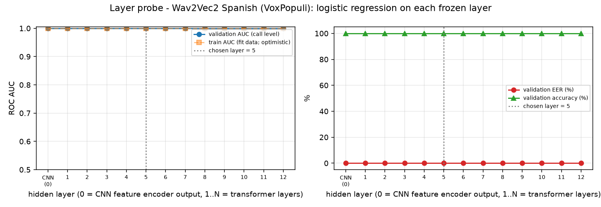
<span class="caption"><b>Figure 7.1 — The clean-split layer probe for Wav2Vec2 Spanish.</b> A flat line at 1.000. Reproduced here precisely because it is uninformative: this is what a saturated benchmark looks like, and the project treated it as a warning rather than a result. Source: <code>src/train_classifier.py::plot_layer_probe</code>.</span>
</div>

**How the layer was actually chosen.** Since the clean probe could not decide, the layer was re-probed
under the eleven-condition stress suite of §14.2 and chosen on *stressed* performance.

!!! fact "Stress-selected layers"
    WavLM → layer **9** (mean stressed AUC 0.9990, worst 0.9905). Wav2Vec2 Spanish → layer **5** (mean
    0.9999, worst 0.9992). XLS-R → layer **23** (mean 0.9993, worst 0.9960).
    `[reports/EXPERIMENT_LOG.md, entries 00:19:43–00:19:53]`

Relative depth: WavLM 9/12 = 0.75, Wav2Vec2 Spanish **5/12 = 0.42**, XLS-R 23/24 = 0.96.

!!! warn "An inconsistency this audit found and could not resolve"
    The tie-break expression currently in `src/train_classifier.py` —
    `max(probe, key=lambda p: (round(auc,4), -round(eer,4), -p["layer"]))` — when replayed against the
    stored `layer_probe.json` files (where every row is tied) selects **layer 0** for all three backbones,
    not the 5 / 9 / 23 recorded in `meta.json`. The experiment log shows the layers were set from the
    *stress* probe, which is consistent with the stored values; but the clean-probe code as it stands today
    would not reproduce them. **Not recoverable from the project artifacts**: whether an earlier code
    revision or an explicit `--layer` flag wrote those files. The deployed checkpoints are unambiguous —
    `models/wav2vec2_spanish/meta.json` and `models/robust_v2/meta.json` both record `layer: 5` — so this
    affects provenance of the selection, not what is running.

## 7.5 Embeddings and pooling

An embedding is a fixed-length vector standing in for something of variable length, positioned so that
geometric closeness means semantic similarity.

```text
one 4 s chunk
      |
      v   frozen Wav2Vec2, output_hidden_states=True
hidden_states[5]        shape (T, D) = (156, 768) for a 3.13 s chunk
      |                 T = time steps, ~one per 20 ms — varies with chunk length
      |                 D = 768, the model's hidden width — fixed
      |
      v   MEAN POOLING over the time axis
embedding               shape (768,)
```

**Mean pooling**, precisely: for each of the 768 dimensions, average that dimension's value across all *T*
time steps.

```text
embedding[d] = (1/T) * sum over t of hidden_states[5][t][d]
```

This throws away *when* something happened and keeps *how much of it there was on average* — appropriate
when the question is "does this voice carry generation artefacts", which is a property of the whole chunk
rather than of one instant.

!!! fact "What is actually cached"
    `src/extract_embeddings.py` stores mean **and** standard-deviation pooled vectors for **every** layer, as
    float16: `train_mean.npy` of shape **`[4102, 13, 768]`** and `val_mean.npy` of **`[977, 13, 768]`** for the
    768-wide backbones; `[4102, 25, 1024]` for XLS-R. Caching all layers is what made the layer probe cost
    nothing to run. The deployed model uses `pooling: "mean"` only.
    `[outputs/embeddings/*/extraction_stats.json]`, `[models/wav2vec2_spanish/meta.json]`

!!! fact "Extraction cost"
    Wav2Vec2 Spanish: 75.2 s for all 5079 chunks on an RTX 4080 Laptop GPU — **224× realtime**. WavLM
    134.0 s (123×), XLS-R 136.3 s (122×). Peak VRAM 1.88 / 1.86 / 3.00 GB.

---

# 8 · The classifier

## 8.1 Neural-network vocabulary, briefly

!!! bg "The pieces"
    - A **weight** is a learned multiplier on an input; a **bias** is a learned constant added afterwards.
      A linear layer computes `y = W·x + b`.
    - An **activation** is a non-linear function applied elementwise. Without one, stacking linear layers
      collapses to a single linear layer. **ReLU** is `max(0, x)`.
    - **Dropout** randomly zeroes a fraction of activations during training only. It prevents the network
      from relying on any single pathway, which reduces overfitting.
    - A **logit** is a raw, unbounded score — the output before any squashing. Positive means "toward the
      positive class".
    - The **sigmoid** `σ(z) = 1/(1+e^-z)` maps a logit to (0,1). **Log-odds** is the inverse: a probability
      of 0.9 is log-odds +2.20.
    - A **decision threshold** converts a probability to a verdict. Here it is 0.5
      (`config.DECISION_THRESHOLD`).

## 8.2 The deployed architecture, layer by layer

`src/train_classifier.py::MLP`.

| Stage | Shape in → out | Detail | Purpose |
|---|---|---|---|
| Input standardisation | 768 → 768 | `(x − mean) / std`, both saved **as buffers inside the checkpoint** | Every dimension on the same scale; the statistics travel with the weights so inference cannot drift from training |
| `nn.Linear` | 768 → 256 | 768·256 + 256 = **196 864** parameters | Learns a compressed decision space |
| `nn.ReLU` | 256 → 256 | — | Non-linearity |
| `nn.Dropout` | 256 → 256 | p = 0.3, **training only** | Regularisation |
| `nn.Linear` | 256 → 2 | 256·2 + 2 = **514** parameters | Two class logits |
| score | 2 → 1 | `logits[1] − logits[0]` | The log-odds of synthetic |
| calibration | 1 → 1 | `σ(a·score + b)` | A probability that can be trusted (§10) |

!!! fact "Total trainable parameters: 197 378"
    Against 94.37 M frozen backbone parameters. The trainable fraction is **0.21 %**.
    `[outputs/classifier/wav2vec2_spanish/results.json → mlp_params]`

```text
  FROZEN                                          TRAINED
  ------                                          -------
  Wav2Vec2 Spanish        94 371 712 params       MLP        197 378 params
  [LOCKED] never updated, identical to the        [OPEN] the only thing that
  published checkpoint, bit for bit                learns anything here
```

!!! bg "Why freezing is the right call at this data scale"
    Three reasons. **Compute**: no backward pass through 94 M parameters, so embeddings are extracted once
    and every subsequent experiment is seconds rather than minutes. **Overfitting**: 197 k parameters fitted
    on 4102 chunks is a defensible ratio; 94 M on 4102 is not. **Preservation**: the pretrained
    representation is the asset — fine-tuning on 3 hours of narrowband audio risks destroying general speech
    knowledge in exchange for fitting quirks of 282 calls. §9.4 shows this was tested rather than assumed.

A **logistic regression probe** is also trained alongside — `StandardScaler` then
`LogisticRegression(C=1.0, class_weight="balanced", max_iter=5000)`. Its role is diagnostic: if a linear
model on the same embeddings matches the MLP, the MLP is not earning its non-linearity.

## 8.3 Training

!!! fact "Every hyperparameter, as configured and as recorded"
    | Setting | Value | Source |
    |---|---|---|
    | random seed | 42 | `config.SEED`, echoed in every `meta.json` |
    | train / val | 282 / 71 calls → 4102 / 977 chunks | the official split, unchanged |
    | batch size | 64 | `MLP_BATCH_SIZE` |
    | max epochs | 60 | `MLP_EPOCHS` |
    | learning rate | 1e-3 | `MLP_LR` |
    | weight decay | 1e-4 | `MLP_WEIGHT_DECAY` |
    | optimiser | **AdamW** | `train_classifier.py` |
    | loss | cross-entropy with inverse-frequency class weights | `train_classifier.py` |
    | dropout | 0.3 | `MLP_DROPOUT` |
    | early stopping | patience 15 epochs on **validation loss** | `MLP_PATIENCE` |
    | checkpoint kept | the epoch with lowest validation loss | `train_classifier.py` |
    | device | CUDA, RTX 4080 Laptop | `extraction_stats.json` |
    | mixed precision | bf16 autocast during embedding extraction | `extract_embeddings.py` |
    | **epochs actually run** | **18** (best at **epoch 3**, then 15 without improvement) | `results.json` |
    | training time | ~10 s on cached embeddings | `augmentation results.json` |

!!! bg "Cross-entropy, and why confident mistakes hurt most"
    For a binary label *y* and predicted probability *p*, the loss is `−[y·ln p + (1−y)·ln(1−p)]`. Predict
    0.99 when the answer is 1 and the loss is 0.01. Predict 0.01 when the answer is 1 and the loss is
    **4.6** — 460 times larger. The logarithm goes to infinity as a confident prediction becomes wrong, so
    gradient descent pushes hardest against arrogance. This is exactly the behaviour a bank wants: a
    detector that is wrong is bad, a detector that is *confidently* wrong is dangerous.

    **Class weighting** multiplies each example's loss by `n / (2 · count(its class))`. The training split is
    60 % synthetic, so without it the model could reach 60 % by always saying synthetic; weighting makes the
    two classes contribute equally.

!!! bg "Backpropagation and AdamW in five lines"
    ```text
    forward   run the batch through the network, get logits
    loss      compare logits with labels -> one number
    backward  apply the chain rule from the loss back to every weight, giving
              each one a gradient: "if you increase, does the loss rise or fall,
              and how fast?"
    step      the optimiser moves each weight against its gradient
    repeat
    ```
    **Adam** keeps a running average of each weight's gradient and of its squared gradient, and uses them to
    give every weight its own effective step size — parameters with consistently small gradients take bigger
    steps. **AdamW** differs from Adam in applying weight decay directly to the weights instead of folding it
    into the gradient, which is the mathematically correct form of L2 regularisation for adaptive methods.
    The **learning rate** (1e-3 here) scales every step: too large and training oscillates or diverges, too
    small and it crawls or stalls in a poor region.

!!! fact "The training curve for the deployed head"
    | epoch | train loss | val loss | val chunk acc | val call AUC |
    |--:|--:|--:|--:|--:|
    | 1 | 0.02662 | 0.02838 | 0.9908 | 1.000 |
    | 2 | 0.02076 | 0.02720 | 0.9877 | 1.000 |
    | **3 (kept)** | **0.01271** | **0.01941** | **0.9939** | **1.000** |
    | 4–18 | ↓ to ~0.000 | 0.0197 – 0.1421, never better | — | 1.000 |

    Call-level AUC is 1.000 **from epoch 1**. `[outputs/classifier/wav2vec2_spanish/mlp_history.json]`

<div class="figure" markdown="1">

<span class="caption"><b>Figure 8.1 — Loss, accuracy, AUC and EER per epoch for the deployed head.</b> The call-level metrics are pinned at their ceiling throughout; only the loss curve carries any information, and it is what selects epoch 3. Source: <code>src/train_classifier.py::plot_mlp_history</code>.</span>
</div>

## 8.4 From chunk scores to one verdict

A call produces several chunk scores that must become one number.
`src/metrics.py::aggregate_chunk_scores` implements seven strategies; the deployed one is **`mean`**, on
**log-odds** rather than probabilities.

!!! interp "Why the mean of log-odds, and why it was fixed in advance"
    Averaging log-odds is the correct combination rule if the chunks are treated as conditionally
    independent observations of the same underlying call: in log-odds space, independent evidence *adds*.
    Averaging probabilities instead would let one saturated chunk at 0.999 dominate.

    More importantly, `mean` was **pre-registered in `config.py` before results were seen**, and the six
    alternatives (median, max, min, top-25 % mean, trimmed mean, mean-of-probabilities) are computed and
    reported as diagnostics only. The project's stated reason is that choosing an aggregation on the
    validation split would be "mild peeking". Given that the split is saturated, any of them would have
    looked perfect — which is precisely when such a choice is most likely to be self-deception.

<div class="figure" markdown="1">

<span class="caption"><b>Figure 8.2 — Every aggregation strategy against every metric.</b> Reported, never used for selection. Source: <code>src/benchmark.py::fig_aggregation</code>.</span>
</div>

---

# 9 · Model V1 — the specialist

## 9.1 What it is and why it exists

**Model A, the specialist**: frozen `facebook/wav2vec2-base-es-voxpopuli-v2`, hidden layer 5, mean pooling,
the 197 k-parameter MLP, energy VAD, mean-of-log-odds aggregation, Platt calibration. Artefacts in
`models/wav2vec2_spanish/`, never overwritten by any later work.

It exists to answer one question under controlled conditions: **which frozen speech representation
generalises best to this task?** Everything except the backbone was held fixed — the same VAD, the same
chunking, the same normalisation, the same classifier, the same seed, the same aggregation.

## 9.2 The controlled comparison

!!! fact "On the clean validation split, all three backbones are indistinguishable"
    | backbone | layer | accuracy | AUC | EER | F1 | Brier (raw) |
    |---|--:|--:|--:|--:|--:|--:|
    | WavLM Base+ | 9 | 1.000 | 1.000 | 0.000 | 1.000 | 5.2e-06 |
    | Wav2Vec2 Spanish | 5 | 1.000 | 1.000 | 0.000 | 1.000 | 3.8e-05 |
    | XLS-R 300M | 23 | 1.000 | 1.000 | 0.000 | 1.000 | 1.3e-05 |

    Linear probe, MLP and call-averaged-embedding logistic regression **all** reach the same ceiling, on
    both train and validation. `[reports/benchmark.csv]`, `[reports/model_comparison.csv]`

<div class="figure" markdown="1">

<span class="caption"><b>Figure 9.1 — Five metrics, three backbones, clean validation.</b> Every bar is at its maximum. Source: <code>src/benchmark.py::fig_metric_bars</code>.</span>
</div>

<div class="figure" markdown="1">

<span class="caption"><b>Figure 9.2 — Three ROC curves on top of each other, in the top-left corner.</b> A perfect ROC passes through (0,1): every synthetic call ranked above every human call. Source: <code>src/benchmark.py::fig_roc</code>.</span>
</div>

<div class="figure" markdown="1">
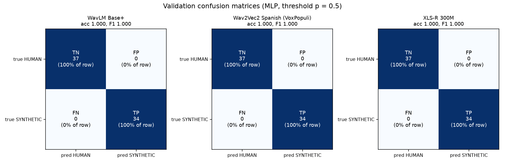
<span class="caption"><b>Figure 9.3 — Confusion matrices, clean validation.</b> 37 true human, 34 true synthetic, zero errors, for all three backbones. Source: <code>src/benchmark.py::fig_confusions</code>.</span>
</div>

## 9.3 The tie-break that actually chose the winner

Since clean validation could not rank anything, the selection rule was **mean AUC across the eleven stress
conditions**, with stressed accuracy, EER and latency as further tie-breaks.

!!! fact "The rule and the result, recorded verbatim in `reports/best_model.json`"
    > "highest mean validation AUC under the 10 stress conditions (0.9998; stressed accuracy 0.972, worst
    > condition white_snr10 AUC 0.998); clean validation accuracy 1.000 / AUC 1.0000 — the clean split is
    > saturated for every backbone and cannot rank them; 3 model(s) within 0.005 → tie-break by stressed
    > accuracy, EER, latency"

    | backbone | mean stressed AUC | mean stressed accuracy | worst condition | GPU latency |
    |---|--:|--:|---|--:|
    | WavLM Base+ | 0.9967 | 92.96 % | tilt −3 dB/oct (AUC 0.976) | 255 ms |
    | **Wav2Vec2 Spanish** | **0.9998** | **97.18 %** | white SNR 10 (AUC 0.998) | **119 ms** |
    | XLS-R 300M | 0.9975 | 86.20 % | white SNR 10 (AUC 0.980) | 310 ms |

<div class="figure" markdown="1">
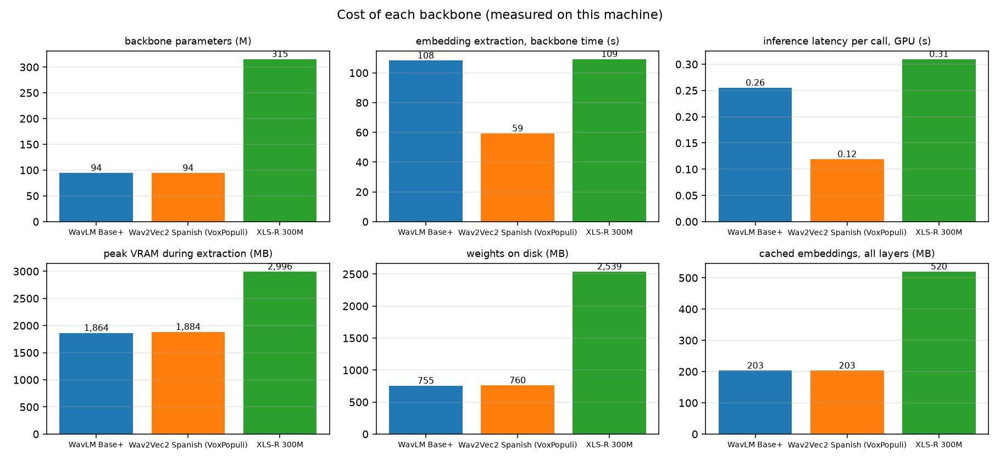
<span class="caption"><b>Figure 9.4 — Cost, six ways.</b> Parameters, extraction time, inference latency, peak VRAM, weight size and cache size. The Spanish model is the cheapest on every axis except being tied on parameters with WavLM. Source: <code>src/benchmark.py::fig_resources</code>.</span>
</div>

!!! warn "The margin is 0.003 AUC"
    The gap between the best and worst backbone on the selection metric is three thousandths. The project's
    own summary calls this "a preference supported by a controlled experiment, not a proof", and that is the
    honest reading. The accuracy gap (97.2 % vs 86.2 %) and the 2.6× latency advantage are more substantial
    grounds than the headline AUC.

!!! interp "Why the Spanish model plausibly won — labelled as hypothesis"
    Three candidate explanations, none of which this project tested by ablation. **Language match**: the
    calls are LatAm Spanish and the backbone is the only Spanish-pretrained one. **Depth**: at 5/12 it sits
    where acoustic detail is still intact, whereas XLS-R's layer 23/24 is nearly at the top of a much deeper
    stack and more linguistically abstract. **Capacity**: 94 M parameters fit 3 hours of data more
    comfortably than 315 M. The project explicitly declines to attribute the win: "we did not run an
    ablation that removes the band edge, so we cannot say how much of the score depends on it".

## 9.4 Two experiments that failed, and were kept

**Fine-tuning.** `src/finetune.py` truncates the backbone after layer 5, warm-starts the head from the
frozen MLP, trains the head alone for 3 epochs, then unfreezes the last 4 transformer layers at
`lr = 1e-5` with warmup, decay and gradient clipping for up to 8 more. Ran on a Runpod L4, 323 seconds.

!!! fact "Fine-tuning did not win"
    Clean validation: frozen 100 % / AUC 1.000, fine-tuned 100 % / AUC 1.000. The decision rule required the
    fine-tuned model to beat the frozen one by more than 0.005 on **mean stressed AUC**. The measured values
    were **0.9997615262321146 and 0.9997615262321146** — identical to sixteen digits. Winner: frozen.
    `[outputs/finetune/wav2vec2_spanish/results.json]`

    The validation loss also tells the story: best at epoch 4 (0.01759), then 0.05985, 0.16872, 0.07263
    while train loss fell to 0.00025. That is textbook overfitting on 3 hours of audio.

<div class="figure" markdown="1">
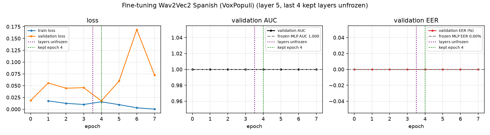
<span class="caption"><b>Figure 9.5 — Fine-tuning the last four transformer layers.</b> Train loss collapses toward zero while validation loss climbs; the clean metrics stay pinned at 1.000 and say nothing. Source: <code>src/finetune.py</code>.</span>
</div>

**Training-time augmentation.** `src/augment_train.py` expands the 4102 training chunks to 20 095 by
applying gain, white noise, pink noise and μ-law companding, then retrains both the augmented and baseline
heads in the same run for a fair comparison.

!!! fact "Augmentation did not win either"
    | | baseline mean AUC | baseline mean acc | augmented mean AUC | augmented mean acc |
    |---|--:|--:|--:|--:|
    | **seen** families (gain, noise, μ-law) | 0.99968 | 98.87 % | 0.99984 | 99.44 % |
    | **unseen** families (low-pass, PSTN, reverb, tilt) | 0.99984 | **95.49 %** | 1.00000 | **93.80 %** |

    The rule required the augmented model to beat the baseline on unseen-family AUC by more than 0.002; it
    beat it by 0.00016 while *losing* 1.7 accuracy points. On `reverb_0.3s` specifically, accuracy fell from
    88.73 % to 76.06 %. Winner: baseline. `[outputs/augmentation/wav2vec2_spanish/results.json]`

!!! interp "The lesson, which the project states plainly"
    "Augmentation with noise, gain and codec teaches robustness to noise, gain and codec — not to band
    limits or spectral tilt." Augmenting with a family teaches that family. This finding is what motivated
    the very different approach taken in §13: instead of perturbing waveforms with generic effects, build a
    dataset by pushing audio through **real codecs and a modelled transmission path**, and hold an entire
    family of codecs out of training to measure whether the robustness generalises.

<div class="figure" markdown="1">

<span class="caption"><b>Figure 9.6 — Baseline against augmented, per condition.</b> The unseen families are shaded. Source: <code>src/augment_train.py</code>.</span>
</div>

---

# 10 · Calibration

## 10.1 A score is not a probability

!!! bg "The distinction"
    A classifier's output of 0.858 is a **score** — a monotone ranking signal. Calling it a probability
    asserts something much stronger: that among all calls scored 0.858, about 85.8 % really are synthetic.
    Nothing in cross-entropy training guarantees that. Models trained to separate classes typically become
    **overconfident**, pushing scores toward 0 and 1 well beyond what their error rate justifies.

    Calibration fits a small monotone function from score to probability. Because it is monotone, it cannot
    change any ranking and therefore **cannot change AUC or EER** — it changes Brier score, log loss and
    expected calibration error, and it changes what a threshold means.

The challenge brief rewards well-calibrated systems, so this is a deliverable rather than a refinement.

## 10.2 What the project fits

`src/calibrate.py` fits two candidates and picks between them by out-of-fold log loss:

- **Platt scaling** — `p = σ(a·score + b)`, two parameters, fitted by minimising log loss with
  Nelder-Mead.
- **Temperature scaling** — `p = σ(score / T)`, one parameter, grid-searched over 400 values of *T*
  logarithmically spaced from 0.05 to 50. Equivalent to Platt with `b = 0`.

Evaluation is 5-fold, grouped by call when a call appears under several conditions, then the winner is
refitted on everything for deployment.

!!! warn "The first calibration attempt was degenerate, and the project says so"
    Fitted on the clean validation split, calibration produced Brier 0.0000 for all three backbones. With
    **zero errors**, the log-likelihood has no interior maximum: the optimiser is free to sharpen without
    limit, and it did — "a first attempt drove the temperature to its grid minimum". Those numbers are
    meaningless. `[reports/EXPERIMENT_LOG.md 00:20:47]`

    The fix was to calibrate on a set that contains errors: the 71 validation calls under all 11 stress
    conditions, **781 call-conditions**, grouped by call so no call is split across folds.

!!! fact "The deployed calibration"
    ```json
    {"method": "platt", "a": 0.9024501565233612, "b": 0.836586731242573,
     "fit_on": "validation under 11 conditions (781 call-conditions)", "n": 781,
     "cv": {"brier": 0.019587, "log_loss": 0.070961, "ece": 0.015021, "accuracy": 0.974392}}
    ```
    `[models/wav2vec2_spanish/calibration_mlp.json]`

    Per backbone, raw → calibrated Brier: WavLM 0.0597 → 0.0565 (temperature won); **Wav2Vec2 Spanish
    0.0200 → 0.0196 (Platt)**; XLS-R 0.1014 → 0.0771 (Platt). Expected calibration error for the winner:
    0.0190 → 0.0150.

!!! interp "Reading a = 0.90 and b = 0.84"
    The slope is slightly below 1, so the fit *softens* the raw log-odds a little — the uncalibrated model
    was mildly overconfident, as expected. The positive intercept shifts every score toward synthetic,
    which is what fitting on a stressed set produces: under channel degradation the model's scores drift
    toward "human", and the intercept corrects that drift back.

<div class="figure" markdown="1">
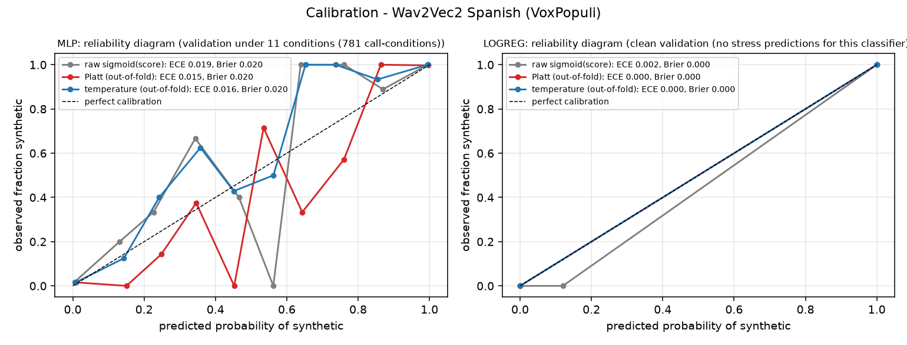
<span class="caption"><b>Figure 10.1 — Reliability diagrams for the winning backbone,</b> MLP and logistic probe, raw against Platt and temperature. A perfectly calibrated model lies on the diagonal. Source: <code>src/calibrate.py::plot</code>.</span>
</div>

!!! warn "The logistic-regression calibrator is a documented degenerate case"
    `models/wav2vec2_spanish/calibration_logreg.json` records `method: temperature, a: 3.0,
    temperature: 0.05`, fitted on the clean 71 calls with the slope **capped at 3.0** and a cross-validated
    Brier of 1e-12. That is the saturation pathology above, mitigated by a cap rather than solved. It does
    not affect the deployed path — the deployed classifier is the MLP — but anyone switching to
    `--classifier logreg` should know its calibration is not trustworthy.
# 11 · The 100 % problem

## 11.1 Why a perfect score is bad news

The first trained model scored 71 out of 71. So did the second. So did the third, and every layer of all
three, and the linear probes, and the call-averaged embeddings.

!!! bg "What 71/71 actually licenses you to say"
    Accuracy is `correct / total`. 71/71 = 100 %. But the quantity of interest is the *true* accuracy on the
    population the split was drawn from, and a finite sample bounds that only loosely. The Clopper-Pearson
    exact **one-sided 95 % lower confidence bound** for 71 successes in 71 trials is **95.9 %** (the
    two-sided interval's lower bound is 94.9 %; the one-sided figure is the right one for a claim of the
    form "at least X"). So even taking the split at face value, the honest claim is "at least 95.9 %, on
    calls that look like
    these" — not "perfect".

    And one call is 1.4 accuracy points. A single flipped verdict takes 100 % to 98.6 %.

!!! interp "The real problem is not the confidence interval"
    It is that a saturated metric **cannot rank anything**. Every architectural decision this project needed
    to make — which backbone, which layer, which classifier, which aggregation — is a comparison, and all of
    them returned "tied". A benchmark that gives the same answer to every question has stopped being a
    benchmark. That, and not modesty, is why the project went looking for what was wrong.

## 11.2 Eight checks

`src/sanity_checks.py` runs on the cached embeddings of the winning backbone. Each check has a null
hypothesis and a result.

### Check 1 — Label permutation

Shuffle the training labels, refit, score. If the pipeline is honest, performance must collapse to chance;
if it does not, something in the features encodes the label directly.

!!! fact "Result: chance, five times out of five"
    AUC over 5 shuffles: **0.471, 0.532, 0.510, 0.394, 0.592** — mean 0.500. Accuracies 0.493, 0.507, 0.549,
    0.394, 0.577. `[outputs/sanity/wav2vec2_spanish/results.json → permutation]`

    This rules out: validation data leaking into training, a label encoded in the features, and a bug in
    the metric or evaluation harness. A pipeline with any of those faults scores well on shuffled labels.

### Check 2 — How little audio is enough

!!! fact "One chunk is enough"
    | evidence given | n | accuracy | AUC |
    |---|--:|--:|--:|
    | the **first** chunk only | 71 | **1.000** | 1.000 |
    | one **random** chunk | 71 | 0.986 | 1.000 |
    | the first 3 chunks | 71 | 1.000 | 1.000 |
    | all chunks | 71 | 1.000 | 1.000 |
    | every chunk scored in isolation | 977 | 0.987 | 0.9995 |
    | only chunks **shorter than 2 s** | 407 | 0.973 | 0.9987 |

!!! interp "What this says"
    If a single sub-two-second fragment is 97 % separable, the discriminating signal is not a subtle
    accumulation of phonetic evidence. It is something gross, global and present everywhere in the
    recording — a property of the *signal*, not of the speech. Combined with layer 0 already being perfect
    (§7.4), the direction is clear before a single shortcut has been named.

### Check 3 — Duplicates, hashes and near-duplicates

Covered in §6: zero duplicate MD5s, zero near-duplicate spectral fingerprints across the split, zero id
overlap, id hex value AUC 0.497.

### Check 4 — How many distinct voices are there

Agglomerative clustering on the detector's own embeddings, *k* chosen by silhouette.

!!! fact "Two clusters per class"
    Synthetic: best k = 2, silhouette 0.630, sizes 183 and 20. Human: best k = 2, silhouette 0.520, sizes
    150 and 3.

### Check 5 — Leave one voice group out

Remove a whole cluster from training, retrain, and see whether the model still recognises it.

!!! fact "Ranking survives, the threshold does not"
    Synthetic cluster 0 (183 held-out calls): **held-out accuracy 0.175, AUC 0.996**. Human cluster 0 (147
    calls): accuracy 0.109, AUC 0.997.

!!! interp "This is the most important diagnostic in the section"
    An AUC of 0.996 with an accuracy of 0.175 is not a contradiction — it is a precise statement that
    **the model still ranks every held-out synthetic call above every held-out human call, but the decision
    threshold has moved off the data**. This "ranking survives, threshold breaks" signature recurs in every
    domain-shift experiment in this report (§13, §14, §15). It is also why the project reports
    best-threshold accuracy alongside deployed-threshold accuracy throughout: the two answer different
    questions, and conflating them would either flatter or condemn a model unfairly.

    A second reading is that the clustering instrument is weak on 8 kHz audio. Check 7 tests that directly.

### Check 6 — Ten training calls

!!! fact "Ten calls reach 98.5 %"
    Fit on 5 human + 5 synthetic calls, score all 71, over 10 random draws: accuracies 1.0, 0.944, 0.958,
    1.0, 1.0, 0.958, 1.0, 1.0, 0.986, 1.0 — **mean accuracy 0.985, mean AUC 0.995**.

    Reversed direction — fit on the 71 validation calls, score the 282 training calls: **accuracy 0.950,
    AUC 0.9998**, 14 errors of 282.

!!! interp "A task learnable from ten examples is not a hard task"
    Learning a genuine acoustic signature of speech synthesis from five examples per class is implausible.
    Learning "synthetic recordings in this corpus are louder, start later, and roll off earlier" from five
    examples per class is entirely plausible.

### Check 7 — Is the voice-clustering instrument trustworthy

`src/voice_identity.py` brings in an independent instrument: `microsoft/wavlm-base-plus-sv`, a
speaker-verification model with an x-vector head trained on VoxCeleb, used to ask whether voices repeat
across the split.

!!! fact "The instrument cannot resolve individuals on this audio"
    Within-class median pairwise cosine similarity: human 0.760, synthetic 0.774. **Cross-class: 0.750.**
    Human calls — which come from many different real people — collapse into 2 clusters at threshold 0.70
    and only 4 at 0.86 (VoxCeleb's nominal verification threshold).

    At every threshold tested, 100 % of validation calls (34/34 synthetic, 37/37 human) have a "voice" also
    present in training.

    Leave-one-voice-group-out at threshold 0.86, on the four synthetic groups with ≥5 calls: call-weighted
    recognition **0.955**, worst 0.722 (on the smallest group, n = 18), **mean AUC 1.000**.

!!! interp "Reading check 7 against check 5"
    When a VoxCeleb speaker model cannot tell dozens of distinct humans apart on this narrowband audio, the
    clusters in check 5 are not speakers. They are *recording conditions*. The correct conclusion is
    therefore **not** "the model memorised voices" — it is that the instrument measures voice-group, not
    identity, and that the leave-one-out threshold collapse reflects a shift in recording condition rather
    than a failure to generalise across speakers.

<div class="figure" markdown="1">

<span class="caption"><b>Figure 11.1 — Three of the checks.</b> Left: real-label AUC against five shuffled-label AUCs, with the chance line. Centre: accuracy from one chunk, a random chunk, three chunks and all chunks. Right: held-out cluster size against recognition rate. Source: <code>src/sanity_checks.py</code>.</span>
</div>

<div class="figure" markdown="1">
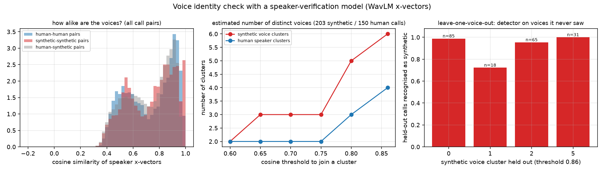
<span class="caption"><b>Figure 11.2 — The speaker-verification instrument.</b> Left: x-vector similarity distributions within and across classes, nearly on top of each other. Centre: cluster count against threshold. Right: leave-one-voice-out results. Source: <code>src/voice_identity.py</code>.</span>
</div>

## 11.3 The verdict

!!! fact "The project's own conclusion, verbatim"
    > "Not a bug, not memorisation of the training callers, not classical overfitting. It is a dataset in
    > which the two classes differ by more than their voices, evaluated on a small split."

    `[src/report_sanity.py]`

---

# 12 · Shortcut learning

## 12.1 The idea

!!! bg "Shortcut learning"
    A model minimises its loss by whatever route is cheapest. If a feature that has nothing to do with the
    intended concept happens to correlate perfectly with the label *in the training distribution*, learning
    that feature is not a mistake by the model — it is optimal behaviour. The failure is in the dataset and
    in the evaluation, which cannot tell the two strategies apart. The shortcut then evaporates the moment
    the distribution changes, which is exactly what production is.

## 12.2 The experiment that proved it

`src/train_shortcut.py` trains ordinary classifiers on **24 call-level statistics that contain no voice
content whatsoever** — durations, silence lengths, turn counts, loudness, bandwidth summaries, response
timings. No spectrogram, no embedding, no phoneme.

!!! fact "A model that never hears a voice matches a model that does"
    | feature set | n | model | val accuracy | val AUC | val EER |
    |---|--:|---|--:|--:|--:|
    | duration only | 1 | logreg | 0.465 | 0.518 | 0.493 |
    | duration only | 1 | gbm | 0.535 | 0.581 | 0.493 |
    | duration + silence | 3 | logreg | 0.746 | 0.885 | 0.211 |
    | duration + silence | 3 | gbm | 0.859 | 0.944 | 0.141 |
    | metadata | 9 | logreg | 0.887 | 0.952 | 0.113 |
    | metadata | 9 | gbm | 0.887 | 0.953 | 0.141 |
    | loudness | 7 | logreg | 0.901 | 0.957 | 0.085 |
    | loudness | 7 | gbm | 0.915 | 0.950 | 0.113 |
    | bandwidth | 3 | logreg | 0.901 | 0.971 | 0.085 |
    | bandwidth | 3 | gbm | 0.676 | 0.765 | 0.324 |
    | behavioural | 6 | logreg | 0.887 | 0.934 | 0.113 |
    | behavioural | 6 | gbm | 0.859 | 0.936 | 0.141 |
    | **all trivial** | **24** | **logreg** | **0.9859** | **1.0000** | **0.0000** |
    | all trivial | 24 | gbm | 0.9859 | 0.9960 | 0.0282 |

    `[reports/shortcut_check.csv]`

!!! interp "What this result is and is not"
    It is **not** a claim that the acoustic model is doing the same thing as the trivial model — they read
    different inputs, and the acoustic model works on RMS-normalised 4-second chunks that carry none of the
    turn-timing features. It **is** a proof that the validation split can be saturated without any voice
    modelling at all, which means a perfect score on it is not evidence of voice modelling. The metric had
    to be replaced, and §13–§15 are that replacement.

<div class="figure" markdown="1">
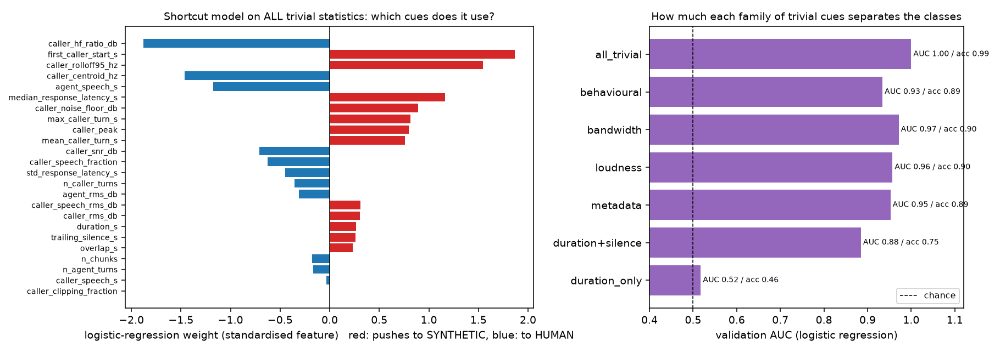
<span class="caption"><b>Figure 12.1 — Left: standardised logistic-regression weights on the 24 trivial features. Right: validation AUC per feature family.</b> Leading silence and the band-edge ratio carry the largest weights. Source: <code>src/train_shortcut.py</code>.</span>
</div>

## 12.3 The shortcuts, one by one

<div class="figure" markdown="1">
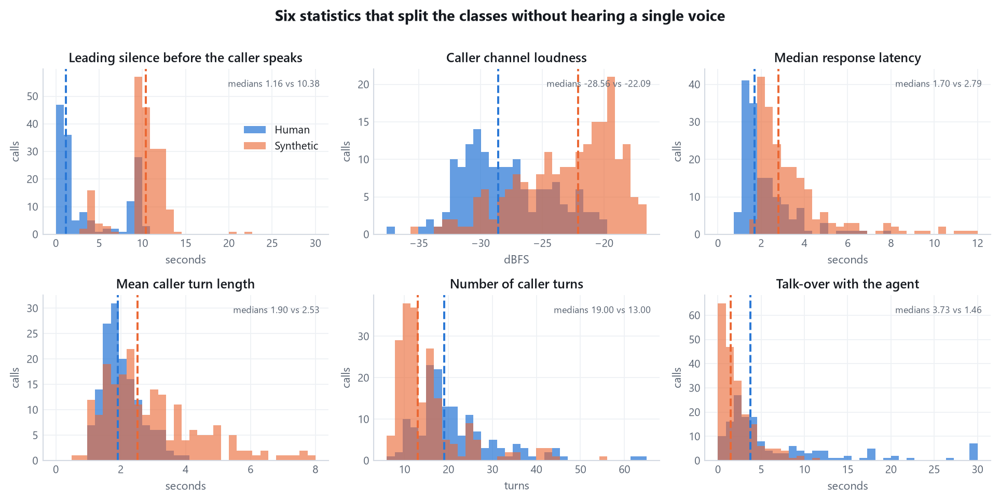
<span class="caption"><b>Figure 12.2 — Six call statistics that split the classes without hearing a voice.</b> Every panel is a real histogram over all 353 calls; dashed lines are the class medians. Generated for this report from <code>outputs/dataset_inspection/call_stats.csv</code> by <code>report_assets/make_report_figures.py</code>.</span>
</div>

!!! fact "The measured separations"
    Single-feature AUC on the training split, with the two class medians.

    | shortcut | human median | synthetic median | train AUC | Mann-Whitney p |
    |---|--:|--:|--:|--:|
    | **Leading silence before the caller speaks** | 1.16 s | **10.38 s** | **0.948** | 3.4e-37 |
    | High-band / low-band energy ratio | −30.7 dB | −36.6 dB | 0.106 *(≡ 0.894 reversed)* | 4.0e-29 |
    | Caller channel loudness | −28.56 dB | −22.09 dB | 0.798 | 2.1e-17 |
    | Caller loudness during speech | −23.37 dB | −16.32 dB | 0.790 | 1.6e-16 |
    | Median response latency | 1.70 s | 2.79 s | 0.785 | 5.6e-16 |
    | Mean caller turn length | 1.90 s | 2.53 s | 0.676 | 5.8e-07 |
    | Caller peak amplitude | 0.824 | 0.980 | 0.701 | 7.1e-10 |
    | Talk-over with the agent | 3.74 s | 1.46 s | 0.220 *(reversed)* | 1.6e-15 |
    | Number of caller turns | 19 | 13 | 0.233 *(reversed)* | 3.1e-14 |
    | Call duration | 147.1 s | 144.4 s | 0.469 | — |
    | Clipping fraction | 0.000 | 0.000 | 0.500 | 1.0 |

    `[outputs/dataset_inspection/shortcut_features.csv]`

**What each one is, physically.**

1. **Leading silence (AUC 0.948, the strongest single feature in the dataset).** A synthetic caller waits a
   median of 10.4 seconds before its first word; a human waits 1.2. This is a property of how the two sets
   of calls were *initiated* — a bot waiting for a prompt versus a person who starts talking.
2. **The band edge.** Synthetic recordings carry about 6 dB less energy in 3.4–4 kHz relative to the speech
   band. A model that learns "where the spectrum stops" has learned about the encoder, not the speaker.
3. **Loudness.** Synthetic callers are injected roughly 6 dB hotter, with peaks at 0.98 against 0.82.
4. **Response latency and turn shape.** Synthetic callers reply about a second slower and speak in longer,
   fewer turns.
5. **Overlap.** Humans talk over the agent more than twice as much.
6. **The digital-silence floor.** Both classes sit at exactly −72.247 dB between turns in 266 of 353 calls.
   This one does not separate the classes — it is identical for both — but it is the most consequential
   property in the dataset, because it is the thing that a real telephone line destroys. §13.

!!! fact "Which shortcuts the acoustic model can and cannot reach"
    | cue | available to the acoustic layer? | why |
    |---|---|---|
    | leading silence, turn timing | **no** | the model only ever sees chunks *inside* detected caller speech |
    | absolute loudness | **no** | every chunk is RMS-normalised to −26 dBFS before the model sees it |
    | noise floor and SNR | **partly** | normalisation scales the whole chunk, preserving the *ratio* of speech to floor |
    | band edge and spectral tilt | **yes** | normalisation is a scalar gain; it does not change spectral shape |
    | genuine voice-quality artefacts | **yes** | the intended signal |

    `[reports/ACOUSTIC_LEARNING_SUMMARY.md Part 9]`

!!! interp "So how much of V1 is shortcut?"
    The project never ran the ablation that would answer this exactly, and says so. What the evidence
    supports: the timing and loudness shortcuts are *architecturally* out of reach, the spectral ones are
    not, and §13's channel experiment measures the consequence directly — when a codec removes the band
    edge and raises the noise floor, V1's accuracy on synthetic callers collapses. That collapse is the
    size of the spectral shortcut, measured behaviourally rather than by ablation.

---

# 13 · Domain shift and the telephone channel

## 13.1 The problem stated

!!! bg "Domain shift"
    A model learns `P(label | features)` on the distribution it was trained on. Deployment draws from a
    different distribution. If the features whose relationship to the label the model learned are themselves
    altered by the change of distribution, the learned relationship no longer holds — even though nothing
    about the underlying concept changed. A synthetic voice is still synthetic after passing through GSM;
    the *evidence* the model was using is what disappeared.

The Altur recordings are studio-clean captures of a voice-agent platform. A production bank line is not.
The gap between them is the single largest risk to this system, and the project measured it rather than
arguing about it.

## 13.2 The measurement that started it: digital silence

<div class="figure" markdown="1">
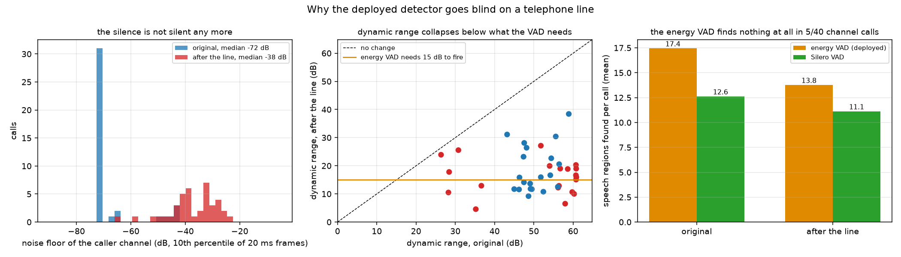
<span class="caption"><b>Figure 13.1 — What a telephone line does to the caller channel.</b> Left: the noise floor before and after. Centre: total dynamic range. Right: how many speech regions the energy VAD finds. Source: <code>src/channel_figures.py::fig_dynamic_range</code>, 40 validation calls.</span>
</div>

!!! fact "The numbers, over 40 validation calls"
    | | original recording | after a simulated line |
    |---|--:|--:|
    | median noise floor | **−72.25 dB** (digital zero) | −37.51 dB |
    | median dynamic range | **52.10 dB** | **15.95 dB** |
    | calls where the **energy VAD finds no speech at all** | 0 | **5 of 40 (12.5 %)** |
    | calls where **Silero** finds no speech | 0 | 0 |

    `[outputs/robust/dynamic_range.json]`

!!! interp "Why this single measurement explains the whole second half of the project"
    The energy VAD's rule is "speech is 15 dB above the noise floor" (§5.2). Before a line, there are 52 dB
    of range and that rule is trivially satisfied. After a line, there are **16 dB of range in the entire
    file** — the threshold barely clears the floor, and on 12 % of calls it does not clear it at all.

    When the VAD returns nothing, `predict.py` has no chunks, and returns `synthetic_probability = 0.5`
    with a warning. Under the challenge contract, `0.5 >= 0.5` evaluates to **`is_synthetic: true`**. So a
    line that silences the VAD does not merely degrade the model — it removes the model from the decision
    entirely and replaces it with a coin that always lands on "synthetic". Across the full evaluation this
    happened on **47 files**.

## 13.3 The pilot: a 10-call gate

Before building anything, ten calls (5 human, 5 synthetic) were pushed through a simulated line and scored
by the deployed specialist.

!!! fact "V1 through a telephone line, first contact"
    | | original | through the line |
    |---|--:|--:|
    | accuracy | **100 %** | **70 %** |
    | verdict flips | — | 3 of 10 |
    | segmentation failures (VAD found nothing) | 0 | 4 of 10 |
    | mean absolute change in probability | — | ~0.33 |

    `[reports/EXPERIMENT_LOG.md 07:15:42]`

!!! warn "The failure is asymmetric, and in the worst possible direction"
    Human callers stayed close to 100 % correct through the line. Synthetic callers collapsed — only 40 %
    were still caught. The channel removes the cues that made synthetic callers *look* synthetic (a clean
    floor, a hot level, a sharp band edge), so after a codec **a deepfake starts to look human**. For a bank,
    a false negative is an attacker let through. This is not a symmetric accuracy loss; it is the model
    failing in the direction that costs money.

## 13.4 Why a real Twilio capture was rejected

!!! fact "The decision, recorded in the robustness report"
    > "Telephony runs in real time... Pushing them [353 calls, 14.5 hours] through real calls takes 14.5
    > hours of calling... the cost (about 28 USD) was never the obstacle; the clock was."

    Plus a second, stronger argument: "One captured channel buys robustness to one channel... change
    carrier and the work is repeated."

!!! interp "Simulation was the right call here, and the report is honest that no carrier was involved"
    A hackathon has hours, not days. But the deciding argument is generalisation, not time: capturing one
    real carrier produces one channel, whereas a parameterised simulator produces a *distribution* of
    channels and lets an entire family of codecs be held out for honest testing. That held-out family
    (§14.1) is the only way to measure whether robustness transfers rather than memorises. The project
    states plainly in its report that no carrier was ever involved, which is the right way to make this
    trade.

## 13.5 The channel simulator

`src/phone_channel.py`, 24.8 KB, is the most technically dense file in the repository.

**Companding, in numpy, exactly.**

!!! bg "What μ-law is and why telephony uses it"
    A 16-bit linear sample spends as much resolution on very loud sounds as on very quiet ones, which is
    wasteful, because human loudness perception is roughly logarithmic. **Companding** compresses the
    dynamic range before quantisation and expands it afterwards: μ-law maps the 14-bit magnitude domain
    through `log(1 + μ|x|)/log(1 + μ)` with μ = 255, then stores 8 bits. The result carries roughly
    12–13 bits of *perceived* quality in 8 bits of storage. A-law is the European variant with a slightly
    different curve. Together they are ITU-T G.711 — the base codec of the entire PSTN.

!!! warn "The classic bug: μ-law bytes are not PCM"
    A μ-law byte is a **compressed codeword**, not a small linear sample. Reading a μ-law stream as if it
    were 16-bit PCM produces noise of the right length but the wrong everything else. The project has a
    regression test for exactly this mistake — `test_mulaw_bytes_read_as_pcm16_is_obviously_broken` asserts
    the correlation with the true signal falls below 0.1 and the length halves.

!!! fact "The G.711 implementation is bit-exact, and this is proved by test"
    `pcm16_to_ulaw` is checked against Python's reference `audioop.lin2ulaw` over **all 65 536 int16
    values** with `np.array_equal`, and the decoder over all 256 codes. The same for A-law. Four tests, no
    tolerance, exact equality. `[tests/test_phone_channel.py]`

**The codecs.** Eleven more run through `ffmpeg`, encode-then-decode:

| Family | Codecs | Bitrate | Type |
|---|---|--:|---|
| **SEEN** — used in training | G.711 μ-law, G.711 A-law | 64k | companding (numpy) |
| | G.726 | 32k / 24k / 16k | ADPCM waveform coding |
| **UNSEEN** — never trained on | GSM 06.10 full rate | 13k | RPE-LTP parametric |
| | AMR-NB | 12.2k / 7.4k / 4.75k | ACELP parametric |
| | iLBC | — | frame-independent |
| | Speex | — | CELP |
| | Opus narrowband | 16k | hybrid, VoIP mode |
| | G.722 | — | wideband sub-band ADPCM |

!!! interp "The seen/unseen split is the experiment, not a detail"
    Seen is **waveform coding** — the codec tries to reproduce the shape of the signal. Unseen is mostly
    **parametric coding** — the codec analyses the signal, transmits parameters of a speech production model,
    and re-synthesises it at the far end. A parametric codec is, in a real sense, a speech synthesiser. So
    the held-out family is not merely "different codecs"; it is a category of transformation that makes
    every voice partly synthetic, which is the hardest possible generalisation test for this task.
    `tests/test_channel_dataset.py::test_no_unseen_family_on_the_training_side` enforces that the training
    side never sees one.

**The transmission path.** Eight further impairments, all numpy:

| Stage | What it does | Range sampled |
|---|---|---|
| input gain | scales before anything else | −10 … +4 dB |
| band-pass | zero-phase Butterworth, order 6 | high-pass 180–380 Hz, low-pass 3000–3800 Hz |
| spectral tilt | FFT-domain dB/octave slope about 1 kHz | −2.5 … +1.5 dB/oct |
| codec hops | 1 hop with probability 0.65, else 2 (transcoding) | from the family pool |
| packet loss | **Gilbert-Elliott** two-state Markov model over 20 ms RTP frames, with either PLC (repeat last good frame at −3 dB with a 16-sample cross-fade) or zero-fill | 0 / 0.5 / 1 / 2 / 4 %, mean burst 1–4 frames |
| clock drift | resample by (1 + ppm/1e6) | ±300 ppm |
| comfort noise (DTX) | band-limited 250–3600 Hz Gaussian noise inserted **only where there is no speech** | −62 … −45 dB, applied 50 % of the time |
| line noise | white or pink, plus optional 50/60 Hz mains hum and its second harmonic | SNR 18–42 dB |
| AGC | envelope follower with asymmetric attack (0.15) / release (0.02), 0.4 s window | target −26 … −16 dB, applied 75 % of the time |
| alignment | FFT cross-correlation of 20 ms speech envelopes, ±250 ms search, then shift and pad | — |

!!! interp "Why comfort noise is the cleverest part of the simulator"
    It is inserted *only in the gaps between speech*. That is precisely and only the transformation that
    destroys the digital-silence shortcut of §13.2 — it converts a channel whose silence is exact zero into
    one whose silence is plausible noise, which is what a real line does. A generic "add noise everywhere"
    augmentation would not have done this, and §9.4 showed that generic augmentation did not help.

    The alignment step matters for a subtler reason: codecs and resampling introduce delay, and comparing a
    transformed call to its original without re-aligning would make every downstream difference measurement
    wrong.

<div class="figure" markdown="1">

<span class="caption"><b>Figure 13.2 — The signal chain, as a diagram.</b> This is a teaching illustration drawn with matplotlib patches, not a plot of measured data. Source: <code>src/channel_figures.py::fig_architecture</code>.</span>
</div>

## 13.6 The channel dataset

`src/build_channel_dataset.py` pushes every call through an independently sampled channel.

!!! fact "What was built"
    | split / family | variants per call | samples |
    |---|--:|--:|
    | train / seen | 2 | 564 (226 human, 338 synthetic) |
    | **train / unseen** | **0** | **0** — enforced by test |
    | val / seen | 1 | 71 |
    | val / unseen | 1 | 71 |
    | **total** | | **706 samples · 29.02 hours · 4.7 GB** |

    Output is both a mono transformed caller channel and a reconstructed stereo file where channel 1 is the
    **original agent, copied bit-for-bit as int16** rather than round-tripped through float.

!!! fact "Label independence, and where to check it in the code"
    `transform_one()` draws its channel with `pc.sample_channel(rng, family=family)` where the RNG seed
    derives from `(anon_id, family, variant)` only. The label is **never** passed to `sample_channel` or
    `apply_channel`; it travels alongside as metadata. Both classes therefore receive draws from the same
    channel distribution.

!!! warn "Why label-independent augmentation is not optional"
    ```text
    WRONG                                   RIGHT
    human     -> clean                      human     -> random channel ~ D
    synthetic -> codec                      synthetic -> random channel ~ D   (the SAME D)

    the model learns "codec => synthetic"   the model must find a cue that
    - you have replaced one shortcut        survives every channel in D
      with a worse one
    ```
    If the channel distribution differed by class, the augmentation would install a new, stronger shortcut
    and the resulting accuracy would be pure self-deception. This is the single easiest way to get this kind
    of work catastrophically wrong.

<div class="figure" markdown="1">

<span class="caption"><b>Figure 13.3 — What the factory actually produced:</b> codec draws, applied gain, realised packet loss, estimated delay, and alignment correlation across the 706 samples. Source: <code>src/channel_figures.py::fig_dataset</code>.</span>
</div>

---

# 14 · Robust V2

## 14.1 Four candidates, one selection rule

`src/train_robust.py` trains four heads on the same frozen layer-5 embeddings, differing only in which
training domains they see. All four use **Silero VAD**, because §13.2 showed the energy VAD goes blind
after a line.

| variant | training chunks | what it tests |
|---|--:|---|
| `orig_only` | 3 861 original | the control: does the VAD swap alone explain any gain? |
| `channel_only` | 6 528 channel | learn only from degraded audio |
| `mixed` | 10 389 both, class-weighted loss | naive combination |
| **`balanced`** | **10 389 both, sampled to equalise every (domain, class) cell** | **the winner** |

!!! fact "Selection, and the tie-break that decided it"
    Per epoch, the score is the **worst** call-level AUC across `val_original` and `val_channel_seen`.
    `val_channel_unseen` is **never used for selection** — it is the honest test.

    At layer 5, every variant with any channel data reached AUC 1.0000 *and* accuracy 1.000 on both
    selectable domains. Both obvious criteria saturated. The tie was broken on **Brier score**, which still
    had resolution. Winner: **`balanced`**, kept at epoch 1.
    `[outputs/robust/results.json]`, `[models/robust_v2/meta.json]`

!!! warn "Without the Brier tie-break, the wrong model would have shipped"
    The code comments record that dictionary iteration order would otherwise have selected `channel_only`.
    The experiment log confirms the flag genuinely moved: two successive sweep runs marked `channel_only` as
    "DEPLOYED as Model B" before a third marked `balanced`. The final written report confirms `balanced`.
    This is worth stating openly — a selection rule that ties is a selection rule that picks by accident.

<div class="figure" markdown="1">
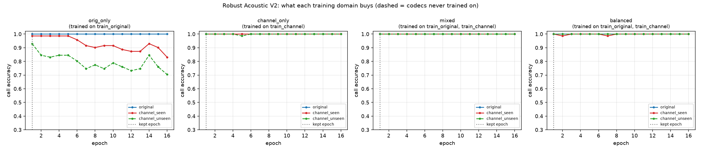
<span class="caption"><b>Figure 14.1 — Per-domain accuracy during training.</b> The dashed line is the untrained codec family, shown but never used to select. Source: <code>src/train_robust.py::plot_curves</code>.</span>
</div>

!!! fact "The deployed model card"
    ```json
    {"backbone": "wav2vec2_spanish", "hf_name": "facebook/wav2vec2-base-es-voxpopuli-v2",
     "layer": 5, "pooling": "mean", "aggregation": "mean", "vad": "silero",
     "chunk_seconds": 4.0, "target_rms_db": -26.0, "seed": 42,
     "variant": "balanced", "train_sets": ["train_original", "train_channel"],
     "best_epoch": 1, "selection_rule": "worst call-level AUC over val_original, val_channel_seen",
     "display": "Robust Acoustic V2 (Wav2Vec2 Spanish, frozen)"}
    ```
    Same backbone, same layer, same pooling, same aggregation as V1. **Only the VAD and the training
    distribution changed.** `[models/robust_v2/meta.json]`

## 14.2 The stress suite

`src/stress_test.py` applies eleven perturbations to the validation split at **test time only** — nothing
is retrained.

| condition | what it does |
|---|---|
| `clean` | identity, the control |
| `gain_-12dB` | multiply by 10^(−12/20) |
| `lowpass_3400` / `lowpass_3000` | Butterworth order 8 |
| `pstn_300-3400` | Butterworth order 6 band-pass — the classic telephone band |
| `white_snr20` / `white_snr10` | additive white Gaussian noise at 20 / 10 dB SNR re speech RMS |
| `pink_snr10` | 1/f noise, 10 dB SNR |
| `mulaw_codec` | μ = 255 companding plus 8-bit quantisation |
| `reverb_0.3s` | exponentially-decaying random impulse response, RT60 0.3 s |
| `tilt_-3dB_oct` | FFT-domain −3 dB/octave slope about 1 kHz |

!!! fact "V1 under stress, per condition"
    | condition | accuracy | FAR | FRR | AUC |
    |---|--:|--:|--:|--:|
    | clean | 1.000 | 0.000 | 0.000 | 1.000 |
    | gain −12 dB | 1.000 | 0.000 | 0.000 | 1.000 |
    | low-pass 3400 | 1.000 | 0.000 | 0.000 | 1.000 |
    | low-pass 3000 | 1.000 | 0.000 | 0.000 | 1.000 |
    | PSTN 300–3400 | 0.986 | 0.029 | 0.000 | 1.000 |
    | white SNR 20 | 0.972 | 0.000 | 0.054 | 1.000 |
    | white SNR 10 | 0.986 | 0.000 | 0.027 | 0.998 |
    | pink SNR 10 | 1.000 | 0.000 | 0.000 | 1.000 |
    | μ-law | 1.000 | 0.000 | 0.000 | 1.000 |
    | **reverb 0.3 s** | **0.887** | **0.235** | 0.000 | 1.000 |
    | **tilt −3 dB/oct** | **0.887** | **0.235** | 0.000 | 0.999 |

    `[outputs/stress/wav2vec2_spanish/mlp_stress.json]`

!!! interp "Read the AUC column next to the accuracy column"
    Under reverb, accuracy falls to 88.7 % while AUC stays at **1.000**. The ranking is untouched; only the
    threshold has moved, and it moves in the false-accept direction (FAR 0.235). This is the same
    "ranking survives, threshold breaks" signature as §11. It also identifies the mechanism precisely:
    reverberation and spectral tilt both change the *shape* of the spectrum, which is what the model was
    partly keying on. The project's own summary states the rule bluntly: "wherever a low-pass filter alone
    breaks a model, that model was partly a band-edge detector."

<div class="figure" markdown="1">

<span class="caption"><b>Figure 14.2 — Accuracy and AUC per condition, all three backbones.</b> WavLM collapses under reverberation, XLS-R under pink noise; the Spanish model holds. Source: <code>src/stress_test.py::plot_mlp_stress</code>.</span>
</div>

## 14.3 Out-of-distribution audio

`src/external_check.py` assembles **108 clips that have nothing to do with the Altur corpus**.

!!! fact "The external set"
    | source | clips | class |
    |---|--:|---|
    | edge-tts, 8 Spanish voices (MX, CO, AR, US) × 4 | 32 | synthetic |
    | gTTS es-MX | 8 | synthetic |
    | Windows SAPI (Sabina, Helena Desktop) × 4 | 8 | synthetic |
    | FLEURS es_419 | 40 | human |
    | ASVspoof 2019 LA bonafide (English) | 20 | human |
    | **total** | **108** | 48 synthetic / 60 human |

    Each is scored in two variants: **`8k`** (resample only) and **`pstn`** (300–3400 Hz band-pass plus
    μ-law), then padded with 1.5 s of faint noise and wrapped in a stereo array with a near-silent agent
    channel.

!!! fact "The honest number"
    | variant | accuracy | balanced acc | AUC | EER | FAR | FRR |
    |---|--:|--:|--:|--:|--:|--:|
    | `8k` — resample only | 0.685 | 0.713 | 0.900 | 0.167 | 0.042 | **0.533** |
    | `pstn` — band-passed | **0.880** | 0.875 | **0.945** | 0.129 | 0.167 | 0.083 |

    `[outputs/external/results.json]`

!!! interp "Why clean audio makes humans look synthetic"
    In the `8k` variant the model flags **53 %** of genuine human recordings as synthetic. The reason is
    exactly the shortcut of §12: in training, the *synthetic* callers were the clean, loud, sharply
    band-limited ones. Present it with a clean studio recording of a real human and it applies the rule it
    learned. Band-limit that same audio and accuracy jumps from 68.5 % to 88.0 %, because the input now
    looks like the domain the model was fitted on. **88.0 % / AUC 0.945 is the number this project quotes
    as honest**, not the 100 %.

<div class="figure" markdown="1">

<span class="caption"><b>Figure 14.3 — Scores on the 108 out-of-dataset clips,</b> by source and by channel variant. Source: <code>src/external_check.py</code>.</span>
</div>

!!! warn "Caveats the project attaches to this number"
    108 clips; a simulated line, not a real one; read sentences rather than conversation; and the neural-TTS
    clips passed through MP3 compression before they were used.

## 14.4 The full evaluation matrix

<div class="figure" markdown="1">
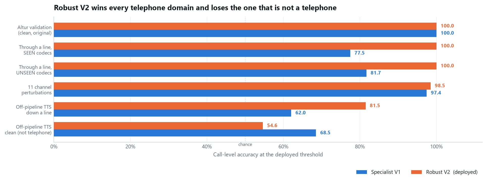
<span class="caption"><b>Figure 14.4 — The headline result.</b> Call-level accuracy at the deployed threshold for the specialist and for Robust V2 across all six evaluation domains. Generated for this report from <code>outputs/robust/evaluation_matrix.csv</code>.</span>
</div>

!!! fact "Four models × six domains, accuracy at the deployed threshold / ROC AUC"
    | domain | n | Specialist V1 | V1 + Silero VAD | Retrained, original data only | **Robust V2** |
    |---|--:|--:|--:|--:|--:|
    | Altur validation (clean) | 71 | 100.0 % / 1.000 | 100.0 % / 1.000 | 100.0 % / 1.000 | **100.0 % / 1.000** |
    | Through a line, **SEEN** codecs | 71 | 77.5 % / 0.908 | 91.5 % / 1.000 | 98.6 % / 1.000 | **100.0 % / 1.000** |
    | Through a line, **UNSEEN** codecs | 71 | 81.7 % / 0.929 | 74.6 % / 1.000 | 93.0 % / 1.000 | **100.0 % / 1.000** |
    | 11 stress perturbations | 781 | 97.4 % / 0.997 | 99.0 % / 1.000 | 98.2 % / 1.000 | 98.5 % / 0.999 |
    | Off-pipeline TTS **down a line** | 108 | 62.0 % / 0.794 | 64.8 % / 0.894 | 76.9 % / 0.891 | **81.5 % / 0.891** |
    | Off-pipeline TTS, **clean** | 108 | **68.5 % / 0.899** | 60.2 % / 0.849 | 55.6 % / 0.886 | 54.6 % / 0.867 |
    | **worst over ALL domains** | | **62.0 %** | 60.2 % | 55.6 % | 54.6 % |
    | **worst over TELEPHONE domains** | | 62.0 % | 64.8 % | 76.9 % | **81.5 %** |

    `[outputs/robust/evaluation_matrix.csv]`

<div class="figure" markdown="1">

<span class="caption"><b>Figure 14.5 — The same matrix as the project plots it,</b> accuracy above, AUC below. Source: <code>src/evaluate_models.py::plot_matrix</code>.</span>
</div>

<div class="figure" markdown="1">

<span class="caption"><b>Figure 14.6 — Deployed-threshold accuracy, best-achievable-threshold accuracy, and AUC, per model per domain.</b> The gap between the first two is the headroom a recalibration would recover. Source: <code>src/evaluate_models.py::plot_auc_vs_threshold</code>.</span>
</div>

## 14.5 The selection, and the argument the project refused to hide

Two defensible criteria disagree.

!!! warn "The two criteria and their answers"
    - **Worst accuracy over ALL six domains** → the **specialist** wins, 62.0 % against 54.6 %.
    - **Worst accuracy over the TELEPHONE domains only** → **Robust V2** wins, 81.5 % against 62.0 %.

    `reports/deployed_model.json` records the choice and the reasoning verbatim:
    ```json
    {"model": "robust_v2",
     "criterion": "highest worst-case accuracy over the telephone domains
                   (altur_val, channel_val_seen, channel_val_unseen, external_ood_channel, stress)",
     "worst_telephone_accuracy": 0.8148, "worst_all_domains_accuracy": 0.5463,
     "runner_up_all_domains": "specialist",
     "note": "external_ood (clean non-telephone audio) is excluded from the criterion
              and reported in full in the report"}
    ```

!!! interp "Why excluding one domain is legitimate here, and how to defend it to a judge"
    `external_ood` is clean, non-telephone, studio-recorded audio — **the one domain that a bank's phone
    line cannot physically produce**. Selecting a telephone detector on performance over audio that has
    never been through a telephone optimises for a situation that will not occur.

    The honest part is that the project prints both rows, names the runner-up, and states the exclusion in
    the artefact itself. Its own report says: "Both rows are printed because the two rules disagree, and
    hiding the one that flatters the older model would be the wrong kind of report."

    The reason V2 is worse on clean audio is also understood rather than mysterious: it has **stopped**
    keying on loudness and band edge, which were exactly the cues that made those clean clips easy. Losing
    accuracy by giving up a shortcut is the intended outcome of the exercise.

!!! interp "Selection beyond accuracy"
    Robustness aside, the two models are identical in cost: same backbone, same layer, same 197 k-parameter
    head, same ~120 ms GPU latency, same 760 MB of weights, same deployment story. There was no
    size/latency/complexity trade to make. The decision rested entirely on which distribution the system
    will actually meet.
# 15 · Every metric, and what it means here

## 15.1 The confusion matrix

Everything else is derived from four counts. Convention: **synthetic is the positive class**.

```text
                          PREDICTED
                     human        synthetic
              +--------------+--------------+
        human |      TN      |      FP      |   a real person was accused
   T          |   correct    |  FALSE ALARM |
   R          +--------------+--------------+
   U synthetic|      FN      |      TP      |   an attacker got through
   E          | MISSED ATTACK|   correct    |
              +--------------+--------------+
```

!!! fact "The fused system on the 71 held-out calls"
    ```text
                        predicted human   predicted synthetic
    true human                 37                  0
    true synthetic              0                 34
    ```
    Zero false alarms, zero missed attacks. `[outputs/fusion/val_weight_sweep.json]`

## 15.2 The derived quantities

| Metric | Formula | Question it answers | In this system |
|---|---|---|---|
| **Accuracy** | (TP+TN)/total | What share of calls did we get right? | 71/71 = 100 % on the held-out split; **88.0 %** on off-pipeline audio down a line |
| **Precision** | TP/(TP+FP) | Of the calls we flagged, how many really were synthetic? | 1.000 here; it is what determines how much analyst time a false alarm wastes |
| **Recall** (= TPR, sensitivity) | TP/(TP+FN) | Of all synthetic callers, how many did we catch? | 1.000 here. **The metric a bank cares about most** — a missed attacker is an account takeover |
| **F1** | harmonic mean of precision and recall | One number when both matter | 1.000 |
| **Balanced accuracy** | mean of per-class recall | Accuracy that a class imbalance cannot flatter | 1.000 |
| **FAR** (false acceptance) | FP/(FP+TN) | How often is an innocent caller accused? | 0.000 here; **0.167** on off-pipeline PSTN audio |
| **FRR** (false rejection) | FN/(FN+TP) | How often does an attacker walk through? | 0.000 here; **0.533** on off-pipeline *clean* audio |
| **EER** | the rate where FAR = FRR | A single threshold-free summary of the trade-off | 0.000 here; **0.129** off-pipeline PSTN |
| **Brier** | mean squared error of the probability | Are the *probabilities* right, not just the ranking? | fused **0.0096**; acoustic alone 0.0003; semantic alone 0.0698 |
| **ECE** | mean gap between confidence and observed accuracy, binned | Same question, read as a percentage | 0.0190 → **0.0150** after calibration |

!!! bg "FAR and FRR are a dial, not two independent numbers"
    Raising the decision threshold makes the system more reluctant to flag: FAR falls, FRR rises. Lowering
    it does the reverse. There is no setting where both fall — the only way to improve both is a better
    model. **EER** is the threshold where the two curves cross, and quoting it is a way to compare models
    without arguing about where the threshold should sit.

```text
   error
     ^
     |\                                     /
     | \   FRR (attackers missed)          /
     |  \                                 /   FAR (people accused)
     |   \                               /
     |    \                             /
     |     \                           /
     |      \___                   ___/
     |          \___           ___/
     |              \___   ___/
     |                  \_X_/   <-- EER: the crossing point
     |                    |
     +--------------------+-------------------------> threshold
                       EER point
   lenient <-------------------------------> strict
```

!!! interp "Where a bank would actually put the threshold"
    Not at the EER. The costs are wildly asymmetric: a false alarm costs one extra verification step, while
    a missed synthetic caller can cost an account. A deployment would push the threshold toward lower FRR
    and accept more false alarms — and because the model is calibrated, that adjustment can be made in terms
    of an actual probability rather than an arbitrary score.

## 15.3 ROC and AUC, and why AUC matters so much in this report

!!! bg "The ROC curve"
    Sweep the threshold from lenient to strict and plot true-positive rate against false-positive rate at
    every setting. A model that ranks randomly traces the diagonal; a model that ranks perfectly goes
    straight up the left edge and across the top. **AUC** is the area underneath, and it has a clean
    interpretation: **the probability that a randomly chosen synthetic call scores above a randomly chosen
    human call.** 0.5 is chance, 1.0 is a perfect ranking.

!!! interp "Why AUC can stay at 1.000 while accuracy collapses"
    AUC measures only the **ordering**. Accuracy measures the ordering *and* where the threshold sits
    relative to it. A domain shift that moves every score in the same direction — which is exactly what a
    codec, a gain change or a reverb does — leaves the ordering perfectly intact and strands the fixed 0.5
    threshold in the wrong place.

    This is not a theoretical aside. It is the single most repeated pattern in this project's measurements:

    | where | accuracy | AUC |
    |---|--:|--:|
    | leave-one-voice-cluster-out (§11) | 0.175 | 0.996 |
    | V1 under reverberation (§14.2) | 0.887 | 1.000 |
    | V1 under spectral tilt (§14.2) | 0.887 | 0.999 |
    | V1 + Silero on unseen codecs (§14.4) | 0.746 | 1.000 |

    Every one of those is a recalibration problem, not a representation problem — the model still *knows*,
    it has just stopped saying so at 0.5. That distinction is why `evaluate_models.py` reports
    best-achievable-threshold accuracy alongside deployed-threshold accuracy (Figure 14.6), and it is the
    single most useful thing to be able to explain to a judge who asks why the numbers move.

---

# 16 · The fusion layer

## 16.1 The registry

`src/fusion.py` defines one abstraction and iterates over it everywhere. A `Layer` implements three
methods — `available()` (a cheap on-disk check that loads no model), `_load()` (lazy, once) and
`_score(wav_bytes)` — and everything else in the system works off that interface.

```python
class Layer:
    key, display, description = "layer", "Layer", ""
    default_weight = 1.0
    role = "primary"           # "primary" votes always; "verifier" only when asked
    RETRY_AFTER_S = 30.0       # a layer that failed to load is not retried per call

    def score(self, wav_bytes):
        """Never raises: a layer that breaks abstains, so one broken layer
           cannot take the verdict down with it."""
        try:
            self.ensure_loaded()
            result = self._score(wav_bytes)
        except Exception as exc:
            result = LayerResult(self.key, self.display, 0.5, 0.0, True, f"{type(exc).__name__}: {exc}")
        result.latency_ms = ...
        return result
```

A `LayerResult` carries `probability`, `quality` (how much evidence the layer actually had), `abstained`,
`reason`, `latency_ms`, `scored` and a free-form `details` dict.

!!! interp "Two distinctions that look pedantic and are not"
    **`abstained` vs `scored=False`.** Abstained means the layer *was asked* and found nothing usable.
    `scored=False` means it was **never invoked** — the gate decided it was unnecessary, and no paid API
    call was made. The user interface shows these as different states because they mean different things
    to an operator.

    **`held_out_score(anon_id)`.** The semantic layer's shipped `model.pkl` was refitted on all 353 calls,
    so scoring a validation call through it would flatter it. Evaluation paths pass an `anon_id`, and a
    layer whose deployed model has seen that call answers from its own out-of-fold scores instead. Acoustic
    and behaviour are train-only fits and return `None`. Live `/detect` has no id, so it always runs for
    real. This is a piece of evaluation hygiene most projects skip.

!!! fact "The shipped registry"
    | layer | weight | role | what it reads |
    |---|--:|---|---|
    | `acoustic` | 0.50 | primary | the caller's voice |
    | `behaviour` | 0.50 | primary | conversation timing on both channels |
    | `semantic` | 0.15 | **verifier** | the transcript |

    The acoustic slot holds **V1, the specialist**, by default — not `robust_v2`. `robust_v2` is what
    `reports/deployed_model.json` names and what the live Twilio path uses; the fusion default can be
    changed with `--acoustic-model robust_v2`. This divergence is real and the project documents it.

## 16.2 `combine()`, exactly

```text
for each layer result r:
    raw   = weights[r.key]                       # default: the layer's own default_weight
    p     = 0.5 if r.abstained else clip(r.probability, 0, 1)
    eff   = 0.0                                  if r.abstained and on_abstain == "renormalise"
          = raw * (r.quality if use_quality else 1.0)     otherwise
    if not r.scored: eff = 0.0                   # never asked cannot vote

_mix(contributions, mode):
    total   = sum(eff)
    share_i = eff_i / total
    weighted_mean:  fused = sum(share_i * p_i)
    logit_mean:     fused = sigmoid( sum(share_i * logit(p_i)) )

STAGE 1   p_primary = _mix(primaries only)
          primary_confidence = max(p_primary, 1 - p_primary)
          settled = primary_confidence >= verify_threshold        # 0.80

STAGE 2   if settled:  verifiers get scored=False, eff=0, and are NEVER CALLED
          else:        verifiers are consulted and everything is re-mixed

fused          -> is_synthetic = fused >= threshold               # 0.50
confidence     = max(fused, 1-fused)                              # confidence_mode "verdict"
nothing voted  -> is_synthetic = False, confidence = 0.5, decisive = False
```

!!! interp "The abstention policy is where the design shows"
    Under `renormalise` a layer that abstains has its weight redistributed proportionally among the layers
    that did vote — its opinion is removed rather than replaced by a neutral 0.5 that would drag the verdict
    toward the fence. Under `neutral` it stays in at 0.5. Renormalise is the default, and it is the reason a
    Twilio call (where the behaviour layer necessarily abstains, §17.4) still produces a confident verdict
    from the acoustic layer rather than a diluted one.

!!! warn "The explicit non-flag, and why it matters"
    If **no** layer votes, `combine()` returns `is_synthetic: false, confidence: 0.5, decisive: false`
    rather than letting `0.5 >= 0.5` evaluate to `true`. Without that special case the system would
    **accuse every caller it knows nothing about**. The same bug is live in the superseded `backend/`
    shell's mock mode, which is documented there as a warning.

## 16.3 The gate

!!! fact "The gate is enforced before the call is spent"
    ```python
    consult = cfg.use_verifiers and not combine(primaries_only, cfg)["settled_by_primaries"]
    for l in verifiers:
        free = l.held_out_score(anon_id) if anon_id else None
        if free is not None:   out.append(free)                     # evaluation: free lookup
        elif consult:          out.append(self._score_one(l, wav))  # the real, paid call
        else:                  out.append(LayerResult(..., scored=False,
                                   reason="not consulted: the primary layers settled this call on their own"))
    ```
    `[src/fusion.py::FusionDetector.score_layers]` — and there is a test asserting the verifier's scorer is
    invoked **zero** times on a settled call.

!!! fact "What the gate bought, measured"
    On the 71 held-out calls: **66 settled by the primaries alone, 5 escalated** — 7 % of the API calls a
    flat three-way vote would have made. Accuracy is 100 % either way; the flat vote's Brier is marginally
    better (0.0086 against 0.0096). Live latency: about **1.0 s** for a settled call against **3.9 s** for
    an escalated one.

!!! fact "The escalation that justifies the architecture"
    `call_569ffb0869eb`, a **human** caller:

    | layer | score | reading |
    |---|--:|---|
    | acoustic | 0.000067 | confidently human |
    | behaviour | **0.963752** | **confidently, wrongly, synthetic** |
    | primaries combined | 0.482 | 52 % confidence — below the 0.80 gate |
    | semantic (verifier) | 0.0463 | human |
    | **fused** | **0.425** | **human — correct** |

    A 50/50 vote between a confident right answer and a confident wrong answer lands on the fence. The gate
    detects that and buys a third opinion for exactly the calls where it is worth paying for.

<div class="figure" markdown="1">
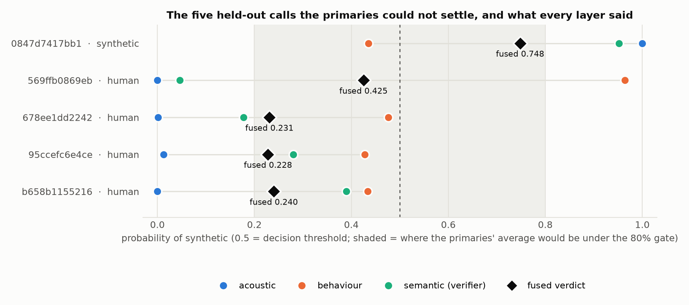
<span class="caption"><b>Figure 16.1 — Every layer's score on the five calls the gate escalated.</b> Source: <code>reports/guide_figures/make_guide_figures.py</code>.</span>
</div>

<div class="figure" markdown="1">
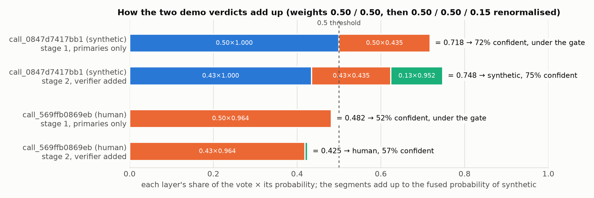
<span class="caption"><b>Figure 16.2 — The fusion arithmetic on two real calls,</b> as weights times scores. Source: <code>reports/guide_figures/make_guide_figures.py</code>.</span>
</div>

## 16.4 The behaviour layer

!!! fact "What it is"
    Silero VAD on **both** channels at 8 kHz → turn boundaries → 24 interpretable features (turn shape,
    response latency statistics, interruptions, barge-ins, extended gaps) plus 15 missing-value indicators
    → **L2 logistic regression, C = 0.1** → sigmoid calibration `σ(1.7190·logit + 0.0931)` fitted by
    5-fold out-of-fold on the training split. 40 parameters, a 52 KB JSON file.

    Validation: **97.18 % (69/71)**, balanced accuracy 0.9718, AUC **0.9913**, Brier 0.0406,
    confusion `[[36,1],[1,33]]`. Train 96.1 % / AUC 0.993 — no overfitting gap.
    Latency ~860 ms p50, almost all of it the VAD.

    It abstains when `quality_score <= 0` or fewer than two interaction events exist, with the reason string
    "insufficient evidence: fewer than two interaction events".

!!! warn "A claim the behaviour module refuses to make"
    The intuitive story — "humans are messy, machines are consistent" — **is not supported by this data**.
    Median within-call response-latency spread is 0.502 s for humans and 0.635 s for synthetic callers: the
    *synthetic* callers are more variable. Interruption-recovery events are too rare to use (only 13 of 282
    training calls had three or more resolved interruptions). Removing the consistency features costs only
    0.991 → 0.979 AUC. The module's own freeze report says so, and this report repeats it because it is
    exactly the kind of plausible narrative that falls apart under a judge's follow-up question.

## 16.5 The semantic layer

!!! fact "The pipeline"
    VAD → **ElevenLabs Scribe** (`scribe_v1`) per channel in 20 s chunks with request hedging → **F4**, 12
    text features (word-level log-probability statistics, disfluency rate, mexicanism rate, false-start
    rate, type-token ratio, mean sentence length) + 1 grounding feature (`overlap_agent`, the share of the
    caller's vocabulary the agent also used) → **F5**, 2 surviving dimensions of a 7-dimension
    **Gemini** (`gemini-3.5-flash-lite`) rubric → **15 features** → standardised logistic regression with
    5-fold sigmoid calibration.

    Budget **2.8 s** for the network calls, hard stop **3.0 s**. Degradation ladder: ASR fails → abstain;
    fewer than 5 caller words → abstain; rubric times out → fall back to `f4` at half evidence quality;
    otherwise `f4+f5`.

    Held-out: accuracy **91.5 %**, AUC **0.975**, Brier 0.070, zero abstentions. Live p50 2.06 s, p95 2.83 s.

<div class="figure" markdown="1">

<span class="caption"><b>Figure 16.3 — Every rung from a dummy classifier to the served semantic model,</b> with the rung that was deliberately abandoned for leaking turn length. Source: <code>reports/guide_figures/make_guide_figures.py</code>, numbers from <code>semantic/AUDIT.md</code>.</span>
</div>

!!! warn "Three things the semantic module found and published against itself"
    1. **The planted traps did not work.** Two deliberately planted conversational traps (a wrong-digit
       repeat, an ambiguous product question) scored AUC **0.45 and 0.35** — worse than chance. The module's
       own plan records the "strong signal" hypothesis as "false, corrected".
    2. **A leak was found and removed.** Two original text features (words-per-turn, word count) correlated
       0.94 with turn length — the behaviour layer's own signal. Keeping them would have double-counted the
       same evidence inside a fusion. They were dropped at a cost of 0.03 AUC.
    3. **The audit and the served model have drifted.** `semantic/AUDIT.md` documents a 10-feature
       configuration at AUC 0.921 as "what is served now"; the pickled model actually serves 15 features.
       The project flagged this in a commit message rather than quietly regenerating the document.

!!! interp "Why the strongest feature family is also the most fragile"
    The single strongest family is ASR log-probability — how confident the transcriber was. Removing it
    drops AUC from 0.921 to 0.882. But that feature measures **how a particular ASR system reacts to a
    particular TTS system**. A new TTS engine could shift that distribution in either direction without
    warning. An adversarial probe with a different engine and two scripts found a 0.36-point swing from
    *script style alone*, same voice. The module calls this "a smoke test, not an evaluation", which is the
    correct label.

## 16.6 The fusion result

!!! fact "The 71 held-out calls, every system"
    | system | accuracy | AUC | Brier |
    |---|--:|--:|--:|
    | Acoustic V1 alone | 100.0 % | 1.000 | 0.0003 |
    | Behaviour alone | 97.2 % | 0.991 | 0.0406 |
    | Semantic alone | 91.5 % | 0.975 | 0.0698 |
    | **Fused — 50/50 primaries + gated verifier** | **100.0 %** | **1.000** | **0.0096** |
    | Flat three-way vote, no gate | 100.0 % | 1.000 | 0.0086 |

<div class="figure" markdown="1">

<span class="caption"><b>Figure 16.4 — Accuracy and Brier score for each layer alone and for the two fusion configurations.</b> Source: <code>reports/guide_figures/make_guide_figures.py</code>.</span>
</div>

!!! warn "The weights were not tuned, and the project says why not"
    The acoustic layer alone is already at 100 % on these 71 calls. There is therefore **no signal in this
    split with which to justify any particular weighting or gate threshold** — every setting that keeps the
    acoustic layer influential scores the same. The weights (0.50 / 0.50 / 0.15) and the gate (0.80) are
    **stated design choices exposed as runtime knobs**, not fitted values, and `evaluate_fusion.py` records
    in its own output: "a sweep maximum describes this split, it is not a tuned setting you can promise on
    the hidden test set." The three-layer weight sweep was deliberately not run.

---

# 17 · Latency: how early, not just what

## 17.1 Two clocks

!!! interp "Call time and speech time are different questions"
    A call can run 20 seconds with the caller saying almost nothing. A detector that reports "decided at
    12 seconds" without saying how much of that was *speech* is reporting a property of the conversation,
    not of itself. This project reports both, and treats **seconds of caller speech consumed** as the
    honest measure of how much evidence the model needed.

    Across the dataset only 27 % of audio is caller speech (3.9 h of 14.5 h), so the two clocks diverge by
    roughly a factor of four.

## 17.2 What the prefix walk is, and what it is not

`src/latency.py::progression` walks *k* = 1…n and asks what the model would have answered having heard only
the first *k* chunks.

!!! fact "The walk is exact, not a replay animation"
    The acoustic layer scores each 4-second chunk independently and aggregates by the **mean of chunk
    log-odds**. The mean of the first *k* values *is* what the deployed model would have produced from those
    *k* chunks — same `aggregate_chunk_scores`, same Platt calibration, nothing re-derived. There is a test
    that asserts the walk equals `metrics.aggregate_chunk_scores` directly, with the comment: "if this ever
    drifts, every number on /demo becomes a story rather than a measurement."

    The behaviour layer is genuinely **re-run** on the call truncated at each boundary; it abstains until it
    has two interaction events, exactly as it would live. The semantic verifier is **never** consulted on a
    prefix, because that would cost a paid API call per chunk; it is marked `scored=False` with the reason
    shown on the page.

!!! warn "Stated plainly: this is not streaming"
    The model scores a finished recording. This is a **prefix evaluation** — "what would it have concluded
    by second *t*" — which is the standard way to measure detection latency for a non-streaming model. The
    project states this on the page itself rather than implying real-time inference. `/api/health` returns
    `streaming: false` for the same reason, alongside `queue_depth: 0`, both described in the code as
    "two fields the server refuses to fake."

## 17.3 The measurement

!!! bg "The confidence band is a policy, not a fit"
    `CONFIDENT_SYNTHETIC_THRESHOLD = 0.85` and `CONFIDENT_HUMAN_THRESHOLD = 0.15` define when a running
    verdict counts as a commitment rather than a lean. These are **not** tuned on the validation split —
    tuning a confidence band on the same 71 calls used to report the resulting latency would make the
    latency meaningless. They are a symmetric band, stated in `config.py`, and the page re-tunes them live so
    anyone can see the sensitivity.

<div class="figure" markdown="1">
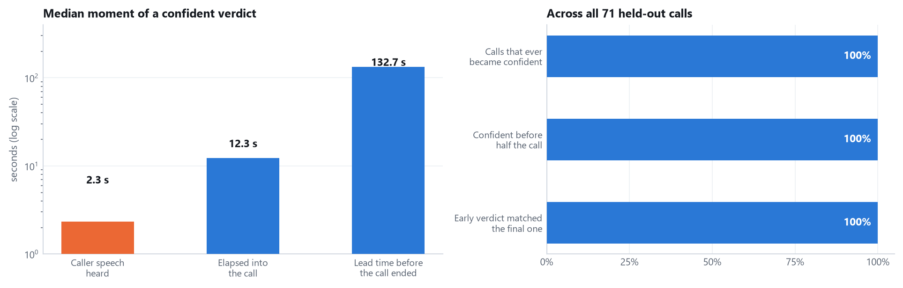
<span class="caption"><b>Figure 17.1 — When the verdict became reachable, over all 71 held-out calls.</b> Left: the median moment of a confident verdict on three different clocks, log scale. Right: the three rates that say whether an early verdict can be acted on. Generated for this report from <code>outputs/fusion/latency_benchmark.json</code>.</span>
</div>

!!! fact "Detection latency, median over 71 held-out calls"
    | measure | value |
    |---|--:|
    | **caller speech heard before a confident verdict** | **2.33 s** |
    | elapsed into the call | 12.32 s |
    | lead time before the call would have ended | **132.73 s** |
    | share of the call elapsed at detection | 7.9 % |
    | calls that ever became confident | **71 / 71** |
    | confident before the halfway point | **100 %** |
    | early verdict agreed with the final verdict | **100 %** |

    Model inference itself is **119 ms** median on GPU, 850 ms on CPU.
    `[outputs/fusion/latency_benchmark.json]`

!!! interp "Why the lead time is the number a bank would care about"
    132 seconds of lead time means the verdict is available with more than two minutes of call remaining —
    enough to route to step-up verification, alert a supervisor, or restrict what the agent may action,
    while the caller is still on the line. A detector that is right after the call ends has no operational
    value. The 100 % early-agrees-with-final figure is what makes acting on the early verdict defensible;
    without it, early detection would just be guessing sooner.

<div class="figure" markdown="1">
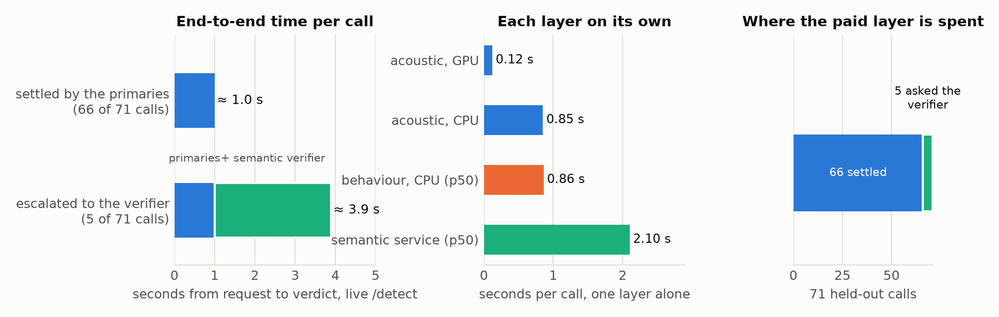
<span class="caption"><b>Figure 17.2 — Where the time goes,</b> and where the verifier's 2.8-second budget is spent when the gate opens. Source: <code>reports/guide_figures/make_guide_figures.py</code>.</span>
</div>

---

# 18 · One real call, end to end

Every number below was produced by running the pipeline on **`call_0294f969f98b`**, a genuine held-out
synthetic call, and printing the intermediate state at each stage.

```text
CALL call_0294f969f98b   true label = synthetic   manifest duration = 109 s

 1  DECODE          soundfile.read -> float32 array (870240, 2) @ 8000 Hz = 108.78 s
                    (1 744 480 numbers in total)

 2  CHANNELS        caller = stereo[:, 0]   shape (870240,)   RMS -21.6 dBFS
                    agent  = stereo[:, 1]   shape (870240,)   RMS -24.6 dBFS
                    the agent channel goes no further into the acoustic path

 3  ENERGY VAD      20 ms frames / 10 ms hop -> frame dB
                    noise floor = 10th percentile
                    speech if level > max(floor + 15 dB, -55 dB)
                    -> 14 regions, 20.04 s of caller speech = 18.4 % of the call
                    first four: (5.44,6.19) (9.95,10.57) (12.93,16.06) (21.61,22.77)

 4  CHUNKING        regions under 1.0 s dropped; 4.0 s cuts inside regions only
                    -> 6 chunks, 14.59 s total
                    (12.93,16.06) (21.61,22.77) (34.40,37.44)
                    (46.20,48.09) (72.01,73.38) (85.18,89.18)

 5  PER CHUNK       slice -> resample 8000->16000 Hz (resample_poly, exact 2x)
                          -> scale so RMS = -26.00 dBFS
                    chunk[0]: 50 080 samples @ 16 kHz = 3.13 s, RMS -26.00 dBFS

 6  BACKBONE        frozen wav2vec2-base-es-voxpopuli-v2, truncated after layer 5
                    hidden_states[5] = (1, 156, 768)     156 steps ~ one per 20 ms
                                        ^    ^    ^
                                    batch    T    D

 7  POOLING         mean over the 156 time steps -> (1, 768)

 8  CLASSIFIER      standardise with the buffers stored in the checkpoint
                    Linear(768->256) -> ReLU -> Dropout(off at inference) -> Linear(256->2)
                    score = logits[1] - logits[0]
                    six chunk log-odds:
                        [10.437, 10.396, 12.926, 8.412, 9.082, 9.719]

 9  AGGREGATE       mean of the six log-odds = 10.1619

10  CALIBRATE       Platt: sigmoid(0.9024501565 * 10.1619 + 0.8365867312)
                          = 0.999955                 (uncalibrated would be 0.999961)

11  VERDICT         is_synthetic = 0.999955 >= 0.50            -> true
                    confidence   = max(p, 1-p)                 -> 1.0
                    {"is_synthetic": true, "confidence": 1.0}

12  TIMING          decode 4.7 ms | segmentation 22.6 ms | backbone 130.1 ms
                    classifier 24.9 ms | total 177.6 ms | wall 183 ms

13  FUSION          behaviour layer scores the same WAV: p = 0.988
                    primaries 50/50 -> 0.994, confidence 99.4 % >= 0.80
                    -> SETTLED. the semantic verifier is never called.

14  LOG             store.record() writes one row: verdict, confidence, per-layer
                    scores, timings, decided_at_s. NO AUDIO IS STORED.

15  RESPONSE        {"is_synthetic": true, "confidence": 0.9941,
                     "details": {"synthetic_probability": 0.9941,
                                 "layers": [...], "weights": {...},
                                 "latency_ms": 183, "n_layers_used": 2, ...}}

16  UI              the browser paints the verdict, the waveform, the per-chunk
                    strip and the running probability from `details`
```

!!! fact "Verified against the live server"
    Posting this call to the running endpoint returns `is_synthetic: true, confidence: 0.9941`, with
    acoustic p = 0.999955, behaviour p = 0.988, and the semantic layer reporting `"not consulted: the
    primary layers settled this call on their own"`. Round trip 0.87 s including HTTP.

---

# 19 · The product

## 19.1 One backend

`python src/server.py` is the whole thing: the challenge endpoint, the fusion console API, the demo API,
the live-call path, the admin API and three server-rendered pages, in one process. All three detection
layers run inside it — the semantic layer is imported through `LocalSemanticLayer`, not reached over HTTP.

```text
                      +----------------------------------------------+
   browser  --------> |            src/server.py  (FastAPI)          |
   /  /demo/          |                                              |
   /admin/            |  POST /detect ------> score_call()           |
                      |                          |                   |
   judge's harness -> |                          v                   |
   POST /detect       |                   fusion.FusionDetector      |
                      |                    /        |        \       |
   phone  <---------- |          AcousticLayer  BehaviourLayer  LocalSemanticLayer
   Twilio REST        |            (torch,        (onnxruntime,   (httpx ->
                      |             frozen        numpy, 40        ElevenLabs
                      |             Wav2Vec2)     params)          + Gemini)
                      |                    \        |        /       |
                      |                     combine(), two-stage     |
                      |                          |                   |
                      |                          v                   |
                      |                   store.record()  ---> outputs/fusion/calls.db
                      |                                       (scores only, never audio)
                      +----------------------------------------------+
```

!!! warn "There is a second FastAPI app in the repository, and it is not the one you run"
    `backend/` came in from a merged branch and serves the same `/detect` through a bridge into the same
    `src/fusion.py`. It is marked superseded at the top of `backend/INTEGRATION.md`; nothing starts it.
    Its only surviving advantage is serving hygiene the main server lacks — a request-size limit, a
    `/ready` endpoint that returns 503 until layers load, request ids, and a typed error contract — which is
    listed as future work rather than quietly dropped.

## 19.2 The API

**The challenge contract.**

| | |
|---|---|
| **Method / path** | `POST /detect` |
| **Handler** | `server.detect()` → `score_call()` |
| **Body** | JSON with base64 audio under any of `audio`, `wav`, `audio_base64`, `file`, `data`, `audio_b64`, `base64`, `wav_base64`; or any string value over 100 characters; or a raw base64 body; or `multipart/form-data`. `data:` URI prefixes are stripped. Optional `call_id` and `queue`. |
| **Response** | `{"is_synthetic": bool, "confidence": float, "details": {...}}` |

```json
{"call_id": "call_...", "audio_base64": "<complete WAV as base64>",
 "sample_rate": 8000, "channels": 2}
```

```json
{"is_synthetic": true, "confidence": 0.9941,
 "details": {"synthetic_probability": 0.9941,
             "layers": [{"key": "acoustic", "probability": 0.999955, "abstained": false,
                         "scored": true, "share": 0.5, "latency_ms": 130.1}, ...],
             "weights": {"acoustic": 0.5, "behaviour": 0.5, "semantic": 0.15},
             "latency_ms": 183, "n_layers_used": 2, "acoustic_model": "wav2vec2_spanish"}}
```

!!! interp "Why the field name is permissive"
    The brief does not specify the JSON key. Rather than guess, the server accepts eight spellings, raw
    bodies and multipart. The cost is a few lines; the benefit is that a judging harness cannot fail on a
    naming mismatch during a fifteen-minute slot.

!!! warn "The endpoint never returns an error status"
    Any internal exception is caught, logged as a failed record, and answered with **HTTP 200** and
    `{"is_synthetic": false, "confidence": 0.5, "error": "..."}`. The stated reason is "never leave the
    judges without an answer." This is defensible for a benchmark harness and would be wrong in production,
    where a 5xx is the honest signal.

**The rest of the surface.**

| Group | Endpoints |
|---|---|
| Fusion console | `POST /detect_layers`, `POST /fusion/recombine`, `GET`/`POST /fusion/config`, `GET /layers` |
| A/B | `POST /detect_all`, `GET /models` |
| Demo + latency | `POST /demo/analyse`, `GET /demo/calls`, `GET /demo/call/{id}`, `GET /demo/benchmark` |
| Live call | `GET /twilio/config`, `POST /twilio/call`, `GET /twilio/status/{sid}`, `/twilio/recording/{sid}`, `/twilio/analysis/{sid}` |
| Admin | `GET /api/calls`, `GET /api/stats`, `GET /api/health` |
| Held-out data | `GET /validation`, `/validation/{id}/audio`, `/validation/{id}/score`, `/validation/scores` |
| Pages | `GET /`, `GET /fusion`, `GET /demo` |

!!! interp "`POST /fusion/recombine` is the nicest idea in the API"
    The console scores all 71 calls once, then re-decides them from the cached per-layer scores as the
    faders move. No model runs. One combiner implementation serves both the endpoint and the page, so the
    page can never drift from the server's arithmetic — a re-implementation in JavaScript would have been
    the obvious shortcut and the obvious source of a demo-day contradiction.

## 19.3 The call log

`src/store.py` — SQLite, one file, created on first use, no server and no credentials.

```sql
CREATE TABLE calls (
  id TEXT PRIMARY KEY, at TEXT,          -- ISO-8601 UTC
  duration_s REAL, channels INTEGER,
  verdict TEXT,                          -- human | synthetic | abstained
  confidence REAL, probability REAL, latency_ms REAL,
  decided_at_s REAL,                     -- nullable, computed not guessed
  queue TEXT, trap TEXT,
  layers TEXT,                           -- JSON, both views merged by key
  ok INTEGER
);
```

!!! fact "No audio is stored, and that is a deliberate constraint"
    Only scores, verdicts and timings. The dataset terms forbid redistributing the recordings, and a
    database of them would be exactly that.

`decided_at()` computes "the second at which this call stopped being ambiguous": walk the chunks in order,
track whether the running mean agrees with the final verdict, and **reset the marker whenever it
disagrees**. The answer is the end of the first chunk after which the verdict never flips again — or `None`
when the layer abstained or never settled. It is never a placeholder.

## 19.4 The live call

`src/twilio_demo.py`. This is the only path where audio has genuinely been through a telephone network.

```text
POST /twilio/call  {"seconds": 30}      <- no phone number in the request
        |
        v
Twilio REST: calls.create(twiml=<inline>, from_=TWILIO_PHONE_NUMBER, to=TWILIO_TO_NUMBER)
        |
        |   <Say language="es-MX">...</Say>
        |   <Record playBeep="true" maxLength="30" finishOnKey="#" trim="do-not-trim"/>
        |   <Say>Gracias. Analizando.</Say>          NOTE: no action= attribute
        v
background thread:
    warm()                      load Robust V2 while the phone is still ringing
    poll every 2 s              ringing -> in-progress -> completed
    poll for the recording      until status == "completed"
    authenticated GET           .../Recordings/{sid}.wav
        |
        v
mono_to_stereo_wav()
    average channels if stereo; resample to 8 kHz with resample_poly if needed
    caller -> channel 0,  channel 1 = ZEROS
        |
        v
latency.scene(fusion with ROBUST V2, run_fusion_prefixes=False)
        |
        v
GET /twilio/status/{sid} -> done; the page fetches /twilio/analysis and /twilio/recording
```

!!! interp "Three design decisions worth defending"
    **No `action` attribute on `<Record>`.** The usual way to collect a Twilio recording is a webhook,
    which means Twilio must reach your machine — a tunnel, and one more thing to fail on stage. With no
    `action`, Twilio ends the call after recording and the audio is collected by **polling the REST API**.
    Nothing has to reach in: no public URL, no tunnel.

    **Robust V2, not V1.** This is the one place where the audio really has been through a codec, and
    §14.4 says V1 falls to 77.5 % there while V2 holds 100 %. Using the specialist here would be knowingly
    deploying the wrong model.

    **The agent channel is honestly silent.** A Twilio recording is mono; there is no separate agent track
    to put in channel 1, so it is filled with zeros. The behaviour layer then correctly finds no interaction
    to time and abstains — and the page displays "No signal" rather than a number. Fabricating an agent
    channel would have produced a plausible-looking behaviour score from nothing.

!!! fact "Privacy and warm-up"
    `_mask()` reduces any number to its last four digits, and the job the page polls carries only the masked
    form — the full number never reaches a browser. `warm()` loads the V2 backbone **while the phone is
    ringing**, touching primary layers only so no paid verifier call is spent on a test tone. Without it the
    first live call reported its 7-second model load as "voice latency"; with it, 604 ms.

## 19.5 The interfaces

Three server-rendered pages plus a Vite + React app with three entry points.

| Route | What it is |
|---|---|
| `GET /` | **Line Inspector** — record or upload one call, get the verdict with its explanation, optionally simulate a telephone line, A/B the two acoustic models, play the 71 held-out calls |
| `GET /fusion` | **Fusion Console** — weight faders, combine mode, abstention policy, the gate, batch-score all 71 calls, CSV export |
| `/` (React) | the landing narrative |
| `/admin/` | **operations dashboard** — KPI tiles, hourly verdicts, confidence histogram, latency sparkline, a filterable call stream, a request tester, and a health card |
| `/demo/` | **the product demo** — three ways in |

The demo page has three modes: **live microphone** (captures 5 s, builds a caller-only stereo WAV in the
browser, posts it), **upload** (a WAV or pasted base64), and **"Try being the caller"** — one button that
asks for no phone number and makes the server dial `TWILIO_TO_NUMBER`, so the person presenting answers
their own phone and becomes the caller under test. The stage visualises both parties, who is speaking, the
running probability chunk by chunk, and the final verdict with each layer's own contribution.

!!! fact "The demo page has no mock"
    `web/src/demo/api.ts` states it directly: "a fabricated verdict or latency is the one thing this page
    must never show, so without a backend it says so and stops." The admin panel does keep a seeded mock
    behind the same interface, and the header pill reads SAMPLE rather than LIVE when it is active.
# 20 · The code that matters

Ten functions carry most of the system. For each: what it takes, what it returns, how it works, who calls
it, and where it breaks.

## 20.1 `audio.detect_speech_energy` — the segmenter

```python
def detect_speech_energy(wave, sr, frame_s=0.02, hop_s=0.01, threshold_db=15.0,
                         min_abs_db=-55.0, min_speech_s=0.30, min_gap_s=0.30, pad_s=0.10):
    db = frame_db(wave, sr, frame_s, hop_s)          # one RMS-in-dB per 10 ms
    floor = np.percentile(db, 10)                    # robust noise floor
    speech = db > max(floor + threshold_db, min_abs_db)
    speech = close_short_gaps(speech, min_gap_s / hop_s)
    return merge_regions(pad(runs_at_least(speech, min_speech_s), pad_s))
```

**In**: one channel, float32, plus its sample rate. **Out**: a list of `(start, end)` in seconds.
**Called by**: `caller_chunks`, `inspect_dataset`, `latency.scene`. **Edge cases**: a channel shorter than
one frame is zero-padded; a channel with no speech returns `[]`, which every caller must handle — and
`predict.py` does, returning probability 0.5 with a warning. **Where it breaks**: when the dynamic range
falls below the 15 dB threshold, which is exactly what a telephone line does (§13.2). That single failure
mode is why the deployed model uses Silero.

## 20.2 `audio.chunk_regions` — the budget

```python
for (start, end) in regions:
    L = end - start
    if L < min_s:  continue                      # too short to be evidence
    n = int(L // chunk_s)
    spans += [(start + i*chunk_s, start + (i+1)*chunk_s) for i in range(n)]
    if L - n*chunk_s >= min_s:                   # keep a usable tail
        spans.append((start + n*chunk_s, end))
return spans[:max_chunks]
```

**Invariant that matters**: a chunk never crosses a region boundary, so it never contains silence stitched
to speech. That is what makes each chunk an independent observation, which is what makes the mean-of-
log-odds aggregation — and therefore the exact prefix walk of §17 — valid.

## 20.3 `metrics.aggregate_chunk_scores` — one call, one number

```python
def aggregate_chunk_scores(scores, method="mean"):
    if method == "mean":        return float(np.mean(scores))
    if method == "median":      return float(np.median(scores))
    if method == "top25_mean":  return float(np.mean(sorted(scores)[-max(1, len(scores)//4):]))
    ...
```

**Called by**: `predict.AcousticDetector.predict_stereo`, and independently by `latency.progression`.
**Why that matters**: the latency page and the endpoint call the *same* function, so the running verdict on
the page cannot drift from the verdict the endpoint would give. There is a test asserting exactly this.

## 20.4 `predict.AcousticDetector` — the acoustic layer

```python
class AcousticDetector:
    def __init__(self, backbone=None, classifier="mlp", ...):
        meta = json.load(open(MODELS_DIR / backbone / "meta.json"))
        self.layer, self.pooling, self.aggregation, self.vad = meta[...]
        self._load_backbone()      # AutoModel, TRUNCATED after self.layer, frozen, eval()
        self._load_classifier()    # mlp.pt or logreg.joblib
        self._load_calibration()   # calibration_{classifier}.json, or identity
```

!!! interp "Truncating the encoder is a real optimisation, not a detail"
    `model.encoder.layers = model.encoder.layers[:layer+1]` physically discards transformer blocks 6–12.
    For layer 5 of a 12-layer model that is **more than half the compute removed** from every forward pass,
    with no effect on the output — a test asserts the truncated model's hidden states match the full
    model's exactly. It is why GPU latency is 119 ms rather than roughly double.

`predict_stereo` then runs the pipeline of §18 and `verdict()` produces the contract:

```python
def verdict(self, result):
    p = result["synthetic_probability"]
    is_synth = p >= config.DECISION_THRESHOLD                         # 0.5
    conf = max(p, 1 - p) if config.CONFIDENCE_MODE == "verdict" else p
    return {"is_synthetic": bool(is_synth), "confidence": round(float(conf), 4)}
```

## 20.5 `phone_channel.apply_channel` — the transmission path

```python
def apply_channel(wave, params, speech_mask=None, seed=None):
    y = wave * 10**(params.input_gain_db / 20)
    y = spectral_tilt(band_limit(y, params.high_pass_hz, params.low_pass_hz), params.tilt_db_oct)
    for codec in params.codecs:                       # 1 hop, or 2 for transcoding
        y = fit_length(codec_roundtrip(y, codec), len(wave))
    y, realised = packet_loss(y, params.loss_rate, params.loss_burst, params.concealment, rng)
    y = clock_drift(y, params.drift_ppm)
    if speech_mask is not None and params.comfort_noise:
        y = comfort_noise(y, speech_mask, params.cn_level_db, rng)    # ONLY in the gaps
    y = line_noise(y, params.noise_snr_db, params.noise_colour, ...)
    if params.agc: y = agc(y, params.agc_target_db)
    return align_to(wave, y, mask=speech_mask), info
```

**Order is physical**, not arbitrary: gain and filtering happen at the near end, codecs in the middle,
loss and drift in transit, comfort noise where the codec's DTX would insert it, line noise on the wire, AGC
at the far end, and alignment last because everything before it introduces delay.

## 20.6 `fusion.combine` — the verdict

Covered in full in §16.2. Two properties worth restating as code contracts: it accepts either
`LayerResult` objects or the plain dicts `to_dict()` produces, so the console can re-decide cached scores
without re-running anything; and a layer that abstains, fails or is skipped can never crash it.

## 20.7 `latency.progression` and `latency.scene`

```python
def progression(chunk_scores, chunk_spans, calibration, aggregation, hi, lo):
    for k in 1..n:
        p = calibrated(aggregate_chunk_scores(scores[:k], aggregation), calibration)
        yield {"chunk": k, "call_time_s": spans[k-1][1],
               "caller_speech_s": cumulative speech so far,
               "probability": p, "confident": p >= hi or p <= lo}
```

`scene()` assembles everything the visualiser needs from **one** real scoring pass: both channels'
envelopes, both channels' VAD regions, chunk spans, the acoustic walk, optionally the fusion walk, and the
real end-of-call verdict with the gate applied.

## 20.8 `store.decided_at` — when it stopped being ambiguous

```python
final = mean(all_scores) >= 0
settled, running = None, 0.0
for i, s in enumerate(scores):
    running += s
    if ((running / (i+1)) >= 0) == final:
        settled = i if settled is None else settled
    else:
        settled = None                    # a later flip invalidates an earlier settle
return None if settled is None else round(spans[settled][1], 2)
```

The reset is the whole point: a call that looks decided at chunk 2 and flips at chunk 5 was never decided
at chunk 2.

## 20.9 `twilio_demo.mono_to_stereo_wav`

```python
samples = frombuffer(raw, "<i2").reshape(-1, channels)
caller = samples.mean(axis=1).astype("<i2") if channels > 1 else samples[:, 0]
if rate != 8000:
    g = gcd(rate, 8000); caller = resample_poly(caller, 8000//g, rate//g)
stereo = np.stack([caller, np.zeros_like(caller)], axis=1)     # channel 1 is honestly empty
```

Raises on anything that is not 16-bit PCM rather than silently misinterpreting the bytes — the μ-law
lesson of §13.5 applied defensively.

## 20.10 `server.score_call` — the single place a verdict is produced

Every path — `/detect`, `/detect_file`, the Twilio job, the demo scene — reaches the same function, so
there is exactly one implementation of "what this system thinks about a call".

---

# 21 · Algorithms in pseudocode

**Production inference.**

```text
function detect(wav_bytes):
    stereo, sr = decode(wav_bytes)

    # --- acoustic (primary) -------------------------------------------------
    caller  = stereo[:, 0]
    regions = vad(caller, sr)                      # silero for V2, energy for V1
    spans   = chunk_regions(regions, 4.0s, min 1.0s, cap 60)
    if spans is empty:
        acoustic = abstain("no caller speech found")
    else:
        scores = []
        for (a, b) in spans:
            x = normalise_rms(resample(caller[a:b], sr -> 16000), -26 dB)
            h = wav2vec2(x).hidden_states[5]        # (T, 768)
            z = mean(h, axis=time)                  # (768,)
            scores.append(mlp(z).logit[1] - mlp(z).logit[0])
        p_ac = sigmoid(a_platt * mean(scores) + b_platt)
        acoustic = LayerResult(p_ac, quality=1.0)

    # --- behaviour (primary) ------------------------------------------------
    turns = silero_vad(both channels)
    behaviour = abstain("fewer than two interaction events") if events(turns) < 2
                else LayerResult(sigmoid(1.719 * logit(logreg(features(turns))) + 0.093))

    # --- stage 1: do the primaries settle it? -------------------------------
    p_primary  = weighted_mean([acoustic, behaviour], weights = [0.50, 0.50])
    confidence = max(p_primary, 1 - p_primary)

    if confidence >= 0.80:
        fused = p_primary                           # the verifier is NEVER called
    else:
        # --- stage 2: the verifier ------------------------------------------
        transcript = scribe(caller) ; rubric = gemini(transcript)   # budget 2.8 s
        semantic   = LayerResult(logreg(f4(transcript) + f5(rubric)))
        fused      = weighted_mean([acoustic, behaviour, semantic], [0.50, 0.50, 0.15])

    return {"is_synthetic": fused >= 0.5, "confidence": max(fused, 1 - fused)}
```

**Training, the acoustic layer.**

```text
for each call in TRAIN:
    for each chunk in caller_chunks(call):
        for every layer L of the frozen backbone:
            cache mean-pooled and std-pooled hidden_states[L]     # float16, once

choose_layer:
    for L in layers:  fit logreg on cached[L], score on validation
    -> all tie at AUC 1.000  ->  re-probe under 11 stress conditions
    -> choose the layer with the best mean stressed AUC           # layer 5

train_mlp(cached[5]):
    standardise using TRAIN mean/std; store them inside the checkpoint
    for epoch in 1..60:
        for batch in shuffle(train_chunks, 64):
            loss = cross_entropy(mlp(x), y, weight = inverse class frequency)
            AdamW.step(lr=1e-3, weight_decay=1e-4)
        if val_loss < best: save checkpoint          # -> epoch 3
        if 15 epochs without improvement: stop       # -> stopped at 18

calibrate:
    score the 71 validation calls under all 11 stress conditions -> 781 points
    fit Platt and temperature, 5-fold grouped by call
    keep whichever has lower out-of-fold log loss   # -> Platt, a=0.902, b=0.837
```

**Robust training.**

```text
for each call, for each variant:
    params = sample_channel(rng(anon_id, family, variant))   # LABEL NEVER CONSULTED
    write  apply_channel(caller_channel, params, speech_mask)
    plan:  train/seen x2,  train/unseen x0,  val/seen x1,  val/unseen x1

extract embeddings over the channel dataset using SILERO vad
for variant in [orig_only, channel_only, mixed, balanced]:
    train the same MLP on that variant's domains
    per epoch score = min(AUC on val_original, AUC on val_channel_seen)   # unseen never used
select argmax over (worst AUC, worst accuracy, -worst Brier)              # Brier breaks the tie
-> balanced
```

**The prefix walk.**

```text
for k in 1..n_chunks:
    p_ac = calibrate(mean(chunk_log_odds[0:k]))          # EXACT, same function as production
    p_be = behaviour(call truncated at chunk_spans[k-1].end)   # genuinely re-run
    p    = combine([p_ac, p_be], deployed weights)        # semantic: scored=False
    record(call_time, caller_speech_so_far, p, p crosses the 0.85/0.15 band)
first confident crossing -> detection latency
```

---

# 22 · Architecture diagrams

**Training.**

```text
   ALTUR TRAIN (282 calls)                      CHANNEL TRAIN (564 samples)
            |                                             |
            |                          sample_channel() -- label never consulted
            |                          codec(s) -> loss -> drift -> comfort noise
            |                          -> line noise -> AGC -> align
            |                                             |
            +----------------------+----------------------+
                                   |
                            channel 0 only
                                   |
                          Silero VAD  (V2)  /  energy VAD  (V1)
                                   |
                      chunk 4 s, drop < 1 s, cap 60
                                   |
                       RMS normalise to -26 dBFS
                                   |
                          resample 8k -> 16k
                                   |
                 +-----------------+-----------------+
                 |   FROZEN Wav2Vec2 Spanish         |   94 371 712 params, LOCKED
                 |   truncated after layer 5         |
                 +-----------------+-----------------+
                                   |
                     mean pooling over time  -> (768,)
                                   |
                   cache as float16 .npy, ALL layers
                                   |
                 MLP  768 -> 256 -> ReLU -> Dropout -> 2      197 378 params, TRAINED
                 AdamW 1e-3, wd 1e-4, bs 64, class-weighted CE
                 early stop on val loss, patience 15
                                   |
                  select variant on worst AUC over
                  (val_original, val_channel_seen), Brier tie-break
                                   |
                 Platt calibration on 781 stressed call-conditions
                                   |
                       models/robust_v2/mlp.pt  +  meta.json
```

**Production inference — a different path, not the same one reversed.**

```text
   stereo 8 kHz WAV (base64, multipart, or raw)
            |
      _wav_from_payload()  -- eight accepted field names
            |
      +-----+-------------------------------+
      |                                     |
   channel 0                          channels 0 and 1
      |                                     |
   Silero VAD                          Silero VAD both
      |                                     |
   chunks 4 s                          turn boundaries
      |                                     |
   resample 16k, RMS -26                24 timing features
      |                                     |
   frozen Wav2Vec2 L5                  L2 logreg, C=0.1
      |                                     |
   mean pool -> MLP                    sigmoid calibration
      |                                     |
   mean of log-odds                          |
      |                                     |
   Platt -> p_acoustic                  p_behaviour
      |                                     |
      +----------- 0.50 / 0.50 ------------+
                     |
          confidence >= 0.80 ?
             |            |
           YES           NO ---> ElevenLabs Scribe + Gemini rubric
             |                     (budget 2.8 s) -> p_semantic, weight 0.15
             |                            |
             +-------------+--------------+
                           |
                    threshold 0.5
                           |
        {"is_synthetic": ..., "confidence": ...} + details
                           |
                    store.record()       (scores only)
```

**Model architecture.**

```text
  4 s of caller speech, 16 kHz, RMS -26 dBFS        64 000 floats
            |
   +--------v---------------------------------+
   |  CONV FEATURE ENCODER   7 strided 1-D    |    frozen
   |  convolutions, ~320x time reduction      |
   +--------+---------------------------------+
            |                                       ~199 steps x 768
   +--------v---------------------------------+
   |  TRANSFORMER BLOCK 1   attn + FFN        |    frozen
   |  TRANSFORMER BLOCK 2                     |
   |  TRANSFORMER BLOCK 3                     |
   |  TRANSFORMER BLOCK 4                     |
   |  TRANSFORMER BLOCK 5  <== hidden_states[5] TAPPED HERE
   +------------------------------------------+
   |  blocks 6..12  PHYSICALLY DELETED at load time   |
   +--------+---------------------------------+
            |                                       (T, 768)
        mean over T
            |                                       (768,)
   +--------v---------+
   |  standardise     |   mean/std buffers stored in the checkpoint
   |  Linear 768->256 |   196 864 params            TRAINED
   |  ReLU            |
   |  Dropout p=0.3   |   training only
   |  Linear 256->2   |   514 params
   +--------+---------+
            |
   logit[1] - logit[0]  -> per-chunk log-odds
            |
   mean over the call's chunks
            |
   sigmoid(0.9025 * score + 0.8366)   -> calibrated P(synthetic)
            |
   >= 0.5 ?  ->  is_synthetic
```

**A live call, as a sequence.**

```text
 Caller        Browser            Server           Twilio        Fusion
   |              |                  |                |             |
   |              |-- POST /twilio/call (no number) ->|             |
   |              |                  |-- calls.create(inline TwiML) |
   |              |<- {call_sid} ----|                |             |
   |              |                  |-- warm(): load Robust V2 --->|
   |<=== ring ====|==================|================|             |
   |              |-- GET status --->|-- fetch call ->|             |
   |              |<- "ringing" -----|                |             |
   | answers      |                  |                |             |
   |== speaking ==|==================|================|             |
   |              |-- GET status --->|                |             |
   |              |<- "recording" ---|                |             |
   | hangs up     |                  |                |             |
   |              |                  |-- poll recordings ---------->|
   |              |                  |<- completed ---|             |
   |              |                  |-- authed GET .wav ---------->|
   |              |                  |   mono_to_stereo_wav()       |
   |              |                  |-- latency.scene() ---------->|
   |              |                  |   acoustic scores; behaviour |
   |              |                  |   ABSTAINS (channel 1 empty) |
   |              |<- "done" --------|                |             |
   |              |-- GET /twilio/analysis ---------->|             |
   |              |<- scene JSON ----|                |             |
   |              |-- GET /twilio/recording --------->|             |
   |              |   paint verdict, waveform, layers |             |
```

---

# 23 · How the project actually unfolded

All 32 commits fall on **2026-09-12** — a single hackathon day. Times are local.

| Stage | When | What happened | The number that decided the next step |
|---|---|---|---|
| **1. Shortcut check** | 00:01 | Trivial statistics, no voice content | val AUC **1.000**, accuracy 98.6 % — a warning logged before the first model was trained |
| **2. Embeddings** | 00:02–00:05 | Three backbones over 5079 chunks | 75–136 s each, 122–224× realtime |
| **3. Layer probe** | 00:04–00:07 | Every layer of every backbone | **Every layer AUC 1.000.** The clean split cannot rank anything |
| **4. Stress probe** | 00:19 | Re-probe under 11 perturbations | Layers 9 / **5** / 23 selected — the measurement that could still discriminate |
| **5. Stress MLP** | 00:20 | The heads under stress | Spanish mean AUC 0.9998 / acc 97.2 %; XLS-R acc 86.2 % |
| **6. Calibration v1** | 00:20 | Fitted on the clean split | Brier 0.0000 — degenerate, thrown away |
| **7. Benchmark** | 00:21 | The controlled comparison | **Wav2Vec2 Spanish layer 5 wins.** V1 exists |
| **8. Calibration v2** | 00:38 | Refitted on 781 stressed call-conditions | Platt, Brier 0.0200 → 0.0196 |
| **9. Runpod** | ~00:38–00:56 | Fine-tuning and augmentation on an L4 | Fine-tuned **0.9998 vs frozen 0.9998** → frozen ships. Augmented unseen accuracy 93.8 % vs 95.5 % → baseline ships |
| **10. Sanity checks** | 01:48 | Permutation, tiny-train, clustering | permutation AUC ≈ 0.50; ten calls reach 98.5 % |
| **11. Voice identity** | 01:52 | A VoxCeleb model as an instrument | The instrument cannot resolve individuals on 8 kHz audio |
| **12. External check** | 02:03 | 108 off-pipeline clips | **88.0 % / AUC 0.945** band-passed; 68.5 % clean. "The honest number" |
| **13. Channel pilot** | 07:15 | Ten calls through a simulated line | **100 % → 70 %**, 3 verdict flips, 4 segmentation failures. GO |
| **14. Channel dataset** | 08:02 | 706 samples, 29.0 h, 4.7 GB | — |
| **15. Robust sweep** | 08:03–08:09 | Four variants, layer 1 then layer 5 | All tie at AUC 1.000 and accuracy 1.000 → **Brier breaks the tie** → `balanced` |
| **16. Evaluation matrix** | 08:36–08:42 | 4 models × 6 domains | Two criteria disagree; telephone-only criterion selects **Robust V2** |
| **17. Fusion** | 11:47–14:37 | Acoustic + behaviour, then the verifier gate | Fused 100 %, Brier 0.0096, 66/71 settled by primaries |
| **18. Product** | 15:14–19:37 | Backend, admin panel, landing page, live call, latency demo | median **2.33 s** of caller speech to a confident verdict |

<div class="figure" markdown="1">
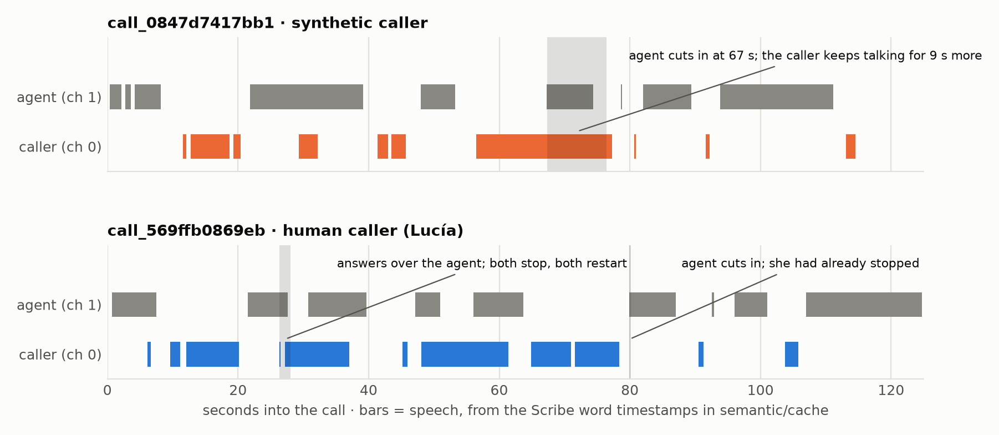
<span class="caption"><b>Figure 23.1 — Speech-activity timelines for the two calls used in the live demo,</b> rebuilt from raw word-level ASR timestamps. Source: <code>reports/guide_figures/make_guide_figures.py</code>.</span>
</div>

!!! warn "Three provenance issues this audit found in the record"
    1. **The deployed-variant flag moved.** Two successive sweep runs marked `channel_only` as "DEPLOYED as
       Model B" before a third marked `balanced`. The final report and the shipped `meta.json` both say
       `balanced`, so the shipped artefact is unambiguous — but the log shows the tie being broken twice in
       different directions before it settled.
    2. **An early fine-tuning entry reports metrics on n = 4.** The 00:13 local trial shows
       `finetuned_val` accuracy 1.0000 computed on four calls next to `frozen_val` on 71. It is a smoke
       test, not evidence; the real run (n = 71 both sides) is the 06:49 Runpod entry.
    3. **Timestamps mix two clocks.** Runpod entries are UTC and the local entries are UTC−6, so the pod
       block appears six hours out of order. `RUNPOD_USAGE.md` confirms the pod ran while the local session
       was paused.

---

# 24 · What did not work

Every entry below is recorded in the project's own artefacts. This section exists because a report that
only lists successes is not an engineering report.

| # | What was tried | What happened | Why | What changed |
|---|---|---|---|---|
| 1 | **Trusting a 100 % validation score** | Every backbone, every layer, every classifier tied at 1.000 | The split is saturated; trivial statistics reach the same score | The selection metric moved to stressed AUC, and §11–§12 were written |
| 2 | **Fine-tuning the last 4 transformer layers** | Mean stressed AUC 0.9998 against 0.9998 — identical | 3 hours of narrowband audio cannot improve a 21 400-hour representation; val loss rose from 0.0176 to 0.1687 while train loss fell to 0.0003 | Frozen backbone deployed; the checkpoint is kept but unused |
| 3 | **Training-time augmentation** | Unseen-family accuracy fell 95.5 % → 93.8 %; reverb fell 88.7 % → 76.1 % | "Augmentation with noise, gain and codec teaches robustness to noise, gain and codec — not to band limits or spectral tilt" | Replaced by a real channel simulator with a held-out codec family |
| 4 | **Calibrating on the clean split** | Brier 0.0000 for all three backbones; the temperature hit its grid minimum | With zero errors the likelihood has no interior maximum — the optimiser sharpens without limit | Recalibrated on 781 stressed call-conditions |
| 5 | **The energy VAD after a telephone line** | Found no speech at all on 5 of 40 calls, 47 files across the full evaluation | The line leaves 16 dB of dynamic range; the rule needs 15 dB above the floor. And a call with no chunks returns 0.5, which the contract reads as "synthetic" | Silero VAD in V2 |
| 6 | **Swapping only the VAD, without retraining** | Seen codecs 77.5 % → 91.5 %, but **unseen codecs 81.7 % → 74.6 %** | The MLP was fitted on chunks a *different* detector chose; train and inference disagreed about what a chunk is | Retrained the head on the new segmentation |
| 7 | **Capturing a real Twilio channel for training data** | Abandoned before starting | 14.5 h of audio needs 14.5 h of real-time calling; and one carrier buys robustness to one carrier | Offline simulation with randomised codecs and a held-out family |
| 8 | **The specialist on telephone audio** | 100 % → 70 % on ten calls, **and the failure is asymmetric** — humans held, synthetic callers collapsed to 40 % | The cues it keyed on (digital silence, hot level, sharp band edge) do not survive a codec | Robust V2 |
| 9 | **Scoring clean external audio** | 53 % of genuine humans flagged synthetic | In training, the *synthetic* callers were the clean ones | Reported as a limitation; band-passing lifts accuracy to 88.0 % |
| 10 | **Using a speaker-verification model to count voices** | Human calls collapsed to 2 clusters; cross-class similarity 0.750 against within-class 0.760/0.774 | VoxCeleb x-vectors do not resolve individuals on 8 kHz telephone audio | The leave-one-out result reinterpreted as recording condition, not speaker |
| 11 | **The planted conversational traps** | AUC **0.45 and 0.35** — worse than chance | The hypothesis was simply wrong | Recorded as "false, corrected" in the module's own plan |
| 12 | **"Humans are messy, machines are consistent"** | Median within-call latency spread 0.502 s human vs **0.635 s synthetic** | The intuition is backwards in this data | The claim is explicitly refused in the behaviour freeze report |
| 13 | **Two semantic text features** | Correlated 0.94 with turn length | They were proxies for the behaviour layer's own signal and would double-count it in a fusion | Removed at a cost of 0.03 AUC |
| 14 | **`DETECTOR_MODE=mock` in the merged backend** | Flags **every** caller as synthetic at 50 % confidence | The mock returns 0.5 and `is_synthetic = p >= 0.5`, so `0.5 >= 0.5` is `True` | Documented as a warning; `.env.example` ships `fusion`; `combine()` has an explicit non-flag for the same case |
| 15 | **The first two pushes of the semantic branch** | Contained zero `.py` files and a live `.env` with API keys | — | Sources re-pushed. **The keys were never rotated**; the commit messages say so in capitals |

---

# 25 · Limitations

!!! warn "What this system has not demonstrated"
    - **71 calls cannot establish banking error rates.** The exact one-sided 95 % lower bound on 71/71 is
      95.9 %. The
      behaviour module's own freeze report says it plainly: "Not proven robust on Altur's hidden set or
      production banking traffic."
    - **No audio in this project has been through a real carrier.** Every telephone result is from a
      simulator. The simulator is detailed and its G.711 is bit-exact, but a simulator is a model of a line.
    - **The off-pipeline number is 88.0 %, not 100 %,** and it comes from 108 clips of read sentences, not
      conversations.
    - **Robust V2 is worse than V1 on clean, non-telephone audio** (54.6 % against 68.5 %). That is an
      accepted trade, not a solved problem.
    - **The semantic layer's strongest feature is its most fragile.** ASR log-probability measures how one
      transcriber reacts to one synthesiser. A new TTS engine could move it without warning; the only
      evidence is a ten-sample probe the module itself calls "a smoke test, not an evaluation".
    - **Nothing here is adversarially robust.** No attacker has tried to evade this system. An adversary who
      knows the model can add noise, adjust level, or pick a codec.
    - **The system is not streaming.** It scores a finished recording; the latency figures are prefix
      evaluations, and `/api/health` says `streaming: false`.
    - **The fusion weights are not fitted.** No weighting can be justified from a split where one layer is
      already perfect.
    - **The semantic layer sends customer audio to ElevenLabs and transcripts to Google.** There is no
      offline mode. That is why it is gated.
    - **The committed API keys have not been rotated.**

## 25.1 Future work

!!! interp "In the order a next team should attack it — all of this is FUTURE WORK, none is implemented"
    1. **Rotate the leaked credentials.** Not research; do it first.
    2. **Get real carrier audio.** Even a few hundred calls through one real PSTN and one real VoIP path
       would convert the entire simulated-channel argument from plausible to demonstrated.
    3. **Ablate the band edge.** The project says outright that it never measured how much of V1's score
       depends on the spectral shortcut. Low-pass the training data to a fixed cut-off and retrain; the drop
       is the answer.
    4. **A much larger and more diverse TTS set.** 48 synthetic clips from three engines is thin. Add
       current-generation voice cloning, which is the actual threat model.
    5. **Speaker-disjoint evaluation that can be verified.** Without speaker ids, disjointness is taken on
       trust.
    6. **Genuine streaming inference.** The chunked architecture already supports it — the aggregation is a
       running mean — so this is an engineering task, not a research one.
    7. **Threshold policy per risk tier** rather than a single 0.5, now that the model is calibrated.
    8. **Port the serving hygiene from `backend/`**: request-size limits, `/ready`, request ids, typed
       errors.
    9. **Model compression** — ONNX export and int8 quantisation of the frozen backbone — if CPU-only
       deployment is ever required. The 850 ms CPU latency is the constraint, not the 119 ms GPU latency.
    10. **Active challenge-response.** Everything here is passive. A system that can ask the caller to do
        something has a far stronger signal available.

---

# 26 · What a bank would actually do with this

!!! warn "This is not identity verification"
    The system answers "does this voice appear to be synthetic", not "is this person who they claim to be".
    A human fraudster reading a script from a stolen file passes every check in this report. A legitimate
    customer using an accessibility speech device could fail them. Presenting a synthetic-voice detector as
    identity proof would be a serious misrepresentation of what was built.

The honest framing is **a risk signal**, one input among several, with an explicit abstention path.

```text
        call arrives
             |
             v
   acoustic + behaviour score the first seconds of caller speech
             |
       +-----+----------------------------+
       |                                  |
   no usable evidence                 a score
   (caller silent, line dead)             |
       |                        +---------+----------+---------------------+
       v                        |                    |                     |
   DO NOT FLAG.            low risk            uncertain              high risk
   route as normal,        p < 0.15            0.15 - 0.85            p > 0.85
   log the abstention           |                    |                     |
                                v                    v                     v
                         continue normally    escalate: the paid    step-up verification,
                                              verifier, or a        restrict what the agent
                                              supervisor prompt     may action, human review
                                                                    -- NEVER auto-terminate
```

!!! interp "Four properties that make this deployable rather than a demo"
    **It abstains rather than guesses.** When no layer has evidence, the answer is an explicit non-flag at
    confidence 0.5 with `decisive: false`, not a coin flip that accuses a customer.

    **It is calibrated**, so "0.87" can be set against an actual cost of being wrong, and the threshold
    becomes a business decision rather than an arbitrary cut.

    **It is early enough to act on.** A median 133 seconds of lead time is the difference between a control
    and a post-mortem.

    **It stores no audio.** The call log holds scores, verdicts and timings. That is a meaningful privacy
    property for a bank, and it was a constraint from the start rather than a retrofit.

!!! interp "Where the residual risk sits"
    The false-rejection rate is the number that should worry a deployment, not the false-acceptance rate.
    Off-pipeline clean audio produced FRR 0.533 — over half of genuine callers flagged — and while
    band-limiting fixes most of that, it demonstrates how sharply this model's behaviour depends on the
    channel matching what it was trained for. A bank deploying this would need to measure on **its own**
    line before choosing a threshold, and would be well advised to run in shadow mode first, flagging
    nothing and only recording what it would have flagged.
# 27 · Glossary

**Signal processing**

| Term | Meaning |
|---|---|
| **Waveform** | A signal as amplitude over time; in code, a 1-D array of floats. |
| **Sample** | One measurement of amplitude. Here 16-bit signed integers, converted to float32 in −1…+1. |
| **Sample rate** | Measurements per second. 8000 Hz in this dataset, 16 000 Hz at the model's input. |
| **PCM** | Pulse-code modulation — uncompressed linear samples. What a WAV file normally holds. |
| **Nyquist frequency** | Half the sample rate; the highest frequency that can be represented. **4 kHz** here. |
| **Aliasing** | A frequency above Nyquist masquerading as a lower one after sampling. |
| **Resampling** | Changing the sample rate. Polyphase (`resample_poly`) here. It never adds information. |
| **dBFS** | Decibels relative to full scale. `20·log10(amplitude)`. 0 is the maximum; all real audio is negative. |
| **RMS** | Root mean square, `sqrt(mean(x²))` — the energy of a window. |
| **FFT** | Fast Fourier Transform: decomposes a signal into its constituent frequencies. |
| **STFT** | Short-time FFT — one FFT per sliding window, giving frequency content over time. |
| **Spectrogram** | The STFT magnitude as an image: time × frequency × energy. |
| **Mel scale** | A frequency warping that matches human pitch perception (roughly logarithmic). |
| **MFCC** | Mel-frequency cepstral coefficients — a compact summary of spectral shape. Not used by any deployed model here. |
| **Spectral roll-off** | The frequency below which a given share (95 % here) of the energy lies. |
| **Spectral centroid** | The energy-weighted mean frequency — a brightness proxy. |
| **LTAS** | Long-term average spectrum — the spectrum averaged over a whole recording. |
| **Band-pass / low-pass** | Filters that keep a range of frequencies, or everything below a cut-off. |
| **PSTN band** | 300–3400 Hz, the classical telephone passband. |
| **Companding** | Compress before quantising, expand after — squeezes more perceptual quality into fewer bits. |
| **μ-law / A-law** | The two ITU-T G.711 companding curves. μ-law in North America and Japan, A-law elsewhere. **A μ-law byte is a codeword, not a small PCM sample.** |
| **Codec** | Coder-decoder. **Waveform codecs** reproduce the signal shape (G.711, G.726); **parametric codecs** transmit speech-model parameters and re-synthesise (GSM, AMR, Speex, Opus). |
| **Packet loss / PLC** | Frames lost in transit; packet-loss concealment fills the gap by repeating or zeroing. |
| **Gilbert-Elliott model** | A two-state Markov chain producing *bursty* loss, as real networks do. |
| **Jitter / clock drift** | Variation in arrival timing; a slight sample-rate mismatch between endpoints. |
| **AGC** | Automatic gain control — continuously adjusts level toward a target, destroying absolute-loudness cues. |
| **DTX / comfort noise** | Discontinuous transmission stops sending during silence; the receiver generates plausible noise so the line does not sound dead. |
| **VAD** | Voice activity detection — deciding which parts of a signal are speech. |
| **Reverberation / RT60** | Room echo; RT60 is the time for it to decay by 60 dB. |

**Machine learning**

| Term | Meaning |
|---|---|
| **Embedding** | A fixed-length vector standing in for variable-length input, positioned so that distance means similarity. 768-dimensional here. |
| **Transformer** | An architecture whose core operation is self-attention: every position attends to every other. |
| **Self-attention** | Each time step weighs every other time step by learned relevance, giving context-dependent representations. |
| **Hidden state** | The representation at a given layer. This model exposes 13 (encoder output plus 12 blocks). |
| **Pooling** | Collapsing a variable-length sequence into one vector. **Mean pooling** here: average each dimension over time. |
| **Frozen backbone** | A pretrained network whose weights are not updated. 94.37 M frozen against 197 378 trained. |
| **Self-supervised learning** | Pretraining on a task derived from the data itself — here, identifying masked latent speech units. No human labels. |
| **Transfer learning** | Reusing a representation learned on a large corpus for a small downstream task. |
| **Fine-tuning** | Continuing to train pretrained weights on the new task. Tried here; did not win. |
| **Logit** | A raw unbounded score before squashing. |
| **Sigmoid** | `σ(z) = 1/(1+e^-z)`, mapping a logit to (0,1). |
| **Log-odds** | `ln(p/(1−p))`, the inverse of sigmoid. Independent evidence *adds* in this space, which is why chunk scores are averaged here. |
| **Threshold** | The probability at which a verdict flips. 0.5 here. |
| **Epoch** | One pass over the training set. Best at epoch 3 here. |
| **Batch** | The group of examples processed per weight update. 64 here. |
| **Learning rate** | How far each weight moves per update. 1e-3 here. |
| **Loss** | The number being minimised. Class-weighted cross-entropy here. |
| **Cross-entropy** | `−[y·ln p + (1−y)·ln(1−p)]` — penalises confident mistakes very heavily. |
| **Backpropagation** | Applying the chain rule from the loss back to every weight to obtain gradients. |
| **Optimiser** | What turns gradients into weight updates. **AdamW** here: per-parameter adaptive steps, with weight decay applied directly to the weights. |
| **Weight decay** | A pull toward smaller weights; regularisation. 1e-4 here. |
| **Dropout** | Randomly zeroing activations during training so no single pathway is relied on. p = 0.3. |
| **Early stopping** | Halting when validation stops improving. Patience 15 here. |
| **Overfitting / underfitting** | Fitting the training set's noise / failing to fit its signal. |
| **Class weighting** | Scaling each class's loss by the inverse of its frequency so an imbalance cannot be exploited. |
| **Shortcut learning** | Solving a task through a spurious correlate rather than the intended concept. **The central finding of this project.** |
| **Domain shift** | Deployment data drawn from a different distribution than training data. |
| **OOD** | Out of distribution — data unlike anything in training. |
| **Augmentation** | Synthetically varying training data. **Label-independent** augmentation applies the same distribution of transformations to both classes; anything else installs a new shortcut. |
| **Counterfactual test** | Same content, same label, one factor changed — does the prediction hold? The stress suite and the channel dataset are both of this form. |
| **Calibration** | Making scores match real-world frequencies. **Platt scaling** fits `σ(a·s+b)`; **temperature scaling** fits `σ(s/T)`. Monotone, so it cannot change AUC. |
| **Inference / latency** | Running the trained model; how long that takes. |

**Evaluation**

| Term | Meaning |
|---|---|
| **Accuracy** | Correct / total. |
| **Precision** | Of those flagged synthetic, how many were. |
| **Recall / TPR** | Of all synthetic callers, how many were caught. |
| **F1** | Harmonic mean of precision and recall. |
| **Balanced accuracy** | Mean of the per-class recalls. |
| **FAR** | False acceptance rate — innocent callers accused. |
| **FRR** | False rejection rate — attackers let through. |
| **EER** | The rate at the threshold where FAR = FRR. |
| **ROC** | True-positive rate against false-positive rate across all thresholds. |
| **AUC** | Area under the ROC; the probability a random synthetic call outranks a random human one. **Measures ranking only, which is why it can stay at 1.000 while accuracy collapses.** |
| **Confusion matrix** | The four counts: TN, FP, FN, TP. |
| **Brier score** | Mean squared error of the predicted probability. Lower is better. |
| **ECE** | Expected calibration error — the average gap between stated confidence and observed accuracy. |
| **Clopper-Pearson interval** | An exact binomial confidence interval, computed from the beta distribution rather than a normal approximation. For 71 successes in 71 trials the **one-sided** 95 % lower bound is `0.05^(1/71)` = **95.9 %**; the two-sided interval's lower bound is 94.9 %. |
| **Out-of-fold / held-out score** | A score produced by a model that never saw that example. |
| **Prefix evaluation** | "What would the model have said after *t* seconds?", computed from a finished recording. Not streaming. |

**Project-specific**

| Term | Meaning |
|---|---|
| **V1 / the specialist** | `models/wav2vec2_spanish` — frozen Wav2Vec2 Spanish layer 5, energy VAD. The benchmark winner. |
| **V2 / Robust V2** | `models/robust_v2` — same backbone and layer, Silero VAD, trained on original + telephone-channel audio. **The deployed model.** |
| **Layer** | A detection system implementing `available()` / `_load()` / `_score()`. Three exist. |
| **Primary / verifier** | Primaries vote on every call; a verifier is consulted only when the primaries do not settle it. |
| **The gate** | `verify_threshold = 0.80` — the joint primary confidence above which no verifier is consulted. |
| **Abstained vs scored=False** | Asked and had no evidence, versus never asked at all. |
| **SEEN / UNSEEN codecs** | Five codec families used in training; eight deliberately held out. |
| **The scene** | The payload the demo page renders: envelopes, VAD regions, chunk spans, the running verdict and the final verdict. |
| **decided_at_s** | The second after which the running verdict never flips again; `None` if it never settles. |
| **Digital silence** | Between-turn silence at exactly −72.247 dB — the 16-bit quantisation floor. Present in 266 of 353 calls; impossible on a real line. |
