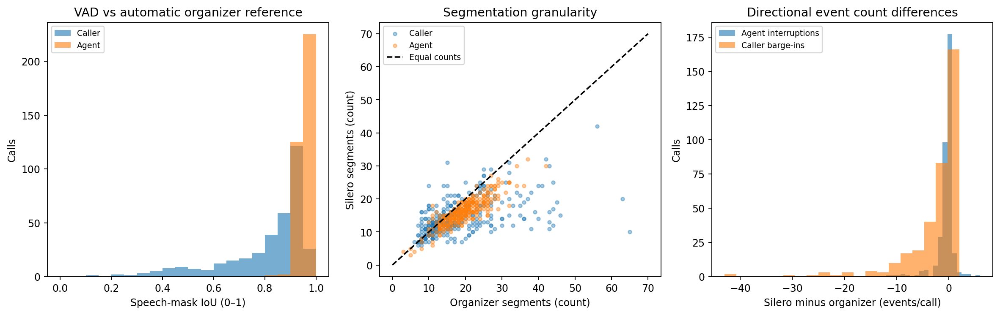
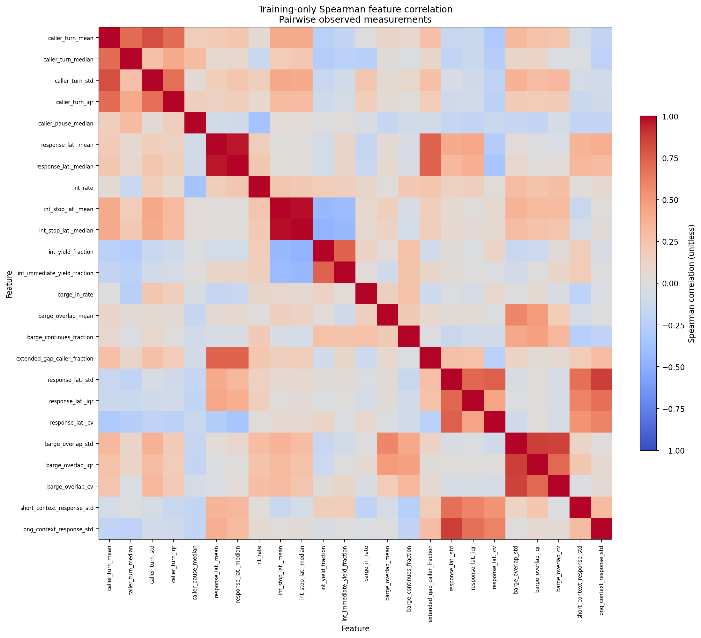
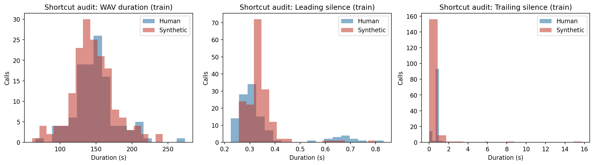
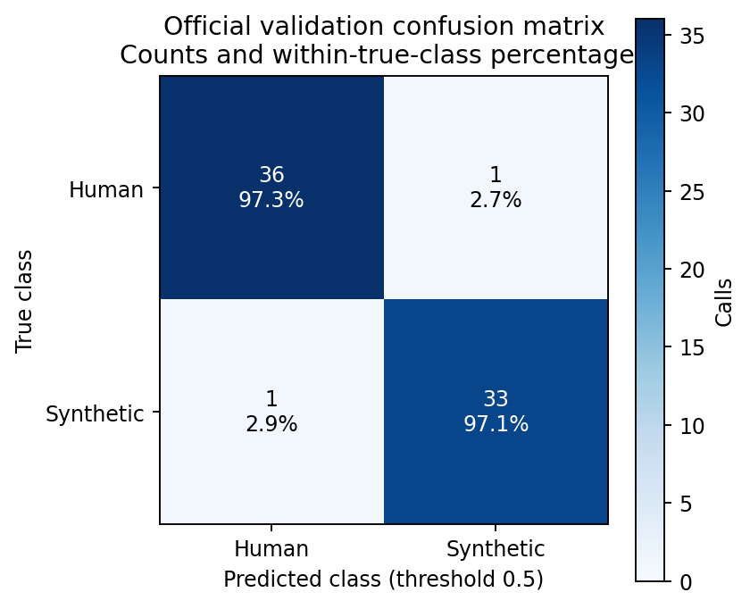
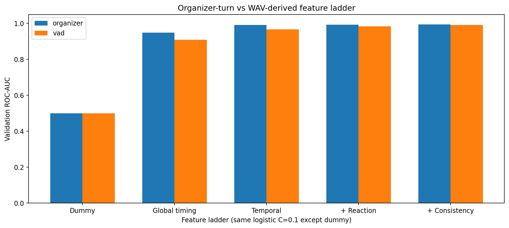
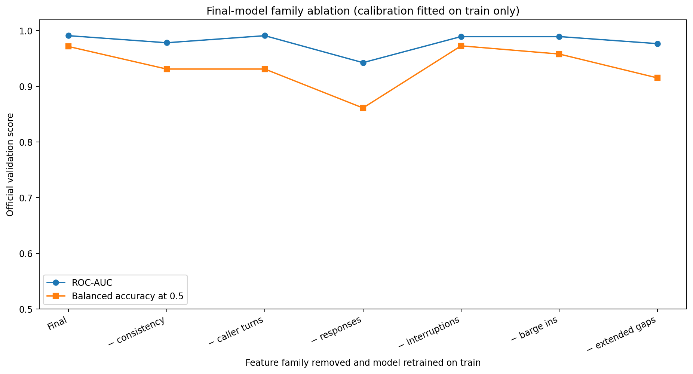
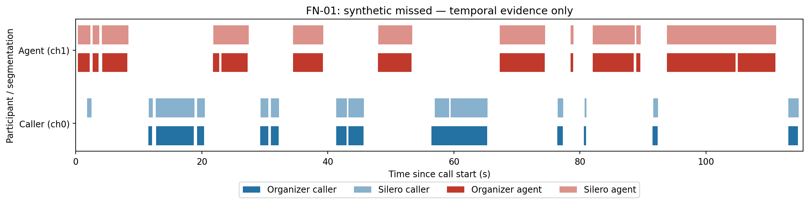
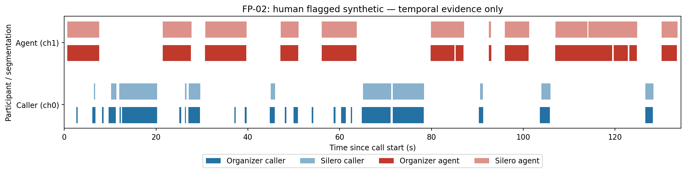
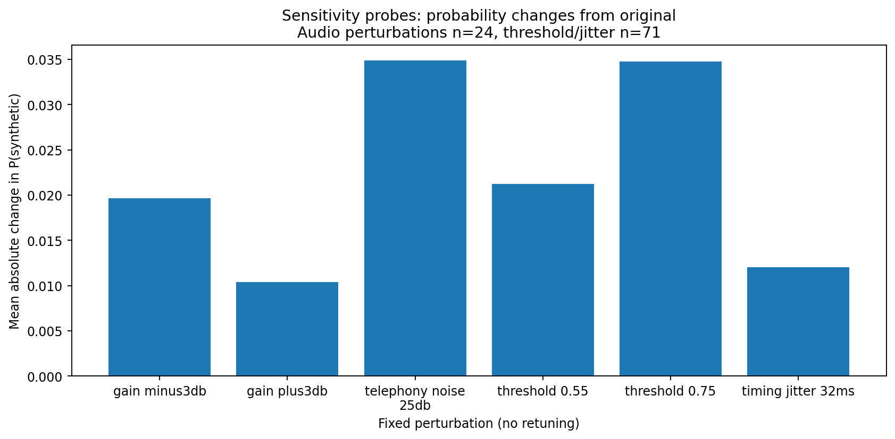

# Conversational Behaviour: a reproducible, explainable Altur module

**HackMTY 2026 — local engineering and educational report**  
Positive class: **synthetic caller = 1**; human = 0.  
Training run: 2026-09-12T09:15:55.724311+00:00. All dataset computation was local.  
This file is rendered from measured JSON/CSV results by `python -m scripts.write_report`.

**Final integration freeze / ASTRA2 correction:** use
[FINAL_BEHAVIOR_FREEZE.md](FINAL_BEHAVIOR_FREEZE.md) for the immutable model and
runtime hashes, and [FINAL_DELTA_REVIEW.md](FINAL_DELTA_REVIEW.md) for every audit
finding. The 24-feature model/parameters are unchanged. Insufficient evidence now
produces a non-flag Boolean with confidence 0.5, not a synthetic verdict; malformed
RIFF chunk errors are sanitized. Historical prefix probability-threshold plots
are explicitly distinguished below from the corrected adapter policy.

## 1. Executive summary

This module turns a two-channel telephone recording into **probabilistic evidence
about how the caller interacts**. It measures when people speak, overlap, pause,
yield and respond. It does not transcribe words, recognize speakers, analyze
vocoder fingerprints, or ask an LLM whether a caller seems human.

The final pipeline is native 8 kHz stereo WAV → offline Silero VAD → temporal
events → **24 interpretable features** → regularized logistic
regression → train-only out-of-fold sigmoid calibration. The classifier has
**40 linear coefficients/intercept parameters**, plus two calibration
parameters. The pretrained VAD weights are frozen.

On the **official 71-call speaker-disjoint validation set**, the final system
reached **97.18% accuracy**, **0.9913 ROC-AUC**, and **0.0406 Brier score**.
There was one human false alarm and one missed synthetic caller. These are
validation results after model development, **not hidden-test or production results**.

The important scientific finding is narrower than the challenge's suggested story:
temporal interactions contain predictive information here, but the general claim
“humans are messy and machines are consistent” is **not established**. In this
dataset, median response variability was actually higher for synthetic callers.
Recovery-consistency events were too scarce to support a deployment feature.
Normal responses and who speaks after long gaps contributed more reliably than
the specific interruption-recovery hypothesis.

On this Intel Mac, a separate 20-call benchmark measured **860 ms p50**,
**1193 ms p95**, and **125.4 MiB peak process memory**. No GPU
or cloud service was needed. The main operational limitation is evidence latency:
15–30 s prefixes are unreliable, and even 60 s does not match full-call performance.
Fast computation is not the same thing as having enough conversation to decide.

## 2. Challenge context: three complementary sources of evidence

| Module | Main question | Examples |
| --- | --- | --- |
| Acoustic | What does the voice sound like? | Spectrum, synthesis artifacts, breathing, vocoder fingerprints |
| Behaviour | How does the caller interact? | Floor changes, overlaps, response timing, reaction variability |
| Semantic | What does the caller say? | Contradictions, invented information, semantic correctness |

Channel 0 is the **incoming caller being classified**. Channel 1 is Altur's AI
agent: the other participant supplies the events that contextualize caller timing.
Using both channels does not mean classifying both speakers.

A bank should receive these as complementary scores and combine them using a
separately trained fusion/risk layer. Different feature definitions do not make
the scores statistically independent. In particular, VAD errors can correlate with
acoustic artifacts. No fusion weights were chosen here, and no existing Acoustic
or Semantic code was found in this project to integrate against.

The supplied `LEARNING_SUMMARY.pdf` concerns ASVspoof, not Altur. Its results are
background lessons: frozen features can beat fine-tuning, channel shift matters,
and duration/silence can be surprisingly predictive. None of its accuracy numbers
are reused as evidence for this Behaviour module.

## 3. Research hypothesis and what the experiments actually say

**Temporal dynamics** describe normal participation: turn lengths, pauses and
response latencies. **Event-conditioned reactions** ask what happens after a
particular temporal event, such as the agent starting over an active caller.
**Consistency** asks how much repeated, comparable observations vary within a call.

“AI always responds faster” is insufficient: response speed also depends on the
task, network delay, whether the caller is thinking, the agent's turn boundaries,
and speech segmentation. A mean also hides variation. Latencies `[0.4,0.4,0.4]`
and `[0.1,0.4,0.7]` have the same mean but different standard deviations.

In the VAD-derived training data, median within-call response-latency standard
deviation was about **0.502 s for humans and 0.635 s for synthetic callers**.
Median barge-in overlap CV was about **0.385 versus 0.435** respectively. These
descriptive differences do not support “synthetic callers are uniformly less variable.”
They may reflect agent designs or how the recordings were produced.

Adding consistency to the predeclared reaction ladder changed validation AUC by
+0.0072, with paired call-bootstrap 95% interval [+0.0000, +0.0200]. For the final model, removing the consistency family reduced
AUC from approximately 0.991 to 0.979. That is useful empirical evidence for
these features **as a group**, not proof of a universal human characteristic.

Only **13/282 training calls** had at least three resolved agent interruptions.
Only **18/282** had any attributable recovery, and **zero** had at least three
recoveries. Recovery mean/gap/retake and interruption/recovery variability/entropy
were retained in exploratory feature tables but excluded from deployment by a
training-support rule. We did not manufacture zero-valued recovery timings.

## 4. Dataset, layout, and split discipline

The actual project is `Documents/hack_mty_2026/hackmty26-main`. At the beginning,
the session working directory `Documents/Default Project` was empty. The repository
folder contained only the organizer README, `.gitignore`, manifest and turns.
There was no application code or project-level `.git`; Git found the parent home
repository instead. No Git commits or remote modifications were made.

```text
hack_mty_2026/
├── hackmty26-altur-challenge.pdf
├── HackMTY-Sponsor-Guide.pdf
├── LEARNING_SUMMARY.pdf
├── audio/                         # confidential, 353 WAVs
└── hackmty26-main/
    ├── manifest.csv               # anon_id, label, split, duration_s
    ├── turns/                     # 353 automatic organizer annotations
    ├── behavior/                  # implementation added here
    ├── scripts/ tests/
    ├── artifacts/                 # local generated models/caches
    └── reports/
```

| Official split | Human (0) | Synthetic (1) | Total |
| --- | --- | --- | --- |
| train | 113 | 169 | 282 |
| val | 37 | 34 | 71 |

All 353 recordings decoded as **stereo, 8000 Hz, 16-bit uncompressed PCM**. They
contain about **14.508 hours**, range from **61.0 to 273.9 s**, and have median
duration **145.94 s**. All manifest IDs had both WAV and JSON files; exact audio
hash comparison found no duplicate recordings. All organizer turns were within
the true WAV duration.

Manifest durations differ from frame-count duration by as much as approximately
0.96 s. We always compute duration as `number_of_frames / sample_rate`; otherwise
valid endpoints might appear out of bounds. This was an inspection correction,
not a change to source data.

The organizer documents that train and validation are speaker-disjoint. We kept
these assignments exactly. No speaker/session group IDs are supplied, so that
claim cannot be independently verified through group IDs; we did not identify
speakers or invent groups. Internal five-fold splits are **call-stratified only**
and may share callers. They are not substitutes for official validation.

Validation was used for a finite model ladder, a supported-feature candidate,
calibration choice, and one audit-motivated removal of count inputs. No hidden
judging data was available or used. Validation is consequently a development
estimate, not an untouched final exam. Its small size makes one error consequential.

### Exact validation involvement (irreversible historical exposure)

1. The predeclared 12-specification ladder was compared on official validation for
   organizer and VAD turns (`scripts/train_behavior.py::LADDER`). C=0.1 versus C=1,
   linear versus tree models, and temporal/reaction/consistency/global families
   were inspected. The choice to retain a simple strongly regularized classifier
   therefore used validation-informed engineering judgment.
2. The supported/no-direct-agent-duration candidate combined interpretability and
   those comparisons. Support filtering itself used only training availability
   (at least 20 observations, nonconstant) and was refitted in calibration folds.
3. `scripts/finalize_model.py` fitted the sigmoid on **training OOF logits/labels**,
   then compared raw and calibrated **validation Brier** to decide whether to
   deploy calibration. This is train-derived parameter fitting plus
   validation-informed selection, not a train-only selection procedure.
4. Final-family removal results on validation motivated the one count-free
   revision from 29 to 24 primary features. It improved full-call validation but
   reduced 60 s AUC. Calibration was again retained based on validation Brier.
5. The 0.5 score threshold, event definitions and three VAD candidates were
   predeclared; the selected VAD setting maximized agreement on 24 train calls
   without class labels. Later threshold-sensitivity results did not change it.

Existing raw train-OOF and leave-one-feature-out results do not contain a complete
nested train-only model/calibration-selection comparison. We cannot honestly say
what an untouched train-only selection procedure would have chosen, and neither
a new seed nor retrospective CV can undo developer exposure. No further model
selection occurred during the delta review; two fixed nuisance diagnostics were
reporting-only. The training/reproduction scripts remain historical procedures,
not the freeze or a new recommendation to optimize validation.

The unknown grouping scope is explicit: **caller-disjoint is the organizer's
assertion; source-, session-, and engine-disjoint evaluation are NOT VERIFIABLE**
with supplied metadata. Byte-identical duplicate checks do not rule out crops,
re-encodings, padding, reused source audio, shared engines or protocol branches.

## 5. From raw WAV to a score

1. **Validate/decode WAV.** Require bytes, stereo PCM16 at 8 kHz. Reject corrupt,
   truncated, empty, wrong-rate, wrong-channel and over-limit files. Do not silently
   replace a failed decode with silence or downmix the participants.
2. **Separate the channels.** Convert signed int16 values to float32 by dividing
   by 32768. Shape is `[samples,2]`. No resampling is needed.
3. **Apply offline VAD.** Silero processes 256-sample (32 ms) frames with 32 context
   samples at 8 kHz. The channels are independent batch entries. Recurrent state
   is reset per request; concurrent calls cannot contaminate each other's history.
4. **Construct turns.** Hysteresis, minimum durations, padding and short-gap merging
   convert speech probabilities into intervals. “Turn” here means an operational
   speech segment, not a linguistically verified conversational turn.
5. **Detect temporal events.** Read the two-channel speaking state timeline.
6. **Compute features and evidence quality.** Missing observations stay NaN.
7. **Transform with training-fitted preprocessing.** Drop unsupported/constant
   candidate columns; median-impute, add missingness indicators, standardize, and
   clip standardized values to ±6. All learned statistics come from train only.
8. **Classify/calibrate.** Logistic regression produces a logit; a train-OOF sigmoid
   maps it to a probability-like estimate. No words, embeddings or filenames enter it.

### VAD research and frozen configuration

We verified the official Silero README, `utils_vad.py`, license and release tags.
The pinned release is **v6.2.1**, commit
`7e30209a3e901f9842f81b225f3e93d8199902b1`, licensed MIT. The model file is 2,327,524
bytes with SHA-256
`1a153a22f4509e292a94e67d6f9b85e8deb25b4988682b7e174c65279d8788e3`.
Setup downloads this public artifact; inference verifies it and works offline.

Official documentation supports native 8 kHz and broad multilingual use. That
does not by itself establish precise Spanish telephone event timing. Our local
comparison below is the task-specific evidence. The implementation uses NumPy and
ONNX Runtime, avoiding large PyTorch/Torchaudio installations for a small CPU task.

Three settings were compared on 24 randomly selected **training** calls after
discarding class labels from the selection table. Mean channel IoUs were 0.8567,
0.8628 and 0.8651. The maximum selected:

| Setting | Frozen value |
| --- | --- |
| Speech-on threshold | 0.65 |
| Speech-off threshold | 0.50 (hysteresis 0.15) |
| Minimum speech | 0.24 s |
| Minimum silence | 0.24 s |
| Padding | 0.032 s each side |
| Same-channel merge gap | 0.15 s |

The differences among settings are small. They were not chosen using human versus
synthetic performance. Although a later threshold sensitivity probe improves some
validation metrics at 0.55, the selected 0.65 configuration is retained.

### Automatic-reference agreement, not ground-truth accuracy

| Split | Channel | Speech IoU | Matched onset MAE (s) | Matched offset MAE (s) | Ref / generated / matched segments per call |
| --- | --- | --- | --- | --- | --- |
| train | caller | 0.809 | 0.392 | 0.341 | 17.76 / 14.48 / 12.20 |
| train | agent | 0.952 | 0.354 | 0.439 | 19.24 / 15.89 / 15.46 |
| val | caller | 0.816 | 0.336 | 0.212 | 18.66 / 14.23 / 12.68 |
| val | agent | 0.951 | 0.376 | 0.425 | 20.41 / 17.00 / 16.62 |

Speech-mask IoU is intersection duration divided by union duration. For endpoint
errors, intervals are matched one-to-one by maximum total IoU (Hungarian matching),
retaining pairs with IoU ≥0.1. Onset/offset errors are **macro averages of per-call
matched-segment MAEs**. Unmatched segments are excluded from those errors, so their
counts must be read alongside the MAE. Matching is not a manual annotation audit.

| Validation event | Mean generated − reference | Mean absolute difference |
| --- | --- | --- |
| interruption_count | -0.451 | 0.620 |
| barge_in_count | -3.014 | 3.324 |
| response_latency_count | -0.493 | 0.634 |

Silero produces fewer segments and fewer barge-ins than the organizer annotations.
Caller speech agreement is lower than agent agreement. Errors of a few tenths of
a second are substantial relative to quick reactions. A 32 ms frame step is
**resolution, not guaranteed timestamp accuracy**. Threshold stability also does
not prove accuracy: two biased settings can agree.



The critical replacement test uses exactly the organizer-trained weights:

| Organizer-trained model | Organizer-input val AUC | WAV-derived input val AUC (same weights) |
| --- | --- | --- |
| B_shortcut | 0.9491 | 0.8362 |
| C_temporal | 0.9921 | 0.9762 |
| D_reaction | 0.9928 | 0.9785 |
| E_consistency | 0.9944 | 0.9857 |
| E_no_agent | 0.9968 | 0.9706 |

The main organizer model's AUC drops from approximately 0.994 to 0.986 when only
the segmentation source changes. It does not collapse. Retraining the same
pipeline on VAD-derived **training** features restores strong performance and
avoids training/inference segmentation mismatch. Production never reads organizer JSON.

## 6. Every final feature

All timing values below refer to normalized, half-open `[start,end)` intervals.
Two small safeguards are important: directional onsets must differ by more than
64 ms, and qualifying directional overlap must last at least 96 ms. Statistics of
variability require at least three observed comparable events; CV also requires
nonnegative observations and mean ≥0.1 s.

Each listed feature has at least 20 observed training calls and nonconstant
training values. The per-feature evidence is a **training-internal five-fold
leave-one-feature-out refit**, not a validation-driven deletion loop. Positive
full-minus-removed AUC suggests that the feature helps; zero can mean redundancy;
a tiny negative difference does not establish real harm. The observed range was
**-0.000733 to +0.014243**: no retained feature caused a material observed degradation, but
there is no guarantee for each feature on future callers. Correlated mean/median
or std/IQR measurements can share credit. Internal folds may share speakers.

### 6.1. `caller_turn_mean`

- **Definition/equation:** arithmetic mean, sum(x)/n of: Complete merged caller segment durations: end − start. Segments still active at the audio boundary are excluded.
- **Unit:** seconds.
- **Example:** Observed durations [1, 2, 3] s give 2 s.
- **Why it may help:** How the caller occupies the floor.
- **Missing/censored cases:** At least one observed event; otherwise NaN.
- **Possible failure:** VAD fragmentation, phrase length and task structure may dominate.
- **Empirical support:** 282/282 training calls observed; removing this feature changes train-internal OOF AUC by **+0.002147** (full minus removed). See the shared caveats below.

### 6.2. `caller_turn_median`

- **Definition/equation:** 50th percentile of: Complete merged caller segment durations: end − start. Segments still active at the audio boundary are excluded.
- **Unit:** seconds.
- **Example:** Observed durations [1, 2, 3] s give 2 s.
- **Why it may help:** How the caller occupies the floor.
- **Missing/censored cases:** At least one observed event; otherwise NaN.
- **Possible failure:** VAD fragmentation, phrase length and task structure may dominate.
- **Empirical support:** 282/282 training calls observed; removing this feature changes train-internal OOF AUC by **-0.000157** (full minus removed). See the shared caveats below.

### 6.3. `caller_turn_std`

- **Definition/equation:** sample standard deviation, sqrt(sum((x−mean)^2)/(n−1)) of: Complete merged caller segment durations: end − start. Segments still active at the audio boundary are excluded.
- **Unit:** seconds.
- **Example:** Observed durations [1, 2, 3] s give 1 s.
- **Why it may help:** How the caller occupies the floor.
- **Missing/censored cases:** At least 3 observed comparable events; otherwise NaN.
- **Possible failure:** VAD fragmentation, phrase length and task structure may dominate.
- **Empirical support:** 282/282 training calls observed; removing this feature changes train-internal OOF AUC by **+0.001937** (full minus removed). See the shared caveats below.

### 6.4. `caller_turn_iqr`

- **Definition/equation:** 75th percentile − 25th percentile, NumPy linear quantiles of: Complete merged caller segment durations: end − start. Segments still active at the audio boundary are excluded.
- **Unit:** seconds.
- **Example:** Observed durations [1, 2, 3] s give 1 s.
- **Why it may help:** How the caller occupies the floor.
- **Missing/censored cases:** At least 3 observed comparable events; otherwise NaN.
- **Possible failure:** VAD fragmentation, phrase length and task structure may dominate.
- **Empirical support:** 282/282 training calls observed; removing this feature changes train-internal OOF AUC by **+0.000209** (full minus removed). See the shared caveats below.

### 6.5. `caller_pause_median`

- **Definition/equation:** 50th percentile of: Gap between consecutive caller segments: next.start − previous.end; may contain agent speech.
- **Unit:** seconds.
- **Example:** Observed durations [1, 2, 3] s give 2 s.
- **Why it may help:** The caller's overall pattern of yielding and returning.
- **Missing/censored cases:** At least one observed event; otherwise NaN.
- **Possible failure:** Not a pure thinking-time measure; contains agent turn duration.
- **Empirical support:** 282/282 training calls observed; removing this feature changes train-internal OOF AUC by **-0.000733** (full minus removed). See the shared caveats below.

### 6.6. `response_latency_mean`

- **Definition/equation:** arithmetic mean, sum(x)/n of: Observed agent-only → optional silence → caller-only handoffs: caller onset − preceding agent offset. Agent continuation and overlap exits are excluded.
- **Unit:** seconds.
- **Example:** Observed durations [0.2, 0.4, 0.6] s give 0.4 s.
- **Why it may help:** Normal floor-taking timing after the other participant finishes.
- **Missing/censored cases:** At least one observed event; otherwise NaN.
- **Possible failure:** A segment boundary is not necessarily the end of a semantic turn.
- **Empirical support:** 282/282 training calls observed; removing this feature changes train-internal OOF AUC by **+0.002304** (full minus removed). See the shared caveats below.

### 6.7. `response_latency_median`

- **Definition/equation:** 50th percentile of: Observed agent-only → optional silence → caller-only handoffs: caller onset − preceding agent offset. Agent continuation and overlap exits are excluded.
- **Unit:** seconds.
- **Example:** Observed durations [0.2, 0.4, 0.6] s give 0.4 s.
- **Why it may help:** Normal floor-taking timing after the other participant finishes.
- **Missing/censored cases:** At least one observed event; otherwise NaN.
- **Possible failure:** A segment boundary is not necessarily the end of a semantic turn.
- **Empirical support:** 282/282 training calls observed; removing this feature changes train-internal OOF AUC by **+0.003456** (full minus removed). See the shared caveats below.

### 6.8. `interruption_rate`

- **Definition/equation:** Qualifying agent-onset interruptions / all merged agent segments.
- **Unit:** fraction (0–1).
- **Example:** 3 of 12 agent onsets interrupt → 0.25.
- **Why it may help:** How frequently the caller was exposed to talk-over.
- **Missing/censored cases:** No agent segments → NaN. With agent segments but no interruptions, zero is a valid observed rate.
- **Possible failure:** Agent policy/segmentation is part of this measurement.
- **Empirical support:** 282/282 training calls observed; removing this feature changes train-internal OOF AUC by **+0.000890** (full minus removed). See the shared caveats below.

### 6.9. `interruption_stop_latency_mean`

- **Definition/equation:** arithmetic mean, sum(x)/n of: For qualifying agent interruptions, caller segment end − agent onset, provided caller end is observed. Includes callers that outlast the agent.
- **Unit:** seconds.
- **Example:** Observed durations [0.2, 0.4, 0.6] s give 0.4 s.
- **Why it may help:** How long the caller keeps talking after an agent begins over them.
- **Missing/censored cases:** At least one observed event; otherwise NaN.
- **Possible failure:** A stop may be natural utterance completion, not caused by the interruption; events are scarce.
- **Empirical support:** 157/282 training calls observed; removing this feature changes train-internal OOF AUC by **+0.000105** (full minus removed). See the shared caveats below.

### 6.10. `interruption_stop_latency_median`

- **Definition/equation:** 50th percentile of: For qualifying agent interruptions, caller segment end − agent onset, provided caller end is observed. Includes callers that outlast the agent.
- **Unit:** seconds.
- **Example:** Observed durations [0.2, 0.4, 0.6] s give 0.4 s.
- **Why it may help:** How long the caller keeps talking after an agent begins over them.
- **Missing/censored cases:** At least one observed event; otherwise NaN.
- **Possible failure:** A stop may be natural utterance completion, not caused by the interruption; events are scarce.
- **Empirical support:** 157/282 training calls observed; removing this feature changes train-internal OOF AUC by **+0.000157** (full minus removed). See the shared caveats below.

### 6.11. `interruption_yield_fraction`

- **Definition/equation:** Fraction of interruptions with observed caller end for which caller.end < agent.end − 0.064 s.
- **Unit:** fraction (0–1).
- **Example:** Caller yields in 2 of 3 resolved interruptions → 0.667.
- **Why it may help:** Probability of relinquishing the floor during agent talk-over.
- **Missing/censored cases:** No resolved interruptions → NaN; unresolved outcomes are excluded.
- **Possible failure:** Close endpoint ties and early natural utterance endings are ambiguous.
- **Empirical support:** 157/282 training calls observed; removing this feature changes train-internal OOF AUC by **+0.001571** (full minus removed). See the shared caveats below.

### 6.12. `interruption_immediate_yield_fraction`

- **Definition/equation:** Fraction of resolved interruptions with BOTH yielding and caller stop latency ≤0.5 s.
- **Unit:** fraction (0–1).
- **Example:** 1 of 4 resolved interruptions produces a rapid yield → 0.25.
- **Why it may help:** Distinguishes prompt yielding from longer continued overlap.
- **Missing/censored cases:** No resolved interruptions → NaN.
- **Possible failure:** The 0.5 s boundary is a coarse design choice, not an experimentally proven human reflex limit.
- **Empirical support:** 157/282 training calls observed; removing this feature changes train-internal OOF AUC by **+0.000471** (full minus removed). See the shared caveats below.

### 6.13. `barge_in_rate`

- **Definition/equation:** Qualifying caller-onset interruptions / all merged caller segments.
- **Unit:** fraction (0–1).
- **Example:** 2 of 10 caller onsets overlap an already active agent → 0.2.
- **Why it may help:** How often the caller enters before the agent finishes.
- **Missing/censored cases:** No caller segments → NaN; zero barge-ins with caller turns is a valid zero rate.
- **Possible failure:** Agent speaking time and VAD boundaries affect the available opportunities.
- **Empirical support:** 282/282 training calls observed; removing this feature changes train-internal OOF AUC by **+0.001623** (full minus removed). See the shared caveats below.

### 6.14. `barge_overlap_mean`

- **Definition/equation:** arithmetic mean, sum(x)/n of: For qualifying caller interruptions, min(caller end, agent end) − caller onset. Missing when neither endpoint is observed before the clip boundary.
- **Unit:** seconds.
- **Example:** Observed durations [0.2, 0.4, 0.6] s give 0.4 s.
- **Why it may help:** Persistence in talk-over and how variable that persistence is.
- **Missing/censored cases:** At least one observed event; otherwise NaN.
- **Possible failure:** Padding/crosstalk can create an overlap; timing alone cannot distinguish a backchannel from deliberate interruption.
- **Empirical support:** 221/282 training calls observed; removing this feature changes train-internal OOF AUC by **+0.000052** (full minus removed). See the shared caveats below.

### 6.15. `barge_continues_fraction`

- **Definition/equation:** Fraction of barge-ins with observed agent end where caller.end > agent.end +0.064 s.
- **Unit:** fraction (0–1).
- **Example:** Caller outlasts agent in 3 of 4 barge-ins → 0.75.
- **Why it may help:** Persistence in taking the floor during talk-over.
- **Missing/censored cases:** No barge-ins with observed agent end → NaN.
- **Possible failure:** A short agent segment can make this high without any deliberate persistence.
- **Empirical support:** 221/282 training calls observed; removing this feature changes train-internal OOF AUC by **-0.000262** (full minus removed). See the shared caveats below.

### 6.16. `extended_gap_caller_fraction`

- **Definition/equation:** Fraction of fully observed interior joint silences ≥2 s whose next speaking state is caller-only.
- **Unit:** fraction (0–1).
- **Example:** Caller ends 3 of 5 long joint gaps → 0.6.
- **Why it may help:** Who takes the floor after a long gap.
- **Missing/censored cases:** No completed interior long gaps → NaN. Leading/trailing silence excluded.
- **Possible failure:** Does not prove that silence was unexpected or intentionally caused by the agent; may encode call flow.
- **Empirical support:** 280/282 training calls observed; removing this feature changes train-internal OOF AUC by **+0.014243** (full minus removed). See the shared caveats below.

### 6.17. `response_latency_std`

- **Definition/equation:** sample standard deviation, sqrt(sum((x−mean)^2)/(n−1)) of: Observed agent-only → optional silence → caller-only handoffs: caller onset − preceding agent offset. Agent continuation and overlap exits are excluded.
- **Unit:** seconds.
- **Example:** Observed durations [0.2, 0.4, 0.6] s give 0.2 s.
- **Why it may help:** Normal floor-taking timing after the other participant finishes.
- **Missing/censored cases:** At least 3 observed comparable events; otherwise NaN.
- **Possible failure:** A segment boundary is not necessarily the end of a semantic turn.
- **Empirical support:** 276/282 training calls observed; removing this feature changes train-internal OOF AUC by **+0.001100** (full minus removed). See the shared caveats below.

### 6.18. `response_latency_iqr`

- **Definition/equation:** 75th percentile − 25th percentile, NumPy linear quantiles of: Observed agent-only → optional silence → caller-only handoffs: caller onset − preceding agent offset. Agent continuation and overlap exits are excluded.
- **Unit:** seconds.
- **Example:** Observed durations [0.2, 0.4, 0.6] s give 0.2 s.
- **Why it may help:** Normal floor-taking timing after the other participant finishes.
- **Missing/censored cases:** At least 3 observed comparable events; otherwise NaN.
- **Possible failure:** A segment boundary is not necessarily the end of a semantic turn.
- **Empirical support:** 276/282 training calls observed; removing this feature changes train-internal OOF AUC by **+0.000524** (full minus removed). See the shared caveats below.

### 6.19. `response_latency_cv`

- **Definition/equation:** sample standard deviation / arithmetic mean of: Observed agent-only → optional silence → caller-only handoffs: caller onset − preceding agent offset. Agent continuation and overlap exits are excluded.
- **Unit:** unitless.
- **Example:** Observed durations [0.2, 0.4, 0.6] s give 0.5 (unitless).
- **Why it may help:** Normal floor-taking timing after the other participant finishes.
- **Missing/censored cases:** At least 3 events, all nonnegative, mean ≥0.1 s; otherwise NaN.
- **Possible failure:** A segment boundary is not necessarily the end of a semantic turn.
- **Empirical support:** 276/282 training calls observed; removing this feature changes train-internal OOF AUC by **-0.000052** (full minus removed). See the shared caveats below.

### 6.20. `barge_overlap_std`

- **Definition/equation:** sample standard deviation, sqrt(sum((x−mean)^2)/(n−1)) of: For qualifying caller interruptions, min(caller end, agent end) − caller onset. Missing when neither endpoint is observed before the clip boundary.
- **Unit:** seconds.
- **Example:** Observed durations [0.2, 0.4, 0.6] s give 0.2 s.
- **Why it may help:** Persistence in talk-over and how variable that persistence is.
- **Missing/censored cases:** At least 3 observed comparable events; otherwise NaN.
- **Possible failure:** Padding/crosstalk can create an overlap; timing alone cannot distinguish a backchannel from deliberate interruption.
- **Empirical support:** 85/282 training calls observed; removing this feature changes train-internal OOF AUC by **+0.000052** (full minus removed). See the shared caveats below.

### 6.21. `barge_overlap_iqr`

- **Definition/equation:** 75th percentile − 25th percentile, NumPy linear quantiles of: For qualifying caller interruptions, min(caller end, agent end) − caller onset. Missing when neither endpoint is observed before the clip boundary.
- **Unit:** seconds.
- **Example:** Observed durations [0.2, 0.4, 0.6] s give 0.2 s.
- **Why it may help:** Persistence in talk-over and how variable that persistence is.
- **Missing/censored cases:** At least 3 observed comparable events; otherwise NaN.
- **Possible failure:** Padding/crosstalk can create an overlap; timing alone cannot distinguish a backchannel from deliberate interruption.
- **Empirical support:** 85/282 training calls observed; removing this feature changes train-internal OOF AUC by **-0.000157** (full minus removed). See the shared caveats below.

### 6.22. `barge_overlap_cv`

- **Definition/equation:** sample standard deviation / arithmetic mean of: For qualifying caller interruptions, min(caller end, agent end) − caller onset. Missing when neither endpoint is observed before the clip boundary.
- **Unit:** unitless.
- **Example:** Observed durations [0.2, 0.4, 0.6] s give 0.5 (unitless).
- **Why it may help:** Persistence in talk-over and how variable that persistence is.
- **Missing/censored cases:** At least 3 events, all nonnegative, mean ≥0.1 s; otherwise NaN.
- **Possible failure:** Padding/crosstalk can create an overlap; timing alone cannot distinguish a backchannel from deliberate interruption.
- **Empirical support:** 85/282 training calls observed; removing this feature changes train-internal OOF AUC by **-0.000209** (full minus removed). See the shared caveats below.

### 6.23. `short_context_response_std`

- **Definition/equation:** sample standard deviation, sqrt(sum((x−mean)^2)/(n−1)) of: Normal response latencies following a complete agent segment shorter than 3 s.
- **Unit:** seconds.
- **Example:** Observed durations [0.2, 0.4, 0.6] s give 0.2 s.
- **Why it may help:** Compare variability within a rough, fixed temporal context instead of pooling all events.
- **Missing/censored cases:** At least 3 observed comparable events; otherwise NaN.
- **Possible failure:** Segment length is not a semantic question category; 3 s is a fixed design cutoff.
- **Empirical support:** 67/282 training calls observed; removing this feature changes train-internal OOF AUC by **+0.002042** (full minus removed). See the shared caveats below.

### 6.24. `long_context_response_std`

- **Definition/equation:** sample standard deviation, sqrt(sum((x−mean)^2)/(n−1)) of: Normal response latencies following a complete agent segment at least 3 s long.
- **Unit:** seconds.
- **Example:** Observed durations [0.2, 0.4, 0.6] s give 0.2 s.
- **Why it may help:** Response variability after longer agent contributions.
- **Missing/censored cases:** At least 3 observed comparable events; otherwise NaN.
- **Possible failure:** Few qualifying events and VAD merging can change context membership.
- **Empirical support:** 256/282 training calls observed; removing this feature changes train-internal OOF AUC by **+0.010159** (full minus removed). See the shared caveats below.


### Missingness indicators and imputation

The primary measurements are supplemented by 15 binary indicators, generated by
the training-fitted `SimpleImputer` for columns that were ever missing in train:

`interruption_stop_latency_mean__missing`, `interruption_stop_latency_median__missing`, `interruption_yield_fraction__missing`, `interruption_immediate_yield_fraction__missing`, `barge_overlap_mean__missing`, `barge_continues_fraction__missing`, `extended_gap_caller_fraction__missing`, `response_latency_std__missing`, `response_latency_iqr__missing`, `response_latency_cv__missing`, `barge_overlap_std__missing`, `barge_overlap_iqr__missing`, `barge_overlap_cv__missing`, `short_context_response_std__missing`, `long_context_response_std__missing`

For every such indicator, **1 means the associated measurement was unavailable
before imputation; 0 means it was observed**. Unit: binary. Rationale: distinguish
“we did not observe this event” from a genuine measured value equal to the train
median. Example: no agent interruption makes stop-latency missing, so its indicator
is 1 while the numerical slot receives the train median. Failure mode: missingness
can itself become a shortcut for event abundance, call length or VAD quality.
The same per-feature removal diagnostic removes the primary feature and its
associated missingness indicator together.

The frozen ASTRA2 diagnostic used exactly these 15 binary flags, a C=0.1 logistic
pipeline fitted on 282 train calls, and **one** official-validation evaluation:
AUC **0.6292**, Brier **0.2383**, matrix `[[21,16],[11,23]]`. No model-selection
decision used it. In the deployed model, indicators contribute **19.11%** of mean
absolute standardized logit terms on validation; on **11.27%** of validation calls
their summed signed magnitude exceeds the numerical features' summed magnitude.
This is arithmetic contribution, not causal importance. Missingness is predictive
but does not by itself explain the final AUC; a proxy risk still remains.

Count-free precisely removes `response_latency_count`, `interruption_count`,
`recovery_latency_count`, `barge_in_count`, and `extended_gap_count` from the
29-feature candidate. It does **not** remove ratios using counts, missingness due
to event minima, or agent-dependent temporal context. There are 24 primary inputs
plus 15 flags: 39 linear weights, one intercept and two calibrator parameters.

All-missing/poorly observed exploratory recovery features are removed **before**
imputation. We do not pretend their default values contain recovery evidence.
Counts, total duration, total speech, leading/trailing silence and direct agent
turn-length statistics are excluded from the final classifier. Counts are still
computed to explain quality and determine whether variability is estimable.





## 7. Precise event detection and censoring

### Agent interrupts an active caller

```text
Time (s)  1.0               3.5   4.0          5.0  5.3
Caller    [====================]                   [====]
Agent                       [================]
                            ↑ onset
Overlap/stop latency        |--0.5s--|
Recovery from caller stop            |-----1.3s----|
Recovery gap relative to agent end             |0.3|
```

An agent onset qualifies when `caller.start + 0.064 < agent.start < caller.end`
and the common active duration is at least 0.096 s. Caller stop latency is
`caller.end - agent.start`. Yielding is stopping at least 64 ms before the agent.
An immediate yield additionally stops within 0.5 s of the agent onset.

Exploratory recovery is the next caller onset after yielding, **before a new agent
turn intervenes**. Recovery latency is measured from caller stop. Recovery gap is
measured from the interrupted agent segment's end and may be negative if the
caller resumes before that agent finishes. Immediate retake means recovery begins
no later than 0.5 s after agent end. These sparse recovery statistics are not deployed.

### Caller interrupts / barges into an active agent

Reverse the roles for onset detection. Overlap persistence lasts until the first
participant stops. A “continues” outcome means the caller remains active more than
64 ms after the agent ends. We cannot distinguish a cooperative “yes” from an
aggressive interruption without semantic annotation; both are temporal talk-over.

### Normal response

```text
Agent   [=======] end=10.00
Silence          [0.35 s]
Caller                   [=======] start=10.35
```

The speaking-state sequence must be agent-only → optional silence → caller-only.
An overlap-to-caller-only transition is not counted as an ordinary response.
Repeated agent segments do not each receive the same later caller response.
Exactly simultaneous endpoints allow a physically meaningful zero-latency handoff.

This defines a **selected non-overlapping response population**, not every caller
response. Calls with more overlapping responses can therefore contribute fewer
normal response observations. Barge-in features describe some of those other
transitions, but do not prove the resulting selection is class-neutral. No manual
semantic event labels or missing-at-random assumption are claimed.

### Long silence

We measure fully observed interior intervals with neither channel active for at
least 2 s, then record who speaks next. Leading and trailing silence are excluded.
No label such as “unexpected silence,” “confusion,” or “asked to repeat” is inferred.

### Why right-censoring matters

If a clip ends while a caller is still talking, the true end is unknown. Treating
the prefix boundary as a voluntary stop would create fake yields. Unobserved
stop/persistence/recovery outcomes are therefore missing. An onset may be counted
as exposure even when its outcome cannot yet be measured. Prefix VAD is rerun on
the actual cropped waveform, including padding the final partial frame; it never
sees future samples from the rest of the call.

Same-channel short-gap merging deliberately suppresses pauses ≤150 ms. This
improves robustness to speech fragmentation but can erase extremely rapid
stop/resume events. It is an explicit limit of this operational definition.

## 8. Models evaluated and why the final one was selected

The fixed ladder tested a dummy prior, global timing shortcuts, normal temporal
dynamics, added reactions, and added consistency. The main logistic configuration
is L2 regularization, `C=0.1`, `lbfgs`, maximum 3000 iterations, seed 2026. A
larger `C=1` tests weaker regularization. The bounded tree comparison uses 200
ExtraTrees, depth 5, minimum leaf size 8, feature fraction 0.75, two CPU workers.

No class weights were used: training has roughly 60% synthetic callers, and the
output is intended to remain interpretable as a probability-like estimate for
this dataset. Class weighting would change its implicit prior. This does not
make the score calibrated to the much lower attack prevalence of a real bank.

| Turns | Experiment | Inputs | Train AUC | Val AUC | Val BA | Val Brier |
| --- | --- | --- | --- | --- | --- | --- |
| organizer | A_dummy | 1 | 0.500 | 0.500 | 0.500 | 0.264 |
| organizer | B_shortcut | 10 | 0.944 | 0.949 | 0.918 | 0.117 |
| organizer | B_shortcut_trees | 10 | 0.963 | 0.893 | 0.795 | 0.165 |
| organizer | C_temporal | 10 | 0.986 | 0.992 | 0.958 | 0.050 |
| organizer | D_reaction | 26 | 0.999 | 0.993 | 0.945 | 0.038 |
| organizer | E_consistency | 41 | 1.000 | 0.994 | 0.945 | 0.041 |
| organizer | E_less_regularized | 41 | 1.000 | 0.994 | 0.945 | 0.035 |
| organizer | E_trees | 41 | 0.997 | 0.990 | 0.959 | 0.042 |
| organizer | E_no_counts | 36 | 0.998 | 0.981 | 0.930 | 0.058 |
| organizer | E_no_agent | 39 | 0.999 | 0.997 | 0.959 | 0.040 |
| organizer | R_reaction_only | 31 | 0.996 | 0.992 | 0.904 | 0.063 |
| organizer | G_with_global | 51 | 1.000 | 0.991 | 0.930 | 0.039 |
| vad | A_dummy | 1 | 0.500 | 0.500 | 0.500 | 0.264 |
| vad | B_shortcut | 10 | 0.907 | 0.909 | 0.818 | 0.137 |
| vad | B_shortcut_trees | 10 | 0.924 | 0.894 | 0.821 | 0.166 |
| vad | C_temporal | 10 | 0.988 | 0.967 | 0.887 | 0.081 |
| vad | D_reaction | 26 | 0.998 | 0.984 | 0.915 | 0.055 |
| vad | E_consistency | 41 | 0.999 | 0.991 | 0.944 | 0.043 |
| vad | E_less_regularized | 41 | 1.000 | 0.993 | 0.944 | 0.036 |
| vad | E_trees | 41 | 0.998 | 0.983 | 0.945 | 0.063 |
| vad | E_no_counts | 36 | 0.996 | 0.992 | 0.929 | 0.049 |
| vad | E_no_agent | 39 | 0.998 | 0.989 | 0.944 | 0.048 |
| vad | R_reaction_only | 31 | 0.984 | 0.988 | 0.915 | 0.070 |
| vad | G_with_global | 51 | 0.999 | 0.994 | 0.929 | 0.038 |

The dummy's training prior is about 0.599, so at threshold 0.5 it predicts every
call synthetic. Its validation accuracy is 34/71, balanced accuracy 0.5, AUC 0.5.
It demonstrates why comparing against chance/majority is necessary.

Organizer timing is very predictive, but global timing alone is also strong.
Trees fit training extremely well and do not provide a compelling generalization
advantage. Weaker regularization makes probabilities more extreme without enough
evidence to justify the extra flexibility. A small, interpretable linear model
is easier to debug, export and fuse. No transformer, MLP, XGBoost, Smart Turn or
VAP experiment was needed to obtain a complete working pipeline. Optional audio
turn-completion models were not claimed to be Spanish-capable or used as generic
synthetic/human embeddings.

The first deployment candidate removed direct agent-duration features and poorly
supported measurements, leaving 29 features. Its calibrated validation matrix was
`[[35,2],[1,33]]`, AUC 0.9881 and Brier 0.0454. The explicit count ablation improved
the matrix to `[[36,1],[1,33]]`, AUC 0.9913 and Brier 0.0406 while reducing a plausible
duration proxy. That motivated **one** final revision to 24 features. The 29-feature
artifact and initial analyses are archived under `artifacts/models/supported_with_counts.json`
and `reports/metrics/initial_supported29/`. Other ablations are reported rather
than repeatedly chasing every validation improvement.

Each experiment records input family, preprocessing, hyperparameters, train/val
metrics, training time, batched prediction time and capacity in local artifacts
and `reports/experiments.csv`. Tree node count is labeled as such, not confused
with neural-network parameter count. Detailed confusion matrices follow.

Final base-model fitting took 0.0195 s; the five-fold calibration procedure took 0.0484 s. Batched exported classification averaged 0.0090 ms per call (excluding VAD/features).

| Turns | Experiment | Train [[TN,FP],[FN,TP]] | Val [[TN,FP],[FN,TP]] |
| --- | --- | --- | --- |
| organizer | A_dummy | [[0, 113], [0, 169]] | [[0, 37], [0, 34]] |
| organizer | B_shortcut | [[88, 25], [7, 162]] | [[32, 5], [1, 33]] |
| organizer | B_shortcut_trees | [[85, 28], [2, 167]] | [[24, 13], [2, 32]] |
| organizer | C_temporal | [[105, 8], [5, 164]] | [[35, 2], [1, 33]] |
| organizer | D_reaction | [[110, 3], [1, 168]] | [[34, 3], [1, 33]] |
| organizer | E_consistency | [[111, 2], [1, 168]] | [[34, 3], [1, 33]] |
| organizer | E_less_regularized | [[113, 0], [0, 169]] | [[34, 3], [1, 33]] |
| organizer | E_trees | [[105, 8], [1, 168]] | [[34, 3], [0, 34]] |
| organizer | E_no_counts | [[110, 3], [1, 168]] | [[34, 3], [2, 32]] |
| organizer | E_no_agent | [[109, 4], [2, 167]] | [[34, 3], [0, 34]] |
| organizer | R_reaction_only | [[106, 7], [4, 165]] | [[31, 6], [1, 33]] |
| organizer | G_with_global | [[112, 1], [0, 169]] | [[34, 3], [2, 32]] |
| vad | A_dummy | [[0, 113], [0, 169]] | [[0, 37], [0, 34]] |
| vad | B_shortcut | [[81, 32], [19, 150]] | [[29, 8], [5, 29]] |
| vad | B_shortcut_trees | [[77, 36], [14, 155]] | [[27, 10], [3, 31]] |
| vad | C_temporal | [[104, 9], [6, 163]] | [[33, 4], [4, 30]] |
| vad | D_reaction | [[109, 4], [3, 166]] | [[34, 3], [3, 31]] |
| vad | E_consistency | [[109, 4], [1, 168]] | [[35, 2], [2, 32]] |
| vad | E_less_regularized | [[112, 1], [0, 169]] | [[35, 2], [2, 32]] |
| vad | E_trees | [[105, 8], [2, 167]] | [[34, 3], [1, 33]] |
| vad | E_no_counts | [[107, 6], [2, 167]] | [[35, 2], [3, 31]] |
| vad | E_no_agent | [[108, 5], [4, 165]] | [[35, 2], [2, 32]] |
| vad | R_reaction_only | [[103, 10], [9, 160]] | [[34, 3], [3, 31]] |
| vad | G_with_global | [[109, 4], [0, 169]] | [[35, 2], [3, 31]] |

## 9. Machine-learning fundamentals, using this project

- A **feature** is one input measurement, for example mean response latency.
- A **label** is the organizer's answer: human or synthetic. Labels guide training;
  they are never features and are unavailable during inference.
- A **classifier** maps a feature vector to a class score. Logistic regression
  computes `z = w·x + b` and `sigmoid(z) = 1/(1+exp(-z))`.
- **Training** learns the weights and preprocessing statistics from training calls.
  **Inference** uses frozen values on a new WAV and learns nothing from it.
- A **probability estimate** expresses uncertainty under a fitted data model. A
  **threshold** converts it into a binary decision; this prototype uses 0.5.
- The **training set** teaches parameters; **validation** helps developers compare
  models; the organizer's **hidden test** evaluates the final submission on new
  callers/voices. Looking at validation is allowed but consumes its independence.
- **Regularization** discourages large weights. In sklearn logistic regression,
  smaller `C` means stronger regularization. There are no epochs/GPU gradients to
  tune in this small `lbfgs` classifier; the optimizer solves a regularized objective.
- **Overfitting** means exploiting training quirks that do not generalize. A
  perfect training score alone is not success. **Underfitting** means even training
  signal is poorly captured; better features can matter more than a larger model.
- **Leakage** means evaluation/label information enters fitting improperly.
  Fitting a scaler on train+val would leak even if labels were omitted.
- **Generalization** means performance on genuinely new conditions. A new agent
  design or recording channel can change temporal patterns despite speaker disjointness.
- **Calibration** means that among calls assigned probability near 0.8, roughly
  80% should be synthetic in a comparable population. It is different from ranking.

### Preprocessing is a learned part of the model

Imputation replaces missing measurements with each column's **training median**.
Standardization subtracts the **training mean** and divides by **training standard
deviation**, after imputation/indicator expansion. Fixed clipping to ±6 limits
extreme extrapolation. The same arrays are exported to JSON and reused verbatim.
The numerical classifier can run without sklearn; tests compare its output to
sklearn at absolute tolerance 1e-12.

Support selection is also inside the cross-validation pipeline. Each fold fits
its own availability mask, imputer, scaler and classifier, rather than fitting
preprocessing once before cross-validation. The chosen model is ultimately fitted
on all 282 training calls, not on the official validation calls.

## 10. Overfitting and underfitting diagnosis

| Metric | Train (resubstitution) | Official validation |
| --- | --- | --- |
| accuracy | 0.9610 | 0.9718 |
| balanced_accuracy | 0.9587 | 0.9718 |
| precision | 0.9647 | 0.9706 |
| recall | 0.9704 | 0.9706 |
| f1 | 0.9676 | 0.9706 |
| roc_auc | 0.9933 | 0.9913 |
| pr_auc_ap | 0.9957 | 0.9895 |
| fpr | 0.0531 | 0.0270 |
| fnr | 0.0296 | 0.0294 |
| eer | 0.0442 | 0.0294 |
| brier | 0.0315 | 0.0406 |
| log_loss | 0.1125 | 0.1583 |
| ece_8_bins | 0.0314 | 0.0800 |

The final model has only a small train/validation AUC gap. Validation accuracy is
slightly higher than training accuracy, which can happen with 71 examples and a
different class mix; it does not imply leakage by itself. Raw train-internal OOF
AUC is **0.9810**, below the training resubstitution score. That more honest
internal estimate still has the repeated-caller caveat.

The richer ladder models achieve almost perfect training AUC, whereas validation
improvements are modest. Strong regularization, input-family discipline and
support filtering were preferred to additional parameters. Calibration loss is
also informative: a few confident mistakes can worsen Brier/log loss even when
accuracy barely changes.

There is no evidence that a larger classifier is needed for full-call inference.
The poor prefix results are better explained by sparse events and distribution
shift than by insufficient model size. Increasing parameters cannot recover an
interruption that has not happened yet.

## 11. Leakage and shortcut audit

### Duration, silence, recording metadata, and channel characteristics

| Measurement | Split | Human median | Synthetic median | Spearman(label) |
| --- | --- | --- | --- | --- |
| wav_duration_s | train | 148.180 | 143.740 | -0.052 |
| sample_rate | train | 8000.000 | 8000.000 | not estimable |
| channels | train | 2.000 | 2.000 | not estimable |
| bits_per_sample | train | 16.000 | 16.000 | not estimable |
| channel_correlation | train | -0.000 | 0.000 | 0.030 |
| caller_rms | train | 0.038 | 0.078 | 0.506 |
| caller_digital_zero_fraction | train | 0.001 | 0.001 | 0.111 |
| agent_rms | train | 0.057 | 0.052 | -0.471 |
| agent_digital_zero_fraction | train | 0.026 | 0.029 | 0.463 |
| caller_speech_s | train | 38.140 | 36.240 | -0.129 |
| agent_speech_s | train | 78.520 | 67.000 | -0.426 |
| caller_turn_count | train | 19.000 | 13.000 | -0.453 |
| agent_turn_count | train | 20.000 | 18.000 | -0.281 |
| leading_silence_s | train | 0.300 | 0.300 | -0.094 |
| trailing_silence_s | train | 0.880 | 0.840 | -0.052 |
| wav_duration_s | val | 144.780 | 146.500 | -0.030 |
| sample_rate | val | 8000.000 | 8000.000 | not estimable |
| channels | val | 2.000 | 2.000 | not estimable |
| bits_per_sample | val | 16.000 | 16.000 | not estimable |
| channel_correlation | val | -0.000 | 0.000 | 0.098 |
| caller_rms | val | 0.037 | 0.082 | 0.748 |
| caller_digital_zero_fraction | val | 0.001 | 0.001 | -0.056 |
| agent_rms | val | 0.058 | 0.052 | -0.605 |
| agent_digital_zero_fraction | val | 0.024 | 0.030 | 0.711 |
| caller_speech_s | val | 32.120 | 37.160 | 0.091 |
| agent_speech_s | val | 79.260 | 69.930 | -0.422 |
| caller_turn_count | val | 20.000 | 14.000 | -0.351 |
| agent_turn_count | val | 22.000 | 18.500 | -0.423 |
| leading_silence_s | val | 0.300 | 0.300 | -0.084 |
| trailing_silence_s | val | 0.860 | 0.830 | -0.100 |

Full numeric summaries, including missingness, overlap and all available
measurements, are in `metrics/shortcut_audit.csv`. WAV sample rate, channel count
and bit depth are constant, so their correlations are undefined rather than zero
evidence of a meaningful effect. RMS, clipping, digital-zero fraction and channel
correlation are **audit-only acoustic quantities**, not model features.

The VAD global timing baseline reaches approximately 0.909 AUC. Final Behaviour
minus this baseline is +0.0827, with paired call-bootstrap 95% interval [+0.0274, +0.1553]. 23 pairs (46 validation calls), ±5 s matching: Behaviour AUC 0.9981, global timing AUC 0.8752.

| Duration quartile (train boundaries) | Val human / synthetic | Behaviour AUC / BA | Shortcut AUC / BA |
| --- | --- | --- | --- |
| duration_quartile_1 | 12 / 12 | 1.000 / 0.958 | 0.819 / 0.750 |
| duration_quartile_2 | 8 / 5 | 0.975 / 0.938 | 0.975 / 0.938 |
| duration_quartile_3 | 6 / 7 | 1.000 / 1.000 | 0.976 / 0.845 |
| duration_quartile_4 | 11 / 10 | 1.000 / 1.000 | 0.918 / 0.809 |

These checks support information beyond total duration alone. They do **not**
remove every shortcut: turn lengths, pause patterns, missingness and who resumes
after a gap may still encode recording/agent workflow. Duration matching does not
balance generator type, device, network latency or task completion. Bootstrap
intervals resample calls, not unknown speaker clusters; validation selection
also makes them optimistic as final-test uncertainty statements.

Twenty shuffled-training-label controls averaged about 0.53 validation AUC, with
substantial spread (roughly 0.31–0.83); none matched the final result. This is a
sanity check against accidental label inclusion, not a formal significance claim.

### What cannot enter the classifier

Input allowlists exclude `anon_id`, filename, directory, label, split and source
metadata. A feature-cache reader checks official ID/split/label assignments,
feature configuration, VAD configuration and table checksum. Identifiers are
used only for joining local artifacts. No random train+validation re-split occurs.

Final classifier inputs also exclude total duration, leading/trailing silence,
total speech/overlap, raw counts and direct agent turn-duration summaries.
Tests confirm that adding leading/trailing silence to a fixed, completed timeline
does not change the final feature vector. That invariant does not guarantee
invariance of VAD when the underlying audio changes.

### Acoustic and speaker leakage limitations

The classifier sees no pitch, spectrum, MFCC, voice embedding, transcript or speaker
identity. VAD itself is an acoustic model: a synthetic voice might be segmented
differently because of its acoustics. Comparing organizer and Silero turns plus
gain/noise/threshold probes reduces blind trust, but cannot establish complete
acoustic independence. The later fusion model should account for correlated evidence.

Grouping the existing cached comparison by class (no new VAD run) gives caller
speech-mask IoU **0.7336 human vs 0.8597 synthetic in train**, and **0.7707 vs
0.8656 in validation**. Mean VAD-minus-reference barge-in count differences in
validation are **−5.14 human vs −0.71 synthetic**. Agreement with automatic
reference boundaries thus differs by class; it is not an acoustic-invariance proof.

One fixed **agent-only** diagnostic used `agent_speech_s`, `agent_turn_count`,
`agent_turn_mean`, and `agent_turn_median`, with the same C=0.1 logistic preprocessing
fitted on train. Validation AUC was **0.8776**, Brier **0.1709**, matrix
`[[24,13],[2,32]]`. This is a marginal agent/protocol diagnostic, not a new deployed
model. The family name `no_agent` only meant excluding direct agent-duration
summaries: the final model intentionally still uses the agent as context. High
final AUC is therefore not proof of caller adaptation or engine independence.

Official speaker separation is preserved. Internal calibration folds lack speaker
IDs and may leak repeated-caller regularities within train. Exact-file deduplication
does not identify repeated speakers and is not claimed to do so.



## 12. Metrics, banking errors, and calibration

| True class ↓ / predicted → | Human | Synthetic |
| --- | --- | --- |
| Human | 36 (TN) | 1 (FP) |
| Synthetic | 1 (FN) | 33 (TP) |

A **false positive** means a real human was flagged synthetic: potentially a false
alarm or unnecessary friction. A **false negative** means a synthetic caller was
classified human: potentially missed attacker evidence. This module does not
authorize a transaction or make a bank's final risk decision.

- **Accuracy:** `(TP+TN)/N`, the fraction correct.
- **Balanced accuracy:** average human and synthetic recall; avoids majority-class dominance.
- **Precision:** `TP/(TP+FP)`, how often a synthetic flag is correct.
- **Recall:** `TP/(TP+FN)`, how many synthetic calls are detected.
- **F1:** harmonic mean of precision and recall.
- **FPR:** `FP/(FP+TN)`, human false alarms. **FNR:** `FN/(FN+TP)`, missed synthetic calls.
- **ROC-AUC:** ranking performance across thresholds; 0.5 is chance, 1 is perfect ranking.
- **PR-AUC/AP:** sklearn average precision (step-wise precision–recall summary),
  not a trapezoidal area under the plotted interpolated curve.
- **EER:** linearly interpolated ROC crossing where FPR=FNR. It is recomputed as
  a descriptive ranking/error tradeoff, not used to retune the frozen threshold.
- **Brier:** mean squared error `(p−y)^2`; lower is better and confident errors hurt.
- **Log loss:** penalizes confidently wrong probabilities even more strongly.
- **ECE:** eight fixed equal-width probability bins, weighted by bin population;
  compare mean predicted P(synthetic) with the observed synthetic fraction.

Lowering the synthetic threshold catches more attackers but flags more humans;
raising it reduces human false alarms while potentially missing more attackers.
The team must choose operating costs and fusion thresholds explicitly. We did
not optimize a special bank risk threshold against these 71 calls.

### How the calibrator was fitted

Within **train only**, five call-stratified folds generate out-of-fold logits.
Each call's calibration input is predicted by a full pipeline not fitted on that
call. A one-input logistic model fits `sigmoid(a*z+b)` to those OOF logits and
training labels. The base classifier is then fitted on all train calls. Its final
calibrator has **slope=1.719004, intercept=0.093086**.

Official validation fitted **none** of these parameters. It compared two versions,
raw and train-OOF calibrated, and selected the lower Brier score. Brier improved
from **0.0542 to 0.0406**; ECE is **0.0800**. The calibration map is
monotone, so ROC-AUC does not change. Reusing OOF calibration on a refitted full
model assumes score scales remain comparable; no perfect calibration is promised.

Brier reflects both discrimination and calibration; a low Brier alone is not proof
of calibration. Evaluating the fitted sigmoid on the same OOF labels that fitted
it would not be an independent calibration test. The held-out official-validation
reliability evidence is outside parameter fitting, but its raw-versus-calibrated
comparison informed selection. No outer grouped calibration evaluation is available.

The reliability plot labels each calibrated bin's sample count. Some bins are
empty or contain very few calls, so apparent local reliability is noisy. The
bank's class prior and new synthetic systems may differ greatly from this dataset.
Do not interpret a score of 0.87 as a universal 87% chance of fraud or proof of AI.





## 13. Ablation: what each family adds



The final family removals refit the same C=0.1 logistic methodology on training
only, and refit the same train-OOF sigmoid procedure. None changes the VAD threshold.

| Removed family | Remaining features | Val AUC | Val BA | Val Brier | Val CM |
| --- | --- | --- | --- | --- | --- |
| without_consistency | 16 | 0.9785 | 0.9312 | 0.0568 | [[33, 4], [1, 33]] |
| without_caller_turns | 19 | 0.9913 | 0.9312 | 0.0520 | [[33, 4], [1, 33]] |
| without_responses | 17 | 0.9428 | 0.8613 | 0.1018 | [[30, 7], [3, 31]] |
| without_interruptions | 19 | 0.9897 | 0.9730 | 0.0338 | [[35, 2], [0, 34]] |
| without_barge_ins | 18 | 0.9897 | 0.9583 | 0.0459 | [[35, 2], [1, 33]] |
| without_extended_gaps | 23 | 0.9769 | 0.9153 | 0.0651 | [[34, 3], [3, 31]] |



Response timing and extended-gap behaviour have the largest AUC losses when
removed. Consistency also adds useful information at the family level. Removing
caller duration/pause features leaves AUC similar but worsens fixed-threshold
balanced accuracy and Brier. Removing interruption features hardly changes AUC
and can improve Brier or the balance of errors: **specific interruption reactions
are not proven necessary here**. This negative finding is retained in the report.
The bank should not trust the module because of an attractive interruption story;
it should assess the measured whole pipeline and its limitations.

## 14. Error analysis: every remaining validation mistake

We inspected local feature vectors, fitted logit contributions, event counts and
both organizer/VAD timelines for **all** final validation errors. No speaker
identification, transcript extraction, or manual listening was performed. Thus
we can describe timing/segmentation discrepancies, but cannot assert that VAD
missed a particular spoken word or that a caller was confused.

The examples below use report-only aliases. The local ID mapping and complete
numeric records are under `reports/private/` and excluded from Git/Docker context.
No sensitive conversational wording is reproduced.

### FN-01: synthetic caller missed

The frozen model assigned P(synthetic)=0.4349. The call lasted 115.40 s, with 8 normal responses, 0 agent interruptions and 1 caller barge-ins. Quality=0.501. These counts are diagnostics, not classifier inputs.

| Feature pushing in the wrong direction | Standardized logit contribution |
| --- | --- |
| caller_turn_mean | -0.2992 |
| caller_turn_std | -0.1830 |
| long_context_response_std__missing | -0.1757 |
| interruption_rate | -0.1616 |

Organizer event counts (responses / agent interruptions / barge-ins): 8 / 0 / 0. Differences between organizer and generated timing are a plausible contributor, not a proven explanation. A large logit contribution explains the fitted arithmetic, not the caller's intent or the cause of the mistake.



### FP-02: human flagged as synthetic

The frozen model assigned P(synthetic)=0.9638. The call lasted 134.38 s, with 6 normal responses, 0 agent interruptions and 3 caller barge-ins. Quality=0.528. These counts are diagnostics, not classifier inputs.

| Feature pushing in the wrong direction | Standardized logit contribution |
| --- | --- |
| extended_gap_caller_fraction | 0.5050 |
| response_latency_std | 0.4960 |
| caller_turn_std | 0.3124 |
| response_latency_mean | 0.2634 |

Organizer event counts (responses / agent interruptions / barge-ins): 6 / 0 / 12. Differences between organizer and generated timing are a plausible contributor, not a proven explanation. A large logit contribution explains the fitted arithmetic, not the caller's intent or the cause of the mistake.




These errors show that a human can receive a strongly synthetic score and a
synthetic caller can resemble the learned temporal distribution. Attribution
weights explain a linear score, not causality. A larger held-out sample and
manual label-blind event annotation would be needed to distinguish genuine
behavioural exceptions from segmentation and dataset effects.

## 15. Evidence latency, compute latency, and robustness

### Same model on prefixes — historical probability-threshold evaluation

Every row uses the **same full-call-trained model**, calibration map and 0.5
threshold. VAD was rerun on actual cropped WAV prefixes. All 71 validation calls
are long enough for 15/30/60 s. No prefix-specific fitting or threshold tuning occurred.

| Prefix | AUC | BA | Brier | CM [[TN,FP],[FN,TP]] | Mean events | Mean quality | p50 / p95 ms | Insufficient evidence |
| --- | --- | --- | --- | --- | --- | --- | --- | --- |
| 15 | 0.698 | 0.512 | 0.259 | [[2, 35], [1, 33]] | 1.79 | 0.020 | 123 / 149 | 32 |
| 30 | 0.775 | 0.622 | 0.309 | [[9, 28], [0, 34]] | 2.62 | 0.123 | 235 / 301 | 10 |
| 60 | 0.940 | 0.823 | 0.134 | [[25, 12], [1, 33]] | 4.76 | 0.274 | 486 / 581 | 0 |
| full | 0.991 | 0.972 | 0.041 | [[36, 1], [1, 33]] | 10.45 | 0.560 | 1166 / 1683 | 0 |

The 15/30 s results are poor, even though inference is quick. Fewer than two
usable interaction events or less than one second of detected speech in either
channel triggers neutral P=0.5 and quality=0. The original evaluation above used
`p>=0.5`, so neutral ties appeared as synthetic. That adapter bug has now been
fixed; this table and the existing prefix figure remain historical **probability-
threshold** results, not a claim about the corrected Boolean fallback.
Other short-prefix errors reflect full-call/prefix distribution shift.

**Corrected explicit adapter policy**, applied once to the same cached scores
without retraining, threshold changes or new audio processing:

| Prefix | Historical raw-threshold BA | Non-flag fallback BA | Corrected CM [[TN,FP],[FN,TP]] | Abstentions / 71 |
| --- | --- | --- | --- | --- |
| 15 s | 51.23% | 63.43% | [[23,14],[12,22]] | 32 |
| 30 s | 62.16% | 58.74% | [[13,24],[6,28]] | 10 |
| 60 s | 82.31% | 82.31% | [[25,12],[1,33]] | 0 |
| Full | 97.18% | 97.18% | [[36,1],[1,33]] | 0 |

These changes are fallback policy arithmetic, not increased detection ability;
all probabilities/AUC/Brier values are unchanged. In particular, a human getting
the default non-flag Boolean during abstention is not a correctly measured human
classification. Source: `metrics/delta_review/decision_policy_impact.json`.

The count-free revision also has a tradeoff: the initial 29-feature candidate's
60 s AUC was about 0.957, versus about 0.940 for the final 24-feature candidate.
We accepted that decrease alongside better full-call results and less explicit
event-count exposure. We did not retune a special early-call threshold to hide it.

At 60 s the AUC is substantially better, but fixed-threshold false positives remain
high. We **cannot** claim that 30 or 60 s is nearly as good as full-call operation,
nor claim tested real-time streaming. The implementation currently processes an
offline recording/prefix; incremental streaming state management is future work.


### CPU benchmark (separate 20-call process)

| Component | Mean ms | p50 ms | p95 ms |
| --- | --- | --- | --- |
| decode | 4.229 | 3.210 | 8.574 |
| vad | 881.656 | 854.081 | 1182.309 |
| features | 2.030 | 1.867 | 2.778 |
| classifier | 0.126 | 0.112 | 0.189 |
| total | 888.041 | 860.446 | 1193.124 |

| Fresh process | Imports s | Model load s | Total init s | Process wall s |
| --- | --- | --- | --- | --- |
| 1 | 0.110 | 0.132 | 0.242 | 0.322 |
| 2 | 0.158 | 0.193 | 0.352 | 0.446 |
| 3 | 0.115 | 0.138 | 0.253 | 0.339 |

Actual HTTP startup and one real-WAV request to each route in the separately
installed runtime-only environment were also measured:

| Loopback service run | Startup to ready s | /behavior request s | /detect request s |
| --- | --- | --- | --- |
| 1 | 16.636 | 1.236 | 1.264 |
| 2 | 1.274 | 1.530 | 1.498 |

The first HTTP service startup after runtime installation was much slower than
the import/model-only benchmark. These are different measurement boundaries and
cache states; we do not silently substitute the faster number for HTTP readiness.
No Linux/cloud cold-start guarantee follows from these local runs.

Peak process RSS was **125.4 MiB** on the Intel MacBook. ONNX uses one
CPU thread and batches the two channels independently. Reported timings include
WAV decoding, VAD postprocessing, features, and score/quality logic. They exclude
network transfer, base64/HTTP parsing and reading the source file from disk.
Fresh-process numbers still benefit from OS filesystem/library caches. p95 from
20 calls is a rough estimate; the prefix table also reports 71-call timings.
Hardware/thermal/background-load variation explains differences between runs.

### Fixed sensitivity probes

| Probe | Calls | Original AUC | Perturbed AUC | Perturbed BA | Mean absolute Δp | Decision flips |
| --- | --- | --- | --- | --- | --- | --- |
| gain_minus3db | 24 | 1.000 | 1.000 | 1.000 | 0.0196 | 0 |
| gain_plus3db | 24 | 1.000 | 1.000 | 1.000 | 0.0104 | 0 |
| telephony_noise_25db | 24 | 1.000 | 1.000 | 1.000 | 0.0349 | 0 |
| threshold_0.55 | 71 | 0.991 | 0.994 | 0.986 | 0.0212 | 1 |
| threshold_0.75 | 71 | 0.991 | 0.990 | 0.957 | 0.0348 | 3 |
| timing_jitter_32ms | 71 | 0.991 | 0.990 | 0.957 | 0.0120 | 1 |

Gain and 25 dB SNR band-limited (300–3400 Hz) noise probes use a fixed random,
label-balanced subset of 24 validation calls. The original subset happened to
contain no final errors; it was selected by seed, not by correctness. Zero decision
flips in that subset is encouraging but weak evidence, not universal robustness.
Threshold changes and ±32 ms boundary jitter use all 71 validation calls. Some
decisions flip. No perturbation changes the trained classifier or calibrator.



## 16. Final architecture and evidence quality

```text
stereo PCM WAV bytes
       │ strict local decode (caller=0, agent=1)
       ▼
Silero 6.2.1 ONNX, frozen, CPU, native 8 kHz
       │ independent channel state; 32 ms speech probabilities
       ▼
hysteresis / padding / merge ──► VAD threshold-stability diagnostic
       ▼
merged speech intervals ──► speaking-state timeline / temporal events
       │                                │
       ▼                                ▼
24 allowlisted measurements       event counts / detected speech
       │                                │
train-fitted imputer + indicators        evidence-quality heuristic
       │                                │
train-fitted z-score, fixed ±6 clip      │
       ▼                                │
L2 logistic C=0.1 → train-OOF sigmoid    │
       └──────────────────┬─────────────┘
                          ▼
P(synthetic), quality, event_count, evidence-weighted decisiveness
                          ▼
team's separately trained Acoustic + Behaviour + Semantic fusion
```

Quality is explicitly a heuristic, not a learned correctness probability:

```text
speech = min(1, caller_speech/10, agent_speech/10)
length = min(1, duration/30)
normal = min(1, response_count/8)
perturbation = min(1, (interruption_count + barge_in_count)/5)
repeated_interruptions = min(1, max(0, interruption_count-2)/4)
quality = speech * length *
          (0.45*normal + 0.35*perturbation + 0.20*repeated_interruptions) * stability
```

Stability is the mean channel speech-mask IoU between thresholds 0.1 below and
above the selected threshold, keeping other VAD parameters fixed. A call without
interruptions can have some normal-response evidence but never the full repeated-
interruption quality contribution. Without enough interaction or both channels'
speech, quality is forced to zero and probability to neutral 0.5.

`behavior_confidence = quality * abs(2*P(synthetic)-1)` is **evidence-weighted
decisiveness**. It is not calibrated correctness and must not be advertised as
“81% sure.” `synthetic_probability` is the calibrated model output, subject to
the data-domain limitations above. Fusion should consume quality separately.

## 17. Integration contract

```python
from behavior import BehaviorDetector

detector = BehaviorDetector()  # once during backend startup
result = detector.predict(wav_bytes)
# result = {
#   "synthetic_probability": float,  # [0,1], synthetic is positive
#   "behavior_confidence": float,    # heuristic decisiveness, not correctness
#   "quality_score": float,          # [0,1], evidence sufficiency
#   "event_count": int,
# }
```

`predict(wav_bytes, debug=True)` optionally includes temporal features and
diagnostics; missing measurements become JSON `null`. Debug information is not
required by production. Malformed audio raises `AudioError`, a `ValueError`
subclass; do not convert corruption into a confident human result.

```python
# Existing teammate models/fusion must be supplied by the team.
acoustic_score = acoustic_detector.predict(wav_bytes)
behavior = detector.predict(wav_bytes)
semantic_score = semantic_detector.predict(wav_bytes)
fusion_input = [[acoustic_score, behavior["synthetic_probability"],
                 semantic_score, behavior["quality_score"]]]
final_score = fusion_model.predict_proba(fusion_input)[0, 1]
```

This snippet specifies data flow, **not fusion weights** or a universal acoustic/
semantic adapter. Agree on each teammate's score orientation and schema. Fusion
training scores should be out-of-fold/held out; training a fusion model on scores
from detectors fitted on those same calls risks optimistic stacking leakage.

HTTP: `GET /health`, `POST /behavior`, and a Behaviour-only demonstration
`POST /detect`. JSON input is `{"audio_base64":"<base64 PCM WAV>"}`. The challenge
describes base64 WAV but does not specify its JSON field name; this adapter's
field is explicit so the team can map the organizer envelope without changing ML.
`/detect` returns exactly `is_synthetic` and `confidence`. Here confidence is the
probability of the chosen class (`p` or `1-p`) **when evidence is available**, not
the heuristic quality score. If quality is zero or event_count <2, it returns
`{"is_synthetic":false,"confidence":0.5}` and the response header
`X-Behavior-Evidence: insufficient_evidence`. This is an explicit non-flag fallback,
not evidence of humanity, access approval, or a vote to be averaged with other
detectors. Available evidence uses the unchanged 0.5 threshold and header `available`.
The internal four-field `/behavior` response is unchanged; fusion must consume
quality and give absent Behaviour evidence no positive synthetic vote. Low positive
quality also warrants downweighting, but no arbitrary quality multiplier is applied
to a probability and presented as calibrated class confidence.
The final team fusion layer should own the public challenge `/detect` route.

## 18. Reproduction and deployment

### Local environment and commands

Use Python **3.11.13** and pinned dependency locks. This machine's system Python
3.14 initially had no ML libraries; a local uv-managed 3.11 environment was created
without changing system Python packages. See `behavior/README.md` for setup.

The training commands below document the historical development process. They
overwrite generated artifacts and include validation-informed selection. **Do not
run training/finalization/reproduction for frozen integration or judging.** Use the
saved two model artifacts and inference/service startup commands instead.

```bash
python -m scripts.extract_features --source organizer
python -m scripts.train_behavior --source organizer
python -m scripts.inspect_data
python -m scripts.analyze_organizer
python -m scripts.download_vad
python -m scripts.compare_turns --smoke 3
python -m scripts.compare_turns --tune --extract-all
python -m scripts.extract_features --source vad
python -m scripts.train_behavior --source vad
python -m scripts.finalize_model --exclude-counts
python -m scripts.evaluate_behavior
python -m scripts.run_ablations
python -m scripts.evaluate_prefixes
python -m scripts.robustness
python -m scripts.benchmark_latency --calls 20
python -m scripts.make_figures
python -m scripts.write_report
python -m pytest -q
```

Run these from `hackmty26-main` with its virtual environment active. Only setup
downloads public packages/model weights. Subsequent dataset operations are local.
Feature tables, raw per-call predictions and probability caches are confidential
derived local artifacts; `.gitignore` excludes them. The reproducibility script
`scripts/reproduce.py` provides these stages in order and performs the compute gate.

Saved production artifacts are `artifacts/models/behavior.json` and
`artifacts/vad/silero_vad.onnx`; inference needs neither the CSV nor `turns/`.
The JSON contains feature names, preprocessing arrays, logistic weights,
calibration, threshold, configuration, package versions, seed and training date.
It is not a pickle. Training-only joblib artifacts are retained as local baselines.
There is no meaningful project Git commit, so it is recorded as null rather than
mistakenly citing the user's home repository. Source and input fingerprints are saved.

| Runtime/training component | Recorded version |
| --- | --- |
| numpy | 1.26.4 |
| scipy | 1.13.1 |
| scikit-learn | 1.5.2 |
| pandas | 2.2.3 |
| onnxruntime | 1.20.1 |
| fastapi | 0.115.6 |

```bash
uvicorn behavior.service:app --host 127.0.0.1 --port 8000 --workers 1 --no-access-log
docker build -t altur-behavior:local .
docker run --rm --cpus=2 --memory=1g -p 127.0.0.1:8000:8000 altur-behavior:local
```

The Dockerfile uses Python 3.11.13 slim, an unprivileged user, a health check,
one worker and bounded request size/concurrent inference. Its allowlisted build
context contains code, the public VAD, and the trained JSON only, never raw data,
manifest, organizer turns, feature caches or `.env`. **Docker is not installed on
this Mac, so the container image build/run is unverified.** Python/HTTP integration
tests and a separately installed runtime-only environment were exercised locally;
those do not replace a Linux container smoke test.

### Cloud plan, conditional on permission

The supplied sponsor guide lists Vultr and describes a $100 event offer, with
eligibility/product/expiry details requiring coach/account verification. No credit
balance or account access was assumed. Measured CPU requirements suggest starting
with an **approved 2-vCPU, 1–2 GB RAM CPU VM**, not a GPU. The standalone process
used about 125 MiB, but allow headroom for JSON bodies, concurrent requests, OS and
the rest of the team's backend. Combined Acoustic/Semantic needs may differ.

Provisioning, payment, credentials, remote image/model transfer and especially any
dataset upload require user authorization. No provisioner or upload script is run.
After approval, deploy the tested container behind HTTPS and confirm the exact
challenge payload envelope, routing and judging-window availability. Do not copy
the dataset to the VM merely to serve this module.

## 19. Permissions and external services used

- **Used externally:** public GitHub documentation/model download; Python package
  registry and public CPython distribution downloads for local environment setup.
- **Dataset processing:** local Python/NumPy/sklearn/ONNX on the Intel Mac only.
- **Not used:** Gemini, ElevenLabs, remote STT, LLM event annotation, external
  experiment tracking, cloud storage or remote model training.
- **Cloud resources/accounts/keys created:** none. No API key is required by the
  module; `.env.example` includes only real local configuration variables.
- **Raw Altur audio/transcripts/dataset records uploaded:** none. No source dataset
  files were deleted or overwritten. No commits, pushes or remote repository changes.

## 20. Limitations and claims we do not make

1. **Small, reused validation set.** 71 calls cannot establish bank-grade error rates;
   finite model selection still adds optimism. Hidden evaluation remains unknown.
2. **Not proof of humanity.** An advanced autonomous agent can randomize timing,
    respond to interruptions, imitate irregularity, or reproduce learned workflow.
    Human-controlled real-time voice conversion can combine synthetic acoustics
    with human timing. The autonomous-caller dataset does not validate detection
    of that or every possible synthetic-voice attack.
3. **Specific interruption hypothesis weakly supported.** Few events and no
   repeated recovery evidence; interruption feature removal barely affects AUC.
4. **Timing can encode dataset construction.** Even with no global/count inputs,
   pause/turn/missingness patterns may reflect agent policy, devices or generator designs.
5. **VAD is imperfect and acoustically dependent.** Automatic-reference agreement
   is not manual truth; perturbations flip some decisions.
6. **Short-call calibration is poor.** The full-call model is not a validated
   15/30/60 s decision system. Low quality must be meaningful to fusion.
7. **No speaker-aware internal calibration folds.** We cannot group by IDs absent
   from the manifest. No attempt at identifying speakers was made.
8. **Quality/confidence heuristic is uncalibrated.** It expresses evidence and
   decisiveness, not a measured chance that this particular answer is right.
9. **Domain-specific probability.** Calibration and class priors may change for
   real banks, new telephony paths or unfamiliar conversational agents.
10. **Deployment boundary.** Local CPU and ASGI tests are verified; Docker/cloud
    deployment, public load, HTTPS and organizer network reachability are not.

Correlation does not prove cognition, intent, fraud, or causal reaction to the agent.

## 21. Prioritized future improvements

1. **Manually annotate a label-blind event subset.** Establish actual speech/turn
   endpoints and distinguish backchannels, interruptions and task boundaries.
2. **Obtain more independent calls and reliable session/agent metadata.** Evaluate
   unseen generators, recording conditions and group-aware calibration without identifying speakers.
3. **Collect useful perturbation events by design.** If the bank controls its agent,
   use authorized, consistent conversational probes and record when they occur.
   This makes event-conditioned recovery scientifically testable.
4. **Train/evaluate prefix-aware models and abstention.** Separate call prefixes by
   original call in internal folds, use train-only prefix calibration, and validate
   on the official split. Do not tune today's full-call threshold on short clips ad hoc.
5. **Fit the team fusion layer using honest held-out scores and quality.** Measure
   what Behaviour adds conditional on Acoustic/Semantic, not only standalone accuracy.
6. **Broaden telephony/domain robustness and deployment testing.** Measure channel
   swap/mixing policy, echo, clipping, codecs, noise, load, memory and Linux container behavior.
7. **Only then consider a turn-completion model.** Verify Spanish/8 kHz suitability,
   compute cost, license and an ablation proving temporal benefit beyond acoustic leakage.

## 22. Glossary

| Term | Meaning in this module |
| --- | --- |
| PCM / WAV | Integer audio samples / their file container |
| Sample rate | Samples per channel per second; here 8000 |
| Channel | A separate participant signal; caller=0, agent=1 |
| VAD | Voice activity detection: speech versus nonspeech timing |
| ONNX Runtime | CPU engine executing the frozen VAD neural network |
| Hysteresis | Different speech-on/off thresholds to reduce flickering |
| Padding / merging | Expand speech edges / combine short same-channel gaps |
| Half-open interval | Includes start, excludes end; touching intervals need not overlap |
| Floor | Which participant is speaking/holding conversational space |
| Barge-in | Caller starts while the agent is already active, under our temporal rule |
| Yield / retake | Caller stops during talk-over / later starts speaking again |
| Censoring | An outcome is unknown because observation ended first |
| IoU / MAE | Intersection over union / mean absolute endpoint error |
| Feature / label | Model input measurement / known human-synthetic answer |
| Mean / median | Arithmetic average / middle observation |
| Standard deviation | Spread around the mean; sample formula uses n−1 |
| IQR | 75th percentile minus 25th percentile, robust central spread |
| CV | Standard deviation divided by mean; unstable near zero |
| MAD | Median absolute deviation; considered but not needed in the final feature set |
| NaN / imputation | Missing numerical value / replacing it with a train-fitted default |
| Missing indicator | Binary feature saying an observation was unavailable |
| Logistic / logit | A probabilistic linear classifier / its pre-sigmoid log-odds score |
| L2 / C | Weight-shrinkage regularization / sklearn's inverse regularization strength |
| Calibration | Agreement between predicted probabilities and observed frequencies |
| OOF / fold | Out-of-fold prediction / one internal train-holdout partition |
| Ablation | Remove a component and refit/evaluate to test its contribution |
| Shortcut / leakage | A spurious but predictive cue / improperly shared evaluation information |
| Speaker-disjoint | No caller identities shared across official splits, per organizer |
| Generalization | Working on new callers, agents and conditions |
| FPR / FNR | Human false-alarm rate / synthetic miss rate |
| EER / AUC / AP | Equal-error rate / ROC ranking area / average precision |
| Brier / ECE | Squared probability error / binned calibration discrepancy |
| p50 / p95 | Median / 95th percentile latency |
| RSS | Resident physical memory used by the process |
| Fusion | A separate model combining module scores and quality |
| ASGI / FastAPI | Python web serving interface / HTTP application framework |
| Base64 | Text representation of bytes used in the JSON request |
| Docker | Container packaging; included here, not built on this machine |

## 23. How to explain this to a judge in two minutes

> Our Behaviour module looks at interaction timing rather than voice fingerprints
> or words. Because the recording separates the caller and bank agent into two
> channels, we can see whether the caller waits, overlaps, yields, or starts again.
> We use a small offline speech detector to derive those intervals directly from
> the WAV, so inference does not depend on organizer annotations.
>
> We tested simple baselines first. Global timing already predicts the labels
> surprisingly well, so a high score alone is not evidence of human-like reasoning.
> Our final model uses 24 temporal features and excludes duration, edge silence,
> raw event counts and direct agent-duration summaries. It is a regularized logistic
> model, calibrated using out-of-fold training predictions.
>
> On the official 71-call validation split, it achieved about 97.2% accuracy and
> 0.991 AUC, with one human false alarm and one synthetic miss. That is validation,
> not hidden-test performance. Removing consistency hurts somewhat, but specific
> interruption-recovery evidence is sparse. We do not claim that AI always behaves
> more consistently; the dataset actually shows some variability in the opposite direction.
>
> It runs on CPU in roughly a second per complete call and provides a separate
> quality score so fusion can downweight weak evidence. Short prefixes are a clear
> limitation. An advanced agent can imitate timing, so this is complementary evidence
> for Acoustic and Semantic detectors, not proof that someone is human.

## 24. Difficult judge questions and defensible answers

**How do you know you are not just learning silence?**  
We evaluated a global-timing shortcut model, excluded global/edge-silence/count
inputs, checked metadata and duration-matched calls, and ran family ablations.
Behaviour improves over that baseline, but internal pause/flow shortcuts may remain.

**Why not use a neural network?**  
We already use a frozen neural VAD for segmentation. The classifier has only 282
training calls and a few dozen interpretable inputs. Small linear models work well;
extra tree capacity did not clearly improve generalization. Bigger is a hypothesis,
not an accomplishment.

**What happens with a very advanced conversational agent?**  
It may imitate these temporal patterns and defeat Behaviour alone. That is why
we need complementary evidence and evaluation on unseen agents.

**What happens when no interruption occurs?**  
Interruption measurements are missing, not fake zero latencies. The model may use
normal responses; quality reflects absent perturbation evidence. With very little
interaction, the module returns neutral probability and quality zero.

**Why do you need both channels?**  
Caller timing is interpretable relative to what the agent was doing. Without
channel 1, a pause cannot reliably be called a response gap or an overlap a barge-in.

**How do you avoid leakage?**  
Preserve official splits; allowlist inputs; fit preprocessing/selection/calibration
on training only; generate fold predictions with fold-fitted pipelines; never use
the hidden test. Internal folds may still share speakers because group IDs are absent.

**How does this differ from Acoustic detection?**  
The classifier sees temporal measurements, not spectral/voice embeddings. VAD is
an acoustic front end, so indirect acoustic dependence remains and is explicitly audited.

**Does the consistency hypothesis hold?**  
Some variability features improve the model, but the proposed direction is not
universal and repeated recovery evidence is absent. We report a predictive timing
signal, not a demonstrated human-cognition mechanism.

**How does validation differ from hidden judging?**  
Validation informed our finite engineering choices. The hidden set contains new
callers/voices outside both provided splits and has not informed any fit or decision.

**Why should a bank trust this score?**  
It should initially treat it as evaluated prototype evidence, with quality and
domain limitations, not as a production authorization mechanism. Calibration is
measured locally, but real deployment requires independent risk/fusion validation.

**Can you decide in real time?**  
The CPU computation is faster than audio duration, but offline prefixes of 15–30 s
perform poorly. We have not validated streaming decisions or sufficient early evidence.

**Did confidential data leave the machine?**  
No audio, transcript or dataset-record uploads were performed. Public model/package
downloads are the only setup network activity. Training, inference and reports are local.

**What would you change before production?**  
Independent event annotation, more group-disjoint/domain-diverse evaluation,
prefix-aware calibration/abstention, measured fusion benefit and deployment/load tests.

## Sources and result locations

- Organizer README and local `hackmty26-altur-challenge.pdf`, inspected in full.
- Local `LEARNING_SUMMARY.pdf`, especially silence shortcuts, calibration and
  frozen-feature versus fine-tuning results; ASVspoof results are not Altur results.
- Local `HackMTY-Sponsor-Guide.pdf`, especially pages 4 and 13 for conditional Vultr use.
- Official Silero documentation: https://github.com/snakers4/silero-vad
- Pinned wrapper: https://github.com/snakers4/silero-vad/blob/v6.2.1/src/silero_vad/utils_vad.py
- License: https://github.com/snakers4/silero-vad/blob/v6.2.1/LICENSE
- `reports/experiments.csv`: experiment record; `reports/metrics/`: measured aggregates.
- `reports/private/`: local per-call diagnostics and alias mapping (confidential derivatives).
- `reports/WHAT_I_NEED_TO_KNOW.md`: shorter student handoff and debugging guide.
