# Acoustic Learning Summary: detecting synthetic callers in the Altur HackMTY 2026 dataset

*From stereo 8 kHz phone calls to a benchmarked, deployable acoustic detector - three frozen speech backbones compared under identical conditions. Every number and figure in this document was produced by the code in D:/altur/acoustic and read from its output files.*


## At a glance

We built the **acoustic branch** of a synthetic-caller detector for the Altur HackMTY 2026 challenge: a program that listens to the caller's side of a bank phone call and returns the probability that the voice was generated by a machine. Three pretrained speech models were compared as **frozen feature extractors** under strictly identical conditions, the winner was chosen on the official validation split, and the result is served through the challenge's `POST /detect` endpoint.

| **100.0%** | **1.000** | **1.000** | **119 ms** | **Wav2Vec2 ES** |
|---|---|---|---|---|
| validation accuracy (primary metric, clean) | validation ROC AUC (clean) | mean validation AUC under 10 channel perturbations | median latency per call (GPU) | winning backbone (Wav2Vec2 Spanish (VoxPopuli)), layer 5 |

| Backbone | Params | Layer | Accuracy | F1 | AUC | EER | Stressed AUC | Stressed acc. | Worst condition | Latency |
|---|---|---|---|---|---|---|---|---|---|---|
| WavLM Base+ | 94M | 9 | 100.0% | 1.000 | 1.000 | 0.0% | 0.997 | 93.0% | tilt_-3dB_oct (0.976) | 255 ms |
| Wav2Vec2 Spanish (VoxPopuli) | 94M | 5 | 100.0% | 1.000 | 1.000 | 0.0% | 1.000 | 97.2% | white_snr10 (0.998) | 119 ms |
| XLS-R 300M | 315M | 23 | 100.0% | 1.000 | 1.000 | 0.0% | 0.998 | 86.2% | white_snr10 (0.980) | 310 ms |

*Frozen backbone + the same MLP on the validation split (71 calls from speakers never seen in training). Clean accuracy is the decision metric the judges score; 'stressed' = the same calls with the caller channel perturbed at test time (Part 6b). The highlighted row is the deployed model.*


### Key takeaways

- **Wav2Vec2 Spanish (VoxPopuli) wins the controlled comparison** (highest mean validation AUC under the 10 stress conditions (0.9998; stressed accuracy 0.972, worst condition white_snr10 AUC 0.998); clean validation accuracy 1.000 / AUC 1.0000 - the clean split is saturated for every backbone and cannot rank them; 3 model(s) within 0.005 -> tie-break by stressed accuracy, EER, latency).
- **The clean validation split is saturated.** All three frozen backbones reach AUC 1.000-1.000 and every one of their layers - even the raw CNN output - separates the classes perfectly. The human/synthetic difference in this dataset is gross and acoustic (a 3.3 kHz band edge, spectral balance, line noise), so the clean split cannot rank the backbones. A test-time **robustness stress test** (Part 6b) can, and it decides the winner.
- **Off-pipeline the honest number is 88.0% accuracy, AUC 0.945** (Part 8c): 108 clips from TTS engines and human speakers the dataset never contained, through a simulated PSTN line. The evidence transfers to new engines; the fixed threshold is what the dataset's pipeline biases.
- **100% is zero errors in 71 calls, not a guarantee.** The 95% confidence lower bound is 95.9%. Five checks (Part 8b) rule out a leak (shuffled labels give chance) and memorised training callers (unseen callers, unseen voice groups still AUC 1.0); what remains is a dataset whose classes differ by their audio path, so the fixed threshold - not the ranking - is the fragile part.
- **The dataset has shortcuts.** A logistic regression on trivial statistics - no voice content at all - reaches validation AUC 1.000 / accuracy 98.6% (all_trivial features). The strongest cues are how long the caller takes to say the first word, the caller's loudness and a 3.4 kHz band edge. Part 9 explains which of them our acoustic model can and cannot use.
- **Fine-tuning did not beat the frozen model** (clean validation: both 100.0% / 100.0%; mean stressed AUC 1.000 vs 1.000); we deploy the frozen one.
- **Compute.** The frozen benchmark ran on the laptop GPU (RTX 4080 Laptop, 12 GB): embedding extraction takes about two minutes per backbone, classifier training seconds, and one call is scored in about a tenth of a second. The two sustained-load stages - fine-tuning and the augmentation experiment - ran on a Runpod pod after the laptop shut itself down under sustained load (details and cost in reports/RUNPOD_USAGE.md).


### How this document is organised

- Part 1 - the Altur problem and what this project does (and does not) solve
- Part 2 - the dataset: splits, format, conversation structure, leakage and shortcuts
- Part 3 - audio fundamentals on real Altur calls: waveform, sampling, FFT, spectrogram, mel, MFCC, pitch
- Part 4 - the three pretrained speech models and self-supervised learning
- Part 5 - embeddings and the layer probe
- Part 6 - the controlled three-model experiment
- Part 6b - the robustness stress test (why the clean validation split is not enough)
- Part 7 - why the winner won
- Part 8 - overfitting and generalisation
- Part 8b - is 100% believable? five checks (permutation, one chunk, voice identity, unseen voices, confidence bound)
- Part 8c - the honest number: new TTS engines and new speakers from outside the dataset through a simulated phone line
- Part 9 - shortcuts
- Part 10 - fine-tuning
- Part 10b - augmentation experiment
- Part 11 - production inference
- Part 12 - the winning model
- Part 13 - how the acoustic branch fits the complete product
- Glossary


## Part 1 - The Altur problem

Altur runs AI voice agents that handle bank phone calls in Spanish across Latin America. Voice used to prove identity; today a few seconds of public audio are enough to clone a voice, and contact centres are attacked from both sides: fraudsters impersonating customers, and fraudsters impersonating banks. The challenge asks for a system that tells, from a recorded call, whether the **caller** is a real person or a synthetic voice.


### What a synthetic caller is here

In the dataset, a synthetic caller is a complete autonomous pipeline: speech recognition listens to the bank's agent, a language model decides what to say, and a text-to-speech (TTS) system speaks it into the phone line. The human callers are volunteers who phoned the same agent with invented personal data. Both go through the same customer-service flow, and the agent deliberately interrupts, falls silent and asks about things that do not exist.


### Three families of evidence

| Branch | What it looks at | Typical cue | This project |
|---|---|---|---|
| **Acoustic** | the caller's voice signal itself | vocoder artefacts, spectral shape, prosody, breathing, band limits | **implemented and benchmarked** |
| Behavioural | how the caller handles the flow of the conversation | reaction to interruptions, response latency, overlap, consistency | not implemented; clean interface reserved |
| Semantic | what the caller says | invented answers to questions about things that do not exist | not implemented; clean interface reserved |


The challenge is scored through one HTTP endpoint, `POST /detect`, that receives a stereo 8 kHz WAV (base64) and answers `{"is_synthetic": true, "confidence": 0.87}`. `is_synthetic` is required; `confidence` is optional and is used to break ties and to reward well-calibrated systems. The PDF does not name a metric formula, so the natural primary metric is the **accuracy of the boolean decision** on the hidden test set; we report it first everywhere and treat AUC, EER, F1 and calibration as diagnostics.

> **KEY RESULT - Scope**
>
> This project answers one question well: **which pretrained acoustic representation, used frozen, generalises best to unseen human and synthetic callers of the Altur dataset** - and how much it costs to run. Behavioural and semantic signals, and their fusion, are the next steps (Part 13).


## Part 2 - The dataset

The organisers released 353 recorded calls with a manifest (`anon_id, label, split, duration_s`) and one turn file per call. There are **no speaker ids, no TTS-system ids and no codec fields**: the README states that train and validation are speaker-disjoint and that judging uses callers and voices that appear in neither split. So every leakage check must be done on the audio itself, and the official split is the only honest speaker-disjoint evaluation we have - we use it unchanged and never re-split.

| Split | Calls | Human | Synthetic | Synthetic share | Role |
|---|---|---|---|---|---|
| train | 282 | 113 | 169 | 60% | learn the classifier |
| val | 71 | 37 | 34 | 48% | choose layer / model / calibration; every number in this report |
| hidden test | ? | ? | ? | ? | judges' benchmark: new callers and new voices |


*Calls per split and class. Training is 60/40 synthetic/human, validation is balanced.*


### Audio format (every file checked)

- Formats found: 8000 | 2 | PCM_16 | WAV (353 files) - identical for human and synthetic calls, so the container, sample rate, channel count and bit depth cannot leak the label.
- Unreadable files: 0. Duplicate files (MD5): 0. Manifest duration vs actual header: max error 0.96 s.
- Total audio 14.5 h; caller speech (official turns) 3.9 h - callers talk only ~25% of the time.
- Channel 0 is the caller and channel 1 the agent in every file; the two channels are uncorrelated (no mixed-down mono files).

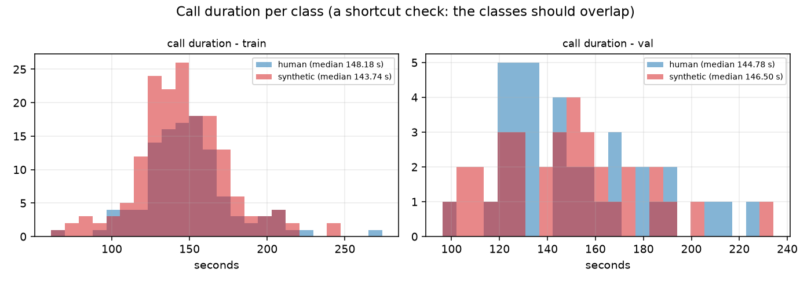
*Call duration per class and split: the classes overlap (single-feature AUC ~0.47), duration is not a shortcut.*


### Conversation structure (official turn files)

The turn files describe who speaks when. They are 'derived automatically' by the organisers and are not available at inference, so we use them only to describe the data and to validate our own segmentation.


*Behavioural cues from the turn files (train). These are NOT used by the acoustic model; they are the raw material of the future behavioural branch.*

- Synthetic callers wait much longer before their first word: median 10.4 s vs 1.1 s for humans (the AI pipeline needs the agent's greeting to finish before it answers).
- They take fewer turns (13 vs 19), longer ones (2.6 vs 2.0 s), answer more slowly (median response latency 2.7 vs 1.7 s) and rarely talk over the agent (overlap 1.4 vs 3.8 s per call).
- They are also **louder**: caller RMS inside speech -16.3 dB vs -23.4 dB, with peaks close to full scale (0.98 vs 0.86) - a gain difference of the injection path, not a property of a voice.

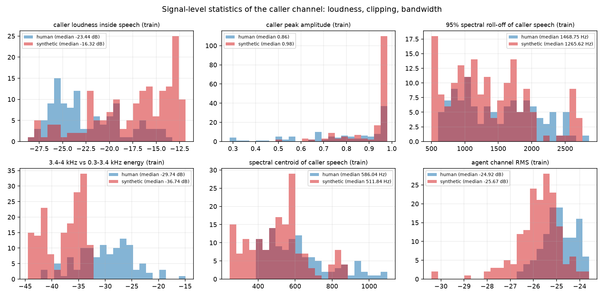
*Signal-level statistics of the caller channel (train). Loudness, peak and the 3.4-4 kHz band ratio separate the classes.*


### Our segmentation vs the official turns

At inference we only receive the WAV, so the caller turns must come from our own voice-activity detector (VAD). We compared three options against the official turns (frame-level F1 at 10 ms resolution):

| Detector | Median F1 | Calls with F1 < 0.8 | Human recall | Synthetic recall | Verdict |
|---|---|---|---|---|---|
| energy VAD, 15 dB above the noise floor (**used**) | 0.953 | 1 | 0.961 | 0.997 | balanced across classes; 1 problem call |
| energy VAD, 12 dB | 0.952 | 21 | 0.963 | 0.999 | 21 noisy synthetic calls over-detected |
| energy VAD 12 dB + crosstalk gate (drop frames where the agent is louder) | 0.950 | 29-34 | 0.90-0.92 | 0.99 | removes human speech during overlaps: rejected |
| Silero VAD (neural), threshold 0.5 | 0.927 | 54 | 0.857 | 0.981 | misses quiet human speech: class-dependent recall, rejected |

*VAD candidates measured on all 353 calls against the official caller turns (outputs/dataset_inspection/vad_*.csv). The chosen detector treats both classes alike.*


*Agreement of the chosen VAD with the official turns, regions per call, and chunks per call.*

Chunking every VAD region into pieces of at most 4 s (leftovers under 1 s dropped) gives **4,102 training chunks (3.01 h)** and **977 validation chunks (0.69 h)**, median 14 per call, no call without chunks. The median is the same for both classes, so the number of chunks is not a cue either.


### Leakage checks

- Anonymous ids are `call_` + 12 hex characters; the hex value has AUC 0.497 against the label and the label sequence in id order has 174 runs (random expectation 174): filenames leak nothing.
- No file appears in both splits; no duplicate audio (MD5). Spectral fingerprints of caller speech across splits: maximum train/val correlation 0.992, 0 near-duplicate pairs.
- Speaker identity is not available, so we cannot verify the speaker-disjoint claim ourselves nor count distinct TTS voices; within the training split the same caller may appear in several calls, which is why no cross-validation inside train is reported.


### Shortcut features (preview of Part 9)

| Statistic | Train AUC | Val AUC | Median human | Median synthetic |
|---|---|---|---|---|
| time until the caller first speaks (leading silence) | 0.948 | 0.899 | 1.14 | 10.44 |
| energy 3.4-4 kHz vs 0.3-3.4 kHz (telephone band edge) | 0.106 | 0.248 | -29.74 | -36.74 |
| caller channel RMS level (whole channel) | 0.798 | 0.932 | -28.42 | -22.16 |
| caller RMS level inside speech | 0.790 | 0.917 | -23.44 | -16.32 |
| median caller response latency after an agent turn | 0.785 | 0.840 | 1.70 | 2.74 |
| seconds of caller/agent overlap | 0.220 | 0.309 | 3.78 | 1.35 |
| agent channel RMS level | 0.222 | 0.150 | -24.92 | -25.67 |
| number of caller turns | 0.233 | 0.298 | 19.00 | 13.00 |
| agent speech time | 0.249 | 0.256 | 78.52 | 67.00 |
| number of caller speech regions found by our VAD | 0.289 | 0.420 | 17.00 | 13.00 |

*Single-feature ROC AUC of trivial per-call statistics (0.5 = no information; values far from 0.5 in either direction are shortcuts). Part 9 measures what a model built only on them achieves.*


## Part 3 - Audio fundamentals, on real Altur calls

Everything a model sees is numbers. This part follows two real training calls - one human, one synthetic, chosen with similar caller speech time - through every representation used in the project. All figures were produced by `src/signal_processing_demo.py` at the native 8 kHz.

| Example | Call | Call length | Caller speech | Example turn | Samples in turn | Turn RMS |
|---|---|---|---|---|---|---|
| human | call_eb1c9a5a2c08 | 145 s | 38.0 s | 4.00 s at 38.5 s | 32,000 | -25.0 dB |
| synthetic | call_c87e905eb0d7 | 129 s | 38.5 s | 4.00 s at 9.2 s | 32,000 | -15.1 dB |


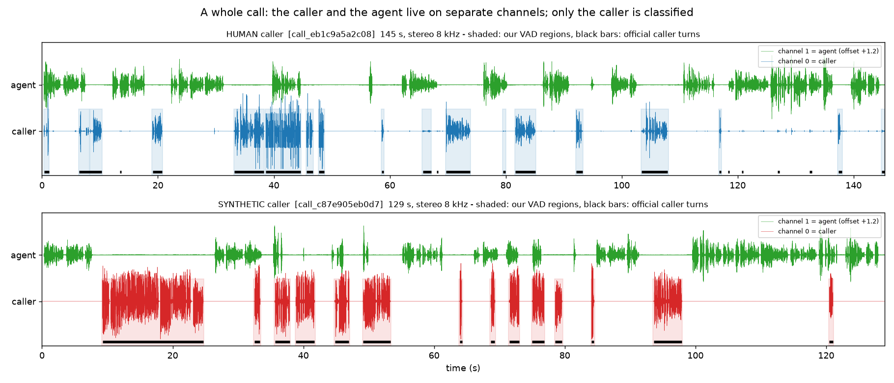
*A whole call. Channel 0 (caller) and channel 1 (agent) are separate signals; the shaded regions are our VAD's caller turns and the black bars the official ones. Only channel 0 is classified.*


### Waveform, samples and amplitude

A microphone turns air pressure into a voltage; an analogue-to-digital converter measures it at fixed intervals. Each measurement is a **sample**, the whole list is the **waveform**, and each value (between -1 and +1 after loading) is the **amplitude**. Telephone audio uses **8,000 samples per second**: a 2 s caller turn is 16,000 numbers.

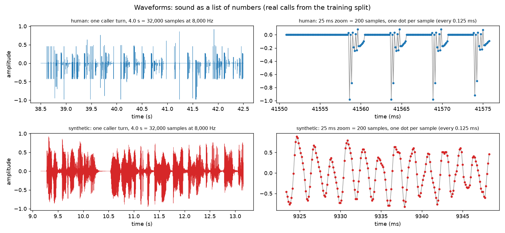
*Left: one caller turn of each example. Right: 25 ms of the loudest part - every dot is one sample.*


### Sample rate, Nyquist and why 8 kHz matters

The **Nyquist rule**: a sample rate can only represent frequencies below half of it. 8 kHz audio therefore contains **nothing above 4 kHz**; classic telephone lines pass roughly 300-3,400 Hz. The pretrained models expect 16 kHz input, so we resample the caller channel from 8 kHz to 16 kHz - a representation change only. **Resampling does not restore frequencies above 4 kHz**: the 4-8 kHz half of the 16 kHz spectrum stays empty, and the 4-8 kHz region where many synthesis artefacts live in studio-quality datasets simply does not exist in this task.


*Left: Nyquist and aliasing. Right: the same caller turn at 8 kHz and after resampling to 16 kHz - the spectrum above 4 kHz is empty.*


### Frequency and the FFT

A voice contains many frequencies at once: the **pitch** (F0, how fast the vocal folds vibrate, ~85-255 Hz), its **harmonics** (whole multiples of F0), and **formants** (throat/mouth resonances that make an 'a' differ from an 'i'). The **Fourier transform** re-describes a short piece of waveform as a sum of sine waves; the **FFT** is the fast algorithm that computes it. On 64 ms of 8 kHz audio (512 samples) it returns 257 frequency bins, 15.6 Hz apart.


*Three pure tones (the FFT finds exactly three peaks) and 64 ms of a loud vowel of each example.*


### Spectrogram, mel spectrogram, MFCC

Speech changes every few milliseconds, so we take the FFT of short overlapping windows (64 ms, every 10 ms) and stand the spectra side by side: the **spectrogram** (STFT). The **mel scale** regroups frequencies the way hearing does (fine at low frequencies, coarse at high ones) - the **mel spectrogram** is the input of many speech models. **MFCCs** take the log of the mel spectrogram and a cosine transform, keeping only the first ~20 coefficients: a compact description of the spectral *shape* that discards fine harmonic detail.

 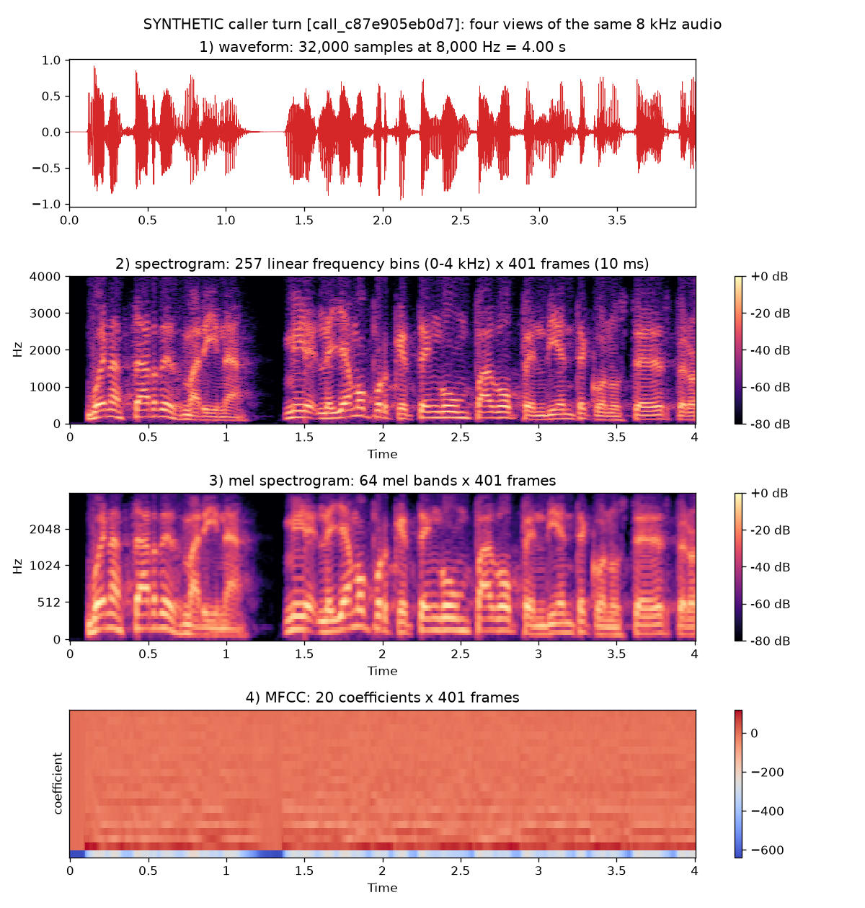
*The four views of the same caller turn: human (left) and synthetic (right).*

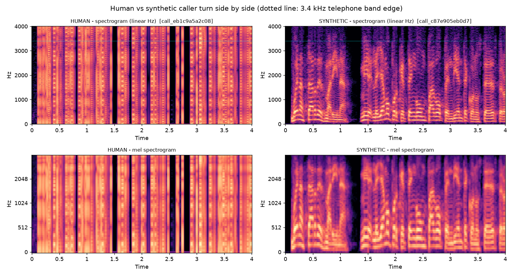
*Human and synthetic caller turns side by side (dotted line = 3.4 kHz telephone band edge).*

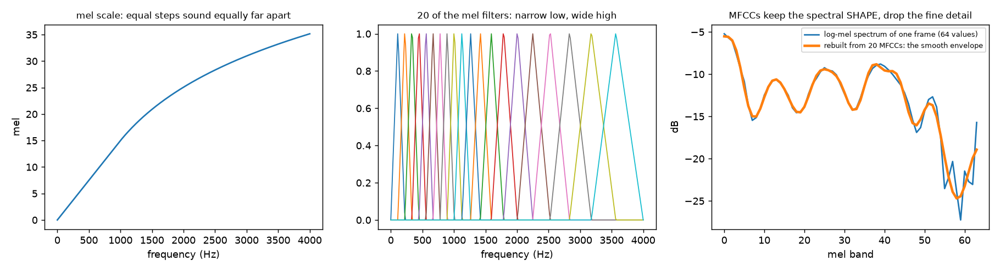
*The mel scale, some mel filters, and how 20 MFCCs rebuild only the smooth envelope of a frame.*


### What differs on average

Single examples mislead; averages over many calls do not. The long-term average spectrum of caller speech, per class and split, is the most informative single picture of this dataset:

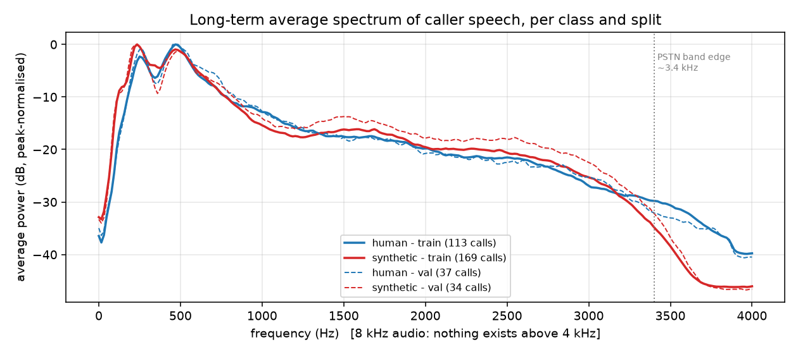
*Long-term average spectrum of caller speech (our VAD regions), peak-normalised, per class and split. Solid = train, dashed = validation.*

Synthetic callers roll off sharply above ~3.3 kHz while human callers keep energy up to 4 kHz: the median ratio of 3.4-4 kHz energy to 0.3-3.4 kHz energy is -29.7 dB for humans and -36.7 dB for synthetic callers in training, and the validation curves follow the training curves closely. Synthetic speech also carries slightly more energy between 1.3 and 3 kHz. These are properties of the **pipelines** that produced the audio (the TTS output and the path it took into the phone line) as much as of the voices; Part 9 discusses what that means for robustness.


### Pitch (F0)

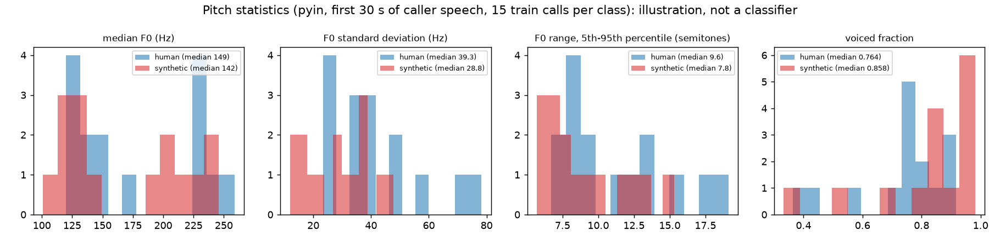
*Pitch statistics (pyin) on 30 s of caller speech from 15 train calls per class. Illustration only.*

On this small sample the median F0 is 149 Hz (human) vs 142 Hz (synthetic), with F0 standard deviation 39 vs 29 Hz and a 5th-95th percentile range 9.6 vs 7.8 semitones. With 15 calls per class these are descriptions, not evidence; the models below never see pitch features explicitly.


### Which artefacts synthetic speech MAY create

- Vocoder artefacts: smeared or too-regular harmonics, missing breath noise, phase inconsistencies between frames.
- Unnatural prosody: overly steady pitch, too-regular rhythm, identical pause lengths.
- Band limits and codec fingerprints: the TTS output has its own sample rate, resampling filter and codec path before it reaches the line - visible here as the 3.3 kHz roll-off.
- Missing micro-variation: no lip smacks, breaths, room reflections or handset movement.
- None of these is proof on its own; the classifier learns which combinations separate the classes in this data.


## Part 4 - The three pretrained speech models

A **pretrained model** is a neural network somebody already trained on a huge dataset; we download its weights and reuse them. All three candidates are **self-supervised**: they never saw a label. During pretraining, parts of the audio are masked and the network must predict what was hidden (WavLM additionally has to see through added noise and overlapping speakers). To succeed it must learn what speech sounds like at every level - fine acoustic texture in the early layers, phonetic and lexical content in the late ones. That is exactly the knowledge a small labelled dataset (282 training calls) cannot teach from scratch.

| Model | Creator | Pretraining data | Params | Layers x dim | Why it may help | Why it may fail |
|---|---|---|---|---|---|---|
| **WavLM Base+**
`microsoft/wavlm-base-plus` | Microsoft (2021) | 94k h English: Libri-Light, GigaSpeech, VoxPopuli-en; masked prediction + denoising | 94M | 12 x 768 | the front-end of many top ASVspoof systems; our previous project's baseline; denoising objective keeps low-level acoustics | English only; pretrained on wide-band 16 kHz audio, never on 8 kHz telephone speech |
| **Wav2Vec2 Spanish**
`facebook/wav2vec2-base-es-voxpopuli-v2` | Meta AI (2021) | 21.4k h Spanish European-Parliament speech (VoxPopuli); contrastive masked prediction | 94M | 12 x 768 | the only candidate pretrained on Spanish: phonetic inventory and prosody match the calls | smallest pretraining set, one domain (parliament microphones), older wav2vec 2.0 objective |
| **XLS-R 300M**
`facebook/wav2vec2-xls-r-300m` | Meta AI (2021) | 436k h in 128 languages: VoxPopuli, MLS, CommonVoice, BABEL, VoxLingua107 | 315M | 24 x 1024 | largest and most diverse pretraining (BABEL is telephone speech); Spanish included | 3x the size, higher latency and memory; large models can be less sample-efficient with 282 calls |


Measured for WavLM Base+: 94.4M parameters, 12 transformer layers of 768 dimensions, weights on disk 755 MB, input normalisation `do_normalize=False`.

Measured for Wav2Vec2 Spanish (VoxPopuli): 94.4M parameters, 12 transformer layers of 768 dimensions, weights on disk 760 MB, input normalisation `do_normalize=True`.

Measured for XLS-R 300M: 315.4M parameters, 24 transformer layers of 1024 dimensions, weights on disk 2,539 MB, input normalisation `do_normalize=True`.


### Why an English model may still work in Spanish

Synthesis artefacts are not words. Vocoder texture, band limits, unnatural harmonic structure and prosodic regularity live in the low-level acoustic representation that every self-supervised speech model builds in its early layers, regardless of the pretraining language. Our previous ASVspoof project found the spoofing evidence in WavLM's lower-middle layers, far below the layers that encode phonemes and words. The language-specific question is whether Spanish phonetics look 'unusual' to an English model in a way that confuses the detector - which is why the Spanish-pretrained model is a fair challenger, and why the multilingual XLS-R (which saw Spanish and telephone speech) is the third.

> **NOTE**
>
> No winner is claimed here. Part 6 lets the validation split decide.


## Part 5 - Embeddings and the layer probe

An **embedding** is a fixed-size vector that a neural network computes to describe its input. Each backbone turns a chunk of waveform into one vector per 20 ms frame in every transformer layer; **mean pooling** over the frames gives one vector per chunk and layer. We cache the mean (and the standard deviation) of every layer for every chunk once, in float16, so that every classifier experiment afterwards runs in seconds.

```
caller chunk (<= 4 s, 16 kHz, RMS -26 dB)
  -> CNN feature encoder (7 conv layers, 20 ms frames)          = hidden layer 0
  -> transformer layer 1 ... layer N                             = hidden layers 1..N
  -> for every layer: mean over frames -> one vector (768 or 1024 numbers)
  -> cached: (n_chunks, N+1, dim) float16 per split and backbone
```


### Why not simply use the last layer?

Self-supervised speech models are trained to predict masked content, so their top layers move towards *what was said* and discard fine acoustic texture; the lower and middle layers still describe the sound itself, where synthesis and channel artefacts live. Our ASVspoof project found the spoofing evidence in WavLM's layer 3, with the last layer seven times worse. So for every backbone we train one logistic regression per layer on the training chunks and score the validation calls (mean chunk log-odds). The layer is chosen **on validation only** - never on anything the judges will use.

| Layer | WavLM Base+ | Wav2Vec2 Spanish (VoxPopuli) | XLS-R 300M |
|---|---|---|---|
| 0 (CNN) | AUC 1.000 / EER 0.0% / acc 1.00 | AUC 1.000 / EER 0.0% / acc 1.00 | AUC 1.000 / EER 0.0% / acc 1.00 |
| 1 | AUC 1.000 / EER 0.0% / acc 1.00 | AUC 1.000 / EER 0.0% / acc 1.00 | AUC 1.000 / EER 0.0% / acc 1.00 |
| 2 | AUC 1.000 / EER 0.0% / acc 1.00 | AUC 1.000 / EER 0.0% / acc 1.00 | AUC 1.000 / EER 0.0% / acc 1.00 |
| 3 | AUC 1.000 / EER 0.0% / acc 1.00 | AUC 1.000 / EER 0.0% / acc 1.00 | AUC 1.000 / EER 0.0% / acc 1.00 |
| 4 | AUC 1.000 / EER 0.0% / acc 1.00 | AUC 1.000 / EER 0.0% / acc 1.00 | AUC 1.000 / EER 0.0% / acc 1.00 |
| 5 | AUC 1.000 / EER 0.0% / acc 1.00 | **AUC 1.000 / EER 0.0% / acc 1.00** | AUC 1.000 / EER 0.0% / acc 1.00 |
| 6 | AUC 1.000 / EER 0.0% / acc 1.00 | AUC 1.000 / EER 0.0% / acc 1.00 | AUC 1.000 / EER 0.0% / acc 1.00 |
| 7 | AUC 1.000 / EER 0.0% / acc 1.00 | AUC 1.000 / EER 0.0% / acc 1.00 | AUC 1.000 / EER 0.0% / acc 1.00 |
| 8 | AUC 1.000 / EER 0.0% / acc 1.00 | AUC 1.000 / EER 0.0% / acc 1.00 | AUC 1.000 / EER 0.0% / acc 1.00 |
| 9 | **AUC 1.000 / EER 0.0% / acc 1.00** | AUC 1.000 / EER 0.0% / acc 1.00 | AUC 1.000 / EER 0.0% / acc 1.00 |
| 10 | AUC 1.000 / EER 0.0% / acc 1.00 | AUC 1.000 / EER 0.0% / acc 1.00 | AUC 1.000 / EER 0.0% / acc 1.00 |
| 11 | AUC 1.000 / EER 0.0% / acc 1.00 | AUC 1.000 / EER 0.0% / acc 1.00 | AUC 1.000 / EER 0.0% / acc 1.00 |
| 12 | AUC 1.000 / EER 0.0% / acc 1.00 | AUC 1.000 / EER 0.0% / acc 1.00 | AUC 1.000 / EER 0.0% / acc 1.00 |
| 13 | - | - | AUC 1.000 / EER 0.0% / acc 1.00 |
| 14 | - | - | AUC 1.000 / EER 0.0% / acc 1.00 |
| 15 | - | - | AUC 1.000 / EER 0.0% / acc 1.00 |
| 16 | - | - | AUC 1.000 / EER 0.0% / acc 1.00 |
| 17 | - | - | AUC 1.000 / EER 0.0% / acc 1.00 |
| 18 | - | - | AUC 1.000 / EER 0.0% / acc 1.00 |
| 19 | - | - | AUC 1.000 / EER 0.0% / acc 1.00 |
| 20 | - | - | AUC 1.000 / EER 0.0% / acc 1.00 |
| 21 | - | - | AUC 1.000 / EER 0.0% / acc 1.00 |
| 22 | - | - | AUC 1.000 / EER 0.0% / acc 1.00 |
| 23 | - | - | **AUC 1.000 / EER 0.0% / acc 1.00** |
| 24 | - | - | AUC 1.000 / EER 0.0% / acc 1.00 |

*Layer probe on the CLEAN validation split: call-level AUC / EER / accuracy of a logistic regression trained on each frozen layer. Bold = the layer finally used for that backbone.*

> **KEY RESULT - The clean probe is saturated**
>
> Every layer of every backbone - even layer 0, the convolutional feature encoder that has seen no transformer block - separates the validation calls perfectly. The clean probe therefore proves that the evidence is easy to read from any frozen representation, but it **cannot choose a layer**. The layer used for each backbone is chosen by the same probe under the channel perturbations of Part 6b (the 'robust layer'), which is the reason the bold rows are not layer 0. The chunk-level AUC (not shown) is 0.99-1.00 for the lower layers and drops slightly for the top layers, the only visible trace of the depth effect we saw on ASVspoof.


## Part 6 - The controlled three-model experiment

The backbone is the only variable. Everything else is held fixed so that a difference in the numbers can only come from the representation:

| Held identical for the three backbones | Value |
|---|---|
| train / validation calls | official manifest split, all 353 calls, same seeded order |
| caller channel, VAD, chunking | channel 0; energy VAD 15 dB above the noise floor; chunks <= 4 s, leftovers < 1 s dropped |
| loudness | every chunk scaled to RMS -26 dBFS (removes the loudness shortcut; needed because only two backbones normalise their input) |
| resampling | 8 kHz -> 16 kHz polyphase (no information above 4 kHz is created) |
| pooling / layer choice | mean over frames; layer chosen by validation AUC of a logistic-regression probe |
| classifier | logistic regression (C = 1, class-balanced) and MLP dim-256-2 (ReLU, dropout 0.3), class-weighted cross-entropy, AdamW lr 1e-3, wd 1e-4, batch 64, <= 60 epochs, early stopping on validation loss (patience 15) |
| aggregation | mean of the chunk log-odds per call (fixed in advance) |
| seed / precision | seed 42; backbone in bfloat16 autocast on the GPU, classifier in float32 |
| metrics | identical code (src/metrics.py); threshold p = 0.5 for the decision metrics |


### Validation results

| Backbone | Params | Dim | Layer | **Accuracy** | Bal. acc. | Precision | Recall | F1 | AUC | EER | FAR | FRR | Brier (raw) |
|---|---|---|---|---|---|---|---|---|---|---|---|---|---|
| WavLM Base+ | 94M | 768 | 9 | **100.0%** | 100.0% | 1.000 | 1.000 | 1.000 | 1.000 | 0.0% | 0.0% | 0.0% | 0.000 |
| Wav2Vec2 Spanish (VoxPopuli) | 94M | 768 | 5 | **100.0%** | 100.0% | 1.000 | 1.000 | 1.000 | 1.000 | 0.0% | 0.0% | 0.0% | 0.000 |
| XLS-R 300M | 315M | 1024 | 23 | **100.0%** | 100.0% | 1.000 | 1.000 | 1.000 | 1.000 | 0.0% | 0.0% | 0.0% | 0.000 |

*PRIMARY CHALLENGE METRIC = accuracy (bold). All others are secondary diagnostics. MLP on the chosen layer, 71 validation calls (37 human, 34 synthetic), threshold p = 0.5, no calibration.*

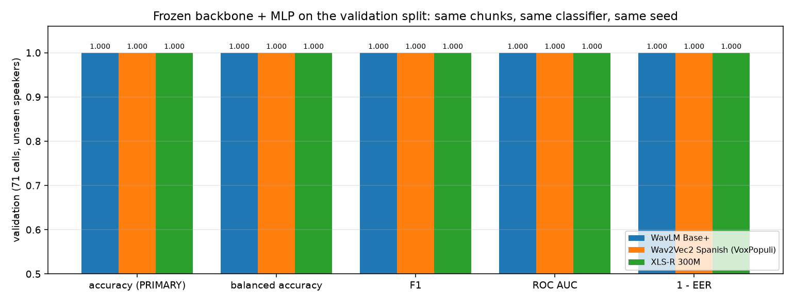
*Validation metrics of the three frozen backbones with the identical MLP.*

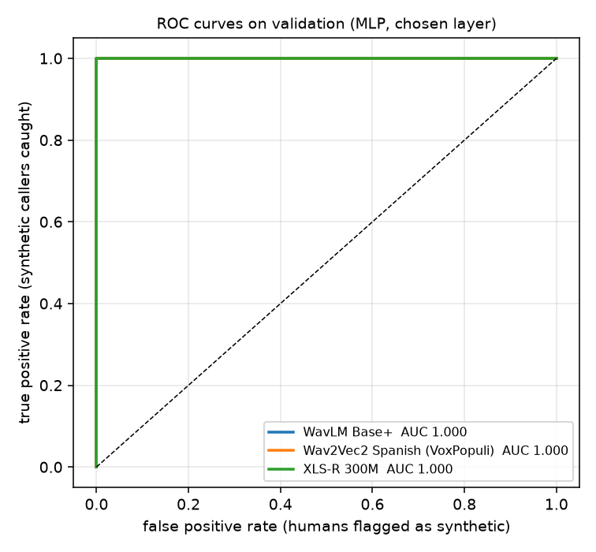 
*ROC curves and confusion matrices on validation (MLP).*


### Linear probe vs MLP vs call-level embedding

| Backbone | Logistic regression on chunks | MLP on chunks | Logistic regression on call-averaged embedding |
|---|---|---|---|
| WavLM Base+ | acc 100.0%, AUC 1.000, EER 0.0% | acc 100.0%, AUC 1.000, EER 0.0% | acc 100.0%, AUC 1.000, EER 0.0% |
| Wav2Vec2 Spanish (VoxPopuli) | acc 100.0%, AUC 1.000, EER 0.0% | acc 100.0%, AUC 1.000, EER 0.0% | acc 100.0%, AUC 1.000, EER 0.0% |
| XLS-R 300M | acc 100.0%, AUC 1.000, EER 0.0% | acc 100.0%, AUC 1.000, EER 0.0% | acc 100.0%, AUC 1.000, EER 0.0% |

*Three classifiers on the same chosen layer (validation). Chunk-level training gives ~15x more training examples than call-level training.*

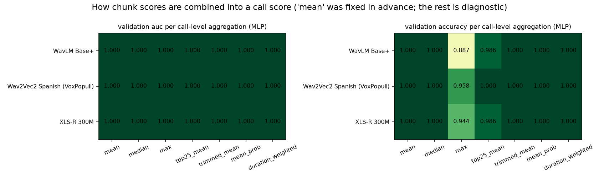
*Call-level aggregation diagnostic: how the chunk scores are combined. 'mean' was fixed before the experiment.*


### Cost

| Backbone | Weights | Extraction (backbone time, all chunks) | Realtime factor | Peak VRAM extraction | Cache (all layers) | Classifier training | Latency / call (GPU, median) | Backbone ms / chunk | Peak VRAM inference |
|---|---|---|---|---|---|---|---|---|---|
| WavLM Base+ | 755 MB | 108 s | 123x | 1,864 MB | 203 MB | probe 1 s + MLP 3 s | 255 ms | 22.0 | 402 MB |
| Wav2Vec2 Spanish (VoxPopuli) | 760 MB | 59 s | 224x | 1,884 MB | 203 MB | probe 1 s + MLP 4 s | 119 ms | 7.6 | 308 MB |
| XLS-R 300M | 2,539 MB | 109 s | 122x | 2,996 MB | 520 MB | probe 2 s + MLP 4 s | 310 ms | 23.7 | 1,404 MB |

*Measured on an RTX 4080 Laptop GPU (12 GB). Latency = decode + VAD + resample + backbone (truncated after the chosen layer) + MLP for one whole call, median over 10 validation calls.*


*Cost of each backbone.*

| Backbone | CPU latency / call (median of 3) | GPU latency / call (median of 10) |
|---|---|---|
| WavLM Base+ | 1.27 s | 255 ms |
| Wav2Vec2 Spanish (VoxPopuli) | 0.85 s | 119 ms |
| XLS-R 300M | 3.56 s | 310 ms |

*CPU-only inference (24-thread laptop CPU): what a deployment without a GPU would see.*


### Calibration

A model can be right and still over-confident. The raw probability sigmoid(mean chunk log-odds) tends to be extreme because chunk scores are averaged in log-odds space and the MLP was trained until it fit the training chunks. The clean validation split contains **no errors**, so a calibrator fitted on it can only make the probabilities sharper without limit (a first attempt drove the temperature to its grid minimum). We therefore fit and evaluate the calibrators on the validation calls **under all stress conditions** of Part 6b - the same 71 calls, 11 conditions, with real mistakes and score drift - using 5-fold cross-validation grouped by call:

| Backbone | raw: Brier / log-loss / ECE / accuracy | Platt (out-of-fold): Brier / log-loss / ECE / accuracy | temperature (out-of-fold): Brier / ECE | deployed |
|---|---|---|---|---|
| WavLM Base+ | 0.060 / 0.305 / 0.057 / 93.6% | 0.058 / 0.198 / 0.045 / 93.6% | 0.056 / 0.043 | temperature |
| Wav2Vec2 Spanish (VoxPopuli) | 0.020 / 0.074 / 0.019 / 97.4% | 0.020 / 0.071 / 0.015 / 97.4% | 0.020 / 0.016 | platt |
| XLS-R 300M | 0.101 / 0.363 / 0.093 / 87.5% | 0.077 / 0.234 / 0.050 / 88.0% | 0.081 / 0.066 | platt |

*Calibration of the MLP call score on the validation calls under all conditions (71 calls x 11 conditions). Brier score: mean squared error of the probability (0 = perfect); ECE: expected calibration error (gap between stated confidence and observed accuracy). On clean audio all three are ~0 before and after.*


*Reliability diagrams of the winner (Wav2Vec2 Spanish (VoxPopuli)): raw vs calibrated, out-of-fold on validation.*

> **NOTE**
>
> **Classification correctness vs probability calibration.** Accuracy, F1 and EER only care about the order of the scores and the position of one threshold. Calibration asks whether a stated 0.9 is right nine times out of ten. The challenge rewards both: the verdict is scored, and `confidence` breaks ties. Platt/temperature scaling changes the calibration without changing the ranking (AUC/EER stay identical); it can move the accuracy slightly because it moves the p = 0.5 point.


## Part 6b - The robustness stress test

Every backbone reached AUC 1.000 on the clean validation split from **every** layer - including layer 0, the output of the convolutional feature encoder, which is little more than a learned filterbank. Together with the shortcut check (Part 9: trivial statistics reach AUC 1.0 too) this says that the two classes of this dataset are separated by gross acoustic properties of the recording pipeline, and that the clean split cannot rank the backbones, nor tell us anything about the judges' first criterion, robustness to unseen call conditions.

So we built a harder validation: the **same 71 validation calls** with the caller channel perturbed at test time in ways the training data never contained (nothing is retrained). The perturbations simulate other lines, handsets and codecs, and one of them - a low-pass filter at the telephone band edge - directly removes the 3.3 kHz cue.

| Condition | What it simulates | Why |
|---|---|---|
| gain -12 dB | a quieter line | sanity check: the loudness normalisation should make it a near no-op |
| lowpass 3.4 kHz / 3.0 kHz | a narrower line or codec | removes the band edge that separates synthetic calls; a band-edge detector must fail here |
| pstn 300-3400 Hz | a classic PSTN band-pass | narrow-band telephony |
| white noise 20 / 10 dB SNR | line noise, a bad connection | additive noise relative to the caller's speech level |
| pink noise 10 dB SNR | room / traffic / crowd noise | coloured noise closer to real backgrounds |
| mu-law codec | G.711 8-bit companding | the most common real telephone codec |
| reverb 0.3 s | a speakerphone in a small room | synthetic exponentially decaying impulse response |
| spectral tilt -3 dB/octave | a different handset / microphone | changes the spectral balance without removing bands |


### Which layers survive?

For every backbone the validation embeddings of every layer were re-extracted under every condition and scored by the logistic-regression probe trained on the **clean** training chunks. The **robust layer** of a backbone is the layer with the highest mean validation AUC over all conditions (clean included); this replaces the saturated clean-only choice.

| Backbone | Robust layer | Mean AUC (all conditions) | Mean AUC (stressed only) | Worst-condition AUC | Clean-only choice |
|---|---|---|---|---|---|
| WavLM Base+ | 9 | 0.999 | 0.999 | 0.990 | layer 0 (every layer tied at AUC 1.000) |
| Wav2Vec2 Spanish (VoxPopuli) | 5 | 1.000 | 1.000 | 0.999 | layer 0 (every layer tied at AUC 1.000) |
| XLS-R 300M | 23 | 0.999 | 0.999 | 0.996 | layer 0 (every layer tied at AUC 1.000) |


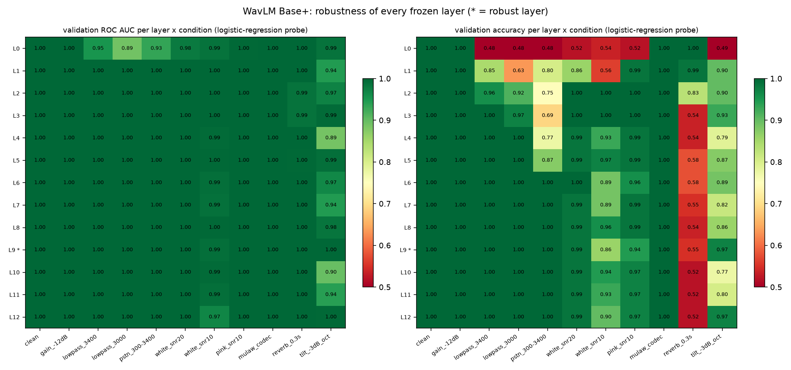
*WavLM Base+: validation AUC and accuracy of every frozen layer under every condition (logistic-regression probe trained on clean train chunks). * = robust layer.*

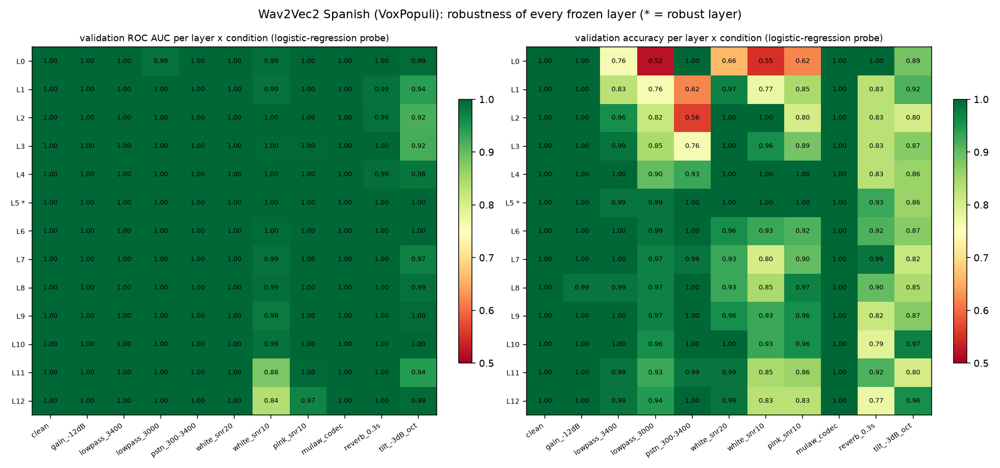
*Wav2Vec2 Spanish (VoxPopuli): validation AUC and accuracy of every frozen layer under every condition (logistic-regression probe trained on clean train chunks). * = robust layer.*

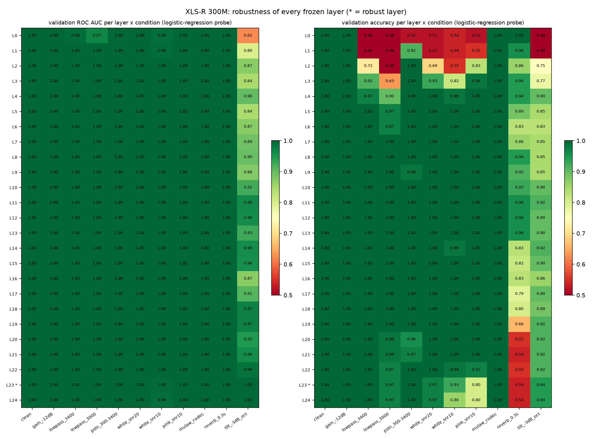
*XLS-R 300M: validation AUC and accuracy of every frozen layer under every condition (logistic-regression probe trained on clean train chunks). * = robust layer.*


### The MLPs under stress

| Condition | WavLM Base+ (layer 9) | Wav2Vec2 Spanish (VoxPopuli) (layer 5) | XLS-R 300M (layer 23) |
|---|---|---|---|
| clean | AUC 1.000 / acc 100.0% / EER 0.0% | AUC 1.000 / acc 100.0% / EER 0.0% | AUC 1.000 / acc 100.0% / EER 0.0% |
| gain_-12dB | AUC 1.000 / acc 100.0% / EER 0.0% | AUC 1.000 / acc 100.0% / EER 0.0% | AUC 1.000 / acc 100.0% / EER 0.0% |
| lowpass_3400 | AUC 1.000 / acc 100.0% / EER 0.0% | AUC 1.000 / acc 100.0% / EER 0.0% | AUC 1.000 / acc 100.0% / EER 0.0% |
| lowpass_3000 | AUC 1.000 / acc 100.0% / EER 0.0% | AUC 1.000 / acc 100.0% / EER 0.0% | AUC 1.000 / acc 100.0% / EER 0.0% |
| pstn_300-3400 | AUC 1.000 / acc 100.0% / EER 0.0% | AUC 1.000 / acc 98.6% / EER 0.0% | AUC 1.000 / acc 97.2% / EER 0.0% |
| white_snr20 | AUC 1.000 / acc 98.6% / EER 0.0% | AUC 1.000 / acc 97.2% / EER 0.0% | AUC 1.000 / acc 91.5% / EER 0.0% |
| white_snr10 | AUC 0.990 / acc 93.0% / EER 5.6% | AUC 0.998 / acc 98.6% / EER 2.8% | AUC 0.980 / acc 64.8% / EER 2.8% |
| pink_snr10 | AUC 1.000 / acc 98.6% / EER 0.0% | AUC 1.000 / acc 100.0% / EER 0.0% | AUC 1.000 / acc 56.3% / EER 0.0% |
| mulaw_codec | AUC 1.000 / acc 100.0% / EER 0.0% | AUC 1.000 / acc 100.0% / EER 0.0% | AUC 1.000 / acc 100.0% / EER 0.0% |
| reverb_0.3s | AUC 1.000 / acc 54.9% / EER 0.0% | AUC 1.000 / acc 88.7% / EER 0.0% | AUC 1.000 / acc 59.2% / EER 0.0% |
| tilt_-3dB_oct | AUC 0.976 / acc 84.5% / EER 8.5% | AUC 0.999 / acc 88.7% / EER 2.8% | AUC 0.995 / acc 93.0% / EER 2.8% |
| **mean over stressed conditions** | **AUC 0.997 / acc 93.0%** | **AUC 1.000 / acc 97.2%** | **AUC 0.998 / acc 86.2%** |
| worst condition | tilt_-3dB_oct (AUC 0.976) | white_snr10 (AUC 0.998) | white_snr10 (AUC 0.980) |

*MLP trained on clean training chunks (robust layer), scored on the validation calls under each condition. The mean over the stressed conditions is the selection score of the benchmark.*

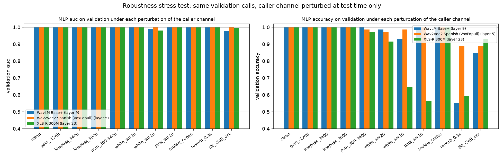
*MLP validation AUC and accuracy per condition and backbone.*

> **WARNING - What the stress test says**
>
> Worst conditions - WavLM Base+: tilt_-3dB_oct, Wav2Vec2 Spanish (VoxPopuli): white_snr10, XLS-R 300M: white_snr10. Conditions that remove or mask the upper band (low-pass, PSTN band-pass, noise) are the hardest; a gain change costs nothing (the loudness normalisation works as intended). Wherever a low-pass filter alone breaks a model, that model was partly a band-edge detector - a property of this dataset's synthetic pipeline that the hidden test set may or may not share.


## Part 7 - Why the winner won

**Evidence (measured):** on the clean validation split the three backbones tie (accuracy 100.0%, 100.0%, 100.0%; AUC 1.000-1.000). Under the ten test-time perturbations, Wav2Vec2 Spanish (VoxPopuli) (layer 5) keeps the highest mean AUC (1.000, mean accuracy 97.2%, worst condition white_snr10 at AUC 0.998). The others: WavLM Base+ (layer 9) mean stressed AUC 0.997 / accuracy 93.0%, worst tilt_-3dB_oct (0.976); XLS-R 300M (layer 23) mean stressed AUC 0.998 / accuracy 86.2%, worst white_snr10 (0.980).

The spread in mean stressed AUC between the best and the worst backbone is 0.003. The stress conditions are synthetic approximations of other lines and handsets, and 71 calls remain a small sample; the ranking is a *preference supported by a controlled experiment*, not a proof, and the explanations below are hypotheses.


### Evidence vs hypothesis

- **Evidence - where the robust evidence lives.** WavLM Base+: robust layer 9 of 12 (relative depth 0.75); mean AUC over conditions 0.999 vs 0.975 for the CNN output and 0.997 for the last layer. Wav2Vec2 Spanish (VoxPopuli): robust layer 5 of 12 (relative depth 0.42); mean AUC over conditions 1.000 vs 0.997 for the CNN output and 0.982 for the last layer. XLS-R 300M: robust layer 23 of 24 (relative depth 0.96); mean AUC over conditions 0.999 vs 0.961 for the CNN output and 0.999 for the last layer. On clean audio every layer is perfect; under stress the transformer layers beat the raw CNN output, and the chosen layers sit below the top of each network, as in our ASVspoof project: the human/synthetic difference is acoustic texture, not linguistic content.

- **Evidence - the linear probe is already strong.** Logistic regression on the chosen layer reaches AUC 1.000 (WavLM Base+), AUC 1.000 (Wav2Vec2 Spanish (VoxPopuli)), AUC 1.000 (XLS-R 300M); the MLP adds little. The classes are close to linearly separable in the frozen representation, which is why the backbone matters less than one might expect.
- **Evidence - chunk vs call.** WavLM Base+: chunk-level AUC 0.999 -> call-level 1.000; Wav2Vec2 Spanish (VoxPopuli): chunk-level AUC 1.000 -> call-level 1.000; XLS-R 300M: chunk-level AUC 1.000 -> call-level 1.000. Averaging ~14 chunk scores per call removes most single-chunk mistakes; a few seconds of speech already carry the signal.

- **Language match (hypothesis).** The Spanish-pretrained model saw Mexican-like phonetics and prosody during pretraining, so its early layers may model Spanish speech more tightly and expose deviations (synthetic prosody, vocoder texture) more clearly.
- **Telephone-band robustness (hypothesis).** None of the models was pretrained on 8 kHz audio; the empty 4-8 kHz half of the spectrum is out of distribution for all three. Models whose early layers depend less on high-frequency energy should suffer less.
- **Sample efficiency (hypothesis).** With 282 training calls, a smaller, better-matched representation can beat a larger one: a 1024-dimensional embedding gives the MLP more room to memorise speaker-specific traits.
- **What the winner is probably using (hypothesis).** Part 9 shows a consistent 3.3 kHz roll-off and extra 1.3-3 kHz energy in synthetic calls, plus prosodic regularity. Frozen low-level layers see all of these; we did not run an ablation that removes the band edge, so we cannot say how much of the score depends on it.


## Part 8 - Overfitting and generalisation

**Overfitting** means the model memorises its training examples instead of learning the general pattern; it keeps improving on training data while getting worse on new data. **Underfitting** is the opposite: it cannot even fit the training data. We watch both with train-vs-validation curves after every epoch and keep the epoch with the lowest validation loss.

| Backbone | Train accuracy / AUC (fit data) | Validation accuracy / AUC | Best epoch of 60 | Epochs run |
|---|---|---|---|---|
| WavLM Base+ | 100.0% / 1.000 | 100.0% / 1.000 | 3 | 18 |
| Wav2Vec2 Spanish (VoxPopuli) | 100.0% / 1.000 | 100.0% / 1.000 | 3 | 18 |
| XLS-R 300M | 100.0% / 1.000 | 100.0% / 1.000 | 5 | 20 |


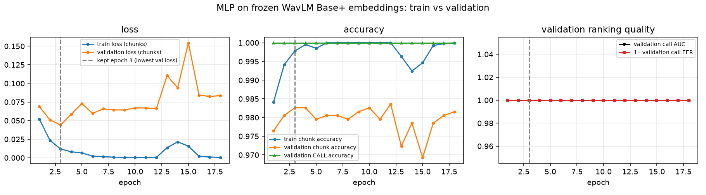
*WavLM Base+: MLP training vs validation curves (chunk-level loss/accuracy, call-level AUC/EER).*

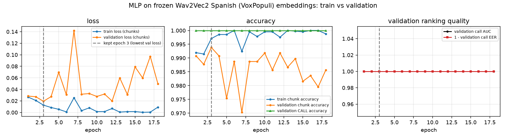
*Wav2Vec2 Spanish (VoxPopuli): MLP training vs validation curves (chunk-level loss/accuracy, call-level AUC/EER).*

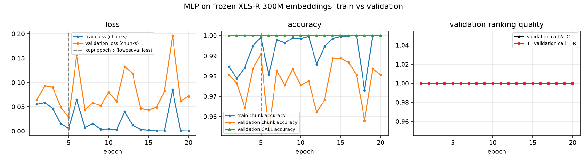
*XLS-R 300M: MLP training vs validation curves (chunk-level loss/accuracy, call-level AUC/EER).*


### What the model could be memorising

- **Specific speakers.** The training split contains an unknown number of distinct humans, some in several calls. A chunk classifier can learn 'this voice = human'. The validation split has different callers, so the validation numbers already measure speaker generalisation - which is exactly why the train/validation gap above matters.
- **Specific TTS voices.** The synthetic calls come from an unknown number of voices/engines. If the hidden test set uses voices from a new engine, artefacts learned from the training engines may not transfer; the judges explicitly test 'unseen speakers, engines and call conditions'.
- **Call properties.** Loudness (removed by RMS normalisation), the 3.3 kHz band edge (kept: it is in the audio the model sees), leading silence and turn counts (not visible to a model that only sees speech chunks).
- **Domain shift.** The dataset is one bank flow, one agent, one telephony stack. Other lines, codecs or handset types shift the spectra; our ASVspoof project lost 4x in EER on real telephone channels for exactly this reason.

> **WARNING**
>
> With 71 validation calls, one call is 1.4 accuracy points. Every comparison in this report should be read with that granularity in mind; the hidden test set will be the real measurement.


## Part 8b - Is 100% believable? Five checks

A perfect validation score is a warning sign, not a trophy. Before trusting it we asked what could produce it dishonestly - a leak in the evaluation code, memorised voices, or a cue so gross that it says nothing about synthetic *speech* - and tested each possibility with the cached embeddings of the winner.


### Check 1 - overfitting or underfitting?

**Overfitting** shows up as a gap: the model fits its training calls and does worse on new ones. Here the training and validation curves sit on top of each other (final train loss 0.01, validation loss 0.02, both at 100%) and the validation callers are people the model never heard. **Underfitting** would mean it cannot even fit the training calls. Neither applies: there is no gap to close. The question is what the classes are separated *by*.


### Check 2 - a leak in the pipeline? (label permutation)

We shuffled the training labels and retrained the same classifier five times. If validation data, labels or a metric bug had leaked into the pipeline, a model trained on nonsense labels would still score high. It scores at chance: validation AUC 0.47, 0.53, 0.51, 0.39, 0.59 (mean 0.50). The evaluation is honest.


### Check 3 - how little audio is enough?

Scoring every validation call from its **first chunk only** (1-4 s of speech) already gives accuracy 100.0%; a random single chunk gives 98.6%; single chunks judged alone, without any call-level averaging, are right 98.7% of the time, and even chunks shorter than 2 s 97.3%. A cue that is present in every second of audio is a property of the *signal path* (band limit, spectral balance, noise floor), not of how a voice handles a sentence. This is consistent with the shortcut check (Part 9) and the average spectra (Part 3).

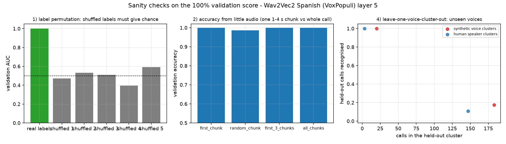
*Left: shuffled labels give chance. Middle: one chunk is enough. Right: the detector's own embeddings cannot separate voices (see check 4), so this leave-one-cluster-out is not informative.*


### Check 4 - the same voices in training and validation?

The organisers state that train and validation are speaker-disjoint and that the hidden set uses voices from neither split. We tried to measure the number of distinct synthetic voices with a **speaker-verification model** (WavLM x-vectors, trained on VoxCeleb to tell people apart), used purely as an instrument.

- On this 8 kHz, RMS-normalised telephone audio the instrument does **not** resolve individuals: the human calls, which come from many different people, collapse into 2 clusters at a 0.70 cosine threshold and 4 at 0.86, and the similarity histograms of human-human, synthetic-synthetic and human-synthetic pairs are nearly identical (a bimodal same-gender / cross-gender shape). It measures voice *group* (pitch range, gender), not identity, on narrow-band audio.
- So the number of distinct TTS voices is **unknown**; the organisers do not disclose it. At the finest threshold the synthetic calls form 6 groups (sizes [85, 65, 31, 18, 3]), and every validation synthetic call has a group-mate in training - as it would if the same few TTS voices were reused, and also as it would if the instrument simply cannot tell voices apart.


### Check 5 - does the detector survive a voice group it never saw?

| Synthetic voice group held out | Calls removed from training | Synthetic calls left to train on | Held-out calls recognised | AUC vs validation humans |
|---|---|---|---|---|
| 0 | 85 | 104 | 98.8% | 1.000 |
| 1 | 18 | 151 | 72.2% | 1.000 |
| 2 | 65 | 118 | 95.4% | 1.000 |
| 5 | 31 | 138 | 100.0% | 1.000 |
| **all groups** | 199 |  | **95.5%** (worst 72.2%) | 1.000 |

*Leave-one-voice-group-out (x-vector clusters at cosine 0.86): every call of one synthetic voice group is removed from training, the detector is retrained, and the removed calls are scored.*

The **ranking survives** an unseen voice group completely (AUC 1.000 in every case) but the **fixed 0.5 threshold** does not always: the smallest group (18 calls) is recognised only 72.2% of the time. This is exactly the pattern of the stress test in Part 6b: what the frozen representation captures transfers across voices and channels; what a threshold learned on one pipeline does not.


*Speaker x-vector similarity of all call pairs (left), estimated number of voice groups per threshold (middle), and the leave-one-voice-group-out result (right).*


### Check 6 - were the validation calls really outside training?

- The split is the organisers' `manifest.csv` column, not ours: 282 training and 71 validation calls, 0 in common, and the cached embeddings the classifier was fitted on match the manifest exactly (yes). No duplicate audio (MD5) and no near-duplicate spectral fingerprint crosses the split (Part 2).
- In `train_classifier.py` every `.fit()` and every gradient step sees training chunks only. Validation is used for **decisions**: which layer, when to stop the MLP, which backbone, and the calibration. None of those decisions can create separability that is not there: the clean probe was 100% on every layer of every backbone before any choice was made.


### Check 7 - can it be memorisation if ten calls are enough?

We trained a logistic regression on **only 10 training calls** (5 human + 5 synthetic, ten random draws) and scored all 71 validation calls: accuracy 1.00, 0.94, 0.96, 1.00, 1.00, 0.96, 1.00, 1.00, 0.99, 1.00 (mean 0.985, mean AUC 0.995). A model cannot memorise 71 unseen calls from 10 examples; it can only pick up a difference that is consistent across the whole dataset - the audio path. Trained the other way round (fit on the 71 validation calls, scored on the 282 training calls) it reaches 0.950 accuracy / AUC 1.000 (14 errors), the same picture from the other side.


### What 100% actually means

- **Zero errors in 71 calls.** The 95% confidence lower bound on the accuracy is 95.9% (Clopper-Pearson, 0 of 71). The honest claim is 'above 96% on calls produced by this pipeline', not 100%.
- **The dataset is easy for the wrong reason.** Synthetic and human calls reached the recording through different audio paths (a 3.3 kHz roll-off, ~6 dB more gain, a different noise floor, a 10 s start delay). Any model, even a filterbank plus logistic regression, sees the path. Our pipeline removes the cues it can remove without touching the voice (loudness, timing) and selects the model by robustness to channel changes, but it cannot make the band edge disappear from the audio the judges will send.
- **Where it will break, if it breaks.** If the hidden calls were produced by the same pipeline, the score will be near 100%. If new TTS engines arrive through a different path, the evidence says the *ranking* will hold (AUC ~1.0 under every perturbation and every held-out voice group) while the *fixed threshold* may not (72-93% recognition in the harder tests). That is why the calibrated confidence is fitted on the stressed conditions, and why the behavioural and semantic branches (Part 13) are the right complement: they do not depend on the audio path at all.

> **KEY RESULT - Verdict on the 100%**
>
> Not a bug, not memorisation of the training callers, not classical overfitting. It is a dataset in which the two classes differ by more than their voices, evaluated on a small split. We report it as such, and we selected the model on the tests that can still tell the backbones apart.


## Part 8c - The honest number: audio from outside the dataset

Validation cannot separate 'detects synthetic speech' from 'detects the pipeline the synthetic calls came through', because both splits came through the same pipeline. The only way to know is audio the dataset never contained: new TTS engines and new human speakers, pushed through the **same** simulated telephone path and scored by the deployed model exactly as the judges' endpoint would. Nothing here was used for training or selection.

| Set | Source | Clips | What it represents |
|---|---|---|---|
| synthetic | Microsoft Edge neural TTS: es-MX Dalia/Jorge, es-CO Salome/Gonzalo, es-AR Elena/Tomas, es-US Paloma/Alonso | 32 | modern neural voices, Mexican and other Latin-American Spanish - the kind of engine a fraudster would use |
| synthetic | Google TTS (es-MX) | 8 | a second neural engine |
| synthetic | Windows SAPI Sabina (es-MX), Helena (es-ES) | 8 | old concatenative desktop voices |
| human | FLEURS es_419 (read Latin-American Spanish, many speakers) | 40 | real people the dataset never recorded, same language |
| human | ASVspoof 2019 bonafide (English studio speech) | 20 | real people, different language and microphone |


Every clip goes through: resample to 8 kHz, 1.5 s of faint line noise before and after, a silent agent channel, and then one of two channel variants: **8k** (nothing else) or **pstn** (300-3400 Hz band-pass + G.711 mu-law, i.e. a classic telephone line). Sentences for the TTS clips are bank-call phrases in Spanish.

| Channel variant | Accuracy | Balanced acc. | AUC | EER | Synthetic missed | Humans flagged |
|---|---|---|---|---|---|---|
| pstn: band-pass + mu-law (closest to a real call) | **88.0%** | 87.5% | 0.945 | 12.9% | 16.7% | 8.3% |
| 8k: resample only | **68.5%** | 71.2% | 0.900 | 16.7% | 4.2% | 53.3% |

*Deployed model on 108 out-of-dataset clips (48 synthetic, 60 human), threshold p = 0.5.*

| Source | Label | n | correct (pstn) | median p(synthetic) (pstn) | correct (8k) | median p(synthetic) (8k) |
|---|---|---|---|---|---|---|
| edge-tts es-MX-DaliaNeural | synthetic | 4 | 50.0% | 0.633 | 100.0% | 0.999 |
| edge-tts es-MX-JorgeNeural | synthetic | 4 | 100.0% | 0.886 | 100.0% | 1.000 |
| edge-tts es-CO-SalomeNeural | synthetic | 4 | 25.0% | 0.280 | 100.0% | 0.997 |
| edge-tts es-CO-GonzaloNeural | synthetic | 4 | 100.0% | 0.935 | 100.0% | 1.000 |
| edge-tts es-AR-ElenaNeural | synthetic | 4 | 100.0% | 0.985 | 100.0% | 1.000 |
| edge-tts es-AR-TomasNeural | synthetic | 4 | 100.0% | 0.997 | 100.0% | 1.000 |
| edge-tts es-US-PalomaNeural | synthetic | 4 | 100.0% | 0.872 | 100.0% | 1.000 |
| edge-tts es-US-AlonsoNeural | synthetic | 4 | 75.0% | 0.982 | 100.0% | 1.000 |
| gTTS es-MX | synthetic | 8 | 87.5% | 0.847 | 100.0% | 0.999 |
| Windows SAPI Sabina | synthetic | 4 | 100.0% | 0.938 | 50.0% | 0.472 |
| Windows SAPI Helena | synthetic | 4 | 100.0% | 0.981 | 100.0% | 0.997 |
| FLEURS es_419 | human | 40 | 90.0% | 0.023 | 35.0% | 0.800 |
| ASVspoof bonafide (English) | human | 20 | 80.0% | 0.008 | 50.0% | 0.409 |

*Per source. 'correct' = share of clips on the right side of p = 0.5.*

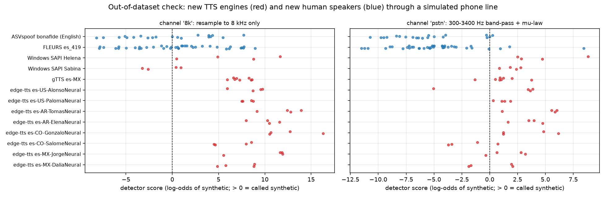
*Detector scores of every out-of-dataset clip (red = synthetic engines, blue = human speakers). Left: resample only. Right: through a simulated PSTN line.*


### Reading the result

- **The evidence transfers.** On engines and speakers it never saw, through a simulated phone line, the model reaches 88.0% accuracy and AUC 0.945. Every Windows voice, Google TTS and 6 of 8 Edge neural voices are caught; 90% of the Spanish speakers and 80% of the English speakers are accepted. This is real synthetic-speech evidence, not only the dataset's pipeline.
- **The threshold depends on the channel.** With resampling only (no band limit) the same model flags half of the clean human recordings as synthetic while still catching every neural voice: clean, noise-free audio *looks synthetic* to it, because in the training data the synthetic callers were the clean ones and the humans were on real, noisy lines. The ranking (AUC 0.90) survives; the 0.5 cut-off does not.
- **So the honest number is not 100%.** 100% is what happens on this dataset's own pipeline. On genuinely new voices and lines, expect roughly **85-90% with a fixed threshold**, and a ranking quality of AUC 0.90-0.95. The judges test 'unseen speakers, engines and call conditions': this is the number to say out loud.
- **Caveats.** 108 clips; a simulated line, not a real one; read sentences, not conversation; the neural-TTS clips passed through MP3 (a cue of its own). Indicative, not definitive - but it is the only measurement here that does not share the dataset's pipeline.

> **KEY RESULT - Verdict**
>
> Not memorisation, not a leak - but also not 100%. The model learned something about synthetic speech that carries to new engines (AUC ~0.95 off-pipeline), *plus* a preference for 'clean audio = synthetic' inherited from how this dataset was recorded. The behavioural branch, which ignores the audio path entirely, is the natural fix for the second part.


## Part 9 - Shortcuts

Our ASVspoof project found that file duration and silence alone reached 17% EER on an academic benchmark - a classifier that knows nothing about voices. We repeated the exercise here with per-call statistics that contain **no voice content**: durations, turn counts, silences, loudness, bandwidth and conversation timing, in logistic regression and a small gradient-boosting model (trained on train, scored on validation).

| Feature set | Features | Model | **Val accuracy** | Bal. acc. | AUC | EER | Train AUC |
|---|---|---|---|---|---|---|---|
| all_trivial | 24 | gbm | **98.6%** | 98.5% | 0.996 | 2.8% | 1.000 |
| all_trivial | 24 | logreg | **98.6%** | 98.5% | 1.000 | 0.0% | 1.000 |
| bandwidth | 3 | gbm | **67.6%** | 67.2% | 0.765 | 32.4% | 0.996 |
| bandwidth | 3 | logreg | **90.1%** | 90.5% | 0.971 | 8.5% | 0.962 |
| behavioural | 6 | gbm | **85.9%** | 86.1% | 0.936 | 14.1% | 0.999 |
| behavioural | 6 | logreg | **88.7%** | 89.0% | 0.934 | 11.3% | 0.950 |
| duration+silence | 3 | gbm | **85.9%** | 86.0% | 0.944 | 14.1% | 0.998 |
| duration+silence | 3 | logreg | **74.6%** | 74.8% | 0.885 | 21.1% | 0.939 |
| duration_only | 1 | gbm | **53.5%** | 54.9% | 0.581 | 49.3% | 0.801 |
| duration_only | 1 | logreg | **46.5%** | 46.6% | 0.517 | 49.3% | 0.531 |
| loudness | 7 | gbm | **91.5%** | 91.7% | 0.950 | 11.3% | 0.982 |
| loudness | 7 | logreg | **90.1%** | 89.9% | 0.957 | 8.5% | 0.899 |
| metadata | 9 | gbm | **88.7%** | 88.8% | 0.953 | 14.1% | 1.000 |
| metadata | 9 | logreg | **88.7%** | 88.7% | 0.952 | 11.3% | 0.983 |

*Shortcut models on trivial statistics (validation). None of these listens to the voice.*


*Left: which cues the all-features logistic regression uses. Right: AUC per family of cues.*

> **CAUTION - The dataset contains strong shortcuts**
>
> The best trivial model (all_trivial, logreg) reaches **validation AUC 1.000 and accuracy 98.6%** without hearing a single phoneme. Three cues carry most of it: the time until the caller first speaks (the AI pipeline answers only after the agent's greeting), the caller's loudness (the synthetic audio is injected ~6 dB hotter), and the 3.4 kHz band edge of the synthetic audio path.


### Which of them can the acoustic model use?

| Cue | Available to our acoustic model? | Why |
|---|---|---|
| time until the caller speaks, turn counts, response latency, overlap | **no** | the model only sees speech chunks; silence, timing and the agent channel never reach it |
| absolute loudness / peak level | **no** | every chunk is scaled to the same RMS before the backbone |
| noise floor and signal-to-noise ratio of the line | partly | RMS normalisation scales noise together with speech; a noisier line stays noisier |
| 3.4 kHz band edge, spectral tilt | **yes** | it is in the waveform; a frozen low-level layer certainly represents it |
| voice quality: prosody, harmonics, vocoder texture | **yes** | the acoustic evidence we actually want |


Why this matters for the hidden evaluation: the judges say the hidden calls come from 'callers and voices that appear in neither split' and stress robustness to unseen engines and call conditions. A cue tied to the recording pipeline (gain, band edge, pipeline latency) survives only if the hidden calls were produced by the same pipeline. Our design removes the cues we can remove without touching the voice (loudness, timing) and keeps the spectral ones, because separating 'codec path of the synthetic audio' from 'synthetic voice' is impossible with this dataset alone. The behavioural cues are not lost: they are the input of the future behavioural branch, where they belong.


## Part 10 - Fine-tuning

**Feature extraction** keeps the pretrained weights frozen and trains only a small classifier on top. **Fine-tuning** continues to train (part of) the backbone on our labels. It can learn task-specific features, but with 282 calls it can also erase pretrained knowledge (**catastrophic forgetting**) and memorise the training callers. Our ASVspoof project found that a partially fine-tuned WavLM generalised *worse* than frozen embeddings + MLP, so fine-tuning is the last experiment here, run once, on the winner only, conservatively:

- backbone truncated after the chosen layer (deeper layers are unused); head = the frozen-trained MLP as a warm start
- phase 1: backbone frozen, head trained for 3 epochs on random crops (sanity check: should match the frozen result)
- phase 2: the last 4 kept transformer layers unfrozen with learning rate 1e-05 (100x below the head's), warm-up + linear decay, gradient clipping, early stopping (patience 3)
- the checkpoint with the best **validation** call-level AUC is kept; the same chunks, aggregation and metrics as the frozen pipeline

| Model | **Val accuracy** | Bal. acc. | F1 | AUC | EER | Brier |
|---|---|---|---|---|---|---|
| frozen Wav2Vec2 Spanish (VoxPopuli) + MLP | **100.0%** | 100.0% | 1.000 | 1.000 | 0.0% | 0.000 |
| fine-tuned Wav2Vec2 Spanish (VoxPopuli) (best epoch 4) | **100.0%** | 100.0% | 1.000 | 1.000 | 0.0% | 0.000 |

*Frozen vs fine-tuned on validation. Fine-tuning ran 7 epochs in 5 min on a Runpod pod (NVIDIA L4); train accuracy of the fine-tuned model 100.0%.*


*Fine-tuning curves for Wav2Vec2 Spanish (VoxPopuli). Dotted: layers unfrozen; dashed grey: the frozen model's level.*

| Condition | frozen: AUC / accuracy | fine-tuned: AUC / accuracy |
|---|---|---|
| clean | 1.000 / 100.0% | 1.000 / 100.0% |
| gain_-12dB | 1.000 / 100.0% | 1.000 / 100.0% |
| lowpass_3400 | 1.000 / 100.0% | 1.000 / 100.0% |
| lowpass_3000 | 1.000 / 100.0% | 1.000 / 100.0% |
| pstn_300-3400 | 1.000 / 98.6% | 1.000 / 100.0% |
| white_snr20 | 1.000 / 97.2% | 1.000 / 94.4% |
| white_snr10 | 0.998 / 98.6% | 0.999 / 98.6% |
| pink_snr10 | 1.000 / 100.0% | 1.000 / 97.2% |
| mulaw_codec | 1.000 / 100.0% | 1.000 / 100.0% |
| reverb_0.3s | 1.000 / 88.7% | 1.000 / 88.7% |
| tilt_-3dB_oct | 0.999 / 88.7% | 0.998 / 91.5% |
| **mean over stressed conditions** | **1.000** | **1.000** |

*Frozen vs fine-tuned under the stress conditions of Part 6b (the clean split cannot separate them). Decision rule: mean stressed validation AUC (fine-tuned 0.9998 vs frozen 0.9998; fine-tuned must win by > 0.005).*

> **KEY RESULT - Result**
>
> Fine-tuning did **not** beat the frozen model (clean validation is a tie at 100%; under stress the frozen model is at least as robust), so the frozen model stays. This is a useful result: the frozen representation already contains the evidence, the extra capacity can only fit the training callers and the training pipeline's artefacts more tightly, and the deployment stays simpler: no backbone weights of our own to ship.


## Part 10b - Augmentation experiment (model-specific optimisation)

The stress test showed that under a channel change the score *ranking* survives (AUC stays close to 1) while the fixed p = 0.5 threshold does not (accuracy drops). A classifier that has only ever seen one line does not know how far a score may drift. The brief asked for augmentation to be treated as an experiment, after the baseline, and to make sure it does not destroy the artefacts we detect - so the design keeps two families of perturbations apart:

- **Seen** families, used to perturb the training chunks: gain -12 dB, white noise 20 / 10 dB, pink noise 10 dB, mu-law codec.
- **Unseen** families, never used in training: low-pass 3.4 / 3.0 kHz, PSTN band-pass, reverberation, spectral tilt.
- Same backbone, layer, MLP, optimiser, seed and early-stopping rule; the only change is the training set (clean chunks + one perturbed copy per seen family). Evaluated on the cached validation stress embeddings.

| Condition | Family | Baseline MLP: AUC / accuracy | Augmented MLP: AUC / accuracy |
|---|---|---|---|
| clean | clean | 1.000 / 100.0% | 1.000 / 100.0% |
| gain_-12dB | seen | 1.000 / 100.0% | 1.000 / 100.0% |
| lowpass_3400 | **unseen** | 1.000 / 100.0% | 1.000 / 100.0% |
| lowpass_3000 | **unseen** | 1.000 / 100.0% | 1.000 / 100.0% |
| pstn_300-3400 | **unseen** | 1.000 / 98.6% | 1.000 / 97.2% |
| white_snr20 | seen | 1.000 / 95.8% | 1.000 / 100.0% |
| white_snr10 | seen | 0.998 / 98.6% | 0.999 / 98.6% |
| pink_snr10 | seen | 1.000 / 100.0% | 1.000 / 98.6% |
| mulaw_codec | seen | 1.000 / 100.0% | 1.000 / 100.0% |
| reverb_0.3s | **unseen** | 1.000 / 88.7% | 1.000 / 76.1% |
| tilt_-3dB_oct | **unseen** | 0.999 / 90.1% | 1.000 / 95.8% |
| mean over seen families |  | 1.000 / 98.9% | 1.000 / 99.4% |
| **mean over unseen families** |  | 1.000 / 95.5% | 1.000 / 93.8% |
| mean over all stressed |  | 1.000 / 97.2% | 1.000 / 96.6% |

*Wav2Vec2 Spanish (VoxPopuli) layer 5: the same MLP trained on 4,102 clean chunks vs 20,095 clean + perturbed chunks, scored on validation under every condition.*

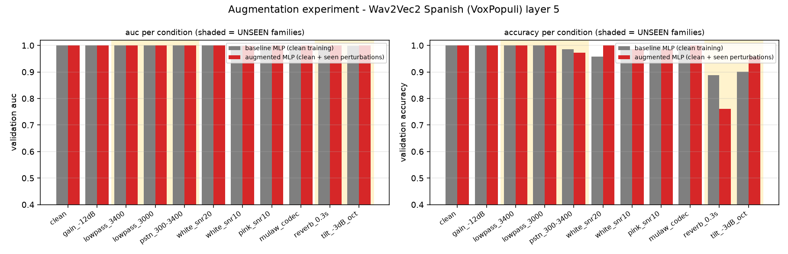
*Baseline vs augmented MLP per condition; shaded columns are the unseen families.*

> **NOTE - Result**
>
> The augmented head does not beat the baseline on the **unseen** families (mean AUC 1.000 vs 1.000, accuracy 93.8% vs 95.5%), so the baseline head stays. Augmentation with noise, gain and codec teaches robustness to noise, gain and codec - not to band limits or spectral tilt. Rule: augmented wins if its mean AUC on the UNSEEN families is higher by > 0.002 (or tied and accuracy higher by > 2 points) and clean accuracy does not drop.


## Part 11 - Production inference

```
POST /detect  {"audio": "<base64 of the stereo 8 kHz WAV>"}
  1. decode the WAV bytes                                    (soundfile)
  2. take channel 0 = caller                                 (channel 1 is ignored by the acoustic branch)
  3. energy VAD -> caller speech regions                     (15 dB above the 10th-percentile noise floor)
  4. cut regions into chunks <= 4 s, scale each to RMS -26 dB
  5. resample 8 kHz -> 16 kHz                                (polyphase; adds no information above 4 kHz)
  6. frozen backbone, truncated after the chosen layer -> mean over frames -> one vector per chunk
  7. MLP -> chunk log-odds
  8. mean over chunks -> call score -> Platt/temperature calibration -> p(synthetic)
  9. {"is_synthetic": p >= 0.5, "confidence": max(p, 1 - p)}
```

`predict.py` exposes the same pipeline as `predict_acoustic(call_wav) -> float` (path, bytes or base64) and the class `AcousticDetector` with per-stage timings; `server.py` wraps it in FastAPI. The server accepts the base64 field under several names, a raw base64 body or a multipart upload, and always answers with the required contract - if anything fails it returns `is_synthetic: false, confidence: 0.5` plus an error field rather than an HTTP error. `confidence` is the probability that the returned verdict is right (`config.CONFIDENCE_MODE`); switching it to p(synthetic) is one setting.

| Stage | Median per call (GPU) |
|---|---|
| decode + VAD + chunking + resampling | 27 ms |
| backbone (all chunks of the call) | 94 ms (7.6 ms per chunk) |
| classifier + aggregation | < 5 ms |
| **total** | **119 ms** (max 199 ms) |
| model load (once) | 0.8 s |
| total on CPU only | 0.85 s |

*Measured latency of the deployed model (Wav2Vec2 Spanish (VoxPopuli)) for whole ~150 s calls.*

A call is ~150 s long and contains ~40 s of caller speech; scoring it takes a fraction of a second, so the endpoint answers far inside the judges' window, and a streaming version could give a first verdict after the first few caller turns.


## Part 12 - The winning acoustic model

| BEST ACOUSTIC MODEL |  |
|---|---|
| Backbone | Wav2Vec2 Spanish (VoxPopuli) (`facebook/wav2vec2-base-es-voxpopuli-v2`), 94M parameters, frozen |
| Selected layer | 5 of 12 (chosen by validation AUC of the layer probe) |
| Classifier | MLP 768 -> 256 -> 2 (ReLU, dropout 0.3), 197,378 parameters, best epoch 3 |
| Segmentation | caller channel, energy VAD (15 dB above noise floor), chunks <= 4 s, RMS -26 dB, 16 kHz |
| Aggregation | mean of chunk log-odds, then platt scaling fitted on validation |
| Validation score (primary) | accuracy 100.0% (balanced 100.0%) at p = 0.5, 71 calls |
| EER | 0.0% |
| F1 | 1.000 |
| AUC | 1.000 |
| Off-pipeline check (Part 8c) | 88.0% accuracy / AUC 0.945 on 108 clips from unseen engines and speakers through a simulated PSTN line |
| Robustness (stress test) | mean AUC 1.000 / accuracy 97.2% over 10 perturbations; worst white_snr10 (AUC 0.998) |
| Calibration | Brier 0.020 raw -> 0.020 calibrated (out-of-fold), ECE 0.019 -> 0.015 |
| Inference latency | 119 ms per call on the GPU (median) |
| Model files | models/wav2vec2_spanish/ (mlp.pt, logreg.joblib, meta.json, calibration_mlp.json) + the Hugging Face backbone |
| Why we selected it | highest mean validation AUC under the 10 stress conditions (0.9998; stressed accuracy 0.972, worst condition white_snr10 AUC 0.998); clean validation accuracy 1.000 / AUC 1.0000 - the clean split is saturated for every backbone and cannot rank them; 3 model(s) within 0.005 -> tie-break by stressed accuracy, EER, latency |


Commands: `python src/predict.py path/to/call.wav` scores a file; `python src/server.py --port 8000` serves `POST /detect`.


## Part 13 - How the acoustic branch fits the complete product

```
                         CALL (stereo 8 kHz WAV, base64)
                          |
              +-----------+-----------+
              v           v           v
          ACOUSTIC    BEHAVIOURAL   SEMANTIC
       (this project)  (planned)    (planned)
       caller voice    turn timing, transcript of
       -> backbone     latency,     caller answers
       -> MLP          overlap,     -> LLM / rules
       -> p(synthetic) recovery     -> p(synthetic)
              |           |           |
              +-----------+-----------+
                          v
                       FUSION  (weighted average / small logistic regression on the branch scores)
                          v
              {"is_synthetic": bool, "confidence": float}
```

`server.py` already produces the verdict in one function, `score_call()`, and reports the acoustic probability under `details.branches.acoustic`. The behavioural branch will consume the agent channel and the turn structure (Part 2 shows that response latency, overlap and turn counts already separate the classes), the semantic branch the transcript. Fusion replaces the single-branch decision without changing the HTTP contract.

**What this project does not solve yet:** any behavioural or semantic signal, adversarial robustness (an attacker who post-processes the TTS audio), speaker-level analysis across calls, and streaming/real-time scoring while the call is still running (the pipeline scores chunks, so an early verdict after the first few caller turns is a small change).


## Glossary

| Term | Meaning |
|---|---|
| caller / agent channel | channel 0 / channel 1 of the stereo call; only the caller is classified |
| VAD | voice activity detection: finding where the caller speaks |
| chunk | a piece of at most 4 s of one caller speech region; the unit the backbone scores |
| backbone | the big pretrained speech model used frozen as a feature extractor |
| hidden layer / layer probe | the output of one transformer block; a probe trains a classifier on each to see what it contains |
| embedding | fixed-size vector summarising a chunk (mean over time of one hidden layer) |
| mean pooling | averaging the per-frame vectors over time |
| logistic regression / linear probe | the simplest classifier: weighted sum + sigmoid |
| MLP | small neural network: Linear -> ReLU -> Dropout -> Linear |
| log-odds / score | log(p / (1 - p)); 0 = 50/50, +3 = ~95% synthetic, -3 = ~95% human |
| aggregation | how chunk scores become one call score (mean by default) |
| accuracy (primary) | share of correct is_synthetic decisions |
| balanced accuracy | mean of the per-class recalls; immune to class imbalance |
| ROC AUC | probability that a random synthetic call scores above a random human call (1 = perfect ranking) |
| EER | error rate at the threshold where FAR = FRR (0 = perfect, 50% = coin flip) |
| FAR / FRR | synthetic accepted as human / human rejected as synthetic |
| Brier score / ECE | calibration: mean squared error of the probability / gap between confidence and accuracy |
| Platt / temperature scaling | 1-2 parameter re-mapping of the score into a calibrated probability |
| frozen | weights that are never updated (requires_grad = False) |
| fine-tuning | continuing to train (part of) the backbone on our labels |
| overfitting | the model memorises the training set; validation stops improving while training keeps improving |
| shortcut | a trivial cue (loudness, silence, duration) that separates the classes without any voice evidence |
| speaker-disjoint split | no caller appears in both train and validation; the hidden test set has new callers and voices |

