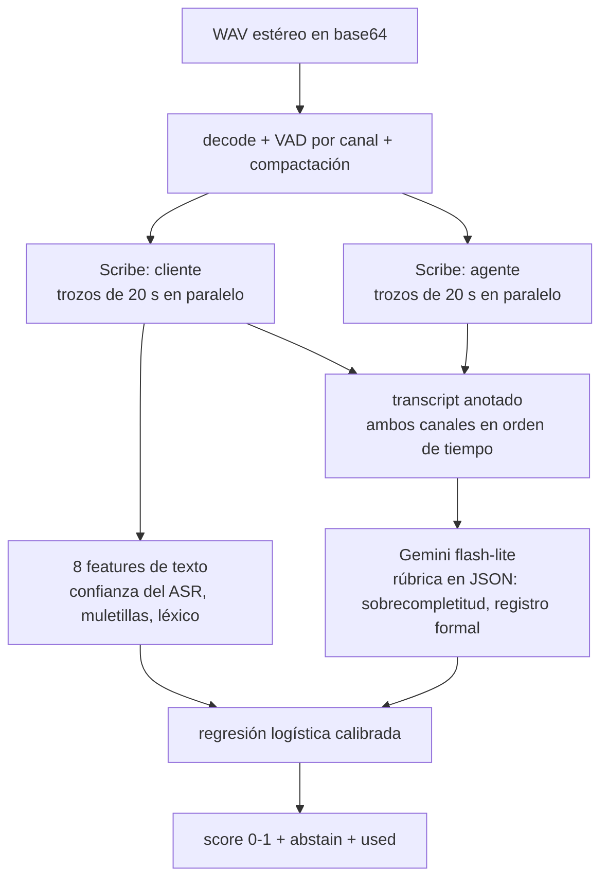
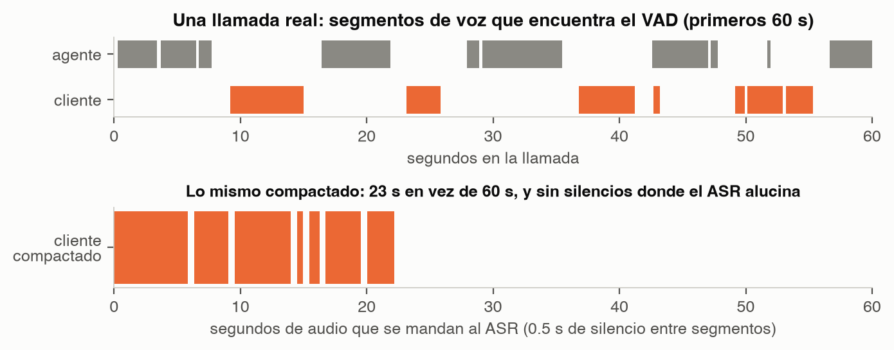
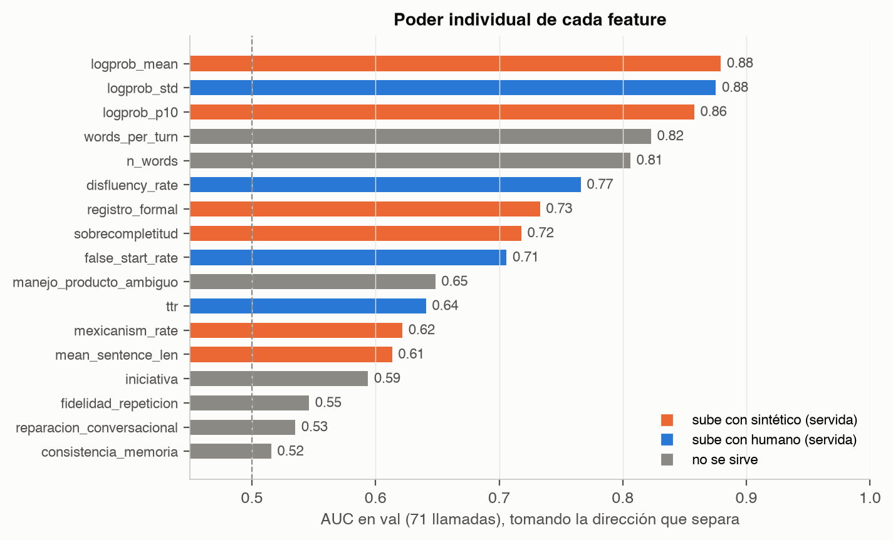
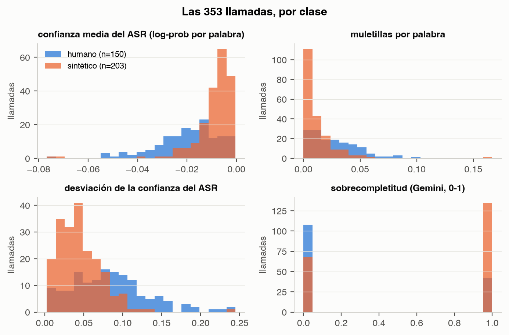
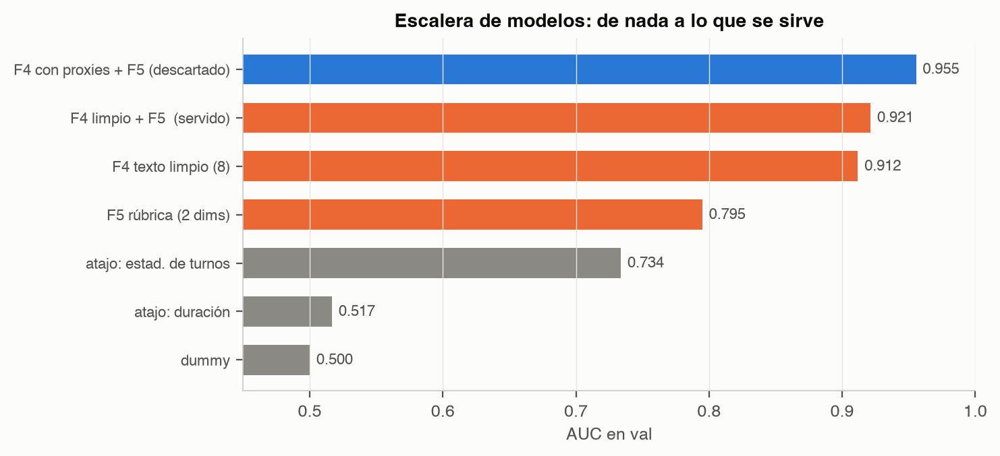
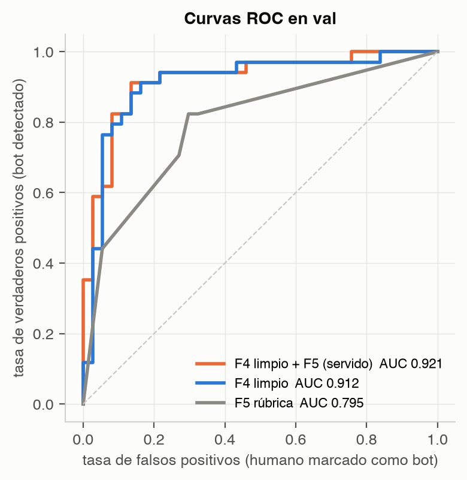
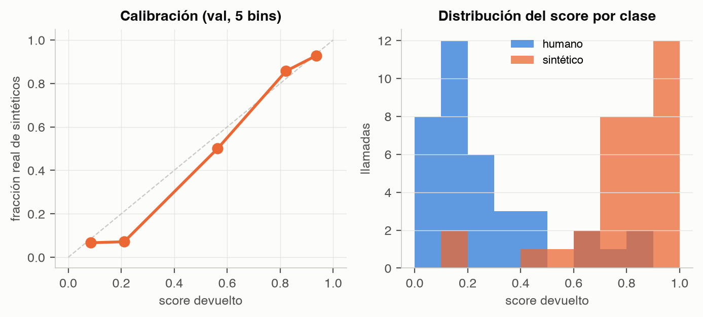
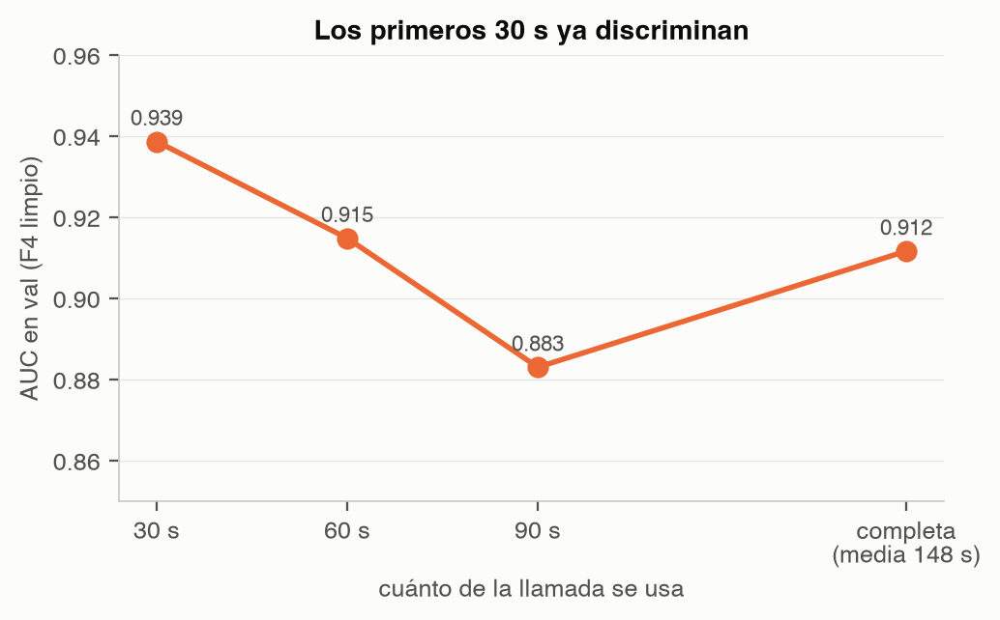
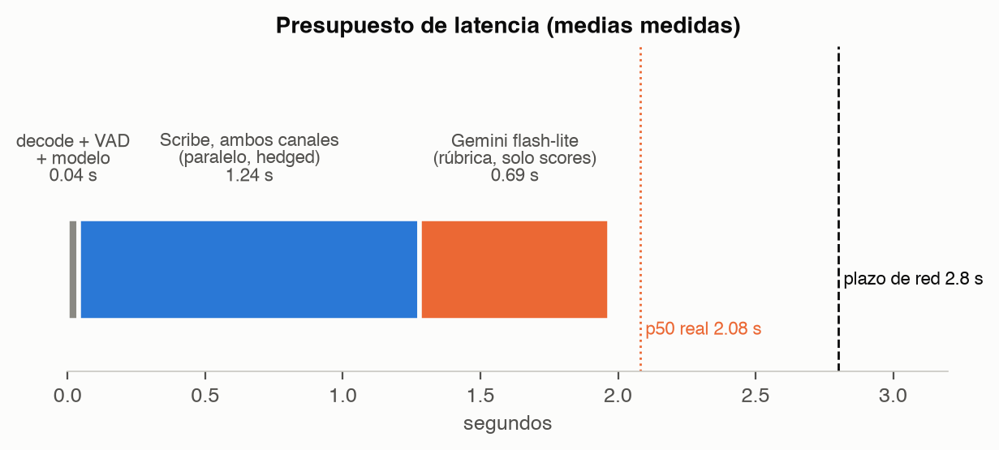

# Módulo semántico: guía de estudio

## Resumen en una página

**Qué hace.** Recibe una llamada telefónica (WAV estéreo, 8 kHz: canal 0 el que llama, canal 1 el agente
del banco) y devuelve un número entre 0 y 1: la probabilidad de que quien llama sea un sistema de IA y no
una persona. Lo hace mirando *qué dice* el llamante y *cómo lo dice en palabras*, no cómo suena su voz.

**Para qué existe.** El sistema completo tiene tres detectores independientes: acústico (la voz), de
comportamiento (los tiempos de la conversación) y semántico (este). Un backend combina los tres. Cada
uno tiene que aportar una señal distinta; si dos miden lo mismo, la fusión cuenta esa señal dos veces.

**Qué señal usa.** Diez números por llamada:

- 8 features de texto sacadas de la transcripción del cliente. Las más fuertes son la *confianza del
  reconocedor de voz* (un TTS se transcribe con más seguridad que una persona por teléfono) y la
  *densidad de muletillas* ("este", "eh", "o sea").
- 2 scores de una rúbrica que llena Gemini leyendo la conversación: *sobrecompletitud* (¿entregó datos
  que aún no le pedían?) y *registro formal* (¿habla como un asistente?).

Una regresión logística calibrada convierte esos diez números en la probabilidad final.

**Resultado.** En las 71 llamadas de validación (hablantes que el modelo nunca vio): AUC 0.921, 88.7 %
de acierto, y un score calibrado (cuando dice 0.8, el 80 % de esas llamadas son sintéticas). Responde
en 2.1 s de mediana, nunca más de 3 s, y nunca se queda sin contestar.

**Limitación principal.** La señal más fuerte depende del reconocedor de voz y del motor de voz del
atacante. Un TTS nuevo, más natural, puede parecer "humano" para el ASR. Por eso este módulo no decide
solo: es una de tres opiniones.

---

# 1. El reto y los tres módulos

El reto de Altur en HackMTY 2026: dado el audio de una llamada al banco, decidir si el llamante es una
persona o un agente autónomo (reconocimiento de voz + LLM + voz sintética) que marcó al mismo número.

| módulo | pregunta que responde | ejemplo de pista |
|---|---|---|
| acústico | ¿cómo suena la voz? | artefactos del vocoder, respiración, prosodia |
| comportamiento | ¿cómo se mueve en la conversación? | cuánto tarda en responder, cómo reacciona a una interrupción |
| **semántico (este)** | ¿qué dice y cómo lo dice en palabras? | entrega todo de un jalón, no dice "mande", cero muletillas |

**Regla de independencia.** Este módulo no puede usar estadísticas de turnos (cuántos turnos, cuánto
duran, cuánto tarda en responder). Eso es del módulo de comportamiento. Al principio lo hacíamos sin
querer: la feature `words_per_turn` era casi idéntica a la longitud media de turno (correlación 0.94).
La auditoría lo detectó y la quitamos, aunque bajara nuestro número en solitario. Ver §9.

# 2. Los datos

- 353 llamadas, 14.5 horas, duración media 148 s. Español mexicano, grabaciones telefónicas.
- `manifest.csv`: id anónimo, etiqueta (`human` / `synthetic`), split (`train` / `val`), duración.
- `audio/<id>.wav`: estéreo, 8 kHz, 16 bits. Canal 0 el llamante (el que se clasifica), canal 1 el agente.
- `turns/<id>.json`: segmentos de voz por canal, generados automáticamente. Sirven para desarrollar; el
  endpoint final solo recibe audio.

| split | humanas | sintéticas | total |
|---|--:|--:|--:|
| train | 113 | 169 | 282 |
| val | 37 | 34 | 71 |

Los splits son **speaker-disjoint**: ningún hablante está en los dos. Por eso val mide de verdad si el
modelo generaliza a gente nueva, y por eso nunca mezclamos los dos ni hacemos validación cruzada
aleatoria. Hay además un set escondido de los jueces con motores y hablantes nuevos.

Dos cosas del dataset que hay que saber de memoria:

- **La duración no discrimina.** Humanas 149.9 s, sintéticas 146.5 s. Está balanceado a propósito.
- **Los humanos usan datos inventados** (nombre, referencia, montos). Se les dijo que era una prueba.
  Por eso "se contradice con lo que dijo antes" no sirve como pista: ambos grupos son consistentes.

# 3. La hipótesis

La observación de arranque, medida sobre las 353 llamadas: el humano contesta a pedazos y la agente le
tiene que ir sacando la información; el bot entrega respuestas completas y organizadas. Ejemplo real de
un primer turno sintético, 20 segundos seguidos:

> "Mire, le llamo porque tengo un pago pendiente con ustedes, vence el diez de septiembre, pero la verdad
> no me va a alcanzar para pagarlo ahorita. Quisiera saber si hay forma de pagar unos días después..."

El humano en la misma posición dice "me hicieron un cobro dos veces" y ya.

Esa *sobrecompletitud* tiene dos caras: una temporal (pocos turnos, más largos) que mide el módulo de
comportamiento, y una semántica (dio datos que nadie le había pedido) que medimos aquí desde el texto.

Otras hipótesis que probamos, con su resultado:

| hipótesis | resultado en val | veredicto |
|---|---|---|
| el TTS se transcribe con más confianza que la voz humana por teléfono | AUC 0.88 | la más fuerte |
| los humanos usan muletillas, los bots no | AUC 0.77 | fuerte |
| los humanos se cortan a media palabra ("el--") | AUC 0.71 | útil |
| el bot entrega información antes de que se la pidan | AUC 0.72 | útil |
| el bot habla en registro formal de asistente | AUC 0.73 | útil |
| los mexicanos dicen "mande", el bot dice "¿perdón?" | AUC 0.62 | débil |
| el bot detecta el dígito cambiado en la trampa de la referencia | AUC 0.45 | no sirve: el humano también lo detecta |
| el bot acepta un producto que no existe ("nómina plus") | AUC 0.35 | no sirve, y al revés de lo esperado |
| el bot es consistente con sus datos, el humano se trabuca | AUC 0.48 | no sirve: los datos son inventados en ambos |

Lección: **no creerle al brief**. Las dos "trampas" del guion sonaban a bala de plata y no discriminan.
Lo que sí discrimina es más aburrido: cómo transcribe el ASR y cuántas muletillas hay.

# 4. Del audio al score



Paso a paso, con los archivos:

1. **Decodificar** (`server.py`). Base64 a WAV a dos vectores de números en [-1, 1]. 14 ms.
2. **VAD** (`vad.py`). *Voice Activity Detection*: encontrar dónde hay voz en cada canal. Es un detector
   de energía: ventanas de 25 ms, umbral = piso de ruido + 12 dB, cerrar huecos < 250 ms, tirar
   segmentos < 150 ms. Reproduce los `turns.json` del organizador con 50 ms de error mediano. 17 ms.
3. **Compactar** (`vad.py`). Concatenar solo los segmentos con voz, con 0.5 s de silencio entre ellos,
   guardando un mapa para devolver cada palabra a su tiempo original. Dos razones: el cliente pasa de
   148 s a ~49 s de audio (menos que mandar), y el ASR **alucina en los silencios largos** (entra en
   bucles repitiendo frases). Esto lo comprobamos: sin compactar, no funciona.

{width=full}

4. **Transcribir** (`asr.py`). ElevenLabs Scribe (`scribe_v1`), español, timestamps y confianza por palabra. El
   audio compactado se parte en trozos de ~20 s (cortando siempre entre segmentos, nunca dentro de una
   palabra) y los trozos se mandan en paralelo: la latencia es la del trozo más lento, no la suma.
   Ambos canales se transcriben. ~1.2 s.
5. **Features de texto** (`features.py`). 8 números del transcript del cliente. Sin red, < 1 ms.
6. **Transcript anotado** (`asr.py`). Se intercalan las palabras de ambos canales en orden de tiempo,
   con marcas `[AGENTE 1:33]`, `[CLIENTE 1:39]` y `[silencio 2.8s]`. Es lo que lee Gemini.
7. **Rúbrica** (`rubric.py`). Una sola llamada a Gemini 3.5 flash-lite con salida JSON obligatoria
   (esquema fijo): 7 dimensiones con score 0-1. El modelo final usa 2. ~0.7 s.
8. **Modelo** (`model.py`). Regresión logística sobre los 10 números, con calibración Platt. < 1 ms.

# 5. Cada feature, explicada

Todas se calculan sobre las palabras del cliente que devolvió Scribe. `n` = número de palabras.

| feature | definición | unidad | por qué ayudaría | cómo puede fallar |
|---|---|---|---|---|
| `logprob_mean` | media del log-probabilidad que Scribe asigna a cada palabra | log-prob (≤ 0) | un TTS es "limpio": el ASR está más seguro; la voz humana por teléfono a 8 kHz baja la confianza | un TTS nuevo y más natural, o un humano con buen micrófono |
| `logprob_std` | desviación estándar de lo anterior | log-prob | el humano alterna palabras claras y balbuceos; el bot es parejo | igual que arriba |
| `logprob_p10` | percentil 10 de la confianza | log-prob | "las peores palabras": el humano tiene tramos muy dudosos | igual |
| `disfluency_rate` | muletillas ("este", "eh", "o sea", "pues"...) entre n | fracción | el LLM no genera muletillas salvo que se lo pidan | un agente entrenado para meterlas; un humano muy formal |
| `mexicanism_rate` | "mande", "ahorita", "órale", "checar"... entre n | fracción | el LLM tiende al español neutro | débil (AUC 0.62); un LLM con prompt mexicano |
| `false_start_rate` | palabras que Scribe marca cortadas ("el--") entre n | fracción | los humanos se arrancan y se corrigen | depende de que el ASR marque los cortes |
| `ttr` | *type-token ratio*: palabras distintas / n | fracción | vocabulario repetido vs variado | depende mucho de n |
| `mean_sentence_len` | n / número de oraciones (por puntuación del ASR) | palabras | el bot arma oraciones largas y completas | correlaciona 0.5 con la longitud de turno; se vigila |
| `sobrecompletitud` | Gemini: ¿entregó información que aún no le pedían? | 0-1 | la estrella del brief, cara semántica | un humano organizado que llama con todo preparado |
| `registro_formal` | Gemini: cortesía excesiva, frases bien formadas, cero coloquialismos | 0-1 | estructura de asistente | un humano formal; un bot con prompt "coloquial" |

Descartadas y por qué:

- `words_per_turn`, `n_words`: correlación 0.94 y 0.62 con la longitud media de turno. Es señal del
  módulo de comportamiento. Solas daban AUC 0.84; sin ellas el módulo baja de 0.955 a 0.921 pero deja
  de duplicar señal en la fusión.
- 5 dimensiones de la rúbrica (`reparacion_conversacional`, `iniciativa`, `manejo_producto_ambiguo`,
  `fidelidad_repeticion`, `consistencia_memoria`): AUC entre 0.35 y 0.59. Se siguen pidiendo en el
  prompt (así el LLM lee la llamada completa) pero el modelo las ignora.

{width=full}

{width=full}

**Cada feature lleva una bandera `_observado`** para las de Gemini: si Gemini no respondió a tiempo,
el score entra como 0.5 y la bandera en 0. Así el modelo distingue "salió neutral" de "no lo sé".

# 6. La rúbrica con Gemini: cómo y por qué así

- **Gemini no decide.** Emite features (scores por dimensión). Quien decide es la regresión logística
  entrenada con nuestras etiquetas. El prior de un LLM sobre "qué suena a IA" no está calibrado a este
  dataset; nuestras 282 llamadas de train sí.
- **Nunca ve la etiqueta** ni se le pregunta "¿es IA?". Se le pide observar cosas concretas del texto.
- **Salida estructurada** (`responseSchema`): JSON válido garantizado, sin parseo frágil.
- **Una sola llamada por conversación**, no una por trampa: menos latencia y ve todo el contexto.
- **Sin citas.** Probamos pedir evidencia textual: sube la salida de ~40 a ~270 tokens, suma 0.4 s y
  *baja* la AUC de la rúbrica (0.78 vs 0.83). Apagado por defecto.
- **`thinkingLevel: minimal`**. Con razonamiento por defecto, la misma llamada tarda 4.5 s.
- **Todo cacheado** en `cache/gemini/<id>_<modelo>_<hash del prompt>.json`. Cambiar el prompt cambia
  el hash y obliga a regenerar: nunca se entrena con un prompt e infiere con otro.
- Probamos gemini-3.6-flash: mismas AUC por dimensión, el doble de latencia. Se queda flash-lite.

# 7. Fundamentos de ML, con este proyecto de ejemplo

- **Feature.** Un número que describe una llamada. `disfluency_rate = 0.026` significa 2.6 muletillas
  por cada 100 palabras.
- **Etiqueta.** Lo que queremos predecir: `human` o `synthetic`. Clase positiva = sintético.
- **Clasificador.** Una función de las features a una probabilidad. Usamos regresión logística: cada
  feature tiene un peso, se suman, y una sigmoide convierte la suma en un número entre 0 y 1.
- **Entrenar.** Buscar los pesos que mejor separan las 282 llamadas de train. `class_weight="balanced"`
  porque train tiene 60 % sintéticas y val 50 %: sin eso el modelo aprendería el desbalance.
- **Inferir.** Aplicar los pesos a una llamada nueva.
- **Umbral.** Score ≥ 0.5 es "sintético". Mover el umbral cambia falsos positivos por falsos negativos.
- **Train / val / test escondido.** Se aprende en train, se toman decisiones (qué features, qué modelo)
  mirando val, y los jueces evalúan en un set que nadie ha visto. Val no es el examen final: si lo
  miramos mil veces para ajustar detalles, se convierte en un segundo train.
- **Sobreajuste.** El modelo memoriza train y falla en val. Se ve como AUC alta en train y baja en val.
  Aquí no pasa: 0.908 en train, 0.921 en val (val es más fácil por su balance 50/50).
- **Subajuste.** Malo en los dos. La rúbrica sola está cerca de eso (0.73 / 0.80).
- **Fuga (leakage).** Cuando una feature contiene información que no debería: la etiqueta, el nombre
  del archivo, o algo que solo funciona en este dataset. Auditamos duración, silencio, metadatos y
  turnos (§9).
- **Generalización.** Que funcione con hablantes y motores nuevos. Los splits speaker-disjoint son la
  única medida honesta que tenemos.
- **AUC.** Área bajo la curva ROC: probabilidad de que una llamada sintética al azar reciba un score
  mayor que una humana al azar. 0.5 es tirar una moneda, 1.0 es perfecto. No depende del umbral.
- **Calibración.** Que un score de 0.8 signifique de verdad "80 % de probabilidad". Un clasificador
  puede ordenar bien (AUC alta) y estar mal calibrado (siempre dice 0.99). Como el score se fusiona con
  otros dos, esto importa: un módulo sobreconfiado domina la fusión.

# 8. El modelo y su calibración

Regresión logística sobre features estandarizadas (media 0, desviación 1, **ajustadas solo en train**),
con `CalibratedClassifierCV` (Platt, 5 pliegues) para que la salida sea una probabilidad.

{width=full}

{width=60%}

| configuración | AUC val | accuracy | bal. acc. | precisión / recall / F1 | Brier | FPR / FNR |
|---|--:|--:|--:|---|--:|---|
| dummy (clase mayoritaria) | 0.500 | 0.479 | 0.500 | — | — | 1.00 / 0.00 |
| F5 rúbrica (2 dims) | 0.795 | 0.761 | 0.763 | 0.72 / 0.82 / 0.77 | 0.192 | 0.30 / 0.18 |
| F4 texto limpio (8) | 0.912 | 0.859 | 0.861 | 0.82 / 0.91 / 0.86 | 0.126 | 0.19 / 0.09 |
| **F4 + F5 (servido)** | **0.921** | **0.887** | **0.888** | 0.86 / 0.91 / 0.89 | **0.106** | 0.14 / 0.09 |

Matriz de confusión del modelo servido en val (filas: real, columnas: predicho):

| | predicho humano | predicho sintético |
|---|--:|--:|
| **real humano (37)** | 32 | 5 |
| **real sintético (34)** | 3 | 31 |

En un banco: **falso positivo** = persona real tratada como bot (5 de 37, molestia al cliente).
**Falso negativo** = atacante que pasa como persona (3 de 34, el riesgo de seguridad). El umbral 0.5
es una elección; el backend puede moverlo según cuál error le duela más.

{width=full}

Gap medio de calibración 0.053: en cada bin, la fracción real de sintéticos está a ~5 puntos del score
prometido. El Brier (0.106) es el error cuadrático medio de la probabilidad; 0.25 sería tirar una moneda.

# 9. Auditoría de atajos y fugas

Un número alto no prueba que el modelo aprendió lo que creemos. Por eso la escalera empieza en cero:

| atajo | AUC val | conclusión |
|---|--:|---|
| duración de la llamada | 0.517 | no hay fuga por duración; el dataset está balanceado |
| segundos de voz del cliente | 0.451 | tampoco |
| estadísticas de turnos (n, media, share del más largo) | 0.734 | **sí discrimina, y es del módulo de comportamiento** |
| nuestras 8 features de texto | 0.912 | muy por encima de los atajos |

Correlación de nuestras features con las estadísticas de turnos (las que el módulo vecino usará):

| feature | r con longitud media de turno | decisión |
|---|--:|---|
| `words_per_turn` | 0.94 | eliminada |
| `n_words` | 0.62 | eliminada |
| `mean_sentence_len` | 0.51 | se queda, es contenido (puntuación), AUC propia 0.61 |
| todas las demás | ≤ 0.35 | limpias |

Otras fugas descartadas por construcción: el modelo nunca ve nombre de archivo, id, split ni etiqueta;
el escalador y la calibración se ajustan solo con train; el VAD no usa etiquetas.

**Fuga acústica.** Las tres features de `logprob` son, estrictamente, una medida de qué tan fácil le
resulta al ASR entender la voz. Eso tiene un pie en lo acústico. Lo declaramos: es la señal más fuerte
del módulo y la que más puede solaparse con el detector acústico. El backend debería medir la
correlación entre los scores de los módulos antes de fijar pesos.

# 10. Ablación: qué aporta cada familia

Se quita una familia del modelo servido y se mide qué se pierde:

| se quita | AUC | accuracy | lectura |
|---|--:|--:|---|
| nada (modelo servido) | 0.921 | 0.887 | |
| confianza del ASR (3) | 0.882 | 0.831 | la familia más importante |
| estilo y léxico (5) | 0.918 | 0.775 | la AUC casi no cae pero la accuracy sí: aporta calibración |
| rúbrica Gemini (2) | 0.912 | 0.859 | suma 0.01 de AUC y 0.03 de accuracy |

Familias solas: confianza del ASR 0.882, estilo y léxico 0.863, rúbrica 0.795.

Conclusión honesta: Gemini aporta poco en AUC. Se queda porque mejora accuracy y calibración, porque es
la única parte que mide *contenido* de verdad (y por tanto la más independiente del módulo acústico),
y porque su costo en latencia cabe. Si hubiera que quitar algo por presupuesto, se quita Gemini y el
módulo sigue en 0.912.

# 11. ¿Hace falta la llamada completa?

Mismo modelo de texto, entrenado y evaluado con solo los primeros N segundos del cliente:

{width=70%}

Los primeros 30 s bastan y hasta son mejores (0.937 frente a 0.912). Tiene sentido: en la apertura
es donde más se nota la diferencia entre "me hicieron un cobro dos veces" y el párrafo completo del bot.
No se cambió el servicio porque la rúbrica necesita la llamada entera, pero es una degradación válida
si el presupuesto se aprieta: transcribir solo 60 s del cliente.

# 12. Errores: quién se equivoca y por qué

Los 8 errores de val, ordenados por gravedad:

| llamada | real | score | pistas |
|---|---|--:|---|
| call_743448b8a861 | sintético | 0.10 | ASR poco seguro (−0.022), cero muletillas, entregó todo |
| call_5e4539a471f6 | sintético | 0.20 | 6 % de muletillas, no entregó de más: un bot "sucio" |
| call_0294f969f98b | sintético | 0.42 | casi en el umbral |
| call_fa26d1186721 | humano | 0.90 | ASR muy seguro (−0.003), cero muletillas, entregó todo de un jalón |
| call_e9bd33cdb226 | humano | 0.81 | formal y sobrecompleto |
| call_1c1c0cce9fb5 | humano | 0.78 | igual |
| call_9bb847dfc83e | humano | 0.69 | |
| call_6971b2685c1d | humano | 0.67 | |

Patrón: **los falsos positivos son humanos que hablan como asistentes** (claro, sin muletillas, con
todo preparado). **Los falsos negativos son bots con voz "sucia" o con muletillas.** El módulo mide
"habla como asistente", y algunas personas hablan así. Es exactamente el caso que el módulo acústico y
el de comportamiento deberían rescatar.

# 13. Latencia: el problema difícil

El contrato pedía < 2.5 s; el equipo lo subió a 2.8 s de red y 3.0 s de corte duro. Lo que se midió:

{width=full}

| etapa | media | notas |
|---|--:|---|
| decode + VAD + compactación | 0.03 s | sin red |
| Scribe, ambos canales, trozos de 20 s en paralelo | 1.24 s | p50 ≈ 1.0 s por petición, fijo, no depende del largo |
| Gemini flash-lite, rúbrica solo scores | 0.69 s | con citas sería 1.1 s; con thinking 4.5 s |
| modelo + JSON | < 0.01 s | |

Por HTTP real, 71 llamadas de val: **p50 2.08 s, p95 2.83 s, máximo 2.84 s**. 66 llegaron por el
camino completo, 5 solo con texto, 0 abstenciones. La llamada más larga del dataset (273 s, 11.7 MB en
base64) responde en 2.7 s.

Tres decisiones que hicieron que quepa:

1. **Trocear y paralelizar** el audio compactado. Latencia = la del trozo más lento.
2. **Hedging.** Scribe tiene una cola aleatoria: ~8 % de peticiones tardan 1.7-2.5 s sin relación con el
   largo. Toda petición que sigue pendiente a 1.1 s se duplica y gana la primera. Cuesta ~15 % más de
   audio facturado y elimina las abstenciones.
3. **Degradar, no fallar.** El servicio intenta `f4+f5`; si Gemini o el canal del agente no llegan a
   tiempo, responde con `f4` (solo texto, AUC 0.912); solo si el ASR del cliente falla responde 0.5 con
   `abstain: true`. Nunca cuelga, nunca se pasa del corte.

Dos bugs de latencia que valen como lección:

- El timeout exterior y el interior vencían en el mismo instante y ganaba el exterior: abstención en vez
  de degradar. Solución: plazo de red 2.8 s, corte exterior 3.0 s.
- Los canales se esperaban juntos: si el agente tardaba, se perdía también el cliente. Ahora el cliente
  se espera primero y el agente solo si queda tiempo.

# 14. El servicio y su contrato

```
POST /detect     {"audio": "<WAV estéreo 8 kHz en base64>"}
→ {"is_synthetic": true, "confidence": 0.91, "score": 0.91, "abstain": false, "reason": "", "used": "f4+f5", "ms": 2080}
GET  /health     → config, procedencia del modelo, llaves presentes
```

- `score` (= `confidence`): P(llamante sintético), calibrada. 0.5 con `abstain: true` significa "no tengo
  información", no "creo que es 50/50". El backend no debe promediarlo como opinión. `is_synthetic` es `score >= 0.5`.
- `used`: qué camino alcanzó (`f4+f5`, `f4`, `abstain`) y `reason` por qué (`no_speech`, `asr_error`, `degraded`).
- Entrada inválida (mono, 16 kHz, no WAV) es un 400 con el formato esperado, no una abstención: el backend
  distingue "me mandaste mal el audio" de "no pude analizarlo".
- Sin estado global mutable: corre con varios workers. Modelo y sesiones HTTP (keep-alive hacia
  ElevenLabs y Google) se crean una vez al arranque.
- `scores_semantico.csv` (`anon_id, score`) para las 353 llamadas: con esto el backend aprende pesos de
  fusión en vez de promediar a ciegas. Filas de train son predicción out-of-fold; filas de val vienen del
  modelo entrenado en train.

Servicios externos: el audio de ambos canales sale a ElevenLabs y el texto a Google. Llaves en `.env`,
nunca en el repo. Modelos fijados: `scribe_v1`, `gemini-3.5-flash-lite`, prompt identificado por hash.

# 15. Lo que descubrimos que el plan tenía mal

Vale la pena contarlo porque es el método, no solo el resultado:

- **"El audio del agente es reutilizado, no hace falta transcribirlo."** Falso. Medimos la correlación
  de la forma de onda del saludo entre llamadas: r = 0.09-0.18 (idéntico sería ~1). El TTS de "Marina"
  se regenera cada vez. La fase de *template matching* del plan murió ahí, después de probar correlación
  espectral (7 de 29 anclas correctas) y DTW (localiza el saludo pero con margen mínimo).
- **"El guion es fijo palabra por palabra."** Solo el saludo. El resto lo redacta un LLM y las trampas
  no aparecen en todas las llamadas. Consecuencia: transcribimos también al agente.
- **"Las trampas del guion son la clave."** No discriminan (AUC 0.35-0.47). El bot moderno detecta el
  dígito cambiado igual que el humano.

# 16. Limitaciones

- 353 llamadas es poco. Val son 71: cada error mueve la accuracy 1.4 puntos.
- La señal más fuerte (confianza del ASR) depende de Scribe (v1) y del TTS del atacante. Motores nuevos
  en el set escondido pueden moverla en cualquier dirección.
- Un agente con prompt "habla coloquial, mete muletillas, responde solo lo que te preguntan" imita casi
  todo lo que medimos. Este módulo detecta al bot descuidado, no al bot adversarial. Por eso hay tres.
- Depende de dos APIs externas y de la red. Sin red, abstiene.
- Un humano formal y preparado se parece a un bot. Los 5 falsos positivos de val son eso.
- La validación cruzada de train (para el CSV) es aleatoria porque no hay ids de hablante: puede haber
  fuga de hablante dentro de train, así que esos scores son ligeramente optimistas.

# 17. Cómo explicarlo en dos minutos

"Nuestro módulo mira *qué dice* el llamante. Transcribimos su voz con Scribe, y de la transcripción
sacamos ocho números: qué tan seguro estaba el reconocedor de cada palabra, cuántas muletillas hay,
si se corta a media palabra, cuánto vocabulario usa. Luego Gemini lee la conversación completa y
puntúa dos cosas: si entregó información que nadie le había pedido y si habla como un asistente. Una
regresión logística, entrenada con las 282 llamadas de train, convierte esos diez números en una
probabilidad calibrada. En validación, con hablantes nunca vistos, acierta el 89 % con AUC 0.92, y
responde en dos segundos. Auditamos que no esté usando atajos: la duración no separa nada, y quitamos
dos features que en realidad medían turnos, que es el módulo de comportamiento. La limitación es que
un bot que hable coloquial nos engaña; por eso somos uno de tres detectores."

# 18. Preguntas que pueden hacer los jueces

**¿Cómo saben que no están aprendiendo la duración o el silencio?**
Lo medimos. Un modelo con solo la duración da AUC 0.52, con solo los segundos de voz 0.45. El dataset
está balanceado a propósito. Nuestras features dan 0.91.

**¿Por qué no una red neuronal?**
Con 282 ejemplos y 10 features, una regresión logística es lo correcto: no sobreajusta (train 0.908,
val 0.921), se calibra bien y cada peso se puede explicar. Más parámetros es una hipótesis, no una
mejora.

**¿Y si el agente atacante es muy bueno?**
Nos engaña. Un LLM con prompt coloquial y un TTS muy natural imita lo que medimos. Este módulo detecta
al bot descuidado. Los otros dos módulos miden cosas que ese bot no controla igual de fácil.

**¿Por qué Gemini si aporta solo 0.01 de AUC?**
Mejora la accuracy 3 puntos y la calibración, mide contenido de verdad (lo más independiente del
detector acústico), y cabe en el presupuesto. Y está la evidencia de que sin él seguimos en 0.912.

**¿Por qué necesitan los dos canales?**
El agente es un LLM y cambia lo que dice en cada llamada. Sin su texto, Gemini no sabe qué le
preguntaron al cliente, y "sobrecompletitud" es precisamente "contestó más de lo que le preguntaron".

**¿Cómo evitan fugas?**
Splits speaker-disjoint respetados, escalador y calibrador ajustados solo en train, el modelo nunca ve
id ni etiqueta, y una auditoría explícita de atajos en `AUDIT.md`. Además quitamos dos features que
correlacionaban 0.94 con estadísticas de turnos.

**¿En qué se diferencia del módulo acústico?**
El acústico mira la señal: espectro, vocoder, respiración. Nosotros miramos palabras. La zona gris es
la confianza del ASR, que depende en parte de cómo suena la voz; lo declaramos y recomendamos medir la
correlación entre módulos antes de fusionar.

**¿Por qué val no es el examen final?**
Los jueces tienen un set con motores y hablantes nuevos. Val nos dice si generalizamos a hablantes
nuevos con los mismos motores. Por eso tomamos pocas decisiones mirando val y ninguna mirando el test.

**¿Por qué un banco confiaría en este score?**
Porque está calibrado (cuando dice 0.8, el 80 % son bots), porque declara cuándo no sabe (`abstain`),
y porque nunca decide solo: es una de tres evidencias que un backend combina con pesos aprendidos.

**¿Qué cambiarían antes de producción?**
Un fallback local de ASR para no depender de la red, más datos con más motores de TTS, ids de hablante
en train para validación cruzada honesta, y medir la correlación real entre los tres módulos.

**¿Qué pasa si Gemini o Scribe se caen?**
Si Gemini no llega, respondemos con solo texto (0.912). Si Scribe no llega, respondemos 0.5 con
`abstain: true`. Nunca más de 3 s, nunca sin respuesta.

**¿Cuánto cuesta por llamada?**
Unos 2 minutos de audio a Scribe (con ~15 % extra por hedging) y ~1500 tokens de entrada a flash-lite.
Centavos.

# 19. Glosario

- **VAD.** Detección de actividad de voz: dónde hay voz y dónde silencio.
- **ASR / STT.** Reconocimiento automático de voz: audio a texto. Aquí, ElevenLabs Scribe (`scribe_v1`).
- **TTS.** Texto a voz: lo que usa el atacante para hablar.
- **log-prob.** Logaritmo de la probabilidad que el ASR asigna a una palabra. 0 es seguro; −0.05 ya es duda.
- **Compactación.** Quitar los silencios del audio antes del ASR, guardando el mapa de tiempos.
- **Hedging.** Duplicar una petición lenta y quedarse con la primera que responda.
- **Regresión logística.** Modelo lineal con sigmoide; da una probabilidad.
- **Platt.** Ajustar una sigmoide sobre la salida de un clasificador para que sea una probabilidad real.
- **AUC.** Área bajo la curva ROC; 0.5 azar, 1.0 perfecto; no depende del umbral.
- **Brier.** Error cuadrático medio de la probabilidad; 0 perfecto, 0.25 azar.
- **Speaker-disjoint.** Ningún hablante aparece en dos splits.
- **Ablación.** Quitar una parte y medir cuánto se pierde.
- **Fuga / leakage.** Información que no debería estar en las features y que infla las métricas.
- **Abstención.** Responder "no sé" (0.5 + bandera) en vez de inventar un número.

# 20. Comandos

```bash
.venv/bin/python check_dataset.py    # Fase 0: manifest y 353 audios
.venv/bin/python vad.py              # Fase 1: VAD contra turns.json
.venv/bin/python asr.py all          # Fase 3: transcribe y cachea (cuesta dinero)
.venv/bin/python features.py         # Fase 4: AUC de cada feature
.venv/bin/python rubric.py all       # Fase 5: rúbrica en las 353 (cuesta dinero)
.venv/bin/python model.py            # Fase 6: entrena, calibra, model.pkl y CSV
.venv/bin/python check_server.py     # Fase 7: HTTP real, latencias, AUC (--parallel 8 para carga)
.venv/bin/pytest -q                  # contrato y degradación con Scribe/Gemini simulados
.venv/bin/python audit.py            # auditoría de atajos, ablación, prefijos, errores
.venv/bin/uvicorn server:app --workers 4
```

Parámetros seguros de tocar: `BUDGET_S`/`HARD_S` (server.py), `HEDGE_S`/`CHUNK_S` (asr.py).
No tocar sin reentrenar: el prompt de la rúbrica, `GEMINI_MODEL`, `RUBRIC_EVIDENCE`, la lista de
features en `model.py`. El servidor se niega a arrancar si `model.pkl` fue entrenado con otro prompt.
