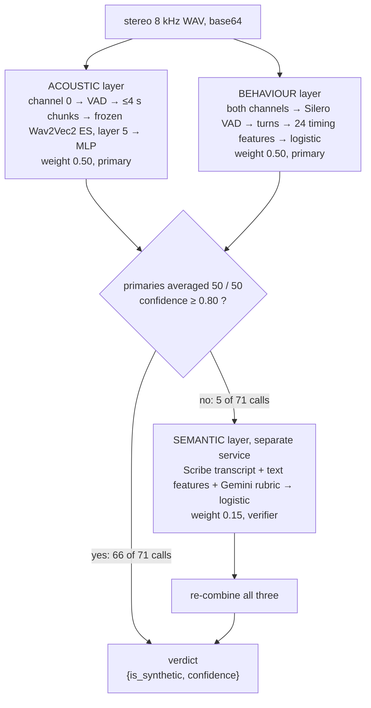
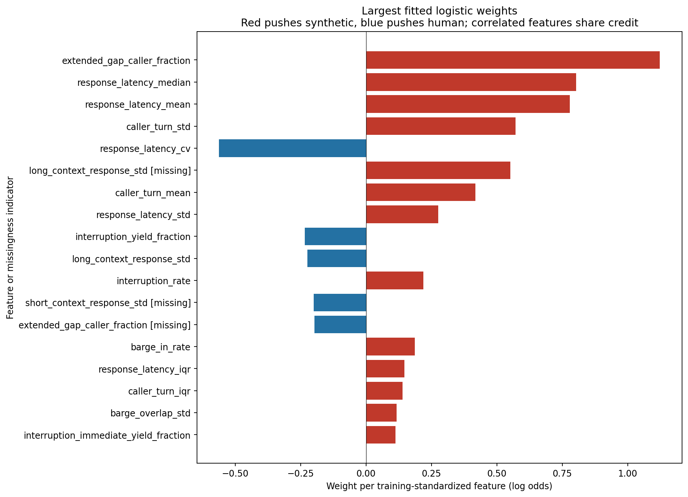
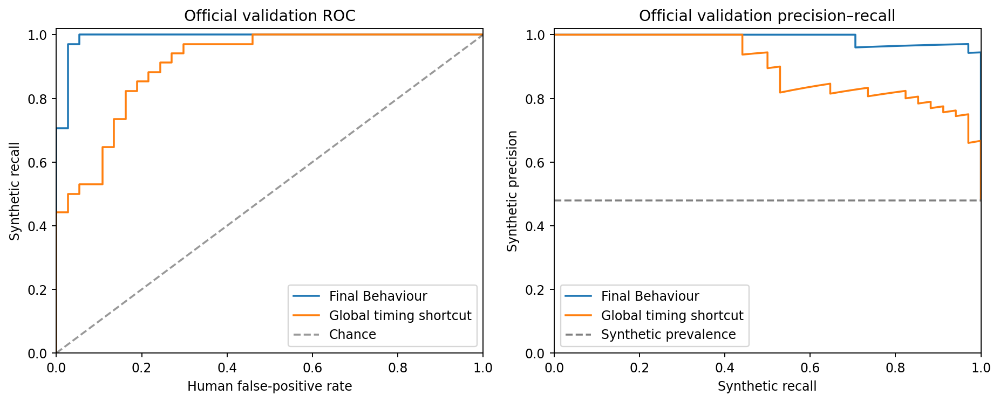
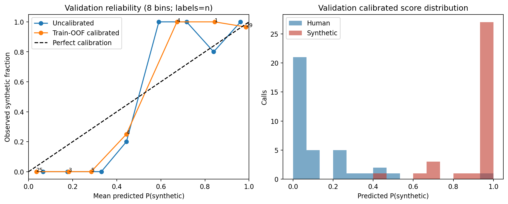
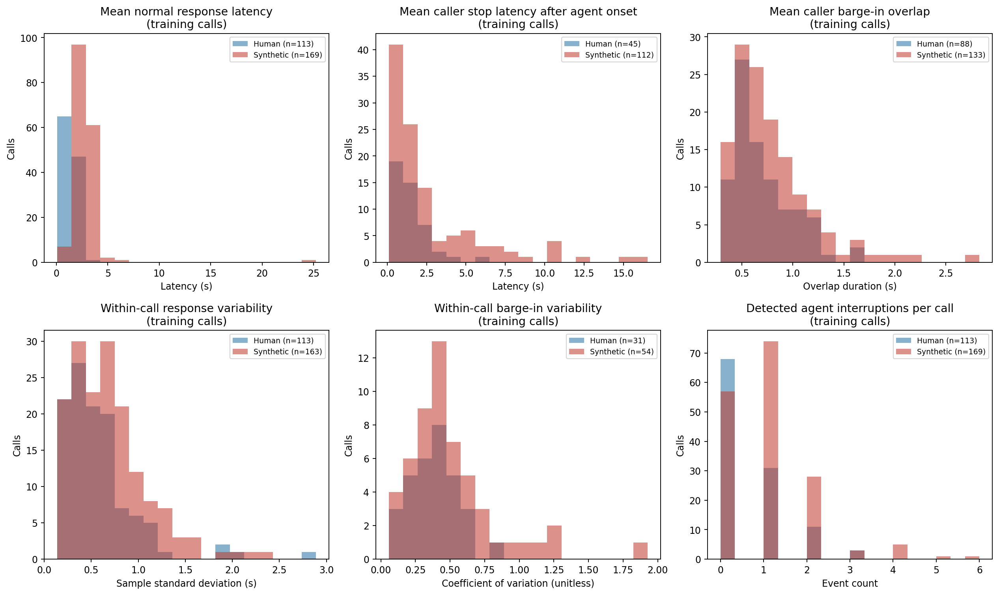
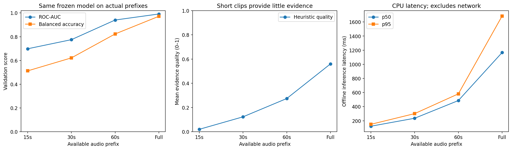
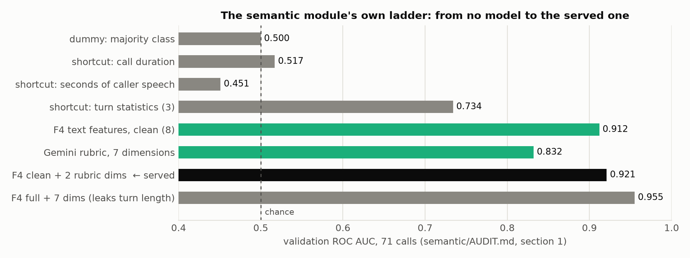
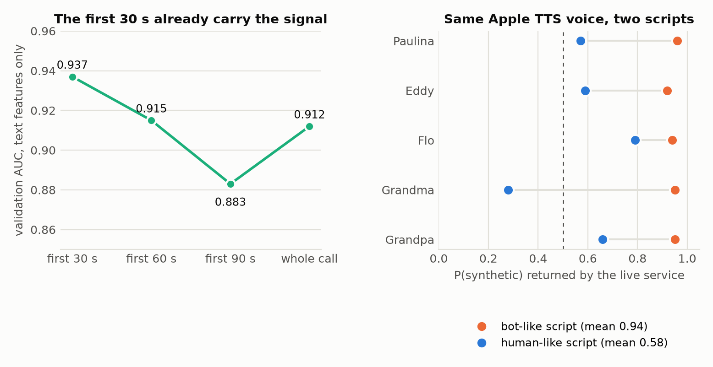
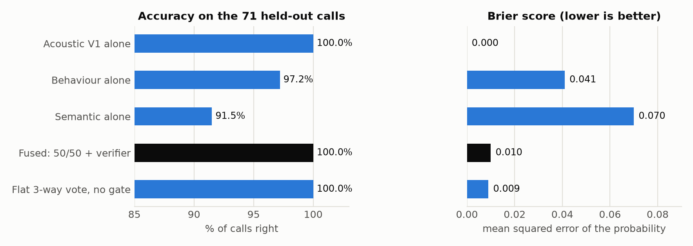

# ISISI, explained for the person presenting it

*Altur challenge, HackMTY 2026. What the detector is, how each layer works, what the numbers mean, and what to say when the judges push back. Every figure here was read from the repository's own reports and metric files, and the source is named next to it. The plots come from two places: the ones the team's own pipeline produced (`outputs/figures/`, `behaviour/reports/figures/`) and seven drawn for this guide from the numbers in the README and the audits (`reports/guide_figures/`).*

## What you are presenting, in one paragraph

Given a recorded bank call, stereo, 8 kHz, with the caller on channel 0 and Altur's AI agent on channel 1, ISISI answers one question: is the caller a person or a synthetic voice? Three independent detectors read three different kinds of evidence. The **acoustic** layer listens to what the voice is made of. The **behaviour** layer times when the caller speaks, yields and answers. The **semantic** layer reads what the caller says. The first two decide every call, half and half. The third is expensive, so it is consulted only when the first two do not settle it. On the 71 held-out validation calls the fused verdict is right on every one, and the semantic service is paid for on 5 of them.

Everything below is the long version.

## How to read the numbers in this guide

Four numbers come up on every page. Here is what each one means, on this dataset's own scale of 71 validation calls, 37 human and 34 synthetic.

**Accuracy** is the share of calls the boolean verdict got right at the fixed threshold of 0.5. One wrong call out of 71 is 98.6%; two is 97.2%. It is what the judges score, and it depends on the threshold.

**ROC AUC** ignores the threshold. Take a random synthetic call and a random human call; AUC is the probability that the synthetic one gets the higher score. 1.000 means every synthetic call scored above every human call, whatever the threshold. 0.5 is a coin toss. A model can have AUC 1.000 and still get calls wrong if its threshold sits in the wrong place, which is exactly what happens to the acoustic model on a telephone line in section 3.1.

**EER**, the equal error rate, is the error at the threshold where false alarms and misses are equally frequent. 0% means a threshold exists that separates the classes perfectly.

**Brier score** is the mean squared error between the probability the model gave and the truth (1 for synthetic, 0 for human). A model that says 0.9 for every synthetic call and 0.1 for every human one scores 0.01. It rewards **calibration**: a model that is right but only ever says 0.55 is punished, and so is one that says 0.99 and is wrong. Calibration is the property that a score of 0.8 means "right about 80% of the time", and every layer here is calibrated on purpose so that the fusion adds up numbers that mean the same thing.

**Held-out** means the model never saw those calls, or those speakers, during training. Train and validation are speaker-disjoint. Every number in this guide is on the validation split unless it says otherwise, and none is from the hidden test set, which nobody has.

## 1. The problem and the data

Altur runs AI voice agents that handle bank calls in Spanish across Latin America. A few seconds of public audio are now enough to clone a voice, so a voice can no longer prove who is calling. The challenge asks for one HTTP endpoint, `POST /detect`, that takes a call and returns `{"is_synthetic": bool, "confidence": float}`.

**The dataset.** The organisers released 353 recorded calls with a manifest and one turn file per call: 150 human, 203 synthetic, 14.5 hours of audio, each call between 61 and 274 seconds long and 148 s on average. Every call is the same customer-service flow with the same agent, Marina at "Banco Altur", in Mexican Spanish. The agent deliberately interrupts, goes quiet, reads a digit back wrong, and asks about products the caller may not have.

| Split | Calls | Human | Synthetic | Role |
|---|---|---|---|---|
| train | 282 | 113 | 169 | fit the classifiers |
| validation | 71 | 37 | 34 | every number in this guide |
| hidden test | ? | ? | ? | the judges' benchmark: new callers, new voices |

Source: `reports/ACOUSTIC_LEARNING_SUMMARY.md`, Part 2.

{width=70%}
*The official split. Train leans synthetic (60%); validation is balanced. Source: `outputs/figures/class_distribution.png`.*

A **synthetic caller** in this data is a whole pipeline: speech recognition listens to the agent, a language model decides what to say, and a text-to-speech engine speaks it into the line. The **human callers** are volunteers who phoned the same agent with invented personal data. There are no speaker ids, no TTS ids and no codec fields, so leakage checks have to be done on the audio itself.


*What one call looks like. The agent lives on channel 1 (green) and the caller on channel 0. Only the caller is classified; the agent's track tells the behaviour layer where the interruptions and questions are. Note how the synthetic caller's channel is dead silent between turns. Source: `outputs/figures/sp_call_overview.png`.*

**Two things about this data you must know before a judge tells you.**

1. **It has shortcuts.** A logistic regression on trivial statistics alone, no voice modelling at all, reaches validation AUC 1.000. The synthetic callers are about 6 dB louder, their band edge sits at a different frequency, and they take about ten seconds to say their first word where humans take one. Those are properties of the recording pipeline, not of the voice (`ACOUSTIC_LEARNING_SUMMARY.md`, Key takeaways and Part 9).
2. **The caller channel is digitally silent between turns.** Across 40 validation calls the median frame level is −72 dB, meaning more than half of every call is a run of exact zeros. A real telephone line never delivers that (`reports/TELEPHONE_ROBUSTNESS_REPORT.md`, section 1.1).


*Left: a classifier on trivial statistics, no voice content, and which cues it leans on. The strongest are the caller's high-frequency ratio, the time until the caller first speaks, and the spectral roll-off. Right: each family of trivial cues separates the classes on its own; only call duration does not. Source: `outputs/figures/shortcut_check.png`.*

Both facts shaped the design: the acoustic layer normalises loudness before the model ever hears the audio, a second acoustic model was trained through real telephone codecs, and the semantic layer dropped two features that were secretly measuring turn length. All three come back in section 8.

## 2. The architecture



The layers fail in different places. The acoustic layer needs audible caller speech. The behaviour layer needs interaction: a caller who is never interrupted leaves it nothing to time. The semantic layer needs a transcript and two third-party APIs. Each one says when it has nothing to go on instead of guessing, and its share of the vote goes to the others (`README.md`, top).

### 2.1 One call, end to end

Take the two calls the landing page shows. Both are real held-out calls from the escalation table in section 6.


*Who is speaking when, reconstructed from the word timestamps in the Scribe transcript cache. Top: the synthetic caller. Bottom: Lucía, a human volunteer. Grey is Marina, the agent. Both calls follow the same script.*

The timelines already show the behaviour layer's raw material. In the synthetic call, Marina cuts in at 67 s and the caller keeps talking for nine more seconds, over her, until its paragraph is finished. In the human call, Lucía answers over the agent at 26 s, both stop, both restart; and when Marina interrupts at 80 s, Lucía had already finished. The acoustic layer, meanwhile, only looks at the orange and blue bars, cut into 4-second pieces. The semantic layer reads the words inside them.

Here is what each layer said, and how the verdict was reached:


*Stage 1 averages the two primaries half and half. If the result is at least 80% confident (0.80 or above, 0.20 or below) it is the verdict. Neither of these calls got there, so stage 2 adds the semantic vote at weight 0.15 and renormalises the three weights to sum to one: 0.43, 0.43, 0.13.*

For the synthetic caller the acoustic layer was certain (1.000) and the behaviour layer was not (0.435): their average, 0.718, is only 72% confident. The semantic layer was asked, said 0.952, and the fused 0.748 is a synthetic verdict at 75% confidence. For Lucía the acoustic layer was certain she was human (0.000), but the behaviour layer read her timing as machine-like at 0.964, confidently wrong. The pair sits at 0.482, a coin toss. The semantic layer said 0.046, and the fused 0.425 is a human verdict. That second call is the reason the second stage exists: one layer can be wrong with conviction, and a different kind of evidence catches it.

## 3. The acoustic layer: what the voice is made of

**What the model looks at.** Speech is air pressure over time; a spectrogram slices it into short frames and shows how much energy sits at each frequency in each frame. A telephone line carries nothing above 4 kHz (the signal is sampled at 8 kHz) and in practice passes about 300 to 3,400 Hz. Human voices and synthesised voices both have harmonics, formants and pauses, but a vocoder produces them from a model, and what it gets slightly wrong, the spacing and sharpness of the harmonics, the noise between them, the way energy fades at the band edge, is what a good acoustic detector picks up.


*Four seconds of a human turn (left) and a synthetic turn (right) from the dataset, as a linear spectrogram (top) and a mel spectrogram (bottom). The dotted line is the 3.4 kHz telephone band edge. The synthetic turn shows cleaner, more regular harmonic bands and darker silence. Source: `outputs/figures/sp_spectrogram_pair.png`.*

**Pipeline.** Channel 0 only. A voice activity detector marks caller speech; regions shorter than 0.30 s are dropped. The speech is cut into chunks of at most 4.0 s (leftovers under 1.0 s dropped), each chunk is level-normalised to −26 dB RMS, which removes the loudness shortcut, and resampled from 8 kHz to 16 kHz, because every pretrained backbone expects 16 kHz. A 150-second call yields about 14 chunks. A frozen speech model turns each chunk into a sequence of vectors; hidden layer 5 is taken, averaged over time into one 768-number vector, and a small MLP scores it: 768 → 256 → 2 with ReLU and dropout, 197,378 trained parameters. The chunk scores are averaged in log-odds and the result is calibrated. One call takes 119 ms on a laptop GPU and about 0.85 s on a CPU (`config.py`, `models/wav2vec2_spanish/meta.json`, `ACOUSTIC_LEARNING_SUMMARY.md` Parts 11 and 12).

**The backbone, and why it is frozen.** `facebook/wav2vec2-base-es-voxpopuli-v2` has 94 million parameters and was pretrained by self-supervision on 21,000 hours of Spanish parliamentary speech: it learned to predict masked pieces of audio from their context, with no labels at all. That makes its internal representations a general description of Spanish speech. It is used **frozen**: nothing in it was trained on the Altur data, only the 197k-parameter head was, on 282 calls. That is the point. A 94M-parameter model fine-tuned on 282 calls can memorise them; a small head on top of fixed features cannot memorise much. Fine-tuning was tried anyway and did not beat the frozen model, so the frozen one is deployed (`ACOUSTIC_LEARNING_SUMMARY.md`, Key takeaways).

**Why layer 5 and not the top.** A transformer's layers move from acoustic detail at the bottom to linguistic meaning at the top. Every layer of every backbone separates the classes perfectly on the clean split, so the clean split could not choose between them. A stress test did: the same 71 calls with the caller channel perturbed at test time in 10 ways, added white and pink noise at different signal-to-noise ratios, a 12 dB gain change, low-pass filters at 3.0 and 3.4 kHz, a 300 to 3,400 Hz band-pass, µ-law codec, reverberation, spectral tilt. Wav2Vec2 Spanish at layer 5 had the highest mean AUC under stress.


*The three backbones under each perturbation of the caller channel. AUC (left) barely moves; accuracy at the fixed threshold (right) is where they differ. XLS-R collapses under pink noise and reverberation, WavLM under reverberation; Wav2Vec2 Spanish holds. Source: `outputs/figures/stress_mlp.png`.*

| Backbone | Params | Layer | Clean acc. | Clean AUC | EER | Stressed AUC | Stressed acc. | Latency per call, GPU |
|---|---|---|---|---|---|---|---|---|
| WavLM Base+ | 94M | 9 | 100.0% | 1.000 | 0.0% | 0.997 | 93.0% | 255 ms |
| **Wav2Vec2 Spanish (VoxPopuli)** | 94M | 5 | 100.0% | 1.000 | 0.0% | 1.000 | 97.2% | 119 ms |
| XLS-R 300M | 315M | 23 | 100.0% | 1.000 | 0.0% | 0.998 | 86.2% | 310 ms |

Source: `ACOUSTIC_LEARNING_SUMMARY.md`, At a glance; `reports/best_model.json`.

{width=55%}
*All three backbones on the clean validation split: three perfect curves on top of each other. This is what "the split is saturated" looks like. It cannot rank models. Source: `outputs/figures/bench_roc.png`.*

**Calibration.** The MLP's raw output is a score; Platt scaling fits a two-parameter logistic curve that maps scores to probabilities. It was fitted not on the clean validation split, where every score is already at 0 or 1 and there is nothing to calibrate, but on validation under 11 channel conditions, 781 call-conditions in total, so that the probability means something on audio that is not pristine. Cross-validated Brier 0.020, expected calibration error 0.015 (`models/wav2vec2_spanish/calibration_mlp.json`).


*A reliability diagram bins calls by predicted probability and plots the fraction that were actually synthetic; perfect calibration is the diagonal. Left: under the 11 stress conditions, where there is something to calibrate. Right: on clean validation the scores are already 0 or 1. Source: `outputs/figures/calibration_wav2vec2_spanish.png`.*

**Is 100% believable?** 100% on the validation split is zero errors in 71 calls, not a guarantee; the 95% lower confidence bound on that accuracy is 95.9%. Five checks were run. Shuffling the labels drops AUC to chance, so there is no leak through the pipeline. Scoring a single 1 to 4 s chunk instead of the whole call still gives 99 to 100%, so the model is not adding up weak evidence. Leaving out whole clusters of similar voices and testing on them still gives AUC 1.0, so it is not memorising speakers.


*Left: five label shuffles give AUC around 0.5 while the real labels give 1.0. Middle: one chunk is nearly as good as the whole call. Right: held-out voice clusters are still recognised. Source: `outputs/figures/sanity_wav2vec2_spanish.png`.*

**The honest number.** On 108 clips from TTS engines and human speakers the dataset never contained, pushed through a simulated phone line, the model scores **88.0% accuracy, AUC 0.945**. The ranking transfers to new engines; the fixed threshold is what the dataset's pipeline biases (`ACOUSTIC_LEARNING_SUMMARY.md`, Key takeaways, Parts 8b and 8c).


*Each dot is one clip: new human speakers in blue (an English anti-spoofing corpus and a Latin American Spanish speech corpus), new TTS engines in red (Windows SAPI, gTTS, Microsoft edge-tts voices). Left: resampled to 8 kHz only. Right: through a 300 to 3,400 Hz band-pass and µ-law, a real telephone path. The humans stay left of the line; most engines stay right, with the SAPI voices and one edge-tts voice drifting across. Source: `outputs/figures/external_check.png`.*

### 3.1 The telephone problem, and the second acoustic model

The specialist above was built on recordings whose silence is digital. Push the same calls through a real narrowband codec chain and the noise floor rises from −72 dB to −38 dB, the dynamic range falls from 52 dB to 16 dB, and the energy-based segmenter, which needs 15 dB of range to fire, **finds no speech at all** in 5 of 40 calls. The endpoint then answers 0.5 before the model is reached. Worse, the damage is asymmetric: humans survive the line, synthetic voices collapse towards "human", which is the dangerous direction for a bank (`TELEPHONE_ROBUSTNESS_REPORT.md`, sections 1.1 and 1.2).


*Left: the caller channel's noise floor before (−72 dB, digital silence) and after a telephone line (−38 dB). Middle: dynamic range collapses from about 50 dB to about 16 dB, right at the 15 dB the energy VAD needs. Right: the energy VAD finds nothing at all in 5 of 40 channel calls; Silero VAD never returns nothing. Source: `outputs/figures/channel_dynamic_range.png`.*

So a second model, **Robust V2**, was trained: the same frozen backbone and layer, Silero VAD instead of the energy detector, and a classifier that also saw the training calls after real codecs (G.711, transcoding, packet loss, jitter, AGC, comfort noise, all modelled offline with ffmpeg). A family of codecs was held out entirely: GSM, AMR-NB, iLBC, Speex, Opus and G.722 never appear in any training set.


*Four models on six domains: accuracy at the deployed threshold (top) and AUC (bottom). The two controls in the middle show what each change buys: swapping the VAD alone fixes the seen-family line but not the unseen one; retraining on original data alone helps; training through the channel (V2, red) holds 100% on both lines. On clean out-of-dataset audio the specialist is still better. Source: `outputs/figures/evaluation_matrix.png`.*

| Domain | Specialist (V1) | Robust V2 |
|---|---|---|
| Altur validation, clean | 100.0% / 1.000 | 100.0% / 1.000 |
| through a seen-family line | 77.5% / 0.908 | 100.0% / 1.000 |
| through an unseen-family line | 81.7% / 0.929 | 100.0% / 1.000 |
| out-of-dataset clips, through a line | 62.0% / 0.794 | 81.5% / 0.891 |
| 11 channel perturbations | 97.4% / 0.997 | 98.5% / 0.999 |
| out-of-dataset clips, clean | 68.5% / 0.899 | 54.6% / 0.867 |

Accuracy at the deployed threshold / ROC AUC. Source: `README.md`, Results; `reports/deployed_model.json`.

Across all six domains the energy segmenter found no caller speech in 47 files; for V2 that number is 2. The one honest caveat: on clean, non-telephone audio the specialist is better, mostly because no threshold has been fitted for that kind of audio.

**Which one is running.** The fusion uses **V1, the specialist, by default**; `--acoustic-model robust_v2` swaps it. The standalone single-model endpoints and the inspector page follow `reports/deployed_model.json`, which names Robust V2. If a judge asks which is deployed, the precise answer is: both are on disk, V1 sits in the fusion, and V2 is one flag away and is what the inspector's A/B panel recommends for a real line (`src/server.py`, `README.md`).

## 4. The behaviour layer: when the caller speaks, yields and answers

**The idea.** A conversation has a rhythm. When the agent stops talking, how long until the caller starts? When the agent interrupts, does the caller stop, and how fast? When the caller barges in, how long do both talk at once? After a long silence, who breaks it? None of this needs the words or the voice. It needs to know, for every moment of the call, whether each channel contains speech. That is what a **voice activity detector** does: Silero VAD is a small neural network that answers "speech or not" every 32 ms on each channel, and it does not key on the noise floor, so a telephone line does not blind it.


*Six timing statistics per call, human in blue and synthetic in red, from the organisers' own turn annotations. The synthetic pipeline takes about ten seconds before its first word (a property of the recording setup, and a shortcut the acoustic layer is not allowed to use), replies more slowly on average, and overlaps the agent less. Source: `outputs/figures/turn_structure.png`.*

**Pipeline.** Both channels, native 8 kHz. Silero VAD (v6.2.1, ONNX, MIT licence, weights frozen) marks speech on each channel. From the two speech tracks the module derives temporal events: turns, pauses, response latencies after the agent stops, agent interruptions and whether the caller stopped, caller barge-ins and how long the overlap lasted, who speaks after a long gap. Those become **24 interpretable features**, plus 15 indicators for features that could not be computed on a given call. A regularised logistic regression (L2, C = 0.1) with **40 parameters** scores them, and a sigmoid fitted on train-only out-of-fold logits calibrates the result (`behaviour/reports/BEHAVIOUR_REPORT.md`, section 1; `behaviour/reports/FINAL_BEHAVIOR_FREEZE.md`).

**What a logistic regression with 40 parameters means.** Each feature is standardised, multiplied by a learned weight, and the weighted sum plus an intercept is the log-odds of synthetic. Positive weights push toward synthetic, negative toward human. The whole model fits in a 52 KB JSON file, it can be read line by line, and it cannot memorise 282 calls with 40 numbers. That is a deliberate choice: an explainable model whose every decision can be traced to a handful of timings.

The 24 features, by family (`behaviour/reports/metrics/final_model.json`):

- **Caller turn shape:** turn length mean, median, standard deviation, interquartile range; median pause.
- **Response timing:** latency mean, median, standard deviation, IQR, coefficient of variation; separate spread for short-context and long-context responses.
- **Agent interruptions:** rate, mean and median time until the caller stops, fraction of interruptions the caller yields to, fraction yielded to immediately.
- **Caller barge-ins:** rate, overlap mean, standard deviation, IQR, coefficient of variation, fraction where the caller keeps going.
- **Long gaps:** fraction of extended silences that the caller ends.

{width=80%}
*The weights the model actually learned. Red pushes synthetic, blue pushes human. Who breaks a long silence and how long the caller takes to reply carry the most; a high coefficient of variation in reply time pushes toward human. Source: `behaviour/reports/figures/logistic_coefficients.png`.*

**Results on the 71 validation calls:** accuracy **97.18%** (69 of 71), balanced accuracy 0.972, ROC AUC **0.9913**, Brier 0.0406. One human false alarm and one missed synthetic caller; confusion `[[36, 1], [1, 33]]`. On train: 96.1%, AUC 0.993, so no overfitting gap (`FINAL_BEHAVIOR_FREEZE.md`).


*The final behaviour model against a "global timing shortcut" baseline built only from the coarse statistics in the previous figure. The shortcut already reaches a high AUC, which is the leakage the semantic layer had to avoid duplicating; the full model is better across the whole curve. Source: `behaviour/reports/figures/roc_pr.png`.*


*Left: reliability before and after the train-only sigmoid calibration; the labels are calls per bin. Right: the calibrated scores on validation. Most humans sit near 0 and most synthetic callers near 1, with a handful of humans between 0.2 and 0.5. Those are the calls that end up under the fusion's 80% gate. Source: `behaviour/reports/figures/calibration_scores.png`.*

**Latency:** 860 ms p50, 1193 ms p95 on an Intel Mac CPU, 125 MiB peak memory. Almost all of it is the VAD (854 ms p50); features take 2 ms and the classifier 0.1 ms (`behaviour/reports/metrics/latency.json`).

**When it abstains.** If the evidence quality is zero or there are fewer than two events, it returns a non-flag: `false` at confidence 0.5, marked insufficient evidence. That is not a vote for "human", and the fusion treats it as no vote at all.

**The finding you should not oversell.** The challenge's suggested story is "humans are messy, machines are consistent". The data does not support it here. The median within-call spread of response latency was **0.502 s for humans and 0.635 s for synthetic callers**, so the machines were the more variable ones. Interruption-recovery events were too scarce to build on: only 13 of 282 training calls had three or more resolved interruptions, and none had three recoveries. What carried the model was ordinary response timing and who speaks after a long gap. The consistency features help as a group (removing them drops AUC from 0.991 to 0.979), but that is evidence about this dataset, not a law about people (`BEHAVIOUR_REPORT.md`, sections 1 and 3).


*Six of the raw measurements on training calls, human in blue and synthetic in red. Top left: humans reply within a second or so, the synthetic pipeline takes two to four. Bottom left: within-call reply variability is, if anything, wider for the synthetic callers. Bottom right: most human calls contain no detected agent interruption at all, which is why interruption-recovery features had too little support to deploy. Source: `behaviour/reports/figures/behavior_distributions.png`.*

**The operational limit.** It needs the whole call. Prefixes of 15 to 30 s are unreliable and even 60 s does not match full-call performance. Fast computation is not the same as having enough conversation to decide.


*The same frozen model given only the first 15, 30 or 60 seconds. Left: AUC climbs from 0.70 to 0.99 as the call unfolds. Middle: the evidence quality the module reports for itself. Right: CPU time grows with the audio. Source: `behaviour/reports/figures/prefix_performance.png`.*

## 5. The semantic layer: what the caller says

**The idea.** Transcribe the caller, then ask two kinds of questions of the text. Cheap ones a script can answer: how confident was the transcriber on each word, how many fillers and false starts, how long are the sentences, how many colloquialisms. And expensive ones a language model answers from the whole transcript: did the caller deliver everything in one over-complete paragraph, is the register formal, did it repair its own sentences. A logistic regression turns those into a probability. The LLM never decides; it emits features.

**Pipeline.** Runs as its own service, on its own Python 3.13 interpreter, reached over HTTP. Caller channel → VAD → **ElevenLabs Scribe** transcription with a log-probability per word, in 20 s chunks in parallel with hedged retries. Agent channel → transcription too, so the caller's vocabulary can be compared with the agent's. Then two feature groups: **F4**, text features that need no LLM (Scribe confidence statistics, disfluency rate, false starts, Mexican colloquialisms, type-token ratio, sentence length), and **F5**, a rubric scored by **Gemini** (gemini-3.5-flash-lite) on the annotated transcript. A logistic regression with Platt calibration returns P(synthetic). Budget 2.8 s, hard stop 3.0 s (`semantic/README.md`, `semantic/rubric.py`, `semantic/model.py`).

**Why transcription confidence is the strongest signal.** A speech recogniser outputs, for each word, how sure it is. A synthetic voice is produced from text, so every phoneme is clean and canonical, and the recogniser is almost never in doubt. A person hesitates, swallows syllables, restarts, and the recogniser's confidence dips on exactly those spots. In Lucía's call the words "Eh", "este" and the restart "mi nú-- mi número" all carry low log-probabilities; in the synthetic call the transcriber is near-certain on every word. Three statistics of those log-probabilities alone give AUC 0.882 on validation.


*From no model to the served one, on the 71 validation calls. Shortcuts (grey) that only count turns already reach 0.73, which is behaviour-layer territory and the reason two text features were removed. The text features alone reach 0.912, the seven-dimension rubric alone 0.832, and the served combination 0.921. The last row is higher but was dropped because it leaks turn length. Source: `semantic/AUDIT.md`, section 1.*

The Gemini rubric asks seven dimensions, in the module's own Spanish: *sobrecompletitud* (delivers everything in one go), *registro_formal*, *reparacion_conversacional* (self-repair), *iniciativa*, *manejo_producto_ambiguo* (how the caller handles a product it may not have), *fidelidad_repeticion* (repeats digits exactly), *consistencia_memoria*. Only the first two are in the served model, with validation AUCs of 0.72 and 0.73. The rest sit between 0.35 and 0.59 (`semantic/FINDINGS.md`, `semantic/model.py`).

**The traps did not work as designed, and the module says so.** The agent's script plants two: a reference number read back wrong on purpose, and a question about a product the caller may not have. The rubric dimensions that measure them, *fidelidad_repeticion* and *manejo_producto_ambiguo*, scored AUC 0.45 and 0.35 on validation, which is worse than chance. The module's plan records this as a "strong signal" hypothesis marked **false, corrected**. *consistencia_memoria* is at 0.48 because the human volunteers invented their personal data too and slip just as little. What survived is how the caller talks, not whether it fell for a trap (`semantic/PLAN.md`, `semantic/AUDIT.md` section 5).

**A leak that was removed.** Two of the original text features, words per turn and word count, were turn-length in disguise (correlation 0.94 with mean turn length), which is the behaviour layer's signal. They were dropped so the fusion does not count the same evidence twice, at a cost of 0.03 AUC for this layer alone. On the fusion's evaluation, using the train-only fit applied to the 71 validation calls, the served model scores **AUC 0.975, accuracy 91.5%, Brier 0.070** (`README.md`, Results). The README flags that `AUDIT.md`'s "what is served now" row (10 features) and the served `model.py` (15 features) have drifted apart; 0.975 is the served configuration measured the same way as the other layers.


*Left: with text features only, the first 30 seconds of the caller separate the classes better than the whole call; that is where a person says "me hicieron un cobro dos veces" and a bot delivers the full paragraph. Right: ten callers synthesised with Apple's Spanish voices, an engine the dataset never contained, reading two scripts with the same facts. The same voice scores 0.94 on a bot-like script and 0.58 on a human-like one. Source: `semantic/AUDIT.md`, sections 3 and 7.*

**Live service, 71 validation calls over real HTTP:** p50 about 2.1 s (2.06 and 2.08 s in two runs), p95 2.83 s. Full path (Scribe + rubric) on 66, text-only on 5, abstained on 0. The ElevenLabs key admits about 20 requests in flight, which works out to two or three simultaneous calls at full quality (`AUDIT.md` section 6, `FINDINGS.md`).

**Errors, and why it must not decide alone.** The false negatives are bots whose audio the ASR found hard: low confidence, disfluencies. The false positives are humans who speak cleanly and deliver everything in one paragraph. The module measures "talks like an assistant", and some people do. The TTS probe above confirms it reacts to the script, not just the voice, and also that a human-like script from a new engine still averages above 0.5: the transcriber's confidence keeps pushing a clean synthetic voice toward synthetic even when the words are colloquial (`AUDIT.md`, sections 4 and 7).

**Privacy.** Caller and agent audio goes to ElevenLabs; the transcript goes to Google. There is no offline version of this layer. This is why it is a verifier and not a primary.

## 6. The fusion: two stages

All of this lives in `src/fusion.py`, one function, `combine()`, that both `/detect` and the console's faders go through. The README reports 114 unit tests for the repository, 27 of them on this combiner.

**Stage 1.** The acoustic and behaviour layers each return a calibrated probability, or abstain. Their probabilities are averaged with weights 0.50 and 0.50. Confidence is `max(p, 1 − p)`. If that confidence is at least the **verify threshold, 0.80**, meaning p ≥ 0.80 or p ≤ 0.20, that is the verdict. The semantic service is never contacted.

**Stage 2.** Otherwise, the semantic layer is asked, and all three are re-combined, semantic at weight 0.15. Only the ratio of the weights matters. A layer that abstained is dropped and the others share its weight (`on_abstain: renormalise`). The decision threshold on the fused probability is 0.5.

**If nothing voted** (every layer abstained, or every weight is zero), the answer is an explicit non-flag: `is_synthetic: false` at confidence 0.5 with `decisive: false`. A raw 0.5 would clear a 0.5 threshold and accuse a caller on no evidence (`README.md`, How the votes are combined).

**Why a verifier rather than a third vote.** The semantic layer is the only one that leaves the machine: a paid ASR call, a paid LLM call and about 2.6 s of network per call, against about 500 ms locally for the other two. Asking it about a call the primaries already agree on at 95% buys nothing and costs money.


*Left: a call the primaries settle answers in about a second; an escalated one waits for the semantic service and takes about four. Middle: each layer alone. Right: on the 71 held-out calls the verifier was consulted 5 times. Sources: `README.md`, `reports/best_model.json`, `behaviour/reports/metrics/latency.json`, `semantic/AUDIT.md`.*

### 6.1 Results on the 71 held-out calls

| System | Accuracy | ROC AUC | Brier | Reads |
|---|---|---|---|---|
| Acoustic V1 alone | 100.0% | 1.000 | 0.000 | how the caller sounds |
| Behaviour alone | 97.2% | 0.991 | 0.041 | when the caller speaks, yields, interrupts |
| Semantic alone | 91.5% | 0.975 | 0.070 | what the caller says |
| **Fused, 50 / 50 + verifier** | **100.0%** | **1.000** | **0.010** | the two primaries, plus the verifier on 5 calls |
| Flat three-way vote, no gate | 100.0% | 1.000 | 0.009 | all three, on every call |


*Accuracy and Brier score per system. The gate costs nothing in accuracy against the flat vote and 0.001 in Brier, while making 7% of its paid calls. Source: `README.md`, Results.*

Confusion of the fused verdict: `[[37, 0], [0, 34]]`. No layer abstained on this split. The primaries settled **66 of 71**; the verifier was asked on **5**, which is 7% of the paid API calls a flat vote would have made, with identical accuracy. A confident call answers in about **1.0 s**; an escalated one in about **3.9 s** (`README.md`, Results).

**The five escalations**, with every layer's real score:

| Call | Truth | Acoustic | Behaviour | Primaries | Conf. | Semantic | Fused |
|---|---|---|---|---|---|---|---|
| `0847d7417bb1` | synthetic | 1.000 | 0.435 | 0.717 | 72% | 0.952 | 0.748 → synthetic |
| `569ffb0869eb` | human | 0.000 | 0.964 | 0.482 | 52% | 0.046 | 0.425 → human |
| `678ee1dd2242` | human | 0.001 | 0.476 | 0.239 | 76% | 0.178 | 0.231 → human |
| `95ccefc6e4ce` | human | 0.013 | 0.428 | 0.221 | 78% | 0.280 | 0.228 → human |
| `b658b1155216` | human | 0.000 | 0.434 | 0.217 | 78% | 0.390 | 0.240 → human |


*Every layer's probability for the five calls the primaries could not settle, and the fused verdict. In every one the behaviour layer (orange) sits near the middle; in the second it is confidently wrong. The acoustic layer (blue) and the verifier (green) agree each time, and the verdict lands on the right side of 0.5. Source: `README.md`, Results.*

Every escalation is a call where the behaviour layer sat near the fence. The second row is the one to tell: the behaviour layer is not unsure there, it is **confidently wrong**, 0.964 for a human caller. The acoustic layer says 0.000, the pair lands at 52%, the verifier is asked, and it agrees with the acoustic layer at 0.046. That is the case the second stage exists for.

**Why not tune the weights on these 71 calls?** Because the acoustic layer alone is already at 100% on them, so any weighting that leans on it scores 100% and nothing can be learned about the others from this split. The README says so plainly: no weighting and no gate can be justified from these 71 calls, and every layer was developed while looking at this split. The argument for the arrangement is not the accuracy column. It is that the layers fail in different places, and that the expensive one is spent only where the cheap ones ran out of confidence.

### 6.2 The two calls the landing page shows

Both are from the table above and both transcripts are in the repository's Scribe cache. Marina's script is the same in both: a wrong digit read back, an interruption, and a question about a product the caller never mentioned. Section 2.1 has their timelines and the arithmetic of their verdicts.

**`call_0847d7417bb1`, synthetic.** The caller reports a duplicated payment of 2,600 pesos. Marina reads the reference back with one digit wrong; the caller corrects it precisely: *"No, no, es 93, no 92. 4470-8193."* Later Marina cuts in with *"Perdón que lo interrumpa"* while the caller is mid-sentence, and the caller **keeps talking for nine more seconds**. Marina asks *"¿Esto es sobre su cuenta Nómina Plus o sobre su crédito verde?"*, two products the caller never mentioned, and it answers *"sobre la Nómina Plus"* without hesitation. Not one filler or false start in the whole call, and the transcriber is near-certain on every word. Gemini scored it 1.0 on over-completeness, the rubric dimension that is actually in the served model.

**`call_569ffb0869eb`, human.** Lucía calls to update her phone number. Her sentences carry fillers and a restart: *"Eh, simplemente quiero actualizarlo porque, eh, cambié de compañía... perdí, ah, mi nú-- mi número anterior."* When Marina asks for the full reference number she had given, she answers *"Eh, sí, termina en cinco, nueve. Mhm."*, only the last two digits. Gemini scored her 0.0 on over-completeness. The behaviour layer read her timing as machine-like, 0.964; the acoustic layer's 0.000 and the verifier's 0.046 carried the verdict.

## 7. The API and the runtime

**The contract, unchanged from the challenge.** `POST /detect` with `{"audio": "<base64 wav>"}`, optionally `"queue": "<label>"`, returns:

```json
{
  "is_synthetic": true,
  "confidence": 0.748,
  "decisive": true,
  "settled_by_primaries": false,
  "verifiers_consulted": true,
  "note": "the primaries reached only 72% confidence (< 80%); Semantic (what the caller says) consulted to break the tie",
  "details": {
    "branches": { "acoustic": 1.0, "behaviour": 0.435, "semantic": 0.952 },
    "weights": { "acoustic": 0.5, "behaviour": 0.5, "semantic": 0.15 },
    "layers": [ "...one entry per layer: probability, share, role, scored, consulted..." ],
    "acoustic_model": "wav2vec2_spanish",
    "latency_ms": "...",
    "call_id": "..."
  }
}
```

`is_synthetic` and `confidence` are the challenge's fields. `confidence` is P(the returned verdict is right), so 0.748 means the fused probability of synthetic was 0.748. Everything under `details` is extra and exists so an analyst can see which layer made the call. On any internal error the endpoint still answers `{"is_synthetic": false, "confidence": 0.5}` with HTTP 200, so the judges are never left without an answer (`src/server.py`, `src/fusion.py`).

**Other endpoints.** `/detect_layers` returns each layer's own score and latency. `/fusion/config` reads and live-tunes weights, roles, the gate and the threshold. `/layers` lists the registry: which detectors exist, whether they are answering and why not. `/fusion` is a console that re-decides all 71 held-out calls in a millisecond as you move the faders, because every layer's score is cached. `/api/calls`, `/api/stats` and `/api/health` feed the admin panel from a SQLite call log that stores scores, verdicts and timings, **never audio**.

**Two things the server refuses to fake.** `streaming: false`, because the detector scores a complete call and does not decide as audio arrives. `queue_depth: 0`, because requests are served synchronously. One thing it computes rather than guesses: `decided_at_s`, the end of the first acoustic chunk after which the running verdict never flips again, and `null` when it never settles (`web/INTEGRATION.md`, `src/store.py`).

**Running it.**

```
python src/server.py --port 8000                                  # the detector, primaries only
cd semantic && uvicorn server:app --port 8100                     # the semantic service (needs API keys)
python src/server.py --semantic-url http://127.0.0.1:8100/detect  # both
cd web && VITE_API_URL=http://127.0.0.1:8000 npm run dev          # landing page + admin panel, LIVE
```

Leave `VITE_API_URL` unset and the admin panel runs on its seeded mock, badged SAMPLE, so the site demos with no backend running.

## 8. What to say when the judges push

**"100% is suspicious."** Agree, then explain. It is zero errors in 71 calls; the lower 95% bound is 95.9%. The split is saturated: trivial statistics also reach AUC 1.000, because the two classes differ in their recording pipeline, not only in their voices. So 100% cannot rank models and does not predict the hidden set. What we did about it: chose the backbone on a stress test the clean split cannot pass, tested on 108 external clips through a simulated line (88.0%), and ran permutation and unseen-voice checks. The fragile part is the threshold, not the ranking.

**"Then why not fine-tune?"** It was tried. Frozen and fine-tuned both hit 100% clean and the same stressed AUC, so the frozen one ships: fewer parameters trained on 282 calls, nothing to overfit.

**"What happens on a real phone line?"** The specialist drops to 62% in the worst telephone domain because the line erases the very cues it learned: loudness, band edge, digital silence. Robust V2 was trained through real codecs, holds 100% on codec families it never saw and 81.5% in the worst domain. The channel is real codecs on a modelled network; no carrier was involved, and we say so.

**"Why is the semantic layer a verifier?"** It is the only paid, networked layer, about 2.6 s per call, and the only one that sends audio off the machine. On the 71 calls the primaries settle 66; asking the semantic layer about those buys nothing. The gate costs no accuracy and saves 93% of those calls.

**"Why 80%? Why 0.50 / 0.50 / 0.15?"** They are runtime knobs, and the README says plainly that no gate value or weighting can be justified from 71 calls on which one layer is already perfect. 50/50 is the literal reading of "two primaries decide"; 0.15 makes the verifier a tie-breaker rather than a third vote. The argument for the arrangement is that the layers fail in different places, not the accuracy column.

**"What if the semantic service is down?"** It abstains, its 0.15 goes to the other two, the console greys it out with the reason, and no verdict waits for it. A layer that raises is caught and abstains; there is a test for exactly that.

**"Isn't the behaviour layer just 'machines answer faster'?"** No, and the data says the opposite here: synthetic callers replied more slowly and with more variable timing. The 24 features are timing distributions and reactions to specific agent events, and the report is explicit that the "humans are messy" story is not established.

**"Doesn't the semantic layer just detect the traps?"** No. The trap dimensions scored below chance on validation and are not in the served model. What it detects is how the caller talks: transcription confidence, fillers, false starts, over-completeness, formal register. Ask it the same words in a human-like script and the score drops from 0.94 to 0.58.

**"Where does the audio go?"** Acoustic and behaviour: nowhere, CPU, local. Semantic: to ElevenLabs and Google, and that is a stated reason it is not a primary. The call log stores no audio.

**"How fast?"** Acoustic about 120 ms on a GPU, about 0.85 s on a CPU. Behaviour about 860 ms on a CPU, almost all of it VAD. Semantic about 2.1 s at the median. A confident call about 1.0 s end to end, an escalated one about 3.9 s. No streaming.

**"What is decided_at?"** The acoustic layer averages chunk log-odds, so the running mean after k chunks is exactly what it would have said having heard only k chunks. `decided_at_s` is the end of the first chunk after which that running verdict never flips. It is `null` when the layer abstained or never settles, never a placeholder.

## 9. A demo order that tells the story

1. **The landing page.** Tap the lock. Read the acronym: the sound, the timing, the sense.
2. **Three signals.** One card per layer, each with what it reads and where it fails.
3. **Two real calls.** Switch between the synthetic caller and Lucía. Point at the behaviour bar on the human call: 0.96, wrong, and the verdict still right because the acoustic layer said 0.00 and the verifier agreed.
4. **The pipeline.** Two stages, the 80% gate, 66 of 71 settled without the paid layer.
5. **The endpoint.** The contract is the challenge's, the details are ours.
6. **The admin panel.** Verdicts by hour, confidence distribution, latency, health. LIVE when the detector is running; SAMPLE otherwise, and say which it is.
7. **The fusion console** at `/fusion` if the backend is up: move a fader and watch 71 verdicts re-decide.

## Glossary

- **AUC (ROC).** Probability that a random synthetic call scores higher than a random human one. 1.0 is perfect ranking; 0.5 is chance. Independent of the threshold.
- **EER.** The error rate at the threshold where false alarms equal misses.
- **Brier score.** Mean squared error between the probability and the truth. Lower is better; it rewards calibration as well as accuracy.
- **Calibration.** Making a score of 0.8 mean "right about 80% of the time". Platt scaling fits a logistic on the scores; a sigmoid on out-of-fold logits is the same idea fitted without seeing the evaluation calls. A reliability diagram is how you check it.
- **Frozen backbone.** A pretrained model used as a fixed feature extractor; only a small head on top is trained.
- **Self-supervised pretraining.** Learning representations by predicting masked pieces of the input from context, with no labels. Wav2Vec2 was pretrained this way on 21,000 hours of Spanish.
- **Embedding.** The vector a network's hidden layer produces for an input; here, 768 numbers per 20 ms of audio, averaged over a chunk.
- **Logistic regression.** A weighted sum of features plus an intercept, squashed to a probability. Its weights can be read and argued about.
- **VAD.** Voice activity detection, which frames contain speech. Silero is a small neural VAD; the energy VAD is a threshold above the noise floor.
- **Log-probability.** A speech recogniser's confidence in a word, on a log scale; 0 is certain, more negative is less sure.
- **Speaker-disjoint.** No speaker appears in both train and validation.
- **Primary / verifier.** A primary votes on every call. A verifier is consulted only when the primaries' joint confidence is under the gate.
- **Abstain.** A layer reporting it has no evidence rather than guessing; the fusion drops it and re-weights the rest.
