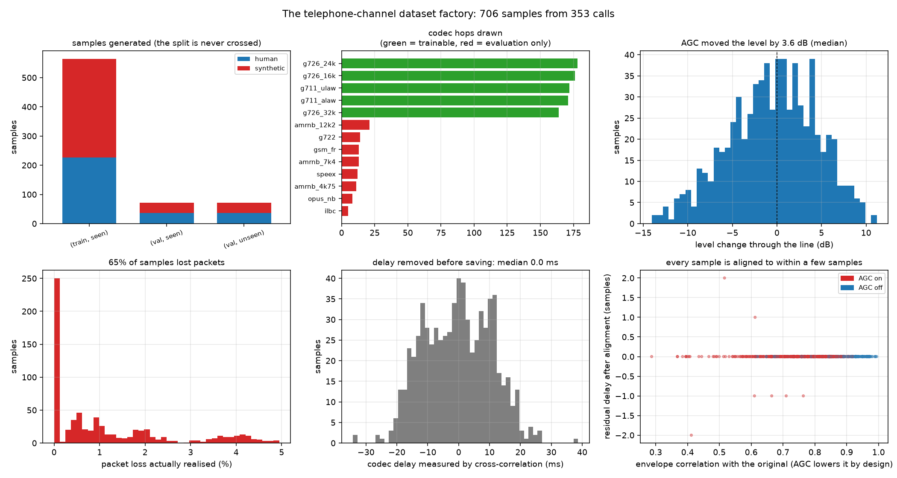
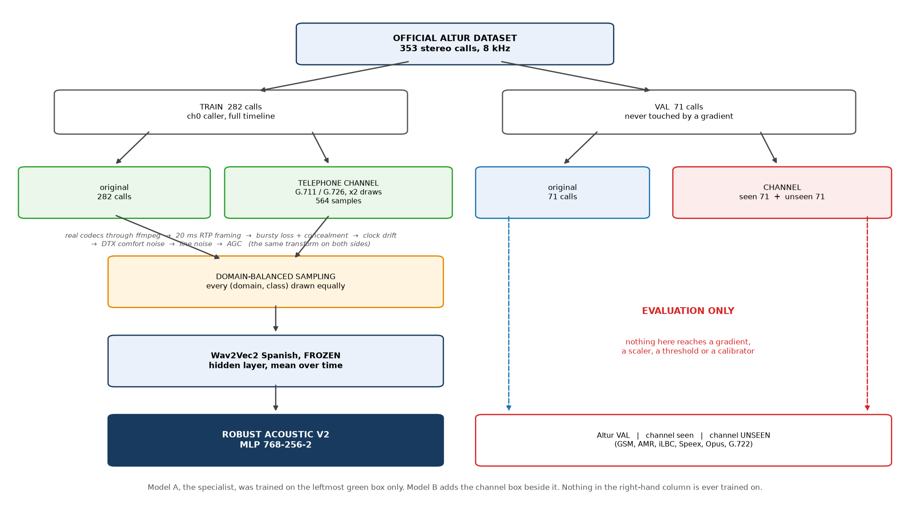
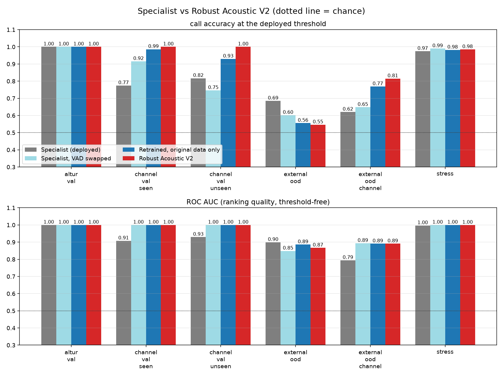
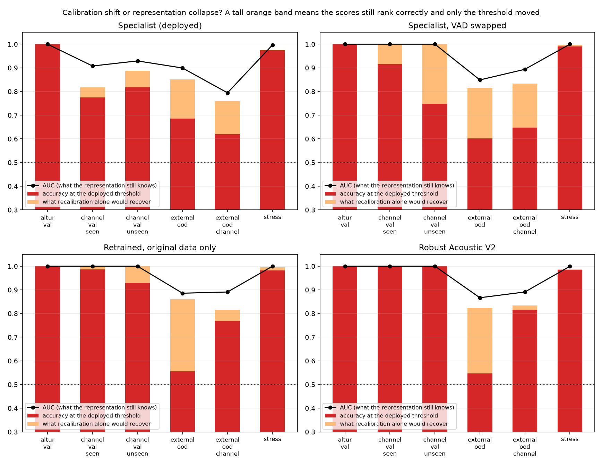

# Surviving the telephone line

*Altur HackMTY 2026, acoustic branch - why a detector that is perfect on the dataset fails on a real call, and what fixes it*


## What this report is about

The deployed acoustic detector - Wav2Vec2 Spanish, frozen, layer 5, plus a small MLP - scores **100 % accuracy and 1.000 AUC** on the official Altur validation split. On audio that has actually been through a telephone call it degrades badly. That gap is the subject of this report.

A detector that only works on the recordings it was trained from is not a product. The bank's calls arrive down a narrowband line, through codecs, gain control and packet loss, and the caller is the same person either way. So the question is not how to score higher on the validation split - it is already saturated - but how to keep that performance when the channel changes underneath it.

| **100%** | **70%** | **4/10** | **12.2 dB** |
|---|---|---|---|
| specialist on clean audio | the same calls, through a line | calls where it found no speech at all | mean spectral distance |


## 1. Why a model that scores 100 % can fail on a phone call

Two separate things go wrong, and they need different fixes. Telling them apart was the first job.


### 1.1 The dataset's silence is digital silence

The Altur caller channel is not merely quiet between turns - it is *exactly zero*. Across 40 validation calls the 10th-percentile frame level sits at **-72 dB** and the median frame sits at the same place, which is another way of saying more than half of every call is a run of zero samples. The speech peaks reach about -17 dB, so the dynamic range is around **52 dB**.

A telephone line never delivers that. Gain control lifts quiet passages, comfort noise fills the gaps left by voice-activity detection at the far end, and the line itself has a floor. After the channel the same calls have a noise floor of **-38 dB** and a dynamic range of **16 dB**.

> **CAUTION - The detector goes blind before the model is even reached**
>
> The deployed segmenter calls a frame speech when it is 15 dB above the noise floor. After the line there is only 16 dB of range in the whole file, so that test can never fire.
> It returned **no speech at all** on 5 of 40 channel calls (12%). The endpoint then answers 0.5, which the challenge contract reads as 'synthetic' - the model never got to vote.

Silero VAD, a small neural detector that does not key on the noise floor, finds 11.1 regions per channel call against the energy detector's 13.8, and never returns nothing. Everything downstream in this report therefore uses Silero, and the specialist is scored under **both** detectors so the report can price the segmentation fix separately from the new training data.


*Left: the noise floor moves by about 45 dB. Middle: the dynamic range falls below what the energy VAD needs to fire. Right: how many speech regions each detector still finds.*


### 1.2 The cues it learned are cues the line erases

The dataset inspection found that a classifier built on trivial statistics alone - loudness, spectral shape, noise floor, band edge, with no voice modelling whatsoever - reaches **AUC 1.000** on this validation split. The synthetic callers are about 6 dB louder than the human ones and their band edge sits in a different place. Those are properties of the recording pipeline, not of the voice.

A telephone line normalises exactly those properties, and it does it to both classes equally: the AGC removes the level difference, the codec and the band-limit filter rewrite the band edge, and comfort noise replaces the noise floor. Whatever part of the model's decision rested on them is gone.

> **CAUTION - The channel makes synthetic voices look human**
>
> The damage is **asymmetric**. In the pilot, human callers survive the line almost untouched (100% still correct, probabilities staying near zero) while synthetic callers collapse towards 'human' (40% correct).
> For a bank that is the dangerous direction: the deepfake is the one that gets through.


## 2. What a telephone channel actually does to speech

The public telephone network is narrowband by standard. Audio is sampled at 8 kHz - so nothing above 4 kHz exists at all - and carried as G.711, a logarithmic 8-bit companding of each sample, at 64 kbit/s. Every carrier, every provider, every SIP trunk terminates to that. Wideband codecs (G.722, AMR-WB, Opus) survive only between endpoints on the same network; the moment a call crosses into the PSTN it is transcoded back down.

- **Band limiting.** The analogue path passes roughly 300-3400 Hz. Low-frequency energy and the top of the band disappear.
- **Companding noise.** G.711's 8-bit logarithmic quantisation adds a noise floor that follows the signal level, rather than sitting underneath it.
- **Transcoding.** A call that crosses two carriers is decoded and re-encoded, sometimes into a different codec family entirely, and the damage compounds.
- **Packetisation and loss.** Audio travels as 20 ms RTP packets. Lost packets are concealed by repeating the previous frame or by inserting silence, and loss is bursty, not independent.
- **Jitter and clock drift.** Sender and receiver clocks never agree exactly; the jitter buffer absorbs the difference by inserting or dropping samples.
- **Gain control.** Gateways run an AGC that pushes every caller towards the same level.
- **Discontinuous transmission.** The far end stops sending during silence and the receiver fills the gap with synthetic comfort noise.


### 2.1 Why this was built offline instead of through Twilio

The original plan was to place a real Twilio call per dataset call and capture what came back. Two facts killed it, and both are worth stating plainly.

- **Telephony runs in real time.** The caller channels of the 353 calls total 14.5 hours. Pushing them through real calls takes 14.5 hours of calling with any provider - the cost (about 28 USD) was never the obstacle; the clock was.
- **One captured channel buys robustness to one channel.** Training against a single provider's path makes the model robust to that path and nothing else. Change carrier and the work is repeated.

So the channel is reproduced offline, from real codec implementations, and **randomised**: every sample draws its own codecs, band edges, gain, loss and noise. That covers a distribution of telephone lines rather than one, and it runs in minutes instead of a day. What is genuinely real here and what is modelled is set out in section 3.


## 3. The channel model: what is real and what is simulated


### 3.1 Real

- **G.711 mu-law and A-law** are the exact ITU-T companding tables, implemented directly in numpy. They are verified bit-for-bit against `audioop`, the reference C implementation shipped with Python, over **all 65 536 int16 inputs and all 256 codes**, in both directions.
- **G.726 (32/24/16 kbit/s), GSM 06.10, AMR-NB (12.2/7.4/4.75 kbit/s), iLBC, Speex, Opus and G.722** are the actual reference encoders and decoders, invoked through ffmpeg. Nothing is approximated by a filter.
- **20 ms RTP framing**, which is what every carrier packetises to (160 samples, and exactly 160 bytes of G.711).


### 3.2 Modelled, not captured

These are parameterised from the ranges telephony equipment uses, but they are models, and the report does not claim otherwise: packet loss and its burstiness (a two-state Gilbert-Elliott chain), the receiver's loss concealment, jitter-buffer clock drift, the analogue front-end response, the gateway AGC, DTX comfort noise and line noise.

> **WARNING - Honest limitation**
>
> The one thing this cannot reproduce is a specific carrier's idiosyncrasies. When Twilio credentials are available, `evaluate_models.py` can be pointed at real captured calls as an additional held-out domain; the code does not need to change for that, only the data.


### 3.3 Seen and unseen codec families

The codecs are split in two, and the split is the backbone of every generalisation claim in this report.

| family | codecs | generated for | may be trained on |
|---|---|---|---|
| seen | g711_ulaw, g711_alaw, g726_32k, g726_24k, g726_16k | TRAIN and VAL | yes |
| unseen | gsm_fr, amrnb_12k2, amrnb_7k4, amrnb_4k75, ilbc, speex, opus_nb, g722 | VAL only | **never** |

*The seen family is waveform coding (companding and ADPCM); the unseen family is mostly parametric and CELP coding, which rebuilds speech from a vocal-tract model rather than coding the waveform. Generalising from one to the other is a hard test, and deliberately so.*

No unseen-family sample exists on the training side at all - `PLAN[('train','unseen')] = 0` - so there is no file on disk that could be trained on by accident. A test asserts it.


## 4. The pilot: ten calls before three hundred

Before generating anything at scale, ten training calls - five human, five synthetic - went through the channel and were scored by the deployed detector. The rule was decided in advance: if the channel did not move the model, the transformation was not reproducing the production failure and nothing else would be generated.

| measure | value |
|---|---|
| specialist accuracy, clean audio | 100% |
| specialist accuracy, through the line | 70% |
| same audio, Silero segmentation | 70% |
| verdicts flipped | 3 / 10 |
| calls where the energy VAD found no speech | 4 / 10 |
| mean change in synthetic probability | 0.330 |
| mean spectral distance | 12.2 dB |
| mean level change | +0.9 dB |
| median measured codec delay | -0.1 ms |
| decision | **GO** |

*The pilot gate. GO means the channel reproduces the failure seen on real calls.*

| call | truth | codecs | p clean | p line | chunks clean -> line | spectral dist. |
|---|---|---|---|---|---|---|
| ce113ebe | synthetic | g726_16k | 1.000 | 0.500 | 16 -> 0 | 17.3 dB |
| 9d3823ac | synthetic | g711_ulaw | 1.000 | 0.821 | 16 -> 2 | 13.6 dB |
| 49059daf | synthetic | g711_alaw | 1.000 | 0.835 | 20 -> 22 | 13.1 dB |
| 806808d6 | synthetic | g726_16k | 0.999 | 0.500 | 7 -> 0 | 11.8 dB |
| 49d2f89d | synthetic | g726_32k+g726_16k | 1.000 | 0.045 | 12 -> 7 | 11.3 dB |
| 82ac0cef | human | g711_alaw | 0.000 | 0.500 | 11 -> 0 | 21.0 dB |
| c3630150 | human | g711_ulaw+g726_24k | 0.000 | 0.000 | 15 -> 14 | 4.0 dB |
| ef8d1243 | human | g726_24k | 0.000 | 0.500 | 12 -> 0 | 14.2 dB |
| 546208d1 | human | g726_16k+g711_ulaw | 0.000 | 0.000 | 8 -> 7 | 6.4 dB |
| d2a0c0f5 | human | g726_32k | 0.002 | 0.002 | 9 -> 10 | 8.9 dB |

*Every pilot call. A 'p line' of exactly 0.500 with 0 chunks is the no-speech fallback, not a decision by the model.*


*A human caller before and after the line.*


*A synthetic caller before and after the line.*


*Left: the measured frequency response of the drawn lines. Middle: what the AGC does to the level gap between the classes. Right: the deployed detector's probability before and after - points far below the diagonal on the red side are synthetic callers that now look human.*


## 5. The dataset factory

The factory produced **706 transformed samples** from the 353 official calls (29.0 hours of audio), with zero failures. Each sample draws its channel from a generator seeded with (call id, family, variant), so the dataset is reproducible bit for bit and regenerating it is idempotent.

| split | family | samples | human | synthetic | variants per call |
|---|---|---|---|---|---|
| train | seen | 564 | 226 | 338 | 2 |
| val | seen | 71 | 37 | 34 | 1 |
| val | unseen | 71 | 37 | 34 | 1 |


Alignment: the codec delay is measured by cross-correlating the smoothed speech envelopes and removed, so the transformed caller channel stays sample-aligned with the untouched agent channel. Measured delay ranges -34 to 39 ms (median 0 ms); after the shift the residual is at most 2 samples (0.2 ms).

> **NOTE - Reading the alignment numbers**
>
> The envelope correlation reported per sample (median 0.80) is *not* an alignment quality score. An AGC deliberately flattens the envelope, which lowers the correlation while leaving the timing perfect - samples with AGC on sit near 0.4-0.7, samples with it off near 0.99. The residual delay after alignment is the number that decides whether a sample can be rebuilt into stereo.


*What the factory drew: sample counts, codec hops, level change, realised packet loss, measured delay, and the alignment residual.*


*The pipeline end to end. Everything on the right of the diagram is evaluation only.*


## 6. Keeping the split honest

A transformed validation call is still a validation call. It carries the same speaker, the same script and the same recording session as its original, so letting one into training would leak the validation set into the model through the back door and every number after that would be worthless. The protections are structural rather than procedural:

1. The split of a transformed sample is read from the official manifest and asserted on write.
2. A test checks that **no call id appears in two splits**.
3. Unseen-family samples are never generated for TRAIN, so no such file exists to be trained on.
4. The embedding extractor re-checks each set's calls against the official manifest before it runs.
5. Model selection and early stopping may look at the original and seen-family validation domains only; the unseen-family domain is consulted once, at the end, by the evaluation script.
6. The calibrator for Model B is fitted with folds **grouped by call id**, so a call's original and its channel transform never straddle a fold.

The integrity tests also verify that the audio on disk is 8 kHz mono PCM16 of the right duration, that every transformed sample differs from its original, that every sample maps back to a real call, that no sample id is duplicated, and that channel 1 of a reconstructed stereo file is the original agent **bit for bit** - only channel 0 was ever transformed.


## 7. Robust Acoustic V2

Model A is untouched. It stays in `models/wav2vec2_spanish/` exactly as it was benchmarked, and the original test suite still passes against it. Model B is a new classifier in `models/robust_v2/`.

The backbone, the layer stack, the chunking, the loudness normalisation, the MLP architecture, the optimiser and the seed are all identical to the specialist. Two things change: the classifier also sees the TRAIN calls after a telephone line, and the segmentation moves to Silero because the energy detector does not survive the channel. Four variants were trained to keep those two changes apart.

| variant | trained on | chunks | kept epoch |
|---|---|---|---|
| orig_only | train_original | 3861 | 1 |
| channel_only | train_channel | 6528 | 1 |
| mixed | train_original, train_channel | 10389 | 1 |
| balanced | train_original, train_channel | 10389 | 1 |


The hidden layer was re-probed under channel shift rather than inherited: the specialist's layer 5 was chosen on a split where every layer scores 1.000, so that choice was never really tested. The criterion here has teeth - the **worst** call-level AUC across the two validation domains selection is allowed to see - and it chose **layer 5**.

Model selection picked **balanced**. Selecting on clean Altur validation would have been meaningless: it is saturated.


*What each training domain buys. The dashed line is the codec family nobody trained on; it is plotted for information and was not used to stop training or pick a variant.*


## 8. Specialist versus Robust V2

| domain | Specialist (Model A) | Specialist, VAD swapped | Retrained, original data only | Robust V2 (Model B) |
|---|---|---|---|---|
| Altur validation (original) | 100.0% / 1.000 | 100.0% / 1.000 | 100.0% / 1.000 | 100.0% / 1.000 |
| Altur validation through a SEEN-family line | 77.5% / 0.908 | 91.5% / 1.000 | 98.6% / 1.000 | 100.0% / 1.000 |
| Altur validation through an UNSEEN-family line | 81.7% / 0.929 | 74.6% / 1.000 | 93.0% / 1.000 | 100.0% / 1.000 |
| out-of-dataset clips (new engines, new speakers) | 68.5% / 0.899 | 60.2% / 0.849 | 55.6% / 0.886 | 54.6% / 0.867 |
| out-of-dataset clips through an UNSEEN-family line | 62.0% / 0.794 | 64.8% / 0.894 | 76.9% / 0.891 | 81.5% / 0.891 |
| validation under 11 channel perturbations | 97.4% / 0.997 | 99.0% / 1.000 | 98.2% / 1.000 | 98.5% / 0.999 |
| worst over ALL domains | 62.0% | 60.2% | 55.6% | 54.6% |
| **worst over TELEPHONE domains** | **62.0%** | **64.8%** | **76.9%** | **81.5%** |

*Accuracy at the deployed threshold / ROC AUC. The last two rows are how bad it gets on the worst domain - first counting everything, then counting only telephone audio.*

Every domain in that table except **external_ood** is telephone audio: 8 kHz, band-limited, through a line. external_ood is clean studio and TTS material merely resampled to 8 kHz. It is not what this product ingests - the demo page already pushes such audio through a simulated line before scoring it, and a bank's call never arrives that way - so the deployment criterion is the worst over the telephone domains. Both rows are printed because the two rules disagree, and hiding the one that flatters the older model would be the wrong kind of report.

> **WARNING - Selection**
>
> Worst over all six domains: **Specialist (Model A)** (62.0%).
> Worst over the five telephone domains: **Robust V2 (Model B)** (81.5%).
> The disagreement is entirely external_ood, and section 9 shows most of that gap is a threshold nobody has fitted for non-telephone audio, not a difference in what the models can actually tell apart.

The middle two columns are there to keep the accounting honest, because 'it got better' is not a finding until you can say what made it better:

- **Specialist, VAD swapped** - the same weights, Silero at inference only. This is the cheap fix, and a partial one: that MLP was fitted on chunks a *different* detector chose, so train and inference no longer agree on what a chunk is.
- **Retrained, original data only** - Silero everywhere, MLP re-fitted on Silero chunks, no new data. The segmentation fix done properly. The gap between this column and Robust V2 is what the **telephone-channel training data** is worth, and nothing else: same backbone, same layer, same architecture, same seed, same segmenter.


### 8.1 Which way do the errors go?

| model | domain | synthetic callers MISSED (FAR) | human callers flagged (FRR) |
|---|---|---|---|
| Specialist (Model A) | Altur validation through a SEEN-family line | 14.7% | 29.7% |
| Specialist (Model A) | Altur validation through an UNSEEN-family line | 17.6% | 18.9% |
| Specialist (Model A) | out-of-dataset clips through an UNSEEN-family line | 70.8% | 11.7% |
| Specialist, VAD swapped | Altur validation through a SEEN-family line | 17.6% | 0.0% |
| Specialist, VAD swapped | Altur validation through an UNSEEN-family line | 52.9% | 0.0% |
| Specialist, VAD swapped | out-of-dataset clips through an UNSEEN-family line | 75.0% | 3.3% |
| Retrained, original data only | Altur validation through a SEEN-family line | 2.9% | 0.0% |
| Retrained, original data only | Altur validation through an UNSEEN-family line | 14.7% | 0.0% |
| Retrained, original data only | out-of-dataset clips through an UNSEEN-family line | 43.8% | 6.7% |
| Robust V2 (Model B) | Altur validation through a SEEN-family line | 0.0% | 0.0% |
| Robust V2 (Model B) | Altur validation through an UNSEEN-family line | 0.0% | 0.0% |
| Robust V2 (Model B) | out-of-dataset clips through an UNSEEN-family line | 18.8% | 18.3% |

*For a bank these two columns are not symmetric. A human wrongly flagged is an annoyed customer; a synthetic caller missed is a fraud that went through.*


*Accuracy and AUC for every model on every domain.*


## 9. Calibration shift or representation collapse?

When accuracy falls there are two possible explanations and they call for completely different work. If the scores still rank the calls correctly - AUC stays high - only the decision threshold is in the wrong place, and recalibration fixes it without retraining anything. If the AUC itself collapses, the representation no longer separates the classes and no threshold can rescue it.

| model | domain | AUC | acc. at 0.5 | acc. at the best threshold | headroom |
|---|---|---|---|---|---|
| Specialist (Model A) | altur_val | 1.000 | 100.0% | 100.0% | 0.0% |
| Specialist (Model A) | channel_val_seen | 0.908 | 77.5% | 81.7% | 4.2% |
| Specialist (Model A) | channel_val_unseen | 0.929 | 81.7% | 88.7% | 7.0% |
| Specialist (Model A) | external_ood | 0.899 | 68.5% | 85.2% | 16.7% |
| Specialist (Model A) | external_ood_channel | 0.794 | 62.0% | 75.9% | 13.9% |
| Specialist (Model A) | stress | 0.997 | 97.4% | 97.6% | 0.1% |
| Specialist, VAD swapped | altur_val | 1.000 | 100.0% | 100.0% | 0.0% |
| Specialist, VAD swapped | channel_val_seen | 1.000 | 91.5% | 100.0% | 8.5% |
| Specialist, VAD swapped | channel_val_unseen | 1.000 | 74.6% | 100.0% | 25.4% |
| Specialist, VAD swapped | external_ood | 0.849 | 60.2% | 81.5% | 21.3% |
| Specialist, VAD swapped | external_ood_channel | 0.894 | 64.8% | 83.3% | 18.5% |
| Specialist, VAD swapped | stress | 1.000 | 99.0% | 99.6% | 0.6% |
| Retrained, original data only | altur_val | 1.000 | 100.0% | 100.0% | 0.0% |
| Retrained, original data only | channel_val_seen | 1.000 | 98.6% | 100.0% | 1.4% |
| Retrained, original data only | channel_val_unseen | 1.000 | 93.0% | 100.0% | 7.0% |
| Retrained, original data only | external_ood | 0.886 | 55.6% | 86.1% | 30.6% |
| Retrained, original data only | external_ood_channel | 0.891 | 76.9% | 81.5% | 4.6% |
| Retrained, original data only | stress | 1.000 | 98.2% | 99.5% | 1.3% |
| Robust V2 (Model B) | altur_val | 1.000 | 100.0% | 100.0% | 0.0% |
| Robust V2 (Model B) | channel_val_seen | 1.000 | 100.0% | 100.0% | 0.0% |
| Robust V2 (Model B) | channel_val_unseen | 1.000 | 100.0% | 100.0% | 0.0% |
| Robust V2 (Model B) | external_ood | 0.867 | 54.6% | 82.4% | 27.8% |
| Robust V2 (Model B) | external_ood_channel | 0.891 | 81.5% | 83.3% | 1.9% |
| Robust V2 (Model B) | stress | 0.999 | 98.5% | 98.6% | 0.1% |

*'Headroom' is what a perfect, domain-specific threshold would recover. Large headroom with a high AUC means a calibration problem; a low AUC means the representation is gone.*


*A tall orange band means the ranking survived and only the threshold moved. A low black line means the representation itself collapsed.*

Model B's probabilities are calibrated on 142 validation calls from val_original + val_channel_seen, measured out-of-fold with the folds grouped by call so that a call's original and its channel transform never straddle a fold: Brier 0.0008 raw against 0.0000 after temperature scaling, ECE 0.007 against 0.000. The deployed calibrator is **temperature** with slope 3.000.

> **WARNING - A calibrator fitted on a set with no errors**
>
> The calibration set contains no mistakes - Model B gets every one of those 142 calls right - so the likelihood has no maximum and the fit would sharpen without limit, reporting 0.9999 on everything. The slope is therefore capped at 3, exactly as calibrate.py does for the specialist in the same situation. The honest reading is that these probabilities are ordered correctly but their absolute values are not evidence of anything.


## 10. What this does not prove

- **No real carrier was involved.** The codecs are real; the network between them is a model. A capture from the production Twilio path remains the last piece of evidence, and the evaluation script is ready to take it as another domain.
- **The unseen family is a proxy for 'a different line', not for 'every line'.** It is a hard proxy - CELP coding is a genuinely different mechanism from companding - but it is still a chosen set.
- **The agent channel never went through the channel.** Only channel 0 is transformed. The reconstructed stereo files are useful for the API and the demo, but their channel 1 is the original recording and nothing in this report treats it as telephone audio.
- **The validation split is 71 calls.** Differences of one or two calls are inside the noise, which is why the report leans on AUC and on the worst domain rather than on a single accuracy figure.
- **Early stopping looked at validation.** As in the original project, the kept epoch was chosen on validation domains. The unseen-family number is the one untouched by any such choice.


## 11. Should Robust V2 replace the specialist?

The case for it, in the order it should be read:

- **It gives up nothing where the specialist was already perfect.** Altur validation: 100.0% against 100.0%.
- **It fixes the failure this project was about.** The same calls down a telephone line: 77.5% against 100.0%.
- **It holds on codecs nobody trained on.** GSM, AMR-NB, iLBC, Speex, Opus, G.722: 81.7% against 100.0%.
- **It holds on engines nobody trained on, down a line nobody trained on.** 62.0% against 81.5%, and the synthetic callers it lets through fall from 70.8% to 18.8%.
- **It answers at all.** Across every domain the deployed segmenter found no caller speech in 47 files, where the endpoint falls back to an undecided 0.5 that the contract reads as 'synthetic'. For Robust V2 that number is 2.

The case against, which is real and is not buried here: on **external_ood** - clean studio and TTS clips resampled to 8 kHz, never through a line - the specialist scores 62.0% and Robust V2 54.6%. Section 9 shows what that gap is made of. At the best available threshold the two are 85.2% and 82.4%; the AUCs are 0.899 and 0.867. Neither model is calibrated for non-telephone audio, and Robust V2 is the more miscalibrated of the two there precisely because it has stopped keying on loudness and band edge - the cues that made those clean clips easy.

The challenge's judging criteria are robustness to unseen speakers, engines and call conditions, and whether a bank could deploy this on real phone audio. Both are questions about the telephone domains.

> **KEY RESULT - Recommendation**
>
> Deploy Robust V2 for telephone audio. It is better on every domain that is a phone call, including two the training never touched, and it answers on files where the deployed detector goes silent.
> Keep the specialist. It is untouched in `models/wav2vec2_spanish/`, still passes its own tests, and is one flag away: `python src/server.py --model specialist`.
> Before pointing either model at non-telephone audio, recalibrate on that audio - or do what the demo page already does and put it through a line first.

Model B on disk: layer 5, variant `balanced`, trained on train_original, train_channel, segmentation `silero`. Selected by worst call-level AUC over val_original and val_channel_seen, tie-broken by worst accuracy and then by worst Brier - both tie-breaks were needed, because the first two criteria saturate.


## 12. Reproducing this

```
python src/build_channel_dataset.py --split all --family all   # the transformed dataset (~6 min)
python src/channel_pilot.py                                    # the 10-call gate
python src/channel_figures.py                                  # the channel figures
python src/extract_channel_embeddings.py --sets all            # frozen backbone -> embeddings
python src/train_robust.py                                     # Model B + the three controls
python src/evaluate_models.py                                  # the evaluation matrix
python src/report_robust.py                                    # this document
python -m pytest tests -q                                      # every integrity check
```

Every experiment is appended to `reports/EXPERIMENT_LOG.md`; nothing there is ever overwritten.
